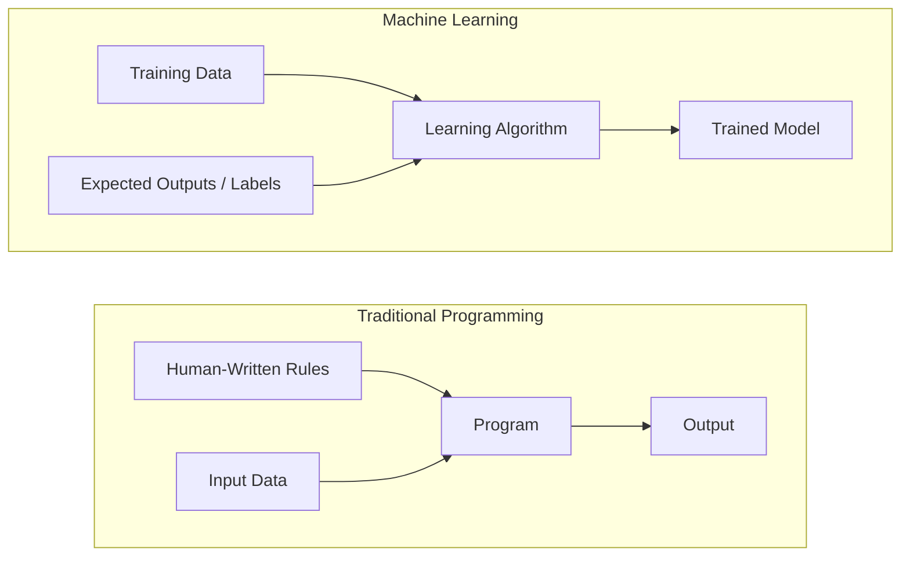
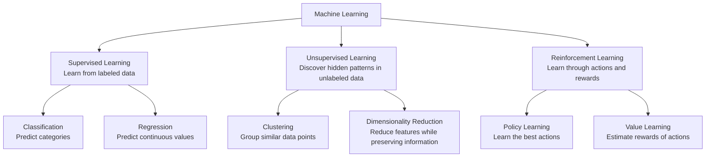

# What Is Machine Learning

> Instead of telling a computer how to solve a problem, we give it examples and let it discover the solution pattern from data.

## Learning Objectives

- Explain the differences between supervised, unsupervised, and reinforcement learning, and identify which type of learning applies to a given problem.
- Implement a nearest centroid classifier from scratch and compare its performance against a random baseline.
- Distinguish between classification and regression problems and select the appropriate loss function for each task.
- Evaluate whether a business problem is better suited for machine learning or can be solved more effectively using deterministic rules.
  
## The Problem

Imagine you want to build a system that predicts house prices. The traditional approach is to manually create hundreds of rules:

- "If the house has more than 3 bedrooms, increase the price."
- "If the house is near the city center, increase the price."
- "If the house is older than 50 years, decrease the price."

You spend weeks analyzing different factors and writing rules. However, real estate markets are complex. House prices depend on many interacting factors, such as location, neighborhood trends, economic conditions, nearby facilities, and buyer preferences. Your manually written rules often fail because they cannot capture all these hidden relationships.

Machine learning takes a different approach. Instead of manually defining every pricing rule, you provide the computer with thousands of examples of houses, including their features (size, location, number of rooms, age, etc.) and their actual selling prices. The model learns the patterns that connect house features to prices.

The model discovers relationships that humans may not have explicitly considered, such as how different combinations of features affect value. When market conditions change, you can retrain the model with new housing data instead of rewriting hundreds of rules.

This transition from "programming explicit rules" to "learning patterns from data" is the fundamental idea behind machine learning.

Modern technologies such as recommendation systems, voice assistants, self-driving vehicles, medical diagnosis systems, and large language models rely on this principle: using data to learn patterns and make intelligent predictions or decisions.

## The Concept

### Learning From Data, Not Rules

> Traditional programming starts with rules and applies them to data, while machine learning starts with data and learns the rules.

- Traditional programming: You manually define the rules. The computer follows those instructions and applies them to input data to generate the desired output.

- Machine learning: Instead of explicitly writing rules, you provide the algorithm with examples of data and their expected outputs. The learning process discovers the underlying patterns and creates its own rules.

- The model produced during training is the learned set of rules, represented mathematically through numbers such as weights and parameters. These learned patterns allow the model to generalize beyond the examples it has seen and make accurate predictions on new, unseen data.

### The Three Types of Machine Learning

## The Three Types of Machine Learning

### **Supervised Learning**

You provide the model with **labeled examples** (input-output pairs). The model learns the relationship between inputs and outputs and uses that knowledge to predict results for new data.

Examples:

- **Medical Diagnosis:**  
  "Here are thousands of patient records with symptoms and diagnoses. Learn the patterns and predict whether a new patient has a specific disease."

- **Email Category Prediction:**  
  "Here are emails labeled as work, personal, or promotional. Learn how to automatically classify new emails."

**Goal:** Learn a function that maps inputs → outputs.

---

### **Unsupervised Learning**

You provide the model with **unlabeled data**. The model analyzes the data and discovers hidden patterns, groups, or structures without predefined answers.

Examples:

- **News Article Grouping:**  
  "Here are thousands of news articles. Automatically group similar articles together based on their topics."

- **Anomaly Detection:**  
  "Here are millions of transaction records. Find unusual patterns that may indicate suspicious activity."

**Goal:** Discover hidden structures and relationships in data.

---

### **Reinforcement Learning**

An **agent learns by interacting with an environment**. It takes actions, receives rewards or penalties, and improves its behavior to maximize long-term rewards.

Examples:

- **Autonomous Driving:**  
  "Control a self-driving car. Receive rewards for safe driving and penalties for collisions or unsafe decisions. Learn the best driving strategy."

- **Resource Management:**  
  "Manage energy usage in a smart building. Receive rewards for reducing energy consumption while maintaining comfort."

**Goal:** Learn the best strategy (policy) through experience and feedback.

---

## Quick Comparison

| Learning Type | Data Available | Learning Process | Example |
|---|---|---|---|
| **Supervised Learning** | Labeled data | Learn from examples with correct answers | Disease prediction, email classification |
| **Unsupervised Learning** | Unlabeled data | Find hidden patterns and structures | Customer grouping, anomaly detection |
| **Reinforcement Learning** | Rewards and penalties | Learn through trial and error | Self-driving cars, game AI |

### Golden Rule

> Machine Learning is fundamentally the process of using features and labels to train a model that minimizes loss and generalizes well to unseen data while avoiding underfitting, overfitting, and data drift.
