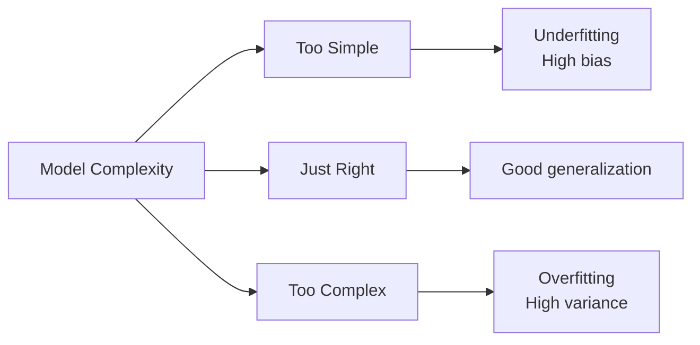
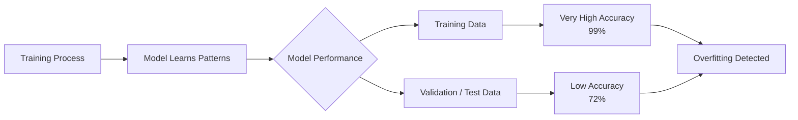
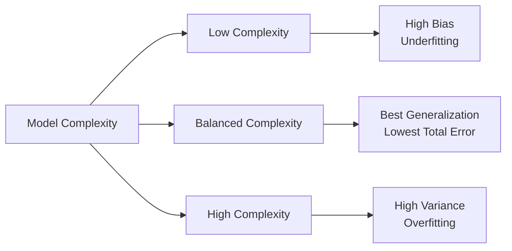
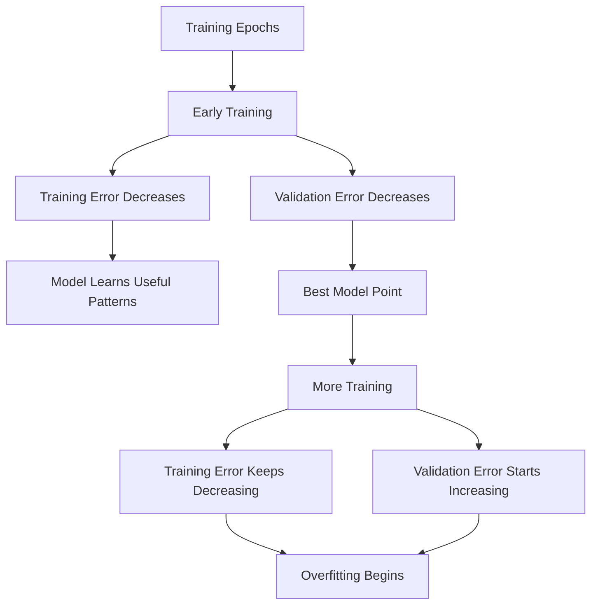
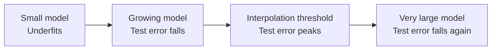
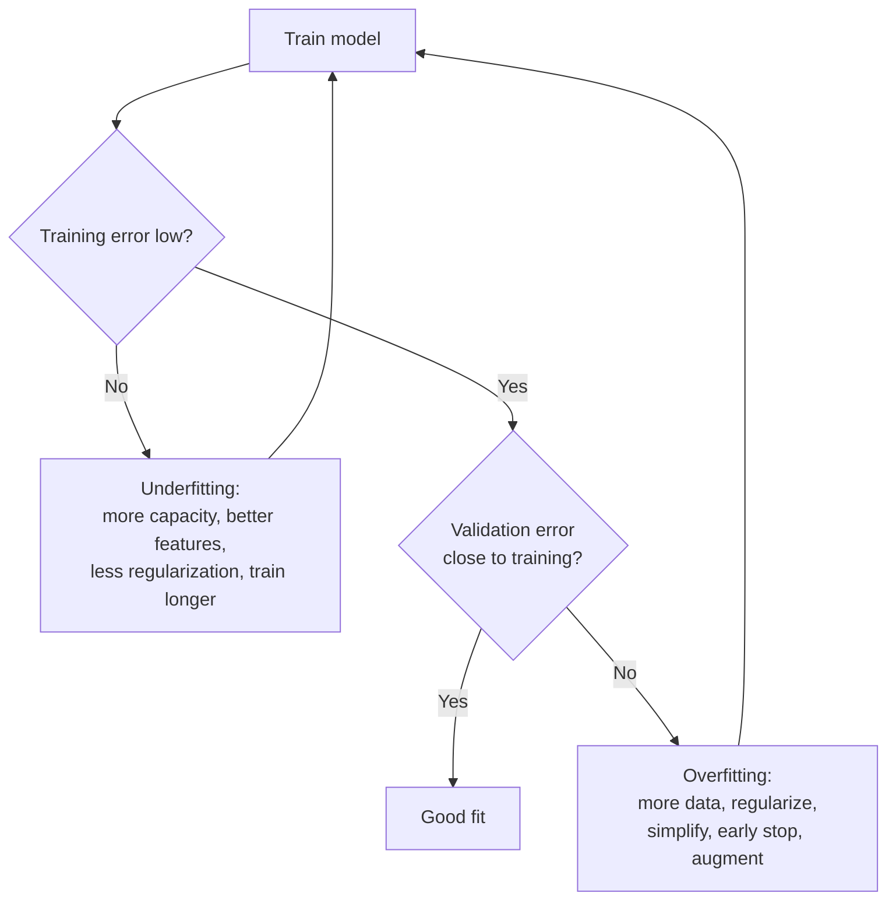

# Overfitting and Underfitting in Machine Learning


## 1. The Core Problem: Generalization

A supervised model is trained on a finite sample, but we care about performance on **data we have not seen**.

Formally, let data be drawn from an unknown distribution $\mathcal{D}$ over $(x, y)$, and let $\ell$ be a loss function.

- **Training (empirical) error:** the average loss on the training set

  $$\hat{R}(f) = \frac{1}{n}\sum_{i=1}^{n} \ell(f(x_i), y_i)$$

- **True (expected) risk:** the average loss on fresh data

  $$R(f) = \mathbb{E}_{(x,y)\sim\mathcal{D}}[\ell(f(x), y)]$$

- **Generalization gap:** $R(f) - \hat{R}(f)$

Training minimizes $\hat{R}$, but what we want is a small $R$. Overfitting and underfitting are the two ways this goes wrong:

| Failure | Training error | True/test error | Generalization gap |
|---|---|---|---|
| **Underfitting** | High | High | Small |
| **Good fit** | Low | Low (close to training) | Small |
| **Overfitting** | Very low | High | Large |



---

## 2. Underfitting

### Definition

**Underfitting** occurs when a model is too simple (or too constrained) to capture the real structure in the data. It performs poorly on **both** the training set and the test set.

> The model has not learned enough.

### Example

Fitting a straight line to data that follows a curve (for example a sine wave). No matter how much data you add, a line cannot bend, so the error stays high.

### Signs of underfitting

| Dataset | Accuracy |
|---|---:|
| Training | 62% |
| Validation | 60% |
| Test | 59% |

- Training error is high.
- Validation error is also high and close to training error.
- Adding more data does **not** help (the learning curves plateau early at a high error).

### Common causes

- Model is too simple (linear model on a non-linear problem).
- Too few features or poorly engineered features.
- Too much regularization (for example a huge $\lambda$).
- Training stopped too early or learning rate badly set.
- Wrong model family for the problem.

---

## 3. Overfitting

### Definition

**Overfitting** occurs when a model fits the training data too closely, including **noise** and accidental quirks, so it fails on new data.

> The model memorizes the training examples instead of learning the general pattern.

### Intuition: a student analogy

A student memorizes the exact answers to past exam questions. On those exact questions they score 100%, but on a new exam with different questions they fail. That is overfitting. A student who understands the concepts does well on both.

### Example: house price prediction

Training data:

| House Features | Actual Price |
|---|---|
| 3 bedrooms, 1500 sq ft, city | $300,000 |
| 4 bedrooms, 2200 sq ft, suburban | $450,000 |
| 2 bedrooms, 1000 sq ft, small town | $180,000 |

A **good model** learns general relationships:

```
size + location + rooms  →  price
```

An **overfitted model** memorizes specifics:

- "This exact house with 3 bedrooms sold for $300,000."
- "This unusual feature appeared once, so it must be important."

When a new house appears (4 bedrooms, 1800 sq ft, new location), the overfitted model's prediction is very inaccurate.

### Signs of overfitting

| Dataset | Accuracy |
|---|---:|
| Training | 99% |
| Validation | 75% |
| Test | 72% |

A large gap between training and validation/test performance is the classic symptom.



---

## 4. The Bias-Variance Tradeoff (Theory)

This is the central theoretical framework for understanding both failures.

### Setup

Assume $y = f(x) + \varepsilon$, where $\varepsilon$ is noise with mean 0 and variance $\sigma^2$. We train a model $\hat{f}$ on a random training set. For squared loss, the expected test error at a point $x$ (averaged over training sets and noise) decomposes as:

$$\mathbb{E}\big[(y - \hat{f}(x))^2\big] = \underbrace{\big(\mathbb{E}[\hat{f}(x)] - f(x)\big)^2}_{\text{Bias}^2} + \underbrace{\mathbb{E}\Big[\big(\hat{f}(x) - \mathbb{E}[\hat{f}(x)]\big)^2\Big]}_{\text{Variance}} + \underbrace{\sigma^2}_{\text{Irreducible noise}}$$

### The three terms

| Term | Meaning | Large when |
|---|---|---|
| **Bias²** | Error from wrong assumptions; how far the *average* model is from the truth | Model too simple |
| **Variance** | How much predictions change if we retrain on a different sample | Model too flexible / data too small |
| **Irreducible error ($\sigma^2$)** | Noise inherent to the problem | Cannot be reduced by any model |

### The tradeoff

- Increasing complexity usually **lowers bias** but **raises variance**.
- Underfitting = high bias, low variance.
- Overfitting = low bias, high variance.
- The best model balances the two to minimize total error.



### Quick intuition: the dartboard

- **High bias, low variance:** darts clustered tightly, but far from the bullseye.
- **Low bias, high variance:** darts scattered widely around the bullseye.
- **Low bias, low variance:** darts tightly clustered on the bullseye (the goal).

### Caveat

The clean decomposition above holds for **squared loss**. For other losses (for example 0-1 loss) similar ideas hold but the math is messier. Also, as Section 10 shows, the classic U-shaped test-error curve is not the whole story for modern overparameterized models.

---

## 5. Diagnosing: Learning Curves and Validation Curves

Two plots are the most useful diagnostic tools.

### 5.1 Learning curve (error vs. training set size)

Plot training and validation error as the number of training examples grows.

| Pattern | Diagnosis | What helps |
|---|---|---|
| Both errors high, curves converge close together | **Underfitting (high bias)** | More capacity, better features, less regularization. More data will *not* help |
| Training error low, validation error high, large gap that shrinks with more data | **Overfitting (high variance)** | More data, regularization, simpler model |
| Both errors low and close | Good fit | Done |

### 5.2 Validation curve (error vs. a hyperparameter)

Vary one complexity hyperparameter (polynomial degree, tree depth, regularization strength) and plot training vs. validation error.

- Left side (low complexity): both errors high, which means underfitting.
- Right side (high complexity): training error keeps falling while validation error rises, which means overfitting.
- The validation minimum is the sweet spot.

### 5.3 Training-epoch curve (for iterative models)



The epoch where validation error is lowest is the point where **early stopping** should halt training.

---

## 6. Causes of Overfitting

### 6.1 Excessively complex models

Too many parameters relative to the amount of data lets the model fit noise.

- Very deep neural networks
- Very large, unpruned decision trees
- High-degree polynomials
- Models with many more features than samples ($p \gg n$)

Example: a deep network trained on only 100 images can memorize each one.

### 6.2 Insufficient training data

Small datasets do not contain enough examples to separate signal from noise.

```
Face recognition trained on 20 pictures:

Model learns:   "Person A always wears glasses."
Instead of:     "Person A has these facial features."
```

### 6.3 Poor feature selection

Irrelevant or noisy features give a flexible model something spurious to latch onto.

- Predicting student grades:
  - Useful: study hours, attendance, previous grades
  - Irrelevant: favorite color

### 6.4 Noisy or incorrectly labeled data

If the training set contains errors (for example "dog image → label: cat"), the model may learn the mistakes.

### 6.5 Data leakage (a hidden cause)

Information from the test set (or the future) leaks into training, making results look better than they truly are. See Section 9.

### 6.6 Training too long

Iterative learners (neural networks, gradient boosting) keep reducing training loss after they have already stopped learning useful patterns.

### 6.7 Distribution mismatch

The model fits the training distribution well but real-world data differs (covariate shift). This looks like overfitting but is really a train/deploy mismatch, which needs different solutions (better data coverage, domain adaptation).

---

## 7. How to Reduce Overfitting

### 7.1 Reduce model complexity

Fewer layers, fewer neurons, shallower trees, lower polynomial degree.

Goal: avoid learning unnecessary details.

### 7.2 Get more (and more diverse) training data

Instead of 1,000 cat images, use 100,000 from different breeds, angles, lighting, and backgrounds. This is often the single most effective fix.

### 7.3 Regularization

Regularization adds a penalty that discourages complex solutions. Instead of minimizing only the data loss, minimize:

$$\min_{w}\; \frac{1}{n}\sum_{i=1}^{n}\ell(f_w(x_i), y_i) + \lambda\,\Omega(w)$$

where $\lambda \ge 0$ controls the strength of regularization.

| Method | Penalty $\Omega(w)$ | Effect |
|---|---|---|
| **L2 (Ridge / weight decay)** | $\lVert w\rVert_2^2 = \sum_j w_j^2$ | Shrinks all weights toward zero; keeps the model smooth |
| **L1 (Lasso)** | $\lVert w\rVert_1 = \sum_j \lvert w_j\rvert$ | Drives some weights exactly to zero; performs feature selection |
| **Elastic Net** | $\alpha\lVert w\rVert_1 + (1-\alpha)\lVert w\rVert_2^2$ | Mix of both; handles correlated features |

Bayesian view: L2 corresponds to a Gaussian prior on the weights, and L1 corresponds to a Laplace prior.

Effect of $\lambda$: too small leads to overfitting, too large leads to underfitting. Tune it with cross-validation.

### 7.4 Cross-validation (for estimating generalization and tuning)

Instead of one train/validation split, test on multiple splits and average.

```
k-fold (k = 5):
Fold 1: [Val][Train][Train][Train][Train]
Fold 2: [Train][Val][Train][Train][Train]
Fold 3: [Train][Train][Val][Train][Train]
Fold 4: [Train][Train][Train][Val][Train]
Fold 5: [Train][Train][Train][Train][Val]
                  ↓
        Average the 5 validation scores
```

Variants:

- **Stratified k-fold:** keeps class proportions in each fold (use for classification, especially imbalanced data).
- **Group k-fold:** keeps all samples from one group (patient, user, source) in the same fold to prevent leakage.
- **Time-series split:** training always precedes validation in time; never shuffle temporal data.
- **Leave-one-out (LOO):** $k = n$; low bias, high variance, expensive.
- **Nested cross-validation:** an inner loop tunes hyperparameters, an outer loop estimates performance. Use it when you need an unbiased estimate after tuning.

### 7.5 Feature selection and engineering

Keep meaningful features, remove noisy ones.

- **Keep:** location, size, bedrooms, age
- **Remove:** random ID number, unrelated text fields

Methods: domain knowledge, filter methods (correlation, mutual information), wrapper methods (recursive feature elimination), embedded methods (L1, tree importance), dimensionality reduction (PCA).

Better features often beat a fancier algorithm.

### 7.6 Early stopping

Monitor validation loss during training and stop when it starts to rise (usually with a *patience* of several epochs, then restore the best weights).

```
Training loss   ↓ ↓ ↓ ↓ ↓ ↓
Validation loss ↓ ↓ ↓ _ ↑ ↑   ← stop here, keep best checkpoint
```

### 7.7 Ensemble methods

Combine several models to reduce variance.

| Method | Idea | Main effect |
|---|---|---|
| **Bagging** (Random Forest) | Train many models on bootstrap samples, average | Reduces **variance** |
| **Boosting** (Gradient Boosting, XGBoost) | Train models sequentially, each correcting the last | Reduces **bias** (can overfit if too many rounds) |
| **Stacking** | A meta-model learns to combine base models | Flexible |

```
Model 1 ─┐
Model 2 ─┼→ Combined prediction
Model 3 ─┘
```

### 7.8 Data augmentation

Create extra training examples by label-preserving transformations.

- **Images:** rotate, flip, crop, change brightness, add noise, cutout, mixup
- **Text:** synonym replacement, back-translation, random deletion
- **Audio:** time stretch, pitch shift, add background noise

The model learns that these variations still represent the same thing.

### 7.9 Dropout (neural networks)

During training, randomly set a fraction $p$ of activations to zero each step. This prevents neurons from co-adapting and acts like training an ensemble of sub-networks. Dropout is disabled at inference.

### 7.10 Other deep learning techniques

- **Batch / Layer normalization:** stabilizes training and has a mild regularizing effect.
- **Weight decay:** L2 penalty built into the optimizer (for AdamW, decoupled weight decay).
- **Label smoothing:** softens hard targets to reduce overconfidence.
- **Smaller learning rate / noisy SGD / small batches:** implicit regularization.
- **Transfer learning / pretraining:** start from a model trained on large data, then fine-tune on your small dataset.
- **Pruning / distillation:** reduce effective model size.

### 7.11 Tree-specific controls

- Limit `max_depth`.
- Set `min_samples_leaf` / `min_samples_split`.
- Cost-complexity pruning (`ccp_alpha`).
- For boosting: lower learning rate, fewer rounds, subsampling.

### Summary table

| Technique | Reduces | Best for |
|---|---|---|
| More data | Variance | Almost everything |
| Simpler model | Variance | Small datasets |
| L1 / L2 | Variance | Linear models, neural nets |
| Dropout | Variance | Neural nets |
| Early stopping | Variance | Iterative training |
| Bagging | Variance | High-variance learners (trees) |
| Augmentation | Variance | Images, audio, text |
| Feature selection | Variance, noise | High-dimensional data |
| Cross-validation | (Detects & tunes) | Model selection |

---

## 8. How to Fix Underfitting

Underfitting needs the opposite medicine:

1. **Increase model capacity:** more layers/neurons, deeper trees, higher polynomial degree.
2. **Add or engineer better features:** interactions, polynomial terms, domain-specific features, embeddings.
3. **Reduce regularization:** lower $\lambda$, lower dropout.
4. **Train longer / better optimization:** more epochs, tuned learning rate, better optimizer.
5. **Use a more expressive model family:** for example move from linear regression to gradient boosting or a neural network.
6. **Fix data issues:** check for label noise or wrong preprocessing that hides the signal.

Note: **more data alone does not fix underfitting**, because a model that is too simple cannot use it.

---

## 9. Evaluation Done Right (Avoiding Hidden Overfitting)

You can overfit **without ever fitting the training set badly**, simply by evaluating carelessly.

### 9.1 Three-way split

| Set | Purpose | Touch it... |
|---|---|---|
| **Training** | Fit parameters | Freely |
| **Validation** | Tune hyperparameters, pick models, early stop | Repeatedly |
| **Test** | Final, unbiased performance estimate | **Once**, at the end |

If you keep tuning based on the test set, it becomes a second validation set and your reported score is optimistic.

### 9.2 Data leakage: the silent killer

Leakage happens when information unavailable at prediction time influences training.

Common forms:

- **Preprocessing before splitting:** fitting a scaler, imputer, or feature selector on the **whole** dataset, then splitting. Always fit on training folds only (use a `Pipeline`).
- **Duplicates across splits:** the same or near-identical sample appears in train and test.
- **Group leakage:** several records from one patient/user/source land in both train and test.
- **Temporal leakage:** using future information to predict the past; shuffling time-series data.
- **Target leakage:** a feature that is derived from, or only known after, the label.

Leakage produces suspiciously good scores, followed by failure in production.

### 9.3 Selection bias from many experiments

If you try hundreds of models/configurations and report the best validation score, that score is biased upward (a form of "multiple comparisons" overfitting). Use a held-out test set or nested cross-validation for the final estimate.

### 9.4 Choose metrics that fit the problem

Accuracy can hide failures on imbalanced data. Use precision, recall, F1, PR-AUC, ROC-AUC, or macro-averaged metrics, and always compare against a simple baseline.

---

## 10. Modern Perspective: Double Descent and Overparameterization

Classical theory predicts a U-shaped test-error curve: error falls, then rises as complexity grows. But modern deep networks, with far more parameters than training samples, often generalize well anyway.

### Double descent

As model size (or training time) increases:

1. **Classical regime:** test error falls, then rises (overfitting).
2. **Interpolation threshold:** the model is just large enough to fit the training data perfectly; test error peaks.
3. **Modern regime:** with even more capacity, test error **falls again**.



### Why can huge models generalize?

Active research. Leading ideas include:

- **Implicit regularization** of gradient descent (it tends to find simple, low-norm solutions).
- Architecture inductive biases (for example convolutions).
- Large, diverse datasets and strong augmentation.
- Flat minima generalize better than sharp minima.

### Practical takeaway

"More parameters means overfitting" is a useful heuristic for classical models and small data, but not a law. Always **measure** generalization on held-out data rather than assuming.

### Related ideas worth knowing

- **VC dimension / Rademacher complexity:** theoretical measures of model capacity that bound the generalization gap.
- **Occam's razor / Minimum description length:** among models that fit equally well, prefer the simpler one.
- **No Free Lunch theorem:** no single model is best for every problem, so the right complexity depends on the data.

---

## 11. Hands-On Code (scikit-learn)

Install: `pip install numpy matplotlib scikit-learn`

### 11.1 Underfit vs. good fit vs. overfit (polynomial regression)

```python
import numpy as np
import matplotlib.pyplot as plt
from sklearn.pipeline import make_pipeline
from sklearn.preprocessing import PolynomialFeatures, StandardScaler
from sklearn.linear_model import LinearRegression
from sklearn.model_selection import train_test_split
from sklearn.metrics import mean_squared_error

rng = np.random.RandomState(0)
X = np.sort(rng.uniform(0, 1, 40))[:, None]
y = np.sin(2 * np.pi * X).ravel() + rng.normal(0, 0.25, size=40)

X_train, X_test, y_train, y_test = train_test_split(
    X, y, test_size=0.4, random_state=1
)

degrees = [1, 4, 15]  # underfit, good fit, overfit
X_plot = np.linspace(0, 1, 300)[:, None]

fig, axes = plt.subplots(1, 3, figsize=(15, 4), sharey=True)
for ax, d in zip(axes, degrees):
    model = make_pipeline(
        PolynomialFeatures(d, include_bias=False),
        StandardScaler(),
        LinearRegression(),
    )
    model.fit(X_train, y_train)
    tr = mean_squared_error(y_train, model.predict(X_train))
    te = mean_squared_error(y_test, model.predict(X_test))

    ax.scatter(X_train, y_train, label="train", alpha=0.7)
    ax.scatter(X_test, y_test, label="test", alpha=0.7, marker="x")
    ax.plot(X_plot, model.predict(X_plot), color="red", label="model")
    ax.plot(X_plot, np.sin(2 * np.pi * X_plot), "g--", label="truth")
    ax.set_ylim(-2, 2)
    ax.set_title(f"degree={d}\ntrain MSE={tr:.3f} | test MSE={te:.3f}")
    ax.legend()

plt.tight_layout()
plt.show()
```

Expected behavior: degree 1 has high train **and** test error (underfit). Degree 4 has low error on both. Degree 15 has very low train error but high test error (overfit).

### 11.2 Validation curve (find the sweet spot)

```python
from sklearn.model_selection import validation_curve

degrees = np.arange(1, 16)
pipe = make_pipeline(
    PolynomialFeatures(include_bias=False),
    StandardScaler(),
    LinearRegression(),
)
train_scores, val_scores = validation_curve(
    pipe, X, y,
    param_name="polynomialfeatures__degree",
    param_range=degrees,
    cv=5,
    scoring="neg_mean_squared_error",
)

plt.plot(degrees, -train_scores.mean(axis=1), "o-", label="train MSE")
plt.plot(degrees, -val_scores.mean(axis=1), "o-", label="validation MSE")
plt.yscale("log")
plt.xlabel("Polynomial degree (model complexity)")
plt.ylabel("MSE")
plt.legend()
plt.show()
```

### 11.3 Learning curve (does more data help?)

```python
from sklearn.model_selection import learning_curve

model = make_pipeline(
    PolynomialFeatures(4, include_bias=False),
    StandardScaler(),
    LinearRegression(),
)
sizes, train_scores, val_scores = learning_curve(
    model, X, y,
    train_sizes=np.linspace(0.2, 1.0, 8),
    cv=5,
    scoring="neg_mean_squared_error",
)

plt.plot(sizes, -train_scores.mean(axis=1), "o-", label="train MSE")
plt.plot(sizes, -val_scores.mean(axis=1), "o-", label="validation MSE")
plt.xlabel("Training set size")
plt.ylabel("MSE")
plt.legend()
plt.show()
```

### 11.4 Regularization (Ridge) taming an overfit model

```python
from sklearn.linear_model import Ridge

for alpha in [1e-6, 1e-3, 1e-1, 1, 10]:
    model = make_pipeline(
        PolynomialFeatures(15, include_bias=False),
        StandardScaler(),
        Ridge(alpha=alpha),
    )
    model.fit(X_train, y_train)
    tr = mean_squared_error(y_train, model.predict(X_train))
    te = mean_squared_error(y_test, model.predict(X_test))
    print(f"alpha={alpha:<8} train MSE={tr:.3f}  test MSE={te:.3f}")
```

A very small `alpha` overfits, a moderate `alpha` gives the best test error, and a very large `alpha` underfits.

### 11.5 Cross-validated hyperparameter search (leak-free)

```python
from sklearn.model_selection import GridSearchCV

pipe = make_pipeline(
    PolynomialFeatures(include_bias=False),
    StandardScaler(),
    Ridge(),
)
grid = GridSearchCV(
    pipe,
    param_grid={
        "polynomialfeatures__degree": [2, 4, 8, 12],
        "ridge__alpha": [1e-3, 1e-1, 1, 10],
    },
    cv=5,
    scoring="neg_mean_squared_error",
)
grid.fit(X_train, y_train)
print("Best params:", grid.best_params_)
print("Test MSE:", mean_squared_error(y_test, grid.predict(X_test)))
```

Because preprocessing lives inside the pipeline, each fold fits the scaler on its own training portion only, which avoids leakage.

### 11.6 Early stopping in a neural network (PyTorch-style pseudocode)

```python
best_val, patience, wait = float("inf"), 10, 0
best_state = None

for epoch in range(max_epochs):
    train_one_epoch(model, train_loader)
    val_loss = evaluate(model, val_loader)

    if val_loss < best_val:
        best_val, wait = val_loss, 0
        best_state = {k: v.clone() for k, v in model.state_dict().items()}
    else:
        wait += 1
        if wait >= patience:
            break  # validation loss stopped improving

model.load_state_dict(best_state)  # restore best weights
```

---

## 12. Practical Workflow Checklist

1. **Define the goal and metric** that matches the real-world objective.
2. **Split data correctly** (train / validation / test), respecting groups and time.
3. **Build a trivial baseline** (majority class, mean prediction, simple linear model).
4. **Train a simple model first** and check training error.
   - High training error means underfitting, so increase capacity or improve features.
5. **Compare training vs. validation error.**
   - Large gap means overfitting, so apply regularization, more data, simpler model.
6. **Plot learning and validation curves** to decide *what* to change.
7. **Tune with cross-validation** inside a leak-free pipeline.
8. **Evaluate on the test set once.**
9. **Monitor after deployment** for drift; a model that generalized yesterday may not tomorrow.

Decision flow:



---

## 13. Common Mistakes

- Judging a model by **training accuracy** alone.
- **Tuning on the test set** until the number looks good.
- Fitting scalers, imputers, or feature selection on **all data before splitting**.
- Random-splitting **time-series** or **grouped** data.
- Assuming **more data** will fix underfitting (it will not).
- Assuming **a bigger model** will fix overfitting (it usually makes it worse in the classical regime).
- Reporting the **best of many runs** without correcting for selection bias.
- Ignoring **class imbalance** and trusting accuracy.
- Using a **single** train/validation split on a small dataset (high-variance estimate).
- Forgetting that **label noise** puts a ceiling on achievable accuracy (the irreducible error).

---

## 14. Exercises

**Conceptual**

1. A model has 98% training accuracy and 70% test accuracy. Diagnose it and list three remedies.
2. A model has 55% training and 54% test accuracy on a binary balanced problem. Diagnose it. Will collecting 10x more data help? Why or why not?
3. Explain why L1 regularization produces sparse solutions while L2 does not.
4. Why can shuffling a time-series dataset before splitting inflate performance?
5. Explain the three terms of the bias-variance decomposition and give an example of a model with high bias and one with high variance.

**Mathematical**

6. Derive the bias-variance decomposition for squared loss starting from $\mathbb{E}[(y-\hat f)^2]$.
7. For ridge regression $\hat w = (X^\top X + \lambda I)^{-1}X^\top y$, show what happens to $\hat w$ as $\lambda \to 0$ and $\lambda \to \infty$.

**Practical**

8. Reproduce Section 11.1 with a different true function. Find the degree that minimizes validation error.
9. Using a decision tree, plot a validation curve over `max_depth`. Where does overfitting begin?
10. Create a deliberate data-leakage example (scale before splitting) and measure how much the test score is inflated compared to a pipeline.
11. Train a small neural network with and without dropout and early stopping; compare the training/validation curves.

---

## 15. Cheat Sheet

| | **Underfitting** | **Good fit** | **Overfitting** |
|---|---|---|---|
| Training error | High | Low | Very low |
| Validation/test error | High | Low | High |
| Gap | Small | Small | Large |
| Bias / Variance | High / Low | Balanced | Low / High |
| Model complexity | Too low | Appropriate | Too high |
| More data helps? | No | Marginally | **Yes** |
| More regularization helps? | No (hurts) | Fine-tune | **Yes** |
| More capacity helps? | **Yes** | Fine-tune | No (hurts) |

**One-line summary:**

> Underfitting means the model has not learned enough. Overfitting means it has learned too much of the wrong thing. The goal is a model that captures the underlying pattern and performs well on new, unseen data.

> *A model that memorizes is not intelligent; a model that generalizes is useful.*

---

## 16. Further Reading

- Hastie, Tibshirani, Friedman. *The Elements of Statistical Learning* (Ch. 2, 7). Bias-variance, model assessment and selection.
- Bishop. *Pattern Recognition and Machine Learning* (Ch. 1, 3). Regularization, Bayesian view.
- Goodfellow, Bengio, Courville. *Deep Learning* (Ch. 5, 7). Capacity, generalization, regularization for neural networks.
- Shalev-Shwartz, Ben-David. *Understanding Machine Learning: From Theory to Algorithms*. VC dimension, generalization bounds.
- Belkin et al. (2019). *Reconciling modern machine-learning practice and the classical bias-variance trade-off*. Double descent.
- Nakkiran et al. (2019). *Deep Double Descent: Where Bigger Models and More Data Hurt*.
- Srivastava et al. (2014). *Dropout: A Simple Way to Prevent Neural Networks from Overfitting*. JMLR.
- Zhang et al. (2017). *Understanding deep learning requires rethinking generalization*.
- scikit-learn user guide: *Cross-validation*, *Validation curves*, *Learning curves*.
