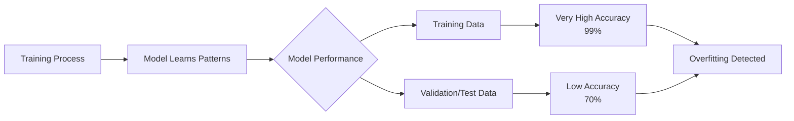
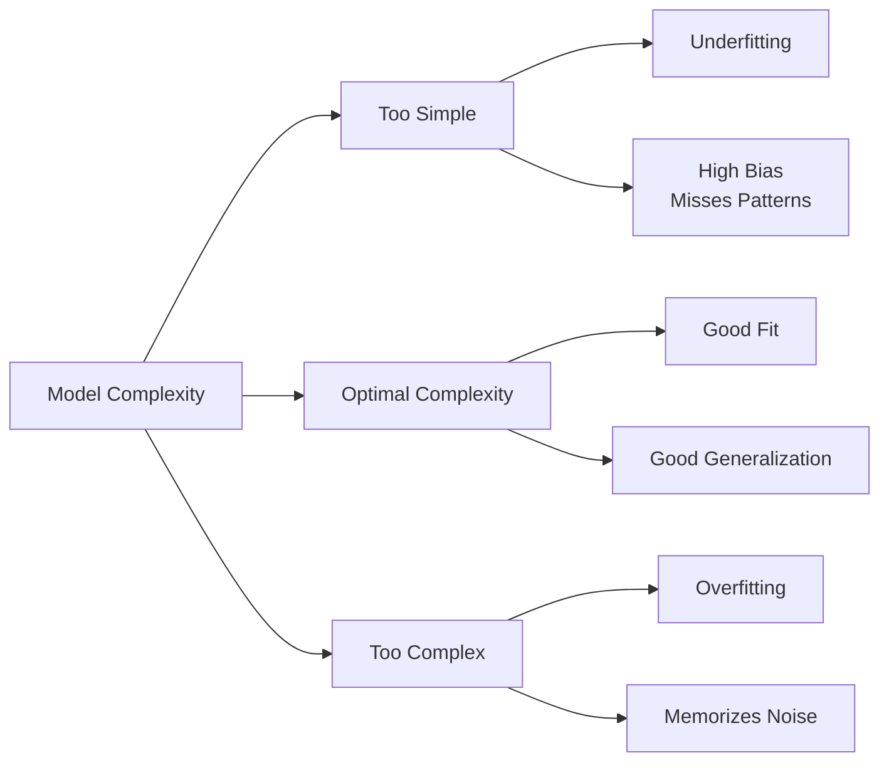

# Overfitting and Underfitting in Machine Learning

Overfitting and underfitting are two fundamental problems in machine learning that describe how well a model learns patterns from training data and how effectively it performs on unseen data.

A good machine learning model should learn meaningful patterns from the training data while also generalizing well to new examples. When a model learns too much or too little, these problems occur.


# 1. Overfitting 

### What is Overfitting?

Overfitting occurs when a machine learning model learns the training data **too closely**, including unnecessary details, random patterns, and noise that do not represent the true relationship in the data.

As a result, the model performs extremely well on the training data but fails to generalize to new, unseen examples.

In simple terms:

> **The model memorizes the training examples instead of learning the general patterns.**

A good machine learning model should not only remember what it has seen; it should understand the underlying patterns and make accurate predictions on new data.

---

### Example: House Price Prediction

Imagine building a model to predict house prices.

#### Training Data:

| House Features | Actual Price |
|---|---|
| 3 bedrooms, 1500 sq ft, city area | $300,000 |
| 4 bedrooms, 2200 sq ft, suburban area | $450,000 |
| 2 bedrooms, 1000 sq ft, small town | $180,000 |

```bash

A simple model learns:
House size + Location + Number of rooms
↓
Price
```
---

This model learns general patterns.

---

#### Overfitted Model:

Instead of learning general rules, the model memorizes specific examples:

- "This exact house with 3 bedrooms sold for $300,000."

- "This exact neighborhood usually has this price."

- "This unusual feature appeared once, so it must be important."


**When a new house appears:**

   - 4 bedrooms
   - 1800 sq ft
   - New location

**Prediction:**
   - Very inaccurate


The model fails because it learned the training examples instead of the real relationship.

---

## Signs of Overfitting

A model is likely overfitting when:


The model fails because it learned the training examples instead of the real relationship.

---

## Signs of Overfitting

A model is likely overfitting when:

- Training Performance: Very High
- Validation/Test Performance: Much Lower


Example:

| Dataset | Accuracy |
|---|---:|
| Training Data | 99% |
| Validation Data | 75% |
| Test Data | 72% |

The large gap indicates that the model has memorized the training data.

---

## Primary Causes of Overfitting

## 1. Excessively Complex Models

A model with too many parameters can learn unnecessary details from the training data.

### Examples:

- Very deep neural networks
- Very large decision trees
- Models with too many features

### Example:

A deep neural network trained on only 100 images may memorize individual images instead of learning general visual patterns.

---

## 2. Insufficient Training Data

Small datasets do not provide enough examples for the model to learn reliable patterns.

#### Example:
```bash

Training a face recognition model with only 20 pictures:


Model learns:
"Person A always wears glasses."

Instead of:
"Person A has specific facial features."

```
---

More diverse data helps the model generalize.

---

## 3. Poor Feature Selection

Including irrelevant or noisy features can confuse the model.

### Example:

- Predicting student grades:

   - Useful features:
   - Study hours
   - Attendance
   - Previous grades


- Irrelevant feature:

   - Favorite color


A complex model may incorrectly learn relationships from meaningless features.

---

## 4. Noisy or Incorrect Data

If training data contains errors, the model may learn those mistakes.

Example:

A dataset contains:

**Dog image → Label: Cat**

The model may learn incorrect patterns because of bad examples.

---

## How to Reduce Overfitting

## 1. Reduce Model Complexity

Use a simpler model with fewer parameters.

Examples:

- Reduce neural network layers
- Reduce number of neurons
- Limit decision tree depth

Goal:


**Avoid learning unnecessary details**

---

## 2. Use More Training Data

More diverse examples help the model learn general patterns.

### Example:

Instead of:

**1,000 images of cats**


**Use:**

- 100,000 images of cats
- from different breeds, angles, and environments


The model learns what makes a cat a cat.

---


## 3. Regularization

Regularization prevents the model from becoming too complex.

**Common techniques:**

#### L1 Regularization (Lasso)

Encourages some model weights to become zero.

Effect:
**Removes unnecessary features**


#### L2 Regularization (Ridge)

Reduces large parameter values.

Effect:


**Keeps the model simpler**


---

## 4. Cross-Validation

Instead of evaluating the model on only one validation split, cross-validation tests it on multiple subsets of data.

### Example:
```bash

Dataset

Split 1 → Train + Validate
Split 2 → Train + Validate
Split 3 → Train + Validate

Average Performance

```
This gives a more reliable estimate of how well the model generalizes.

---

## 5. Feature Selection and Engineering

Choose meaningful features and remove noisy ones.

### Example:

For predicting house prices:

**Keep:**

```bash

Location
Size
Bedrooms
Age

```

**Remove:**
```bash

Random ID number
Unrelated text fields
```

Better features often improve performance more than a more complex algorithm.

---

## 6. Early Stopping

Used mainly in neural networks.
```bash
During training:


Training Loss ↓

Validation Loss ↓
   |
   |
Validation Loss starts increasing
   ↓
Stop Training

```
---
The model stops before it begins memorizing the training data.

---

## 7. Ensemble Methods

Combine multiple models to improve generalization.

Examples:

- Random Forest
- Gradient Boosting
- Bagging

Instead of relying on one model:

```bash
Model 1 prediction
Model 2 prediction
Model 3 prediction
      
       ↓

Combined Prediction

```
---


Multiple models reduce the impact of individual mistakes.

---

## 8. Data Augmentation

Create additional training examples by modifying existing data.

- Common in computer vision:

### Original image:


**Cat image**


Create variations:


- Rotated image
- Flipped image
- Cropped image
- Brightness changed image


**The model learns that these variations still represent the same object.**

---

## Overfitting vs Good Generalization

| Overfitting | Good Generalization |
|---|---|
| Memorizes training data | Learns useful patterns |
| Very high training accuracy | Balanced performance |
| Poor test performance | Good test performance |
| Learns noise | Ignores noise |
| High variance | Balanced bias and variance |

---

### Key Idea

The goal of machine learning is not to create a model that perfectly remembers training data.

The goal is to build a model that learns the **underlying patterns** and performs well on **new, unseen data**.

> A model that memorizes is not intelligent; a model that generalizes is useful.


## 1. Training vs Validation Performance


## 2. Model Complexity vs Generalization


  ## 3. Learning Curve Showing Overfitting
  ```mermaid
      flowchart TD
    A[Training Epochs]

    A --> B[Early Training]

    B --> C[Training Error Decreases]
    B --> D[Validation Error Decreases]

    C --> E[Model Learns Useful Patterns]

    D --> F[Best Model Point]

    F --> G[More Training]

    G --> H[Training Error Continues Decreasing]
    G --> I[Validation Error Starts Increasing]

    H --> J[Overfitting Begins]
    I --> J
```
   4. Simple Concept Diagram
  ```mermaid
   flowchart LR
    A[Training Data]

    A --> B[Machine Learning Model]

    B --> C[Learn Important Patterns]
    B --> D[Learn Noise & Random Details]

    C --> E[Good Generalization]
    D --> F[Overfitting]

    F --> G[Poor Performance on New Data]
```
  ## 5. Bias-Variance View
  ```mermaid
      flowchart LR
    A[Model Complexity]

    A --> B[Low Complexity]
    A --> C[Balanced Complexity]
    A --> D[High Complexity]

    B --> E[High Bias<br/>Underfitting]

    C --> F[Best Generalization<br/>Low Error]

    D --> G[High Variance<br/>Overfitting]
```


---


