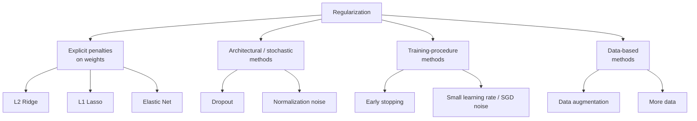
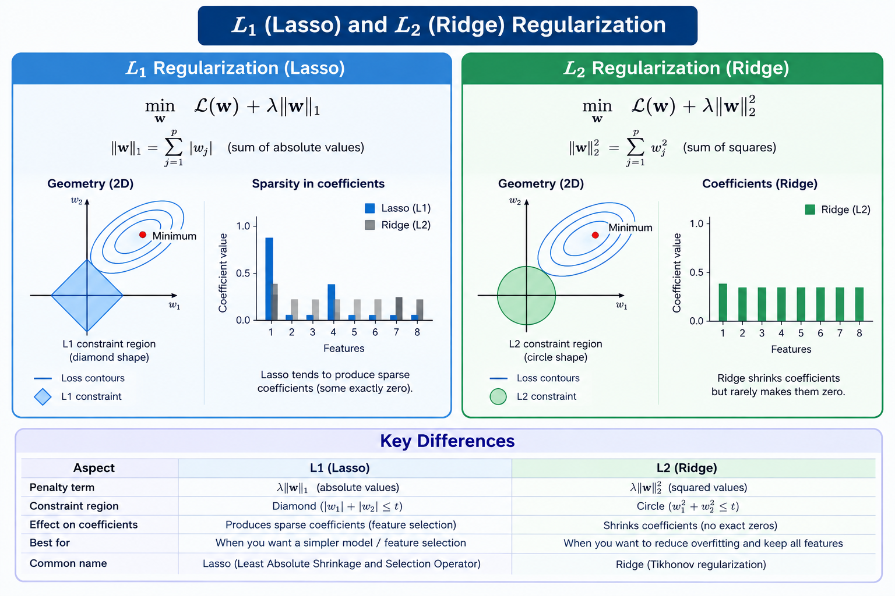
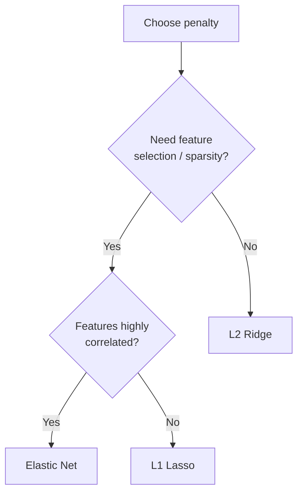
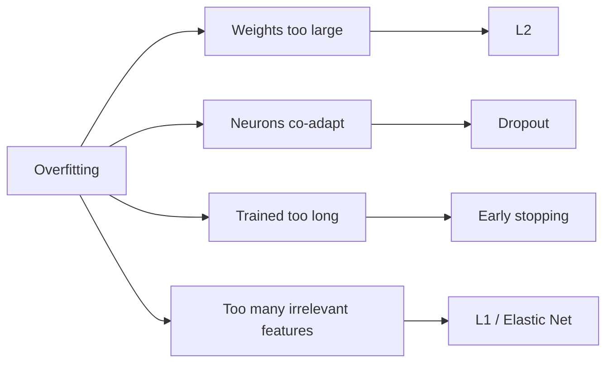

# Regularization Techniques: L1, L2, Elastic Net, Dropout, Early Stopping

A focused guide to the main techniques used to fight overfitting. For each one: intuition, math, how it behaves, code, when to use it, and common mistakes.

---


## 1. What Is Regularization?

**Regularization** is any technique that reduces a model's tendency to overfit by constraining or discouraging complexity, usually at the cost of slightly worse fit on the training data in exchange for better performance on unseen data.

> Regularization deliberately makes the model a little worse at memorizing so it becomes better at generalizing.

### The general recipe

Instead of minimizing only the data loss, minimize a **penalized objective**:

$$\min_{w}\; \underbrace{\frac{1}{n}\sum_{i=1}^{n}\ell\big(f_w(x_i), y_i\big)}_{\text{fit the data}} \;+\; \underbrace{\lambda\,\Omega(w)}_{\text{keep it simple}}$$

- $\ell$ is the loss (squared error, cross-entropy, ...).
- $\Omega(w)$ is the **penalty** that measures complexity.
- $\lambda \ge 0$ is the **regularization strength** (a hyperparameter).

| $\lambda$ | Effect |
|---|---|
| $0$ | No regularization; risk of overfitting |
| Small | Mild constraint |
| Moderate | Usually the sweet spot |
| Very large | Weights forced near zero; underfitting |

### Families of regularization



This guide covers L2, L1, Elastic Net (explicit penalties), Dropout (stochastic), and Early Stopping (training procedure).

### Why does a penalty help? Two views

1. **Geometric / capacity view:** large weights let the model create sharp, wiggly functions that chase noise. Penalizing weight size forces smoother functions.
2. **Bayesian view:** the penalty is a **prior belief** about the weights. Minimizing the penalized loss equals finding the MAP estimate (maximum a posteriori).
   - L2 ⇔ Gaussian prior (weights are probably small, centered at 0).
   - L1 ⇔ Laplace prior (most weights are probably exactly 0, a few are large).

---

## 2. L2 Regularization (Ridge / Weight Decay)

### Definition

Add the **sum of squared weights** to the loss:

$$J(w) = \text{Loss}(w) + \lambda \sum_{j} w_j^2 = \text{Loss}(w) + \lambda\,\lVert w\rVert_2^2$$

(Some texts write $\tfrac{\lambda}{2}\lVert w\rVert_2^2$ so the gradient is cleaner. Libraries differ, so always check the exact convention.)

Names: **Ridge regression** (for linear regression), **weight decay** (in neural networks), **Tikhonov regularization** (in numerical analysis).

### Intuition

L2 punishes **large** weights heavily (because of the square) but barely punishes small ones. The result: weights are **shrunk toward zero but rarely become exactly zero**. The model spreads importance across many features instead of relying on a few huge weights.

### Closed-form solution (linear regression)

For squared loss with $J(w) = \lVert y - Xw\rVert_2^2 + \lambda\lVert w\rVert_2^2$:

$$\hat w_{\text{ridge}} = (X^\top X + \lambda I)^{-1} X^\top y$$

Two benefits visible here:

- Adding $\lambda I$ makes $X^\top X + \lambda I$ **always invertible**, even when features are correlated or $p > n$.
- As $\lambda \to 0$, $\hat w \to$ ordinary least squares. As $\lambda \to \infty$, $\hat w \to 0$.

For an **orthonormal** design ($X^\top X = I$) the effect is a pure proportional shrinkage:

$$\hat w_{\text{ridge}} = \frac{\hat w_{\text{OLS}}}{1+\lambda}$$

### Why it is called "weight decay"

With gradient descent and the penalty $\tfrac{\lambda}{2}\lVert w\rVert^2$, the update is:

$$w \leftarrow w - \eta\big(\nabla \text{Loss}(w) + \lambda w\big) = (1-\eta\lambda)\,w - \eta\,\nabla\text{Loss}(w)$$

Each step multiplies the weights by $(1-\eta\lambda) < 1$, so they **decay** toward zero unless the data gradient pushes back.

> **Caveat for adaptive optimizers:** with Adam, L2 penalty and "true" weight decay are *not* equivalent. Use **AdamW**, which decouples weight decay from the gradient update, for the intended behavior.

### Behavior with correlated features

If two features are highly correlated, plain least squares can assign huge opposite-sign weights (unstable). Ridge tends to split the weight **evenly** among correlated features, which is more stable.

### Pros and cons

| Pros | Cons |
|---|---|
| Stabilizes ill-conditioned problems | Does not produce sparse models |
| Smooth, differentiable, easy to optimize | Keeps all features (less interpretable) |
| Handles correlated features gracefully | Needs feature scaling to behave fairly |
| Works for linear models and neural networks | $\lambda$ must be tuned |

### Code (scikit-learn)

```python
from sklearn.linear_model import Ridge
from sklearn.pipeline import make_pipeline
from sklearn.preprocessing import StandardScaler

model = make_pipeline(StandardScaler(), Ridge(alpha=1.0))  # alpha plays the role of lambda
model.fit(X_train, y_train)
print("Test R^2:", model.score(X_test, y_test))
```

### Code (PyTorch)

```python
import torch

# Weight decay via AdamW (recommended)
optimizer = torch.optim.AdamW(model.parameters(), lr=1e-3, weight_decay=1e-2)

# Or with SGD
optimizer = torch.optim.SGD(model.parameters(), lr=1e-2, weight_decay=1e-4)
```

### When to use

- Default choice when you believe **most features carry some signal**.
- Multicollinear features.
- Almost every neural network (weight decay is nearly always on).

---

## 3. L1 Regularization (Lasso)

### Definition

Add the **sum of absolute values of weights**:

$$J(w) = \text{Loss}(w) + \lambda \sum_{j}\lvert w_j\rvert = \text{Loss}(w) + \lambda\,\lVert w\rVert_1$$

Name: **Lasso** (Least Absolute Shrinkage and Selection Operator).

### Intuition

L1 charges a **constant** price per unit of weight, regardless of size. Small weights are not "forgiven" the way they are in L2, so the optimizer pushes many of them **exactly to zero**. This makes L1 perform **automatic feature selection** and yields **sparse** models.

### Why L1 gives exact zeros (geometry)

Constrained form: minimize the loss subject to a budget on the weights.

- L2 budget: $\lVert w\rVert_2 \le t$ is a **circle/sphere** (smooth).
- L1 budget: $\lVert w\rVert_1 \le t$ is a **diamond** with **corners on the axes**.

The loss contours (ellipses) usually first touch the diamond **at a corner**, where some coordinates are exactly zero. A circle has no corners, so contact rarely lands exactly on an axis.



### Soft-thresholding (orthonormal case)

For an orthonormal design with penalty $\lambda\lVert w\rVert_1$ and loss $\tfrac12\lVert y-Xw\rVert^2$:

$$\hat w_j = \operatorname{sign}(\hat w_j^{\text{OLS}})\,\max\big(\lvert\hat w_j^{\text{OLS}}\rvert - \lambda,\; 0\big)$$

Every coefficient is moved toward zero by the amount $\lambda$, and any coefficient whose magnitude is below $\lambda$ becomes **exactly zero**. Compare with ridge's proportional shrinkage $\hat w^{\text{OLS}}/(1+\lambda)$, which never reaches zero.

### Optimization note

The absolute value is **not differentiable at 0**, so there is no simple closed form in general. Solvers use coordinate descent, proximal gradient (ISTA/FISTA), or LARS. In deep learning, plain SGD with L1 rarely gives exact zeros; sparsity needs proximal or pruning methods.

### Regularization path

As $\lambda$ increases from 0, coefficients shrink and drop to zero one by one. Plotting coefficients against $\lambda$ shows the order in which features are eliminated, which is a useful tool for feature ranking.

### Pros and cons

| Pros | Cons |
|---|---|
| Sparse, interpretable models | Unstable when features are highly correlated (picks one arbitrarily) |
| Built-in feature selection | Selects at most $n$ features when $p > n$ |
| Good when only a few features matter | Non-differentiable at 0 |
| Compact models, faster inference | Biases the retained coefficients toward zero |

### Code (scikit-learn)

```python
from sklearn.linear_model import Lasso
from sklearn.pipeline import make_pipeline
from sklearn.preprocessing import StandardScaler
import numpy as np

model = make_pipeline(StandardScaler(), Lasso(alpha=0.1))
model.fit(X_train, y_train)

coefs = model[-1].coef_
print("Non-zero features:", np.sum(coefs != 0), "of", len(coefs))
```

### Code (PyTorch: manual L1 penalty)

```python
l1_lambda = 1e-5
l1_penalty = sum(p.abs().sum() for p in model.parameters())
loss = criterion(output, target) + l1_lambda * l1_penalty
loss.backward()
```

### When to use

- High-dimensional data ($p$ large) where you believe **only a few features matter**.
- You want **interpretability** or **feature selection**.
- You need a small, fast model.

---

## 4. L1 vs. L2: Side-by-Side

| Aspect | **L1 (Lasso)** | **L2 (Ridge)** |
|---|---|---|
| Penalty | $\sum \lvert w_j\rvert$ | $\sum w_j^2$ |
| Effect on weights | Drives some to **exactly 0** | Shrinks all **toward** 0 |
| Sparsity | Yes | No |
| Feature selection | Built in | No |
| Correlated features | Picks one, drops others (unstable) | Shares weight among them (stable) |
| Constraint shape | Diamond | Circle |
| Bayesian prior | Laplace | Gaussian |
| Differentiable everywhere | No (kink at 0) | Yes |
| Closed form | No | Yes (linear regression) |
| Best when | Few relevant features | Many small contributions |
| Robustness to outliers (weights) | Penalty grows linearly | Penalty grows quadratically (large weights punished more) |

Quick decision rule:



---

## 5. Elastic Net

### Definition

Elastic Net **combines L1 and L2** penalties to get sparsity *and* stability:

$$J(w) = \text{Loss}(w) + \lambda\Big(\alpha\,\lVert w\rVert_1 + \tfrac{1-\alpha}{2}\,\lVert w\rVert_2^2\Big)$$

- $\lambda$: overall strength.
- $\alpha \in [0,1]$: **mixing ratio**. $\alpha = 1$ gives pure Lasso, $\alpha = 0$ gives pure Ridge.

> In scikit-learn the parameters are named `alpha` (overall strength, equal to $\lambda$) and `l1_ratio` (the mixing ratio, equal to the $\alpha$ above). Do not confuse them.

scikit-learn's objective:

$$\frac{1}{2n}\lVert y - Xw\rVert_2^2 + \texttt{alpha}\cdot\texttt{l1\_ratio}\,\lVert w\rVert_1 + \frac{\texttt{alpha}\,(1-\texttt{l1\_ratio})}{2}\lVert w\rVert_2^2$$

### Why it exists: fixing Lasso's weaknesses

| Lasso problem | How Elastic Net helps |
|---|---|
| Picks one feature from a correlated group arbitrarily | The L2 part encourages correlated features to be **selected together** (the "grouping effect") |
| Selects at most $n$ features when $p > n$ | Can select more than $n$ |
| Unstable path under correlation | L2 term stabilizes the solution |

### Geometry

The constraint region is a **rounded diamond**: it still has corners (so sparsity is possible) but its edges are curved (so correlated features are handled more smoothly).

### Pros and cons

| Pros | Cons |
|---|---|
| Sparse **and** stable | Two hyperparameters to tune |
| Handles correlated groups well | Slightly more computation than Lasso or Ridge alone |
| Works when $p \gg n$ | Still needs scaled features |
| Often the safest general-purpose linear regularizer | |

### Code

```python
from sklearn.linear_model import ElasticNet, ElasticNetCV
from sklearn.pipeline import make_pipeline
from sklearn.preprocessing import StandardScaler

# Fixed hyperparameters
model = make_pipeline(StandardScaler(), ElasticNet(alpha=0.1, l1_ratio=0.5))
model.fit(X_train, y_train)

# Or tune both with built-in cross-validation
cv_model = make_pipeline(
    StandardScaler(),
    ElasticNetCV(l1_ratio=[0.1, 0.3, 0.5, 0.7, 0.9, 1.0], cv=5),
)
cv_model.fit(X_train, y_train)
print("Best alpha:", cv_model[-1].alpha_, " Best l1_ratio:", cv_model[-1].l1_ratio_)
```

### When to use

- Many features, many of them correlated (genomics, text, finance).
- You want selection but Lasso is unstable.
- When unsure between L1 and L2, Elastic Net with CV is a robust default.

---

## 6. Dropout

### Definition

**Dropout** is a regularization method for neural networks. During training, at every step each neuron's output is **randomly set to zero** with probability $p$ (the dropout rate). At test time, all neurons are used.

> Introduced by Srivastava et al. (2014).

### Intuition

1. **Prevents co-adaptation:** a neuron cannot rely on specific other neurons being present, so it must learn features that are useful on their own.
2. **Implicit ensemble:** each training step trains a different random "thinned" sub-network. A network with $N$ droppable units contains up to $2^N$ sub-networks that share weights. Using the full network at test time approximates averaging all of them.
3. **Noise injection:** adds noise that prevents memorization of exact training patterns.

```
Training step 1:        Training step 2:        Test time:
  ●   ○   ●               ○   ●   ●               ●   ●   ●
  ●   ●   ○               ●   ○   ●               ●   ●   ●      (all neurons on,
  ○   ●   ●               ●   ●   ○               ●   ●   ●       outputs scaled)
(○ = dropped)
```

### The math: inverted dropout

For a layer output $h$ and keep-probability $q = 1-p$:

Training:
$$m_j \sim \text{Bernoulli}(q),\qquad \tilde h = \frac{m \odot h}{q}$$

Inference:
$$\tilde h = h$$

Dividing by $q$ during training (**inverted dropout**) keeps the expected activation the same: $\mathbb{E}[\tilde h] = h$. This means no rescaling is needed at test time, and it is what PyTorch and Keras implement.

### Typical rates

| Layer type | Typical dropout rate $p$ |
|---|---|
| Fully connected hidden layers | 0.2 to 0.5 |
| Input layer | 0.0 to 0.2 (small) |
| Convolutional layers | 0.1 to 0.3 (or use spatial dropout) |
| Transformers (attention / FFN) | 0.1 |
| Recurrent networks | Use variational / recurrent dropout |

Higher $p$ means stronger regularization, but too high causes underfitting and slow convergence.

### Variants

- **Spatial dropout:** drops entire feature maps in CNNs (neighboring pixels are correlated, so dropping single pixels does little).
- **DropConnect:** drops weights instead of activations.
- **DropBlock:** drops contiguous regions in feature maps.
- **Stochastic depth:** randomly skips whole layers in deep residual nets.
- **Monte Carlo dropout:** keep dropout **on** at inference and average several stochastic predictions to estimate model uncertainty.

### Pros and cons

| Pros | Cons |
|---|---|
| Very effective for large networks | Training takes longer to converge |
| Cheap and simple | One more hyperparameter ($p$) |
| Acts like a huge ensemble | Less useful with small networks or when already using strong regularization |
| Works with other regularizers | Interacts with batch normalization (can conflict; often use one or reduce $p$) |

### Code (PyTorch)

```python
import torch.nn as nn

model = nn.Sequential(
    nn.Linear(784, 256),
    nn.ReLU(),
    nn.Dropout(p=0.5),     # drops 50% of activations during training
    nn.Linear(256, 128),
    nn.ReLU(),
    nn.Dropout(p=0.3),
    nn.Linear(128, 10),
)

model.train()   # dropout ACTIVE
# ... training loop ...

model.eval()    # dropout OFF (always switch before validation / testing!)
with torch.no_grad():
    preds = model(x_test)
```

### Code (Keras)

```python
from tensorflow import keras
from tensorflow.keras import layers

model = keras.Sequential([
    layers.Dense(256, activation="relu"),
    layers.Dropout(0.5),
    layers.Dense(128, activation="relu"),
    layers.Dropout(0.3),
    layers.Dense(10, activation="softmax"),
])
```

### Most common bug

Forgetting `model.eval()` before validation or inference. Dropout then stays active and your metrics become noisy and pessimistic.

---

## 7. Early Stopping

### Definition

**Early stopping** halts training when performance on a validation set stops improving, instead of training for a fixed number of epochs. It is a regularizer because the amount of training acts like a complexity control.

### Intuition

At the start, a model's weights are small and its function is simple. As training continues, it fits increasingly fine details and eventually noise. Stopping early keeps the model in the "simple" phase.

```
Error
  │\
  │ \           Validation error
  │  \        ______/‾‾‾‾  ← starts rising: overfitting
  │   \______/
  │    \
  │     \______________      Training error keeps falling
  │
  └───────────┬──────────────── Epochs
          best epoch
          (stop here, restore these weights)
```

### Relationship to L2

For linear models trained with gradient descent from zero, early stopping behaves similarly to L2 regularization: fewer iterations correspond to a larger effective $\lambda$. It is a "free" regularizer, since it costs less compute rather than more.

### The algorithm

1. After each epoch, compute validation loss (or metric).
2. If it improved by more than `min_delta`, save a checkpoint and reset the patience counter.
3. If not, increment the counter.
4. If the counter reaches `patience`, stop and **restore the best checkpoint**.

### Key hyperparameters

| Parameter | Meaning | Guidance |
|---|---|---|
| `monitor` | Metric to watch (val loss, val accuracy, val F1) | Match your real objective; val loss is smoother than accuracy |
| `patience` | Epochs to wait without improvement | 5 to 20 typical; larger for noisy validation curves |
| `min_delta` | Minimum change that counts as improvement | Avoids stopping on tiny noise |
| `restore_best_weights` | Roll back to the best epoch | **Almost always True** |

### Pros and cons

| Pros | Cons |
|---|---|
| Simple, nearly free | Needs a held-out validation set (less data for training) |
| Saves training time | Noisy validation curves can trigger premature stopping |
| Works for any iterative learner | Couples model selection with training; validation set becomes slightly "used up" |
| Combines well with other regularizers | Does not change the model's capacity, only how far you train |

### Important practices

- Use a **validation set**, never the test set, to decide when to stop.
- After picking the number of epochs, you may retrain on train+validation for that many epochs (optional).
- Combine with a **learning-rate schedule** (reduce on plateau) so the model can still improve before you stop.

### Code (Keras)

```python
from tensorflow import keras

early_stop = keras.callbacks.EarlyStopping(
    monitor="val_loss",
    patience=10,
    min_delta=1e-4,
    restore_best_weights=True,
)

model.fit(
    X_train, y_train,
    validation_data=(X_val, y_val),
    epochs=200,                 # upper bound; early stopping decides the real number
    callbacks=[early_stop],
)
```

### Code (PyTorch, manual)

```python
import copy

best_val = float("inf")
best_state = None
patience, wait, min_delta = 10, 0, 1e-4

for epoch in range(max_epochs):
    train_one_epoch(model, train_loader)
    val_loss = evaluate(model, val_loader)

    if val_loss < best_val - min_delta:
        best_val = val_loss
        best_state = copy.deepcopy(model.state_dict())
        wait = 0
    else:
        wait += 1
        if wait >= patience:
            print(f"Early stopping at epoch {epoch}")
            break

model.load_state_dict(best_state)   # restore the best model
```

### Code (scikit-learn)

```python
from sklearn.ensemble import GradientBoostingClassifier

clf = GradientBoostingClassifier(
    n_estimators=1000,
    validation_fraction=0.1,
    n_iter_no_change=10,   # patience
    tol=1e-4,
    random_state=0,
)
clf.fit(X_train, y_train)
print("Trees actually used:", clf.n_estimators_)
```

---

## 8. Comparison of All Techniques

| Technique | What it does | Main benefit | Typical use | Key hyperparameter |
|---|---|---|---|---|
| **L2 / Ridge / weight decay** | Penalizes squared weights | Stability, smoothness | Almost everything, including neural nets | $\lambda$ (`alpha`, `weight_decay`) |
| **L1 / Lasso** | Penalizes absolute weights | Sparsity, feature selection | High-dimensional linear models | $\lambda$ (`alpha`) |
| **Elastic Net** | L1 + L2 mix | Sparse **and** stable | Correlated high-dimensional data | `alpha`, `l1_ratio` |
| **Dropout** | Randomly zeroes activations in training | Prevents co-adaptation, ensemble effect | Neural networks | $p$ (drop rate) |
| **Early stopping** | Stops training at best validation point | Prevents over-training, saves time | Any iterative learner | `patience`, `monitor` |

What each one controls:



---

## 9. Combining Techniques

These techniques are **complementary**, and real systems often use several at once.

**Typical deep learning recipe**

- Weight decay (L2, via AdamW)
- Dropout in dense layers (or lower dropout in Transformers)
- Early stopping on validation loss
- Data augmentation
- Learning-rate schedule

**Typical classical ML recipe**

- Elastic Net (or Ridge / Lasso) with cross-validated `alpha` and `l1_ratio`
- Feature scaling inside a pipeline
- Cross-validation for model selection

Cautions when stacking:

- Too much regularization in total leads to **underfitting**. If training error becomes high, reduce something.
- Dropout plus batch normalization can interact badly; test both ways.
- Tune strengths **together**, not in isolation, because their effects add up.

---

## 10. How to Tune the Strength

### General procedure

1. **Scale features first** (L1, L2, and Elastic Net are scale-sensitive).
2. Search $\lambda$ on a **log scale**: for example $10^{-5}, 10^{-4}, \dots, 10^{1}$.
3. Use **cross-validation** (or a validation set) and pick the value with the best validation score.
4. Check for under/overfitting using a validation curve.

```python
from sklearn.linear_model import RidgeCV, LassoCV
import numpy as np

alphas = np.logspace(-4, 2, 30)
ridge = RidgeCV(alphas=alphas, cv=5).fit(X_train_scaled, y_train)
lasso = LassoCV(alphas=alphas, cv=5).fit(X_train_scaled, y_train)
print(ridge.alpha_, lasso.alpha_)
```

### One-standard-error rule

Instead of the single best $\lambda$, choose the **largest (simplest) $\lambda$** whose CV error is within one standard error of the minimum. This favors simpler models with essentially equal performance.

### Reading the symptoms

| Symptom | Likely cause | Action |
|---|---|---|
| Train error ≪ validation error | Too little regularization | Increase $\lambda$ / dropout, stop earlier |
| Both train and validation error high | Too much regularization | Decrease $\lambda$ / dropout, train longer |
| Training loss won't go down with dropout | $p$ too high | Lower $p$ |
| Lasso drops features you know matter | $\lambda$ too large, or correlated features | Lower $\lambda$ or switch to Elastic Net |

---

## 11. Common Mistakes

- **Not scaling features** before L1/L2/Elastic Net. Features with large scales get unfairly small penalties relative to their effect.
- **Penalizing the bias/intercept term.** Usually the intercept should not be regularized (scikit-learn handles this; in manual code, exclude biases, and often normalization parameters, from weight decay).
- **Forgetting `model.eval()`** so dropout stays active during evaluation.
- **Using the test set** for early stopping or tuning $\lambda$.
- **Confusing `alpha` conventions** (scikit-learn's `alpha` is strength; Elastic Net's mixing is `l1_ratio`).
- **Assuming Adam + L2 equals weight decay.** Use AdamW.
- **Expecting exact zeros from L1 in SGD-trained neural nets.** Plain SGD gives small weights, not exact zeros.
- **Stacking too many regularizers** and causing underfitting.
- **Premature early stopping** because patience is too small for a noisy validation curve.
- **Tuning on a single split** of a small dataset (noisy). Use cross-validation.

---

## 12. Exercises

**Conceptual**

1. Explain in your own words why L1 yields sparse solutions and L2 does not, using the geometry of the constraint regions.
2. Why must inverted dropout divide by $1-p$ during training?
3. Why is Elastic Net often better than Lasso when features are correlated?
4. Why is early stopping described as an implicit form of regularization?

**Mathematical**

5. Derive the ridge solution $\hat w = (X^\top X + \lambda I)^{-1}X^\top y$ by setting the gradient to zero.
6. For orthonormal $X$, derive that the ridge solution is $\hat w_{\text{OLS}}/(1+\lambda)$ and the lasso solution is the soft-thresholded OLS estimate.
7. Show that the gradient step with weight decay equals $w \leftarrow (1-\eta\lambda)w - \eta\nabla\text{Loss}$.

**Practical**

8. Generate data with 100 features where only 5 are informative. Fit OLS, Ridge, Lasso, and Elastic Net. Compare test error and the number of non-zero coefficients.
9. Plot the Lasso regularization path (`sklearn.linear_model.lasso_path`) and identify the order in which features enter the model.
10. Train a small MLP with no regularization, with dropout, with weight decay, and with both. Plot training and validation curves for all four.
11. Implement early stopping with patience 5 and patience 20 on a noisy validation curve and compare the stopping epochs and final scores.
12. Use Monte Carlo dropout to produce predictions with uncertainty estimates for a regression network.

---

## 13. Cheat Sheet

| Question | Answer |
|---|---|
| Want smooth, stable weights? | **L2 / weight decay** |
| Want automatic feature selection? | **L1 (Lasso)** |
| Correlated features and want selection? | **Elastic Net** |
| Overfitting neural network? | **Dropout + weight decay + early stopping** |
| Don't know how long to train? | **Early stopping** |
| Using Adam? | **AdamW** for weight decay |
| Before evaluating a model with dropout? | **`model.eval()`** |
| How to pick $\lambda$? | **Cross-validation on a log grid** |
| Scale features first? | **Yes, always for L1/L2/Elastic Net** |

**One-line summaries**

- **L2:** shrink all weights smoothly toward zero.
- **L1:** push unimportant weights exactly to zero.
- **Elastic Net:** L1's sparsity plus L2's stability.
- **Dropout:** randomly silence neurons so none become indispensable.
- **Early stopping:** stop training when validation performance peaks.

---

## 14. References

- Hoerl, Kennard (1970). *Ridge Regression: Biased Estimation for Nonorthogonal Problems*. Technometrics.
- Tibshirani (1996). *Regression Shrinkage and Selection via the Lasso*. JRSS-B.
- Zou, Hastie (2005). *Regularization and Variable Selection via the Elastic Net*. JRSS-B.
- Srivastava et al. (2014). *Dropout: A Simple Way to Prevent Neural Networks from Overfitting*. JMLR.
- Gal, Ghahramani (2016). *Dropout as a Bayesian Approximation* (Monte Carlo dropout).
- Prechelt (1998). *Early Stopping, But When?* In *Neural Networks: Tricks of the Trade*.
- Loshchilov, Hutter (2019). *Decoupled Weight Decay Regularization* (AdamW).
- Hastie, Tibshirani, Friedman. *The Elements of Statistical Learning*, Ch. 3 and 7.
- Goodfellow, Bengio, Courville. *Deep Learning*, Ch. 7 (Regularization for Deep Learning).
- scikit-learn user guide: *Linear Models* (Ridge, Lasso, Elastic Net).