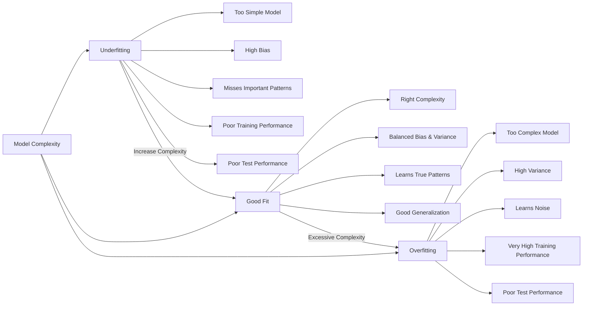
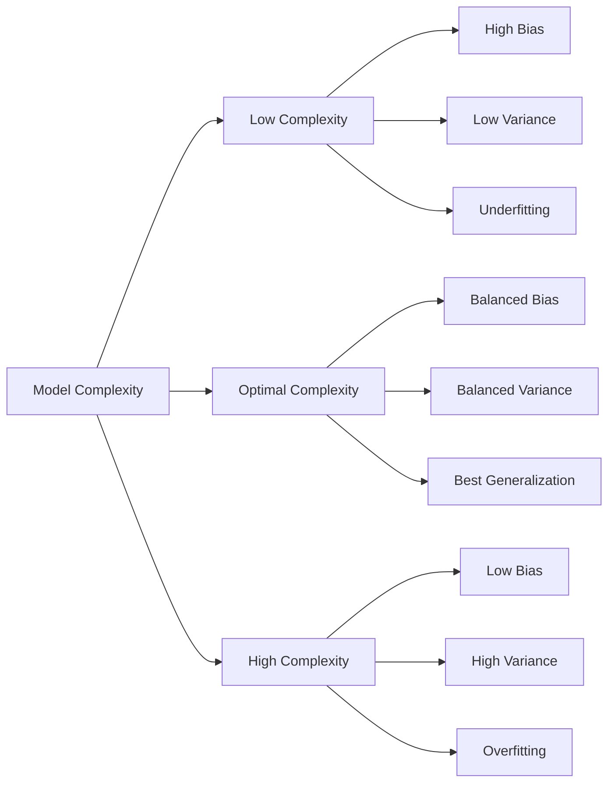
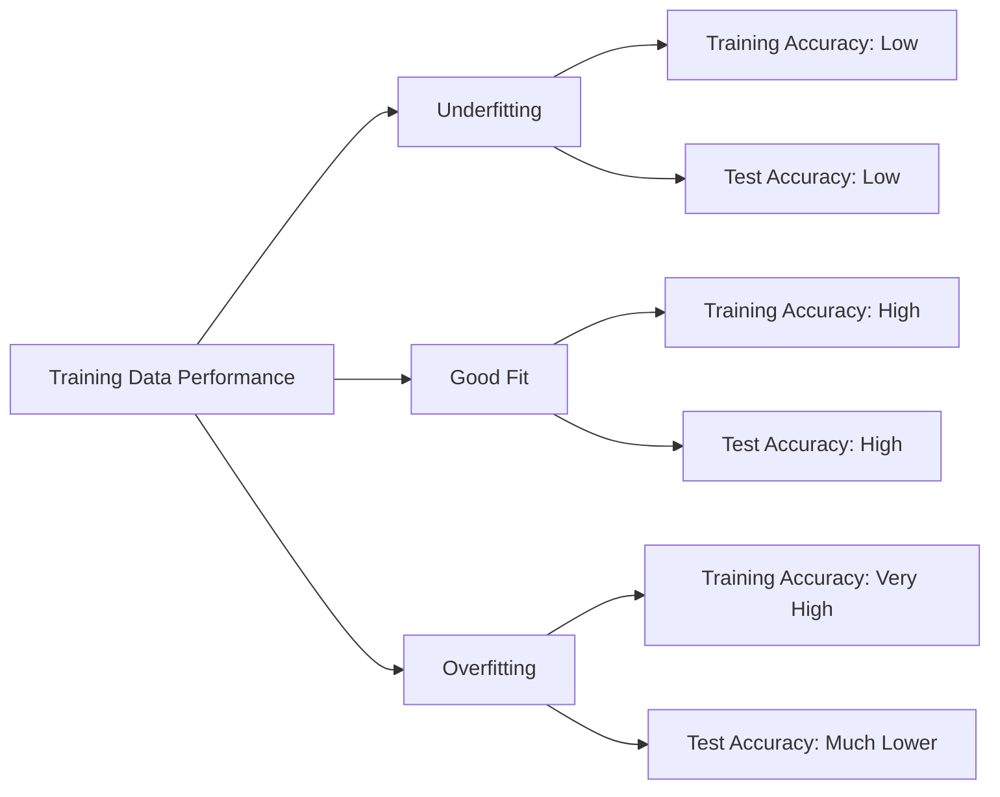
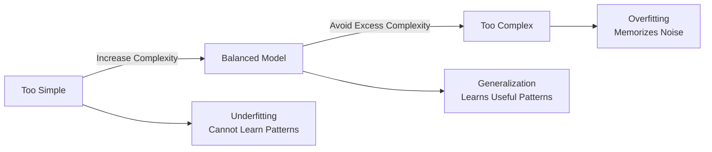

# Understanding the Balance

## Underfitting: Model Too Simple

Underfitting occurs when a model cannot capture the important patterns in the data.

Characteristics:

- High bias
- Low variance
- Model makes overly simple assumptions
- Poor performance on both training and test data

Example:

A house price prediction model only considers:


House size → Price


but ignores:


Location
Number of rooms
Neighborhood
Market trends


The model is too simple to understand the real factors affecting prices.

---

## Overfitting: Model Too Complex

Overfitting occurs when a model learns the training data too closely, including noise and random variations.

Characteristics:

- Low bias
- High variance
- Excellent training performance
- Poor performance on unseen data

Example:

A house price model memorizes:


"This specific house sold for $350,000."

"This neighborhood had this exact price pattern."


Instead of learning general rules:


Size + Location + Features → Price


The model performs well on known houses but fails on new houses.

---

# The Ideal Model: Good Generalization

A well-balanced model:

- Learns important patterns
- Ignores random noise
- Performs well on training and unseen data
- Has a suitable level of complexity

Example:


Training Accuracy: 92%

Validation Accuracy: 90%

Test Accuracy: 89%


The small performance gap indicates good generalization.

---

# Factors Affecting Bias and Variance

The balance between bias and variance depends on several factors:

## 1. Model Complexity

Model complexity has a direct relationship with bias and variance.

### Simple Model:


Low Complexity
↓
High Bias
↓
Underfitting


Example:

Linear regression for a complex nonlinear problem.

---

### Complex Model:


High Complexity
↓
High Variance
↓
Overfitting


Example:

A very deep decision tree memorizing training examples.

---

## 2. Amount and Quality of Data

Data plays an important role in preventing overfitting and improving generalization.

Small dataset:


Less examples
↓
Model learns specific details
↓
Overfitting


Large, diverse dataset:


More examples
↓
Better pattern learning
↓
Improved generalization


However, more data is useful only when the data is high quality.

---

## 3. Number of Features

The number of input features affects model complexity.

Too few features:


Missing important information
↓
High Bias
↓
Underfitting


Too many unnecessary features:


Noise features included
↓
High Variance
↓
Overfitting


Example:

Predicting student performance:

Useful features:


Study hours
Attendance
Previous grades
Assignment scores


Unnecessary features:


Favorite color
Random ID number


---

## 4. Training Duration (Epochs)

The number of training epochs affects how much the model learns.

Too few epochs:


Insufficient learning
↓
Underfitting


Too many epochs:


Model starts memorizing training examples
↓
Overfitting


Example:


Epoch 10:
Model still learning patterns

Epoch 100:
Good performance

Epoch 500:
Starts learning noise


A technique called **early stopping** helps find the right training duration.

---

# Strategies to Balance Overfitting and Underfitting

## 1. Choose Appropriate Model Complexity

Select a model that matches the complexity of the problem.

### Examples:

*Simple problems:*


- Linear models
- Decision trees


**Complex problems:**


- Neural networks
- Gradient boosting
- Deep learning models


The goal is not the most powerful model, but the most suitable one.

---

## 2. Collect More High-Quality Data

More representative data helps the model learn general patterns.

### Example:

> Image classification:

#### Small dataset:


1,000 images


#### Better dataset:


> 100,000 images

*Different:*

- angles
- lighting conditions
- backgrounds

The model learns the actual object instead of memorizing examples.

---

## 3. Cross-Validation

Cross-validation evaluates whether the model performs consistently on different subsets of data.

### Example:

K-fold cross-validation:


**Dataset**
```bash
Fold 1 → Train/Test
Fold 2 → Train/Test
Fold 3 → Train/Test
...
```
---


Benefits:

- Detects overfitting
- Provides more reliable evaluation
- Helps choose better models

---

## 4. Regularization

Regularization reduces overfitting by preventing the model from becoming unnecessarily complex.

## Common methods:

### L1 Regularization (Lasso)

Encourages some feature weights to become zero.

*Effect:*


Removes less important features


---

### L2 Regularization (Ridge)

Reduces large parameter values.

*Effect:*


Creates smoother models


---

## 5. Feature Engineering

Good features help models learn important patterns.

### Example:

Raw date: 2026-06-25


**Converted features:**


- Day of week
- Month
- Holiday indicator
- Season


Better features often improve performance more than using a more complicated algorithm.

---

## 6. Early Stopping

Early stopping prevents overtraining.

**During training:**
```bash

Training Loss ↓

Validation Loss ↓

Validation Loss starts increasing

    ↓

Stop Training
```
---

The model stops before it begins memorizing noise.

---

## 7. Ensemble Learning

Ensemble methods combine multiple models to create a stronger predictor.

### Examples:

- Random Forest
- Gradient Boosting
- XGBoost

**Instead of trusting one model:**
```bash

Model A prediction
Model B prediction
Model C prediction

    ↓

Final Combined Prediction
```
---

This reduces errors and improves stability.

---

## 8. Dimensionality Reduction

When datasets contain too many features, dimensionality reduction can remove unnecessary information.

### Example:

**Principal Component Analysis (PCA):**

```bash
100 Features

    ↓

10 Important Components
```
---

**Benefits:**

- Reduces noise
- Speeds up training
- Helps prevent overfitting

---

## 9. Hyperparameter Tuning

Hyperparameters control model behavior.

### Examples:

- Learning rate
- Number of layers
- Tree depth
- Batch size
- Regularization strength

Testing different combinations helps find the best balance.

---

# Detecting the Balance

A simple comparison:

| Situation | Training Performance | Validation Performance | Problem |
|---|---|---|---|
| Underfitting | Low | Low | Model too simple |
| Good Fit | High | High | Good generalization |
| Overfitting | Very High | Low | Model memorized data |

---

# The Bias-Variance Tradeoff

Machine learning is a continuous balancing process:


- High Bias High Variance

- Underfitting ← Balance → Overfitting

- Too Simple Too Complex

- Misses Patterns Learns Noise


** Increasing model complexity:**

```bash
Bias ↓

Variance ↑
```
---

Reducing model complexity:
```bash

Bias ↑

Variance ↓

```

---

# Final Principle

The objective of machine learning is not to create the model with the highest training accuracy.

A model that achieves 100% training accuracy but fails on new data is not useful.

The real goal is:

> **Build a model that learns meaningful patterns, avoids unnecessary complexity, and generalizes well to unseen data.**

Finding this balance between bias and variance is one of the most important skills in machine learning.


## Overfitting vs Underfitting

A machine learning model should have the right level of complexity.  
If the model is too simple, it cannot learn important patterns (**underfitting**).  
If the model is too complex, it learns noise and memorizes the training data (**overfitting**).





## Bias-Variance Relationship

  ## Training vs Test Performance


   ##  The Goal of Machine Learning



