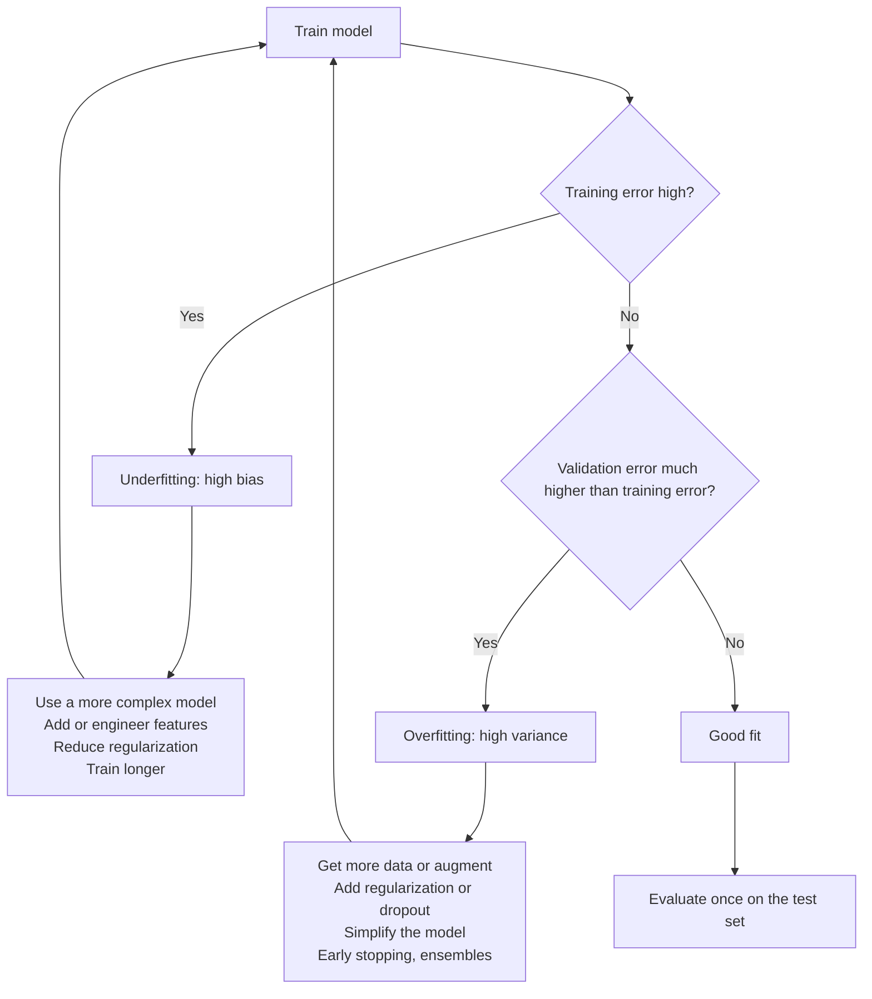
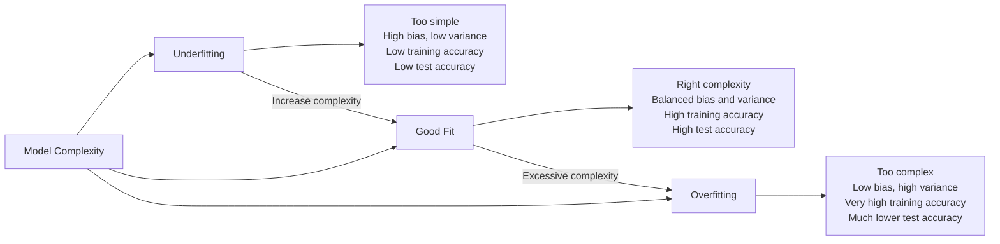
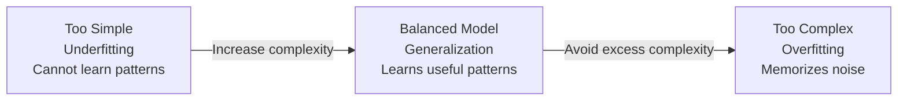

# Underfitting, Overfitting and the Bias-Variance Tradeoff

**Summary.** A machine learning model must have an appropriate level of complexity. A model that is too simple cannot learn the important patterns (**underfitting**); a model that is too complex memorizes the training data and its noise (**overfitting**). The goal is a model that **generalizes** well to unseen data. This document first defines the key terms, then explains the causes, the diagnostics and how to avoid each problem.


## 1. Definitions

This section defines the core terms precisely. The rest of the document builds on them.

### 1.1 Foundational terms

| Term | Definition |
|------|------------|
| **Generalization** | A model's ability to perform well on new, unseen data drawn from the same distribution as the training data. |
| **Training error** | The error a model makes on the data it was trained on. |
| **Test (generalization) error** | The error a model makes on unseen data. It is the quantity we ultimately want to minimize. |
| **Model complexity** | The flexibility of a model to represent complicated relationships; determined by its architecture, number of parameters, features and regularization. |

### 1.2 Bias

**Bias** is the error introduced by approximating a real-world problem with a model that makes overly simple or incorrect assumptions. Formally, it is the difference between the **expected (average) prediction** of the model and the **true value**, where the average is taken over different possible training sets.

$$\text{Bias}\big[\hat{f}(x)\big] = E\big[\hat{f}(x)\big] - f(x)$$

- High bias means the model is **systematically wrong**, regardless of the training set used.
- High bias leads to **underfitting**.

### 1.3 Variance

**Variance** is the amount by which a model's predictions change when it is trained on different samples of the training data. A high-variance model is overly sensitive to the specific training set and fits its noise.

$$\text{Var}\big[\hat{f}(x)\big] = E\Big[\big(\hat{f}(x) - E[\hat{f}(x)]\big)^2\Big]$$

- High variance means the model is **inconsistent** across training sets.
- High variance leads to **overfitting**.

### 1.4 Irreducible error

**Irreducible error** (noise) is the component of the error caused by randomness inherent in the data-generating process. No model can eliminate it.

### 1.5 Expected prediction error

The expected squared prediction error decomposes into three parts:

$$E\big[(y - \hat{f}(x))^2\big] = \text{Bias}^2 + \text{Variance} + \sigma^2$$

where $\sigma^2$ is the irreducible error.

### 1.6 Underfitting, overfitting and good fit

| Term | Definition |
|------|------------|
| **Underfitting** | The model is too simple to capture the underlying pattern, so it performs poorly on **both** training and test data (high bias, low variance). |
| **Overfitting** | The model fits the training data, including its noise, so closely that it performs well on training data but poorly on unseen data (low bias, high variance). |
| **Good fit** | The model captures the true pattern without fitting noise, and performs well on both training and unseen data (balanced bias and variance). |

### 1.7 Bias-variance tradeoff

The **bias-variance tradeoff** is the relationship in which increasing model complexity typically **decreases bias but increases variance**, and decreasing complexity does the opposite. The objective is to choose the level of complexity that minimizes total error on unseen data.

### 1.8 Bias term (intercept)

In a parametric model such as $y = wx + b$, the **bias term** $b$ is a learnable intercept that shifts the output or decision boundary, allowing the model to fit patterns that cannot be represented by the weights alone. It is a model parameter and is **unrelated** to statistical bias or fairness bias.

### 1.9 Techniques referenced in this document

| Technique | Definition |
|-----------|------------|
| **Regularization** | Adding a penalty to the training objective to discourage unnecessary complexity and reduce overfitting. |
| **Cross-validation** | Evaluating a model on multiple train/test splits of the data to obtain a reliable estimate of generalization performance. |
| **Early stopping** | Halting training when validation performance stops improving, before the model begins to memorize noise. |
| **Ensemble learning** | Combining the predictions of multiple models to improve accuracy and stability. |
| **Hyperparameter** | A setting chosen before training (for example learning rate or tree depth) that controls model behavior. |

---

## 2. Underfitting vs Overfitting vs Good Fit

### Underfitting: model is too simple

The model cannot capture the important patterns in the data.

| Property | Value |
|----------|-------|
| Bias | **High** |
| Variance | Low |
| Training performance | Poor |
| Test performance | Poor |
| Cause | Overly simple assumptions |

**Example:** a house price model that uses only `House size → Price` and ignores location, number of rooms, neighborhood and market trends. It is too simple to understand the real factors behind prices.

### Overfitting: model is too complex

The model learns the training data too closely, including noise and random variation.

| Property | Value |
|----------|-------|
| Bias | Low |
| Variance | **High** |
| Training performance | Excellent |
| Test performance | Poor |
| Cause | Memorizing instead of learning |

**Example:** the model memorizes *"this specific house sold for $350,000"* and *"this neighborhood had this exact price"* instead of learning the general rule `Size + Location + Features → Price`. It does well on known houses and fails on new ones.

### Good fit: the ideal model

A well-balanced model:

- Learns the important patterns
- Ignores random noise
- Performs well on both training and unseen data
- Has a suitable level of complexity

**Example:**

| Dataset | Accuracy |
|---------|----------|
| Training | 92% |
| Validation | 90% |
| Test | 89% |

The small gap between training and test accuracy shows good generalization.

### Side-by-side comparison

| | Underfitting | Good Fit | Overfitting |
|---|--------------|----------|-------------|
| Model complexity | Too low | Right | Too high |
| Bias | High | Balanced | Low |
| Variance | Low | Balanced | High |
| Training performance | Low | High | Very high |
| Test performance | Low | High | Much lower |
| What it does | Misses patterns | Learns true patterns | Learns noise |

---

## 3. Factors That Affect Bias and Variance

### 3.1 Model complexity

| Model | Chain of effects | Example |
|-------|------------------|---------|
| Too simple | Low complexity → High bias → Underfitting | Linear regression on a nonlinear problem |
| Too complex | High complexity → High variance → Overfitting | A very deep decision tree memorizing examples |

### 3.2 Amount and quality of data

| Data | Effect |
|------|--------|
| Small dataset | Model learns specific details → **Overfitting** |
| Large, diverse dataset | Better pattern learning → **Better generalization** |

> More data helps only when it is **high quality** and representative.

### 3.3 Number of features

| Features | Effect |
|----------|--------|
| Too few | Missing important information → High bias → Underfitting |
| Too many unnecessary ones | Noise features included → High variance → Overfitting |

**Example: predicting student performance**

- Useful features: study hours, attendance, previous grades, assignment scores
- Unnecessary features: favorite color, random ID number

### 3.4 Training duration (epochs)

| Epochs | Effect |
|--------|--------|
| Too few | Insufficient learning → Underfitting |
| Just right | Good performance |
| Too many | Model starts memorizing → Overfitting |

**Example:**

| Epoch | What happens |
|-------|--------------|
| 10 | Model is still learning patterns |
| 100 | Good performance |
| 500 | Starts learning noise |

**Early stopping** helps find the right training duration (see Section 4.6).

---

## 4. Strategies to Balance the Model

### 4.1 Choose appropriate model complexity

Match the model to the problem.

| Problem | Suitable models |
|---------|-----------------|
| Simple | Linear models, shallow decision trees |
| Complex | Neural networks, gradient boosting, deep learning |

> The goal is not the most powerful model, but the **most suitable** one.

### 4.2 Collect more high-quality data

More representative data helps the model learn general patterns.

**Example: image classification**

- Small dataset: 1,000 images
- Better dataset: 100,000 images with different **angles**, **lighting conditions** and **backgrounds**

The model then learns the actual object instead of memorizing examples.

### 4.3 Cross-validation

Cross-validation checks whether the model performs consistently on different subsets of the data.

**K-fold cross-validation:** the dataset is split into K folds; each fold takes a turn as the test set while the others are used for training.

```
Fold 1 → Test | Train | Train | Train | Train
Fold 2 → Train | Test | Train | Train | Train
Fold 3 → Train | Train | Test | Train | Train
...
```

**Benefits:**

- Detects overfitting
- Gives a more reliable evaluation
- Helps choose better models

### 4.4 Regularization

Regularization prevents the model from becoming unnecessarily complex by adding a penalty to the loss.

| Method | What it does | Effect |
|--------|--------------|--------|
| **L1 (Lasso)** | Pushes some weights to exactly zero | Removes less important features |
| **L2 (Ridge)** | Shrinks large weights | Creates smoother models |
| **Dropout** (neural nets) | Randomly turns off neurons during training | Reduces co-dependence between neurons |

### 4.5 Feature engineering

Good features help models learn important patterns.

**Example:** raw date `2026-06-25` can be converted into:

- Day of week
- Month
- Holiday indicator
- Season

> Better features often improve performance more than using a more complicated algorithm.

### 4.6 Early stopping

Stop training before the model starts memorizing noise.

```
Training loss      ↓  (keeps decreasing)
Validation loss    ↓  (decreasing)
Validation loss    ↑  (starts increasing)  →  STOP TRAINING
```

### 4.7 Ensemble learning

Combine multiple models into a stronger predictor.

- Examples: Random Forest, Gradient Boosting, XGBoost

```
Model A prediction ┐
Model B prediction ├→ Final combined prediction
Model C prediction ┘
```

This reduces errors and improves stability (especially it **lowers variance**).

### 4.8 Dimensionality reduction

When there are too many features, remove unnecessary information.

**Example: PCA (Principal Component Analysis)**

```
100 features  →  10 important components
```

**Benefits:** reduces noise, speeds up training, helps prevent overfitting.

### 4.9 Hyperparameter tuning

Hyperparameters control model behavior. Testing different combinations helps find the best balance.

Examples: learning rate, number of layers, tree depth, batch size, regularization strength.

### Quick fix guide

| Problem | Fixes |
|---------|-------|
| **High bias (underfitting)** | More complex model, more/better features, less regularization, train longer |
| **High variance (overfitting)** | More data, regularization, simpler model, fewer features, cross-validation, early stopping, ensembles, data augmentation |

---

## 5. How to Avoid Underfitting and Overfitting

Underfitting and overfitting have opposite causes, so they require opposite remedies. Always **diagnose first** (Section 6), then apply the matching fixes below. Applying an overfitting remedy to an underfitting model (or the reverse) makes the problem worse.

### 5.1 How to avoid underfitting (reduce bias)

The goal is to increase the model's capacity to learn.

| Action | Why it works | Example |
|--------|--------------|---------|
| **Use a more complex model** | Gives the model enough flexibility to capture the pattern | Replace linear regression with Random Forest, Gradient Boosting or a neural network |
| **Add relevant features** | Supplies information the model was missing | Add location and number of rooms to a house price model |
| **Improve feature engineering** | Exposes patterns that raw inputs hide | Polynomial features, interaction terms, date parts |
| **Reduce regularization** | Excessive penalties over-constrain the model | Lower the L1/L2 strength or dropout rate |
| **Train longer** | The model may not have converged yet | Increase epochs; tune the learning rate |
| **Increase model capacity** | More parameters can represent more complex functions | Add layers or neurons; increase tree depth |
| **Remove over-aggressive feature reduction** | Dimensionality reduction may have discarded signal | Keep more PCA components |

### 5.2 How to avoid overfitting (reduce variance)

The goal is to limit the model's ability to memorize noise.

| Action | Why it works | Example |
|--------|--------------|---------|
| **Collect more data** | Makes noise average out and patterns stand out | Add more labeled examples |
| **Use data augmentation** | Creates variety without new collection | Flip, rotate and crop images; add noise to audio |
| **Apply regularization** | Penalizes complexity | L1 (Lasso), L2 (Ridge), weight decay |
| **Use dropout** | Prevents neurons from co-adapting | Dropout layers in neural networks |
| **Simplify the model** | Reduces capacity to memorize | Fewer layers, shallower trees, fewer parameters |
| **Prune or limit trees** | Stops trees from fitting every sample | Set `max_depth`, `min_samples_leaf`; prune after training |
| **Select features** | Removes noise inputs | Drop irrelevant features; use L1 or feature importance |
| **Apply dimensionality reduction** | Keeps signal, drops noise | PCA from 100 features to 10 components |
| **Use early stopping** | Stops before memorization begins | Stop when validation loss rises |
| **Use ensembles** | Averaging reduces variance | Bagging, Random Forest |
| **Use cross-validation** | Gives a reliable estimate and guides model selection | K-fold with K = 5 or 10 |
| **Use transfer learning** | Starts from knowledge learned on large data | Fine-tune a pretrained model on a small dataset |

### 5.3 Reading learning curves

Plot training and validation error against the number of training examples (or epochs).

| Curve pattern | Diagnosis | What to do |
|---------------|-----------|------------|
| Both errors **high** and close together | Underfitting (high bias) | Increase complexity, add features; **more data will not help** |
| Training error **low**, validation error **high**, large gap | Overfitting (high variance) | More data, regularization, simpler model |
| Both errors **low** and close together | Good fit | Stop; evaluate on the test set |
| Validation error **falls then rises** during training | Overfitting from over-training | Use early stopping |

### 5.4 Recommended workflow

1. **Split the data** into training, validation and test sets (or use cross-validation). Keep the test set untouched.
2. **Start with a simple baseline** (for example linear or logistic regression) to know what "reasonable" looks like.
3. **Train and record** training and validation error.
4. **Diagnose** using the learning-curve table above.
5. **Apply the matching remedy**: increase capacity if underfitting; regularize or add data if overfitting.
6. **Tune hyperparameters** using the validation set or cross-validation.
7. **Repeat** steps 3 to 6 until the training/validation gap is small and the error is acceptably low.
8. **Evaluate once** on the test set to report final performance.

### 5.5 Decision flow


```mermaid
flowchart TD
    A[Train model] --> B{Training error high?}
    B -->|Yes| C["Underfitting: high bias"]
    C --> C1["Use a more complex model<br/>Add or engineer features<br/>Reduce regularization<br/>Train longer"]
    C1 --> A
    B -->|No| D{Validation error much higher than training error?}
    D -->|Yes| E["Overfitting: high variance"]
    E --> E1["Get more data or augment<br/>Add regularization or dropout<br/>Simplify the model<br/>Early stopping, ensembles"]
    E1 --> A
    D -->|No| F["Good fit"]
    F --> G[Evaluate once on the test set]
```

### 5.6 Common mistakes to avoid

| Mistake | Consequence | Correct practice |
|---------|-------------|------------------|
| **Tuning on the test set** | Test score becomes over-optimistic; hidden overfitting | Tune only on validation data or via cross-validation |
| **Data leakage** (for example scaling or selecting features before splitting) | Inflated performance that fails in production | Fit preprocessing on training data only, inside a pipeline |
| **Adding more data to an underfitting model** | No improvement | Increase model capacity or features instead |
| **Adding complexity to an overfitting model** | Worse variance | Regularize, simplify or add data |
| **Judging by training accuracy alone** | Misses overfitting | Always compare with validation/test performance |
| **Ignoring class imbalance or data quality** | Misleading metrics, biased model | Use suitable metrics and clean, representative data |

---

## 6. How to Detect the Problem

| Situation | Training performance | Validation performance | Problem |
|-----------|----------------------|------------------------|---------|
| Underfitting | Low | Low | Model too simple |
| Good fit | High | High | Good generalization |
| Overfitting | Very high | Low | Model memorized the data |

**Rule of thumb:**

- Both errors high → **bias problem**
- Training error low, validation error high (large gap) → **variance problem**

---

## 7. The Bias-Variance Tradeoff

Machine learning is a continuous balancing process.

```
Too Simple              Balanced              Too Complex
High Bias         →     Good Model      →     High Variance
Underfitting                                  Overfitting
Misses patterns                               Learns noise
```

| Action | Bias | Variance |
|--------|------|----------|
| Increase model complexity | ↓ decreases | ↑ increases |
| Decrease model complexity | ↑ increases | ↓ decreases |

$$\text{Total Error} = \text{Bias}^2 + \text{Variance} + \text{Irreducible Noise}$$

---

## 8. Visual Summary

### Overfitting vs underfitting


```mermaid
flowchart LR
    A[Model Complexity] --> B[Underfitting]
    A --> C[Good Fit]
    A --> D[Overfitting]

    B --> B1["Too simple<br/>High bias, low variance<br/>Low training accuracy<br/>Low test accuracy"]
    C --> C1["Right complexity<br/>Balanced bias and variance<br/>High training accuracy<br/>High test accuracy"]
    D --> D1["Too complex<br/>Low bias, high variance<br/>Very high training accuracy<br/>Much lower test accuracy"]

    B -->|Increase complexity| C
    C -->|Excessive complexity| D
```

### Goal: find the balance


```mermaid
flowchart LR
    A["Too Simple<br/>Underfitting<br/>Cannot learn patterns"]
    B["Balanced Model<br/>Generalization<br/>Learns useful patterns"]
    C["Too Complex<br/>Overfitting<br/>Memorizes noise"]

    A -->|Increase complexity| B
    B -->|Avoid excess complexity| C
```

---

## 9. Final Principle

The objective of machine learning is **not** to build the model with the highest training accuracy. A model with 100% training accuracy that fails on new data is not useful.

> **Build a model that learns meaningful patterns, avoids unnecessary complexity, and generalizes well to unseen data.**

Finding this balance between bias and variance is one of the most important skills in machine learning.
