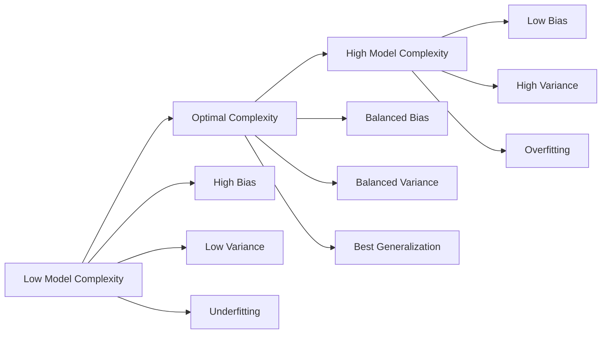

# Bias and Variance in Machine Learning

Bias and variance describe two different types of errors that affect how well a machine learning model learns and generalizes to new data.

A good model needs to find the right balance between **bias** and **variance**.

---

## Total Prediction Error

The expected prediction error can be decomposed as:

$$
\text{Total Error} = \text{Bias}^2 + \text{Variance} + \text{Irreducible Noise}
$$

where:

- **Bias²** → Error caused by overly simple assumptions
- **Variance** → Error caused by being too sensitive to training data
- **Noise** → Random error that cannot be removed

---

# 1. Bias

## What is Bias?

Bias is the error caused when a model makes **overly simple assumptions** about the data.

A high-bias model cannot capture the true patterns and relationships in the dataset.

In simple terms:

> **Bias means the model is too simple and misses important information.**

---

## Example: High Bias

Imagine predicting house prices using only one feature:


House Price = Size × Fixed Rate


The model ignores:

- Location
- Number of bedrooms
- Neighborhood
- Market conditions

The model cannot understand the complexity of real-world pricing.

Result:


Training Error: High
Test Error: High


This is called **underfitting**.

---

## Characteristics of High Bias

- Model is too simple
- Makes strong assumptions
- Cannot learn complex patterns
- Underfits the data
- Low training and testing performance

Examples:

- Linear regression for a nonlinear problem
- Very shallow decision tree
- Simple neural network for a complex task

---

# 2. Variance

## What is Variance?

Variance measures how much a model's predictions change when trained on different datasets.

A high-variance model learns the training data too closely, including noise and random patterns.

In simple terms:

> **Variance means the model is too sensitive to the training data.**

---

## Example: High Variance

Suppose a model learns house prices.

Instead of learning:


Size + Location + Features → Price


It memorizes:


"This exact house sold for $450,000."

"This specific neighborhood had this price."


When it sees a new house, predictions become inaccurate.

Result:


Training Error: Very Low
Test Error: High


This is called **overfitting**.

---

## Characteristics of High Variance

- Model is too complex
- Memorizes training examples
- Learns noise
- Overfits the data
- Large gap between training and test performance

Examples:

- Very deep decision tree
- Neural network with too many parameters
- Model trained on a very small dataset

---

# Bias vs Variance Comparison

| | High Bias | High Variance |
|-|-|-|
| Problem | Underfitting | Overfitting |
| Model | Too simple | Too complex |
| Training Error | High | Very low |
| Test Error | High | High |
| Learning | Misses patterns | Learns noise |
| Generalization | Poor | Poor |

---

# Bias-Variance Tradeoff

Increasing model complexity usually creates this relationship:


----
```mermaid
flowchart LR
    A[Model Complexity]

    A --> B[Simple Model]
    A --> C[Balanced Model]
    A --> D[Complex Model]

    B --> B1["High Bias<br/>Misses Important Patterns"]

    C --> C1["Optimal Balance<br/>Learns True Patterns"]

    D --> D1["High Variance<br/>Learns Noise"]
````
---


## How to Reduce Bias

**If the model has high bias:**

> Increase its ability to learn.

**Solutions:**

- Use a more complex model
- Add useful features
- Reduce excessive regularization
- Train longer
- Use better feature engineering

### Example:

**Replace:**

- Linear Regression

**with:**

- Random Forest
- Gradient Boosting
- Neural Network
- 
## How to Reduce Variance

**If the model has high variance:**

> Reduce unnecessary complexity.

**Solutions:**

- Collect more training data
- Use regularization
- Reduce model complexity
- Remove irrelevant features
- Use cross-validation
- Apply data augmentation
- Use ensemble methods

### Example:

**Instead of:**

- Decision Tree with unlimited depth

**use:**

- Random Forest with controlled trees
  
## Key Idea

> The goal of machine learning is not to minimize training error alone.

**A successful model should:**

- Learn important patterns
- Ignore random noise
- Perform well on unseen data

**The best model lies between two extremes:**


Too Simple              Balanced              Too Complex

High Bias        →      Good Model      →     High Variance

Underfitting                              Overfitting

> The purpose of the bias-variance tradeoff is to find the right level of complexity where the model generalizes best


## Key Terms: Bias, Variance, and Model Behavior

These terms explain **why a Machine Learning model fails or succeeds**.  
A model must balance simplicity and complexity to achieve good generalization.

| Term | What People Say | What It Actually Means |
|------|-----------------|------------------------|
| **Bias** | "The model is too simple" | Systematic error caused by incorrect assumptions. It measures how far the average prediction of the model is from the true value. |
| **Variance** | "The model is overfitting" | Error caused by the model being too sensitive to training data. It measures how much predictions change when the training dataset changes. |
| **Irreducible Error** | "Noise in the data" | Random error from the real-world data-generating process that cannot be removed by any model. |
| **Underfitting** | "The model is not learning enough" | A situation where the model has high bias and cannot capture the true pattern, even in the training data. |
| **Overfitting** | "The model memorized the data" | A situation where the model has high variance and learns training noise instead of general patterns. |
| **Regularization** | "Constraining the model" | A technique that adds a penalty to the learning process to reduce complexity and improve generalization. |
| **Double Descent** | "More parameters can help" | A modern phenomenon where increasing model size can reduce test error again after passing the traditional overfitting region. |
| **Model Complexity** | "How flexible the model is" | The ability of a model to represent complex relationships. Controlled by architecture, features, and regularization. |

---