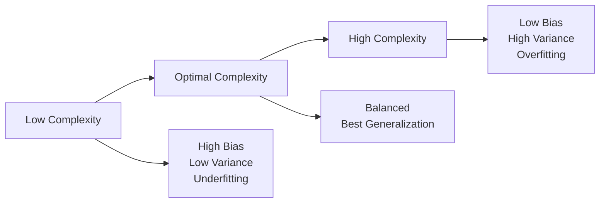

# Bias and Variance in Machine Learning


The word **bias** is used in several different ways in ML. Most confusion comes from mixing them up, so this note separates each meaning, then connects them.

---

##  Quick Map: The 5 Meanings of "Bias"

| # | Meaning | One-line idea | Related to |
|---|---------|---------------|------------|
| 1 | **Bias term (intercept)** | Learnable offset `b` in `y = wx + b` | Model parameters |
| 2 | **Statistical bias** | Model is systematically wrong because it is too simple | Underfitting, bias-variance tradeoff |
| 3 | **Systematic error** | Predictions are consistently too high or too low | Evaluation / error analysis |
| 4 | **Inductive bias** | Assumptions built into a model so it can generalize | Model design (CNN, RNN, etc.) |
| 5 | **Data / fairness bias** | Model treats groups unfairly due to skewed data or design | Ethics, responsible AI |

---

## 1. Bias as a Parameter (Intercept Term)

### Equation

$$y = mx + c \quad\text{or, in ML notation:}\quad y = wx + b$$

- `w` (or `m`) = weight / slope, controls the **angle** of the line
- `x` = input
- `b` (or `c`) = **bias / intercept**, controls the **vertical shift** of the line

### What the diagram shows

**Left: `y = mx` with `c = 0`**

- The line is forced to pass through the origin (0, 0).
- Only the slope can change, so the line can only rotate around the origin.
- If the data does not naturally pass through the origin, the fit is poor and errors (`e1`, `e2`) stay large.

**Right: `y = mx + c`**

- The bias `c` lets the line **shift up or down** as well as rotate.
- The model can find the **best fit** for data that does not pass through the origin.

### Example

- `y = 2x` passes through (0, 0).
- `y = 2x + 5` has the **same slope**, but the whole line is shifted **up by 5**.

### In neural networks

$$z = w_1x_1 + w_2x_2 + \cdots + w_nx_n + b$$

Here `b` shifts the neuron's activation / decision boundary, so a neuron can activate even when all inputs are zero.

> **Interview definition:** Bias is a learnable intercept term that shifts the activation or decision boundary, allowing a model to fit patterns that cannot be represented by weights alone.

**Important:** this `b` has **nothing to do with unfairness** or underfitting. It is just a parameter learned during training.

---

## 2. Error vs Residual vs Bias (Common Confusion)

**Question:** Is the difference between actual and predicted value called bias?

**Answer: Not exactly.**

### Error / Residual (one data point)

$$\text{Error} = y_{\text{actual}} - y_{\text{predicted}}$$

Example: actual = 10, predicted = 8, so error = 10 − 8 = **2**. This is an individual error, not necessarily bias.

### Bias (systematic tendency across many predictions)

Bias asks: *is the model consistently wrong in the same direction?*

| Actual | Predicted | Error (Actual − Predicted) |
|--------|-----------|----------------------------|
| 10 | 8 | +2 |
| 20 | 18 | +2 |
| 30 | 28 | +2 |
| 40 | 38 | +2 |

The model **always under-predicts by about 2**, so it has a systematic bias. The sign depends on the convention used.

Mathematically:

$$\text{Bias} = E[\hat{f}(x)] - f(x)$$

This is the gap between the **average prediction** of the model and the **true value**.

### Summary

| Concept | Meaning |
|---------|---------|
| Error / Residual | Actual − Predicted for **one** sample |
| Bias (statistical) | **Average** tendency of the model to be wrong in one direction |
| Bias term `b` | A learnable parameter (intercept) |

---

## 3. Statistical Bias (Bias-Variance Sense)

### What is it?

Bias is the error caused when a model makes **overly simple assumptions** about the data. A high-bias model cannot capture the true patterns.

> **Bias means the model is too simple and misses important information.**

### Example: High Bias

Predicting house price with a single rule:

```
House Price = Size × Fixed Rate
```

The model ignores location, bedrooms, neighborhood and market conditions.

- Training error: **High**
- Test error: **High**
- Result: **Underfitting**

### Characteristics of high bias

- Model is too simple
- Makes strong assumptions
- Cannot learn complex patterns
- Underfits the data
- Poor training **and** test performance

### Examples

- Linear regression on a nonlinear problem
- Very shallow decision tree
- Simple neural network on a complex task

---

## 4. Variance

### What is it?

Variance measures how much a model's predictions **change when trained on different datasets**. A high-variance model fits the training data too closely, including noise.

> **Variance means the model is too sensitive to the training data.**

### Example: High Variance

Instead of learning `Size + Location + Features → Price`, the model memorizes *"this exact house sold for $450,000."* On a new house, its prediction is poor.

- Training error: **Very low**
- Test error: **High**
- Result: **Overfitting**

### Characteristics of high variance

- Model is too complex
- Memorizes training examples
- Learns noise
- Large gap between training and test performance

### Examples

- Very deep decision tree
- Neural network with too many parameters
- Any model trained on a very small dataset

---

## 5. Bias vs Variance Comparison

| | High Bias | High Variance |
|---|-----------|---------------|
| Problem | Underfitting | Overfitting |
| Model | Too simple | Too complex |
| Training error | High | Very low |
| Test error | High | High |
| Learning | Misses patterns | Learns noise |
| Generalization | Poor | Poor |
| Typical fix | Make model more expressive | Constrain model / add data |

---

## 6. Total Prediction Error

$$\text{Total Error} = \text{Bias}^2 + \text{Variance} + \text{Irreducible Noise}$$

- **Bias²**: error from overly simple assumptions
- **Variance**: error from sensitivity to the training set
- **Irreducible noise**: random error in the real-world process that no model can remove

### Bias-Variance Tradeoff


```mermaid
flowchart LR
    A[Low Complexity] --> B[Optimal Complexity] --> C[High Complexity]

    A --> A1["High Bias<br/>Low Variance<br/>Underfitting"]
    B --> B1["Balanced<br/>Best Generalization"]
    C --> C1["Low Bias<br/>High Variance<br/>Overfitting"]
```

| Complexity | Bias | Variance | Behavior |
|------------|------|----------|----------|
| Low (simple model) | High | Low | Underfitting |
| Optimal | Balanced | Balanced | **Best generalization** |
| High (complex model) | Low | High | Overfitting |

```
Too Simple             Balanced             Too Complex
High Bias        →     Good Model     →     High Variance
Underfitting                                 Overfitting
```

> The purpose of the tradeoff is to find the complexity level where the model generalizes best.

---

## 7. Inductive Bias

Inductive bias is the set of **assumptions built into a model** that help it learn and generalize. Learning is impossible without some assumptions.

| Model | Built-in assumption |
|-------|---------------------|
| Linear regression | The relationship is linear |
| CNN | Nearby pixels are related; patterns repeat across the image |
| RNN / LSTM | Order in a sequence matters |
| Transformer | Any token may relate to any other (attention) |
| k-NN | Similar inputs have similar outputs |
| Regularization | Simpler solutions are preferred |

Inductive bias is **useful**, but if the assumption is wrong for the problem, it becomes a source of high statistical bias.

---

## 8. Data and Fairness Bias (Ethical Bias)

This is the meaning used in news and AI ethics: a model produces **systematically unfair results for certain groups**.

### Common sources

| Type | Description | Example |
|------|-------------|---------|
| **Historical bias** | Data reflects past discrimination | Hiring data that favored men |
| **Sampling bias** | Data does not represent the real population | Face dataset mostly of light-skinned people |
| **Labeling bias** | Human annotators add their assumptions | Subjective "toxic" labels |
| **Measurement bias** | Feature or proxy does not measure the intended thing | Zip code used as proxy for creditworthiness |
| **Selection bias** | Training data is chosen in a skewed way | Only surveying people who respond online |
| **Algorithmic bias** | Model design or objective amplifies inequality | Optimizing only for overall accuracy |
| **Deployment bias** | Model is used in a context it was not built for | Model trained in one country used in another |
| **Confirmation / automation bias** | Humans over-trust or cherry-pick model output | Accepting an AI decision without review |

### How to reduce harmful bias

- Use more representative, diverse data
- Audit performance **per group**, not just overall
- Rebalance or reweight the dataset
- Remove or carefully handle proxy features
- Use fairness-aware training and metrics (demographic parity, equalized odds)
- Keep humans in the loop for high-stakes decisions
- Document datasets and models (datasheets, model cards)

---

## 9. How to Reduce Statistical Bias and Variance

### If the model has HIGH BIAS (underfitting)

> Increase its ability to learn.

- Use a more complex model
- Add useful features / better feature engineering
- Reduce excessive regularization
- Train longer

**Example:** replace Linear Regression with Random Forest, Gradient Boosting or a Neural Network.

### If the model has HIGH VARIANCE (overfitting)

> Reduce unnecessary complexity.

- Collect more training data
- Use regularization (L1, L2, dropout)
- Reduce model complexity
- Remove irrelevant features
- Use cross-validation
- Apply data augmentation
- Use ensemble methods (bagging, Random Forest)

**Example:** instead of a decision tree with unlimited depth, use a Random Forest with controlled trees.

### How to diagnose

| Observation | Likely problem |
|-------------|----------------|
| Train error high, test error high | High bias |
| Train error low, test error high | High variance |
| Train error low, test error low | Good fit |

---

## 10. Key Terms

| Term | Plain-language meaning | Precise meaning |
|------|------------------------|-----------------|
| **Bias** | "Model is too simple" | Systematic error from wrong assumptions; distance between average prediction and truth |
| **Variance** | "Model overfits" | How much predictions change when the training dataset changes |
| **Irreducible error** | "Noise in the data" | Random error that no model can remove |
| **Underfitting** | "Not learning enough" | High bias; cannot capture the pattern even on training data |
| **Overfitting** | "Memorized the data" | High variance; learns training noise instead of general patterns |
| **Regularization** | "Constraining the model" | Penalty added to training to reduce complexity |
| **Double descent** | "More parameters can help" | Test error can fall again after the classic overfitting region as model size grows |
| **Model complexity** | "How flexible the model is" | Ability to represent complex relationships; set by architecture, features and regularization |
| **Residual / error** | "Actual − predicted" | Difference for a single data point |
| **Bias term (`b`)** | "The intercept" | Learnable offset that shifts the output or decision boundary |
| **Inductive bias** | "Built-in assumptions" | Assumptions that let a model generalize beyond training data |

---

## 11. Key Takeaways

1. **Bias term `b`**: a learnable intercept; lets the line shift away from the origin.
2. **Statistical bias**: error from a model that is too simple; causes underfitting.
3. **Error is not bias**: error is per sample; bias is the *average, systematic* direction of error.
4. **Variance** is the opposite problem: too sensitive to training data; causes overfitting.
5. **Total error = Bias² + Variance + Noise**; the goal is the best balance, not zero training error.
6. **Inductive bias** is a helpful assumption; **data/fairness bias** is a harmful distortion.
7. A good model learns real patterns, ignores noise, and performs well on **unseen data**.

### Interview one-liners

- **Bias (parameter):** A learnable intercept that shifts the decision boundary.
- **Bias (statistical):** The error from overly simple assumptions; high bias leads to underfitting.
- **Variance:** The sensitivity of a model to changes in the training data; high variance leads to overfitting.
- **Bias-variance tradeoff:** Increasing complexity lowers bias but raises variance, so we look for the sweet spot.
- **Fairness bias:** Systematic unfair outcomes for certain groups caused by skewed data or design.

