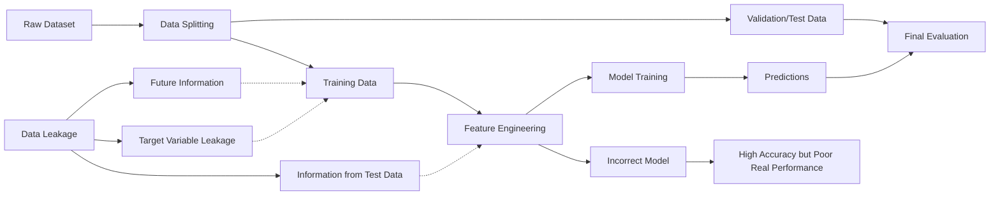
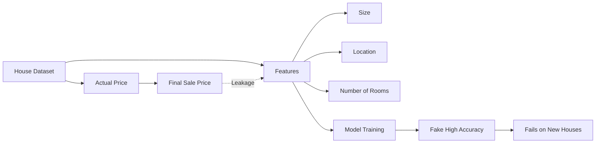
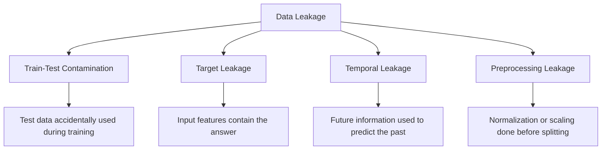
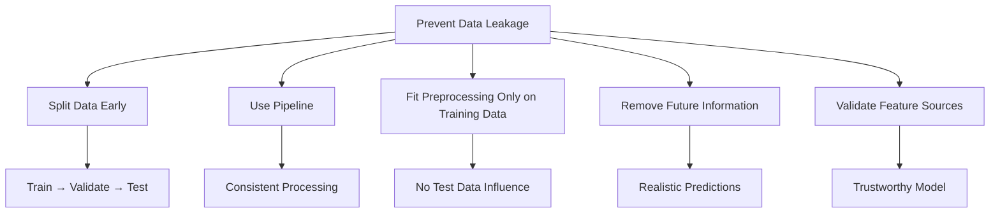
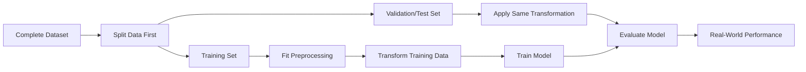

# Data Leakage

Data Leakage is one of the most common and dangerous mistakes in Machine Learning.

It happens when the model gains access to **information that would not be available at prediction time**, causing it to perform unrealistically well during training and testing.

---


---

## Definition

> **Data Leakage** occurs when information from outside the training process (especially future or target-related information) is accidentally used to train the model.

As a result:

- Validation accuracy becomes artificially high.
- Test accuracy appears excellent.
- Real-world performance is poor.

---

## Why Is Data Leakage Bad?

The model "cheats."

Instead of learning real patterns, it learns information that directly reveals the answer.

```text
Training Data
      │
      ▼
 Leaked Information
      │
      ▼
Excellent Validation Score
      │
      ▼
Poor Real-World Performance
```

---

## Example 1: House Price Prediction

Suppose you want to predict house prices.

### Correct Features

| Area | Bedrooms | Age |
|------|-----------|-----|
| 2000 | 3 | 5 |

### Wrong Feature (Leakage)

| Final Selling Price |
|---------------------|
| \$420,000 |

The selling price is the label you are trying to predict.

Including it as a feature allows the model to "cheat."

---

---
## Example 2: Student Exam Prediction

Goal:

Predict whether a student will pass.

### Correct Features

- Study hours
- Attendance
- Previous grades

### Leaked Feature

```text
Final Exam Score
```

The exam score is only known after the exam.

Using it makes prediction meaningless.

---

## Example 3: Medical Diagnosis

Goal:

Predict whether a patient has diabetes.

### Correct Features

- Age
- Weight
- Blood Pressure

### Leaked Feature

```text
Doctor's Final Diagnosis
```

The diagnosis is exactly what the model is trying to predict.

---

## Types of Data Leakage

## 1. Target Leakage

The most common type.

The model accidentally receives information directly related to the target.

### Example

Predict:

```text
Will the customer cancel?
```

Feature:

```text
Refund Amount
```

Refund is usually known only **after** cancellation.

---

## 2. Train-Test Leakage

Information from the test set accidentally influences training.

### Example

Wrong:

```python
# Scale entire dataset first 
scaler.fit(all_data)

# Then split
train_test_split(...)
```

Correct:

```python
# Split first 
train_test_split(...)

# Fit scaler only on training data
scaler.fit(X_train)

# Transform train and test
X_train = scaler.transform(X_train)
X_test = scaler.transform(X_test)
```

---

## 3. Time Leakage

Future information is used to predict the past.

### Example

Predict:

```text
Tomorrow's stock price
```

Feature:

```text
Tomorrow's closing price
```

The future cannot be known when making today's prediction.

---

## Common Causes of Data Leakage

- Splitting data after preprocessing
- Using future information
- Including the target as a feature
- Computing statistics (mean, standard deviation) on the full dataset
- Data duplication between training and testing
- Incorrect feature engineering

---

## How to Prevent Data Leakage


---

##  Split Data First

Always split the dataset before preprocessing.

```text
Dataset
    │
    ▼
Train/Test Split
    │
    ▼
Preprocessing
```

---

##  Fit Preprocessing Only on Training Data

Wrong:

```python
scaler.fit(all_data)
```

Correct:

```python
scaler.fit(X_train)
```

---

##  Remove Future Information

Only use information available **at prediction time**.

---

##  Carefully Inspect Features

Ask yourself:

> "Would this information be known when making the prediction?"

If the answer is **No**, remove the feature.

---

##  Use Pipelines

Scikit-learn pipelines automatically prevent many leakage problems.

Example:

```python
from sklearn.pipeline import Pipeline
from sklearn.preprocessing import StandardScaler
from sklearn.linear_model import LogisticRegression

pipeline = Pipeline([
    ("scaler", StandardScaler()),
    ("model", LogisticRegression())
])

pipeline.fit(X_train, y_train)
```

---

## Signs of Data Leakage

- Extremely high accuracy (e.g., 99–100%)
- Validation accuracy much higher than expected
- Real-world performance drops significantly
- Suspiciously low training and test errors

---

## Data Leakage vs Overfitting

| Data Leakage | Overfitting |
|--------------|-------------|
| Model has access to information it should not have | Model memorizes the training data |
| Caused by incorrect data preparation | Caused by excessive model complexity |
| Gives unrealistically high evaluation scores | Gives low training error but high test error |
| Fixed by correcting the data pipeline | Fixed by regularization, more data, or simpler models |

---

## Real-World Example

Suppose a bank wants to predict whether a customer will default on a loan.

### Correct Features

- Income
- Age
- Credit score
- Employment status

### Leaked Feature

```text
Loan Closed Date
```

If the loan has already been closed, the model is using future information.

It will achieve very high accuracy during testing but fail when deployed.

---

## Workflow Without Leakage



----


## Quick Memory Sheet

| Concept | Remember |
|----------|----------|
| Data Leakage | The model is cheating |
| Target Leakage | Using information related to the target |
| Train-Test Leakage | Test data influences training |
| Time Leakage | Using future information |
| Prevention | Split first, preprocess later |

## Golden Rule

> **If a feature would not be available when making a real prediction, it must not be used for training.**

A model should learn only from information that would genuinely be available at prediction time.