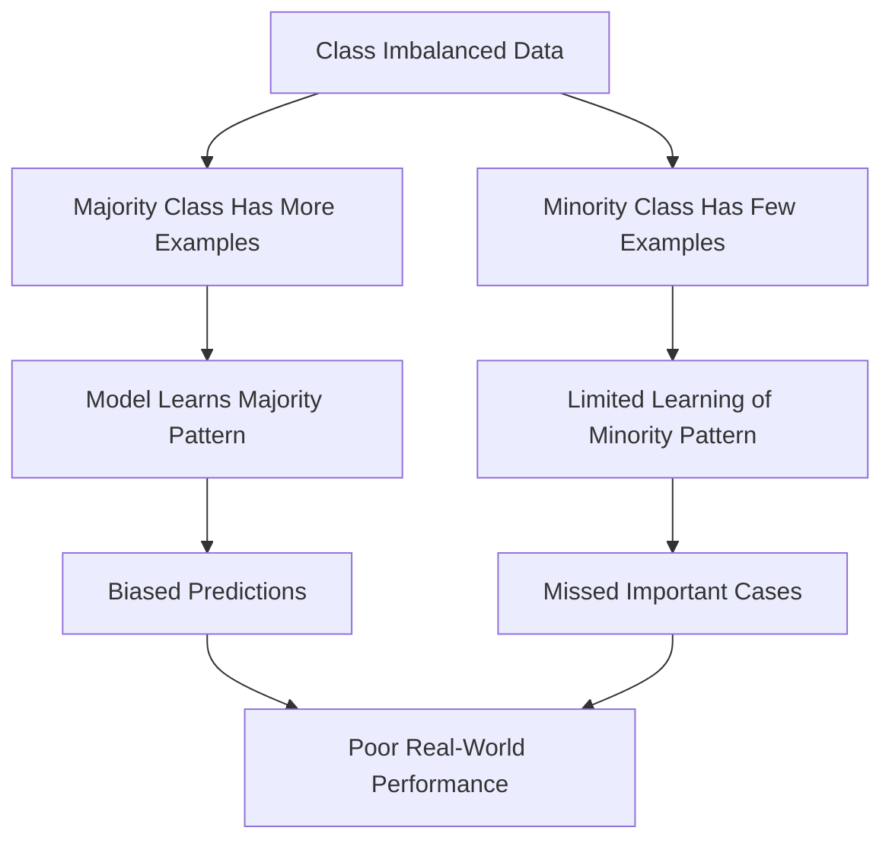
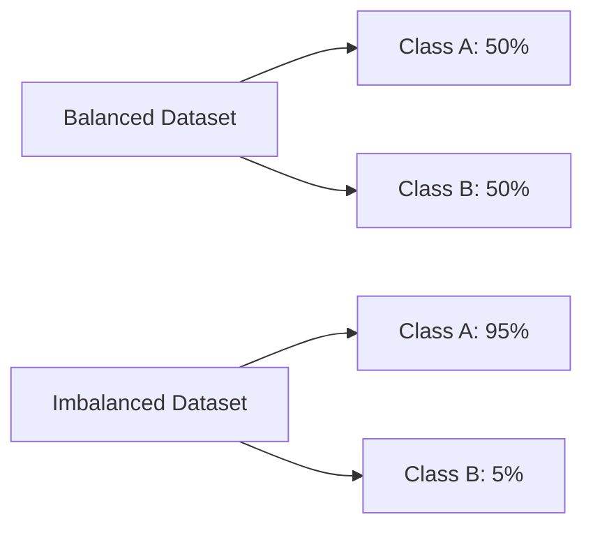
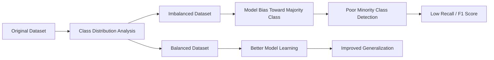

# Class Imbalance

Class imbalance occurs when **one class has significantly more samples than another** in a classification dataset.

In other words, the classes are **not equally represented**.

---

# Definition

> **Class Imbalance** is a situation where the number of examples in one class is much larger (or smaller) than the number of examples in another class.

For example:

```text
Email Dataset

Spam      =   500
Not Spam  = 9500
```

Here,

```text
Spam = 5%
Not Spam = 95%
```

This is an **imbalanced dataset**.

---

# Why Is It a Problem?


Most Machine Learning algorithms try to minimize overall error.

As a result, they tend to favor the **majority class** and ignore the minority class.

Example:

Suppose:

```text
1000 Patients

Healthy = 990
Cancer  = 10
```

A model predicts:

```text
Everyone is Healthy
```

Accuracy:

```text
990 / 1000 = 99%
```

Looks excellent...

But it completely fails to detect cancer patients.

---

# Balanced vs Imbalanced Dataset


### Balanced Dataset

```text
Cats : 500

Dogs : 500
```

Both classes have similar numbers.

---

### Imbalanced Dataset

```text
Cats : 950

Dogs : 50
```

The model may simply predict:

```text
Cat
Cat
Cat
Cat
...
```

---

# Real-World Examples

| Problem | Majority Class | Minority Class |
|----------|----------------|----------------|
| Fraud Detection | Normal Transactions | Fraud |
| Medical Diagnosis | Healthy Patients | Disease |
| Spam Detection | Normal Emails | Spam Emails |
| Credit Card Default | Paid Loans | Defaulted Loans |
| Manufacturing | Good Products | Defective Products |

In these problems, the **minority class is usually the most important**.

---

# Why Accuracy Can Be Misleading

Suppose:

```text
1000 Emails

Spam      = 20
Not Spam  = 980
```

Model prediction:

```text
Everything = Not Spam
```

Accuracy:

```text
980 / 1000

= 98%
```

Looks great...

Reality:

```text
Spam detected = 0%
```

The model is useless.

---

# Better Evaluation Metrics

For imbalanced datasets, accuracy is often **not enough**.

Use:

| Metric | Why? |
|----------|------|
| Precision | Measures how many predicted positives are actually correct. |
| Recall | Measures how many actual positives are detected. |
| F1-Score | Balances Precision and Recall. |
| ROC-AUC | Evaluates ranking ability across thresholds. |
| PR-AUC | Better than ROC-AUC when the positive class is rare. |

---

# Causes of Class Imbalance

- Rare diseases
- Fraud is uncommon
- Manufacturing defects are rare
- Spam emails are fewer than normal emails
- Equipment failures happen infrequently

The imbalance often reflects **real-world distributions**.

---

# How to Handle Class Imbalance

## 1. Collect More Minority Data

The best solution is often to gather more examples of the minority class.

Example:

```text
Fraud Cases

Before = 100

After = 500
```

---

## 2. Oversampling

Duplicate or generate more minority-class samples.

Example:

Before:

```text
Cats = 900

Dogs = 100
```

After Oversampling:

```text
Cats = 900

Dogs = 900
```

### Popular Method

- **SMOTE (Synthetic Minority Over-sampling Technique)**

SMOTE creates **new synthetic samples** instead of simply copying existing ones.

---

## 3. Undersampling

Reduce the number of majority-class samples.

Before:

```text
Cats = 900

Dogs = 100
```

After:

```text
Cats = 100

Dogs = 100
```

Simple but may discard useful information.

---

## 4. Class Weights

Give higher importance to mistakes on the minority class.

Example:

```text
Healthy Patient Error

Weight = 1
```

```text
Cancer Patient Error

Weight = 20
```

Now the model is penalized much more for missing cancer cases.

Many algorithms support this directly:

```python
class_weight="balanced"
```

Examples:

- Logistic Regression
- Decision Trees
- Random Forest
- Support Vector Machine

---

## 5. Threshold Tuning

By default:

```text
Probability > 0.50

Positive
```

For rare events:

```text
Probability > 0.20

Positive
```

Lowering the threshold often improves **Recall**.

---

## 6. Ensemble Methods

Algorithms like:

- Random Forest
- Gradient Boosting
- XGBoost
- LightGBM

often perform better on imbalanced datasets, especially when combined with class weighting.

---

# Example

Suppose:

```text
1000 Patients

Healthy = 950

Cancer = 50
```

Prediction:

```text
Healthy = 950

Cancer = 0
```

Accuracy:

```text
95%
```

Recall:

```text
0%
```

The model completely misses every cancer patient.

This demonstrates why **accuracy alone is not sufficient**.

---

# Workflow


---

# Class Imbalance vs Data Imbalance

| Class Imbalance | Data Imbalance |
|-----------------|----------------|
| Unequal number of class labels | General imbalance in the dataset (e.g., age, gender, regions) |
| Mainly affects classification | Can affect many analyses |
| Solved using sampling or class weights | Solved using better data collection or rebalancing |


---

# Quick Memory Sheet

| Concept | Remember |
|----------|----------|
| Class Imbalance | One class is much larger than another |
| Majority Class | The class with more samples |
| Minority Class | The class with fewer samples |
| Accuracy | Can be misleading |
| Better Metrics | Precision, Recall, F1-Score, ROC-AUC, PR-AUC |
| Oversampling | Increase minority samples |
| Undersampling | Reduce majority samples |
| Class Weights | Penalize minority errors more |
| SMOTE | Generate synthetic minority samples |

## Golden Rule

> **If your dataset is imbalanced, never rely on accuracy alone.**

Always inspect the class distribution and evaluate your model using **Precision, Recall, F1-Score, and appropriate sampling or weighting techniques**.