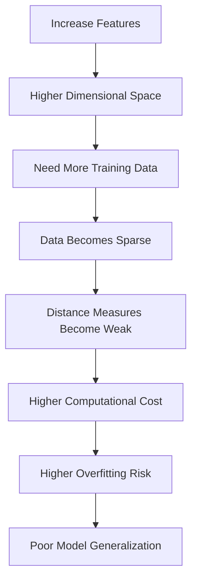

# Curse of Dimensionality

The **Curse of Dimensionality** refers to the problems that arise when the **number of features (dimensions)** in a dataset becomes very large.

As the number of dimensions increases:

- Data becomes increasingly sparse.
- Distances between points become less meaningful.
- Models require much more data.
- Computation becomes slower and more expensive.
- Many Machine Learning algorithms perform worse.

---

## Definition

> **Curse of Dimensionality** is the phenomenon where adding more features causes the feature space to grow exponentially, making it difficult for models to learn meaningful patterns from limited data.

---

## What Is a Dimension?

A **dimension** is simply a **feature (input variable)**.

Example:

| Features | Number of Dimensions |
|----------|----------------------:|
| Height | 1 |
| Height, Weight | 2 |
| Height, Weight, Age | 3 |
| 100 Features | 100 Dimensions |

So,

```text
1 Feature = 1 Dimension
```

---

## Intuition

Imagine placing data points inside a square.

### 1 Dimension

```text
● ● ● ● ● ● ● ● ●
```

The points are close together.

---

### 2 Dimensions

```text
●      ●

    ●

        ●

●             ●
```

The points are farther apart.

---

### 3 Dimensions

Now imagine the points spread throughout a cube.

There is much more empty space.

---

### 100 Dimensions

Most of the space is empty.

The data points become extremely sparse.

This sparsity is the **curse**.

---

## Why Is It a Problem?

Suppose you have:

```text
100 Samples
```

### With 2 Features

The samples may cover the feature space reasonably well.

### With 100 Features

The same 100 samples are scattered across an enormous space.

The model has very few nearby examples to learn from.

---

## Exponential Growth of Space

Imagine dividing each feature into **10 intervals**.

| Dimensions | Number of Cells |
|------------|----------------:|
| 1 | 10 |
| 2 | 100 |
| 3 | 1,000 |
| 5 | 100,000 |
| 10 | 10,000,000,000 |
| 100 | 10¹⁰⁰ |

Notice how the number of possible regions grows **exponentially**.

This means we need exponentially more data to cover the space.

---

## Distance Becomes Less Meaningful

Many algorithms rely on distance.

Examples:

- K-Nearest Neighbors (KNN)
- K-Means Clustering
- DBSCAN

In high dimensions:

- The nearest point is not much closer than the farthest point.
- Almost every point appears similarly distant.

Example:

```text
Low Dimensions

A ---- B

A ----------- C
```

Easy to identify the nearest neighbor.

High Dimensions:

```text
Distance(A,B) ≈ Distance(A,C) ≈ Distance(A,D)
```

Neighbor relationships become unreliable.

---

## Data Sparsity

As dimensions increase:

```text
Same Data + More Features = Sparser Data
```

Sparse data means:

- Few neighboring samples
- Harder pattern recognition
- Greater chance of overfitting

---

## Effects on Machine Learning

| Problem | Effect |
|----------|--------|
| Sparse data | Harder to learn patterns |
| Distance loses meaning | Distance-based algorithms perform poorly |
| More parameters | Higher risk of overfitting |
| More computation | Slower training and prediction |
| More memory | Higher storage requirements |

---

## Algorithms Most Affected

These algorithms depend heavily on distance.

| Algorithm | Effect |
|-----------|--------|
| K-Nearest Neighbors (KNN) | Strongly affected |
| K-Means Clustering | Strongly affected |
| DBSCAN | Strongly affected |
| Hierarchical Clustering | Affected |

Algorithms such as Random Forests or Gradient Boosting are generally less sensitive because they do not rely directly on geometric distances.

---

## How to Handle the Curse of Dimensionality

## 1. Feature Selection

Keep only the most useful features.

Example:

```text
100 Features
        ↓
20 Important Features
```

Popular methods:

- Filter methods
- Wrapper methods
- Embedded methods (e.g., Lasso)

---

## 2. Feature Extraction

Create a smaller set of informative features.

Examples:

- PCA (Principal Component Analysis)
- Autoencoders
- t-SNE (mainly for visualization)
- UMAP (mainly for visualization)

---

## 3. Collect More Data

Higher-dimensional problems usually require **more training samples**.

```text
More Features
        ↓
Need More Data
```

---

## 4. Remove Redundant Features

If two features contain nearly the same information:

```text
Age

Date of Birth
```

Keep only one.

---

## 5. Regularization

Regularization discourages overly complex models and reduces overfitting.

Examples:

- L1 (Lasso)
- L2 (Ridge)
- Elastic Net

---

### Real-World Example

Suppose you want to recognize faces.

Each image contains:

```text
100 × 100 pixels
```

Total features:

```text
10,000 Features
```

Training with only:

```text
200 Images
```

is difficult because the feature space is enormous.

To address this, you might:

- Use PCA to reduce dimensionality.
- Train on many more images.
- Use feature extraction with deep learning.

---

## Curse of Dimensionality vs Overfitting

| Curse of Dimensionality | Overfitting |
|-------------------------|-------------|
| Too many features | Model too complex |
| Data becomes sparse | Model memorizes training data |
| Often caused by high-dimensional input | Often caused by excessive model flexibility |
| Can lead to overfitting | Is a learning problem itself |

---


## Curse of Dimensionality Workflow


---

## Quick Memory Sheet

| Concept | Remember |
|----------|----------|
| Dimension | One feature |
| Curse of Dimensionality | Too many features make learning difficult |
| Main Problem | Sparse data and unreliable distances |
| Most Affected Algorithms | KNN, K-Means, DBSCAN |
| Solutions | Feature Selection, PCA, More Data, Regularization |

## Golden Rule

> **Adding more features does not always improve a model.**

If the added features do not provide useful information, they can increase complexity, require more data, slow computation, and reduce model performance due to the **Curse of Dimensionality**.