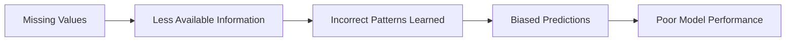
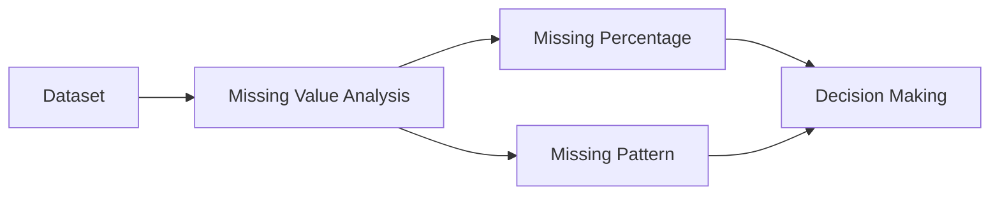
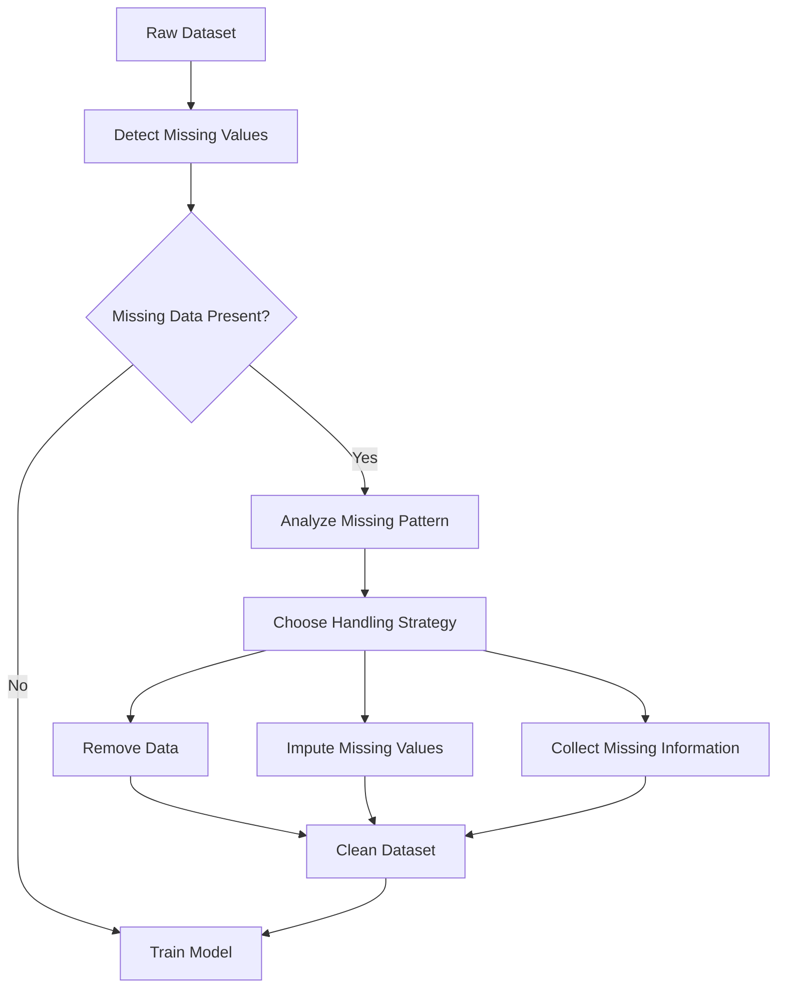

# Missing Data

Missing data occurs when one or more values are **absent (empty or unknown)** in a dataset.

Almost every real-world dataset contains missing values due to human errors, system failures, or incomplete information.

---

## Definition

> **Missing Data** refers to the absence of values for one or more features (columns) in a dataset.

Example:

| Name | Age | Salary |
|------|----:|-------:|
| Alice | 25 | \$50,000 |
| Bob | **?** | \$60,000 |
| Charlie | 30 | **?** |
| David | 28 | \$55,000 |

Here,

- Bob's **Age** is missing.
- Charlie's **Salary** is missing.

---

## Why Is Missing Data a Problem?

---
Most Machine Learning algorithms **cannot handle missing values directly**.

Missing data can lead to:

- Poor model performance
- Biased predictions
- Incorrect statistical analysis
- Training errors
- Reduced accuracy

---

## Why Does Missing Data Occur?

Common reasons include:

- Human data entry mistakes
- Sensor or hardware failures
- Survey participants skipping questions
- Database errors
- Data corruption
- Information not collected

---

## Types of Missing Data

Understanding **why data is missing** is important because different causes require different solutions.

---

## 1. MCAR (Missing Completely At Random)

The missing values are **completely unrelated** to any variable in the dataset.

Every observation has an equal chance of being missing.

### Example

A machine randomly fails to record a customer's age.

```text
Age

25
?
30
28
?
```

The missing values occur randomly.

### Characteristics

- No systematic pattern
- Safest type of missing data
- Easier to handle

---

## 2. MAR (Missing At Random)

The missing value depends on **another observed feature**, but not on the missing value itself.

### Example

Older people are less likely to report their income.

```text
Age → Income Missing
```

Income is missing because of Age.

Since Age is known, we can often model the missingness.

---

## 3. MNAR (Missing Not At Random)

The missing value depends on **its own value**.

### Example

People with very high salaries choose not to disclose their salary.

```text
Higher Salary
      ↓
More Likely Missing
```

This is the most difficult type to handle.

---

### Example Dataset

| Name | Age | Salary |
|------|----:|-------:|
| Alice | 25 | 50000 |
| Bob | ? | 60000 |
| Charlie | 30 | ? |
| David | 28 | 55000 |

---

## How to Handle Missing Data

## 1. Remove Missing Values

### Remove Rows

Delete rows containing missing values.

Before:

| Name | Age |
|------|----:|
| Alice | 25 |
| Bob | ? |
| Charlie | 30 |

After:

| Name | Age |
|------|----:|
| Alice | 25 |
| Charlie | 30 |

### Advantages

- Very simple
- No estimation required

### Disadvantages

- Loss of valuable data
- Poor choice if many rows are removed

---

## 2. Remove Columns

If a feature contains too many missing values, remove the entire column.

Example:

```text
Email Address

95% Missing
```

It may contribute very little.

---

## 3. Mean Imputation

Replace missing numerical values with the **mean**.

Example:

Ages:

```text
20
25
30
?
35
```

Mean:

```text
(20 + 25 + 30 + 35) / 4 = 27.5
```

Replace:

```text
? → 27.5
```

### Best For

Numerical features with approximately symmetric distributions.

---

## 4. Median Imputation

Replace missing values with the **median**.

Example:

```text
20
22
24
25
100
?
```

Median:

```text
24
```

Replace:

```text
? → 24
```

### Best For

Skewed data or datasets with outliers.

---

## 5. Mode Imputation

Replace missing categorical values with the most frequent category.

Example:

```text
Red
Blue
Blue
Green
?
```

Mode:

```text
Blue
```

Replace:

```text
? → Blue
```

### Best For

Categorical variables.

---

## 6. Forward Fill

Use the previous known value.

Example:

```text
20
22
?
?
25
```

After filling:

```text
20
22
22
22
25
```

Useful for time-series data.

---

## 7. Backward Fill

Use the next known value.

Example:

```text
20
?
?
25
```

After filling:

```text
20
25
25
25
```

Also common in time-series analysis.

---
### Visualize Missing Data

## 8. Predict Missing Values

Train a model to estimate missing values using other features.

Example:

Predict missing income from:

- Age
- Education
- Occupation

More accurate but computationally expensive.

---

## Choosing the Right Method

| Situation | Recommended Method |
|-----------|--------------------|
| Few missing rows | Remove rows |
| Too many missing values in a column | Remove column |
| Numerical, symmetric data | Mean |
| Numerical, skewed data | Median |
| Categorical data | Mode |
| Time-series data | Forward/Backward Fill |
| Complex relationships | Predict missing values |

---

# Missing Data in Python (Pandas)

### Detect Missing Values

```python
df.isnull().sum()
```

---

### Remove Missing Rows

```python
df.dropna()
```

---

### Fill with Mean

```python
df["Age"] = df["Age"].fillna(df["Age"].mean())
```

---

### Fill with Median

```python
df["Age"] = df["Age"].fillna(df["Age"].median())
```

---

### Fill with Mode

```python
df["City"] = df["City"].fillna(df["City"].mode()[0])
```

---

# Missing Data vs Data Leakage

| Missing Data | Data Leakage |
|--------------|--------------|
| Some values are absent | Future or target information is accidentally used |
| Causes incomplete information | Causes unrealistic model performance |
| Solved using imputation or removal | Solved by fixing the data pipeline |

---

## Workflow



---

## Quick Memory Sheet

| Concept | Remember |
|----------|----------|
| Missing Data | Some feature values are absent |
| MCAR | Missing completely at random |
| MAR | Missing depends on another observed feature |
| MNAR | Missing depends on the missing value itself |
| Mean | Numerical, symmetric data |
| Median | Numerical, skewed data |
| Mode | Categorical data |
| Forward Fill | Use previous value |
| Backward Fill | Use next value |
| Best Practice | Understand why data is missing before choosing a handling method |

## Golden Rule

> **Never ignore missing values.**

Before training a Machine Learning model:

1. Detect missing values.
2. Understand the reason they are missing (MCAR, MAR, or MNAR).
3. Choose the most appropriate handling technique instead of blindly filling or deleting data.