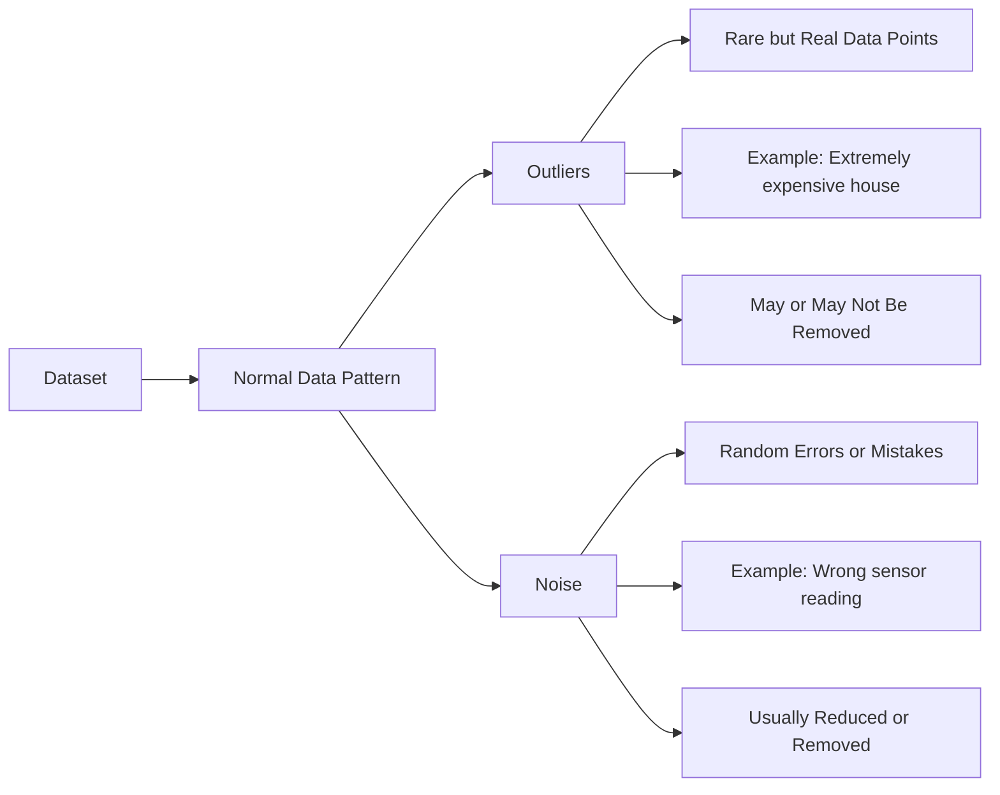
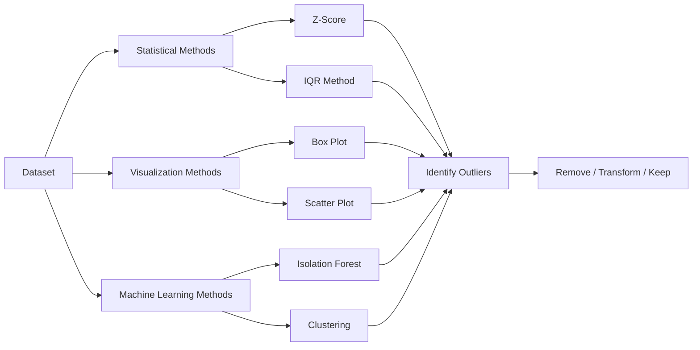
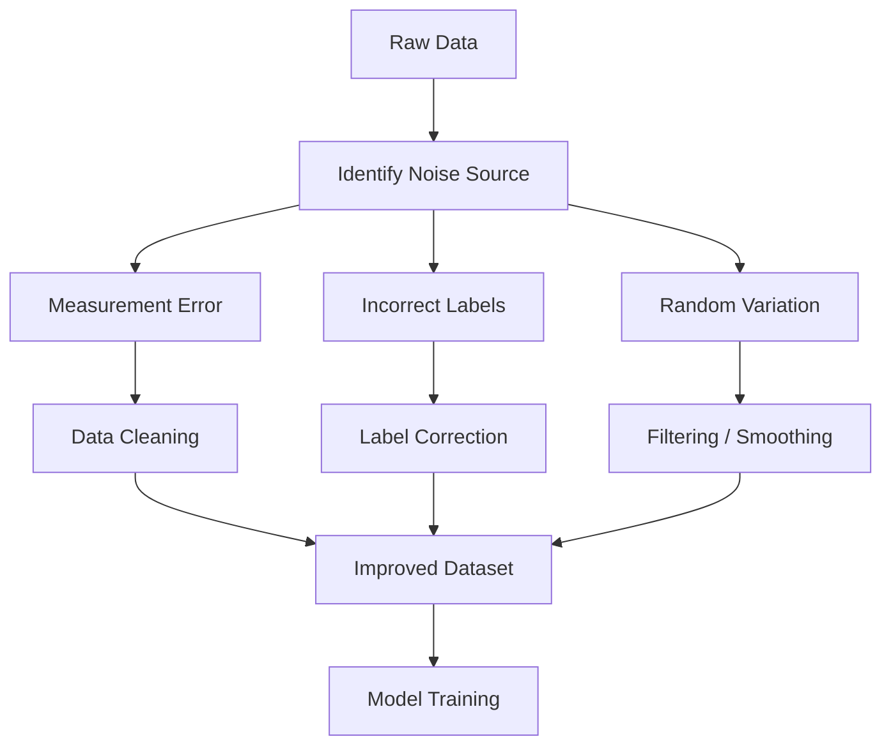
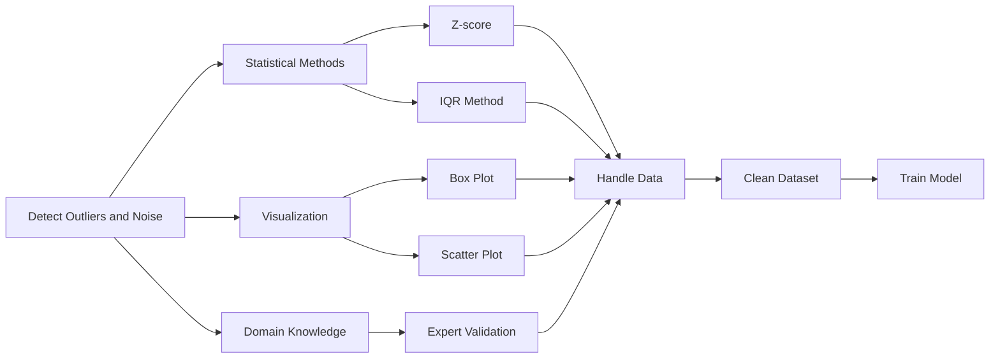
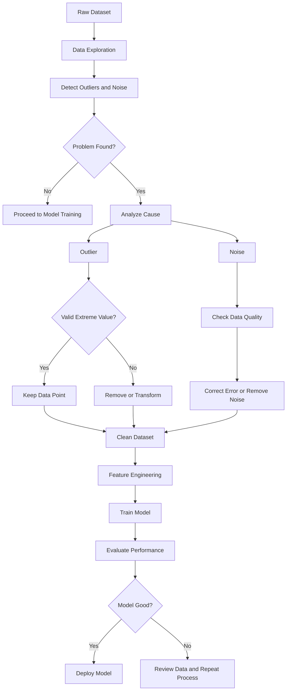
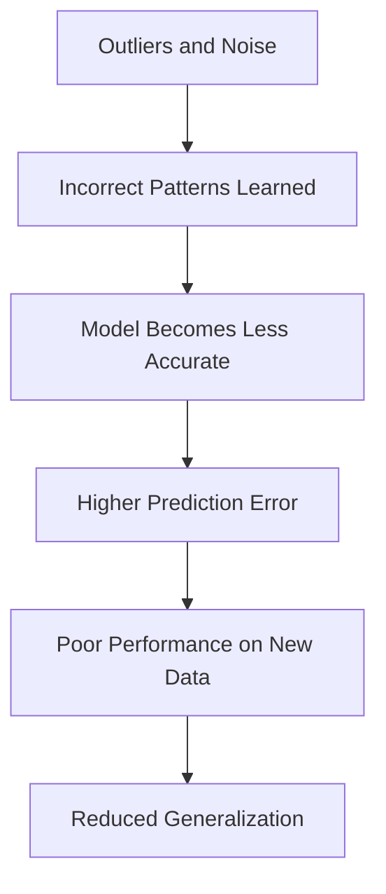

# Outliers and Noise

Real-world datasets are rarely perfect.

Some data points are **unusually different** from the rest (outliers), while others contain **random errors or incorrect values** (noise).

Understanding the difference is important because they affect Machine Learning models in different ways.

---




## What is an Outlier?

An **outlier** is a data point that is significantly different from the majority of the observations.

It lies far away from the normal range of the data.

### Definition

> **Outlier:** An observation whose value is unusually far from the rest of the dataset.

---

### Example

Suppose we record the ages of students:

```text
20, 21, 22, 23, 24, 21, 22, 95
```

Most ages are around:

```text
20–24
```

The value:

```text
95
```

is an **outlier**.

---

## Visual Example

```text
● ● ● ● ● ● ●                     ●
18 20 22 24 26 28 30             95
```

Most observations cluster together, while one point is far away.

---
## Outlier Detection

## What is Noise?

**Noise** refers to random errors or meaningless variations in the data.

Unlike outliers, noise is not necessarily far from the other values—it is simply incorrect or random.

### Definition

> **Noise:** Random variation or error in the data that does not represent the true underlying pattern.

---

### Example

Actual temperature:

```text
25°C
```

Sensor records:

```text
40°C
```

The incorrect reading is **noise**.

---

## Another Example

Actual salary:

```text
50000
```

Mistyped as:

```text
5000000
```

This is noise caused by a data-entry error.

---

## Noise Reduction Workflow

## Outliers vs Noise

| Outlier | Noise |
|----------|-------|
| Unusually different observation | Random error or incorrect value |
| May be valid | Usually invalid |
| Can contain useful information | Usually contains no useful information |
| Often kept after investigation | Often corrected or removed |

---

## Are All Outliers Bad?

**No.**

Some outliers are legitimate and contain valuable information.

Example:

Annual salaries:

```text
40k
45k
50k
55k
2,000k
```

If the last person is a CEO,

```text
$2,000,000
```

is a real observation—not an error.

Removing it would lose important information.

---

## Causes of Outliers

- Natural variation
- Human data-entry mistakes
- Sensor failures
- Measurement errors
- Fraudulent activities
- Rare events

---

## Causes of Noise

- Typing mistakes
- Sensor inaccuracies
- Transmission errors
- Rounding errors
- Missing calibration
- Random environmental effects

---

## Why Are Outliers a Problem?

Outliers can:

- Distort the mean
- Increase variance
- Reduce model accuracy
- Influence regression lines
- Slow model convergence

Example:

```text
10, 12, 13, 14, 15
```

Mean:

```text
12.8
```

Add one outlier:

```text
10, 12, 13, 14, 15, 200
```

Mean becomes:

```text
44
```

The average is now misleading.

---

## Which Algorithms Are Sensitive to Outliers?

| Algorithm | Sensitivity |
|------------|-------------|
| Linear Regression | High |
| Logistic Regression | Medium |
| K-Nearest Neighbors (KNN) | High |
| K-Means Clustering | High |
| Neural Networks | Medium |
| Decision Trees | Low |
| Random Forest | Low |
| XGBoost | Low |

Tree-based models are generally more robust because they split data based on thresholds rather than distances or averages.

---

# Detecting Outliers

## 1. Box Plot

Outliers appear as points outside the whiskers.

```text
------|=====|------      ●
```

---

## 2. Z-Score Method

Measures how many standard deviations a value is from the mean.

Formula:

$$
Z=\frac{x-\mu}{\sigma}
$$

Common rule:

```text
|Z| > 3
```

→ Potential outlier.

Best for approximately normal distributions.

---

## 3. Interquartile Range (IQR)

Most common method.

Step 1:

Find:

- Q1 (25th percentile)
- Q3 (75th percentile)

Step 2:

$$
IQR = Q3 - Q1
$$

Step 3:

Outlier if:

$$
x < Q1 - 1.5 \times IQR
$$

or

$$
x > Q3 + 1.5 \times IQR
$$

Works well for skewed distributions.

---


## Handling Outliers and Noise

## 1. Investigate First

Ask:

> Is this value an error or a genuine observation?

Never remove outliers automatically.

---

## 2. Remove Incorrect Values

Example:

Age:

```text
250 years
```

Clearly impossible.

Safe to remove or correct.

---

## 3. Transform the Data

Use transformations to reduce the influence of large values.

Examples:

- Log transformation
- Square-root transformation

Useful for highly skewed data.

---

## 4. Cap (Winsorize) Extreme Values

Replace extreme values with reasonable limits.

Example:

```text
5000000
```

↓

```text
500000
```

Keeps the observation while reducing its influence.

---

## 5. Use Robust Models

Some algorithms naturally handle outliers better.

Examples:

- Decision Trees
- Random Forests
- Gradient Boosting

---

## 6. Use Robust Statistics

Instead of:

```text
Mean
```

use:

```text
Median
```

Instead of:

```text
Standard Deviation
```

consider:

```text
Interquartile Range (IQR)
```

---

## How to Handle Noise

- Correct obvious data-entry errors.
- Remove duplicate records.
- Smooth noisy signals.
- Use filtering techniques.
- Validate data before training.

---

### Real-World Examples

| Problem | Outlier or Noise? |
|----------|-------------------|
| CEO earns \$5 million | Outlier (valid) |
| Age = 300 years | Noise |
| Credit card fraud transaction | Outlier (important) |
| Broken sensor reports 9999°C | Noise |
| Extremely expensive luxury house | Outlier (valid) |

---


## Outliers and Noise Handling Workflow



---

## Effect of Outliers on Models
  ```mermaid
    flowchart LR
    A[Outlier Present]

    A --> B[Model Sensitive to Extreme Values]

    B --> C[Decision Boundary Changes]

    C --> D[Incorrect Predictions]

    D --> E[Poor Generalization]

```
## Impact on Machine Learning


## Quick Memory Sheet

| Concept | Remember |
|----------|----------|
| Outlier | Unusually different observation |
| Noise | Random error or incorrect value |
| Valid Outlier | Keep after investigation |
| Invalid Outlier | Correct or remove |
| Detection | Box Plot, Z-Score, IQR |
| Sensitive Algorithms | Linear Regression, KNN, K-Means |
| Robust Algorithms | Decision Trees, Random Forest, XGBoost |
| Robust Statistics | Median, IQR |

## Golden Rule

> **Not every outlier is bad, but every unusual value should be investigated.**

Always determine whether an extreme value represents **real information** or **random noise** before deciding to remove, transform, or keep it.


> **Not every outlier is bad, but every unusual value should be investigated.**

Always determine whether an extreme value represents **real information** or **random noise** before deciding to remove, transform, or keep it.