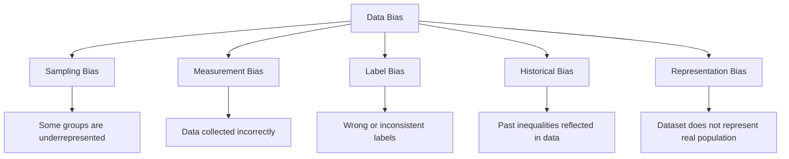
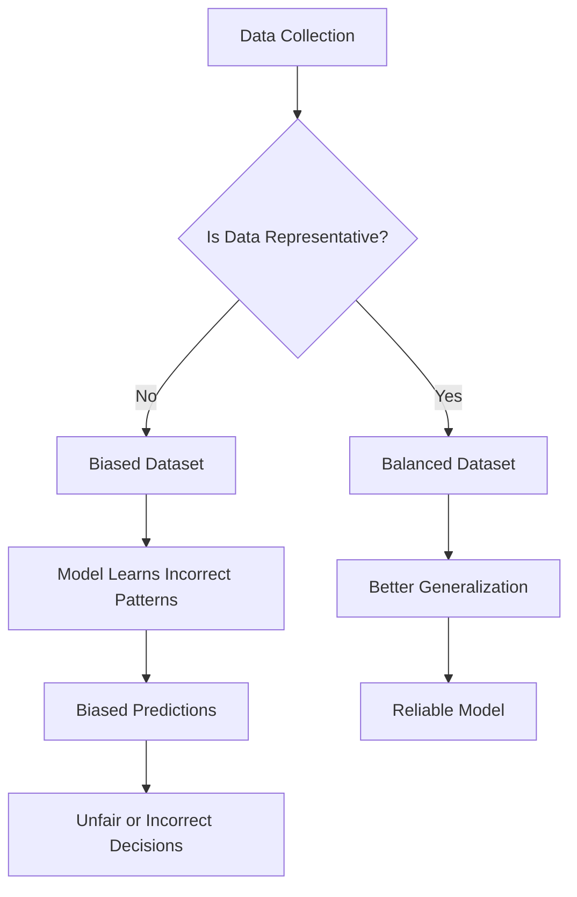
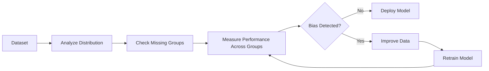
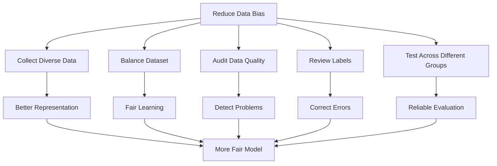

# Bias in Data

Machine Learning models learn from data.

If the **data itself is biased**, the model will also become biased.

This is often summarized by the phrase:

> **"Garbage In, Garbage Out (GIGO)."**

No matter how advanced the algorithm is, biased data leads to biased predictions.

---

## Definition

> **Bias in Data** occurs when the training data does not accurately represent the real-world population or contains systematic unfairness, causing the model to make consistently unfair or inaccurate predictions.

Unlike **model bias** (which comes from simplifying assumptions), **data bias** originates from the dataset itself.

---

## Why Is Data Bias a Problem?

A machine learning model assumes that the training data represents reality.

If the data is biased:

```text
Biased Data
      ↓
Biased Learning
      ↓
Biased Predictions
```

Even a highly accurate model may produce unfair or misleading results.

---

### Example

Suppose a company trains a hiring model using data from the past 20 years.

Historical hiring records:

```text
Male   = 900
Female = 100
```

The model may incorrectly learn:

```text
Male → Better Candidate
```

Not because men are better candidates, but because the training data reflects historical hiring bias.

---

## Real-World Examples

| Application | Possible Bias |
|-------------|---------------|
| Hiring | Preference toward one gender or age group |
| Loan Approval | Bias against certain income groups or neighborhoods |
| Face Recognition | Lower accuracy for underrepresented skin tones |
| Medical Diagnosis | Poor performance on populations underrepresented in the data |
| Recommendation Systems | Popular items become even more popular |

---

## Types of Data Bias



## Sources of Data Bias
```mermaid
flowchart TD
    A[Sources of Bias]

    A --> B[Data Collection Process]

    A --> C[Human Decisions]

    A --> D[Historical Data]

    A --> E[Missing Data]

    A --> F[Sampling Method]

    B --> G[Incomplete Representation]

    C --> H[Subjective Labels]

    D --> I[Existing Social Patterns]

    E --> J[Hidden Information]

    F --> K[Unbalanced Dataset]
  ```
## 1. Sampling Bias

The collected data does not represent the target population.

### Example

Building a health prediction model using only:

```text
University Students
```

The model may perform poorly for:

- Children
- Elderly people
- Working adults

The sample is not representative.

---

## 2. Historical Bias

The data reflects past societal inequalities.

### Example

Past hiring records:

```text
90% Men
10% Women
```

The model learns historical decisions rather than objective qualifications.

---

## 3. Measurement Bias

The data is collected incorrectly or inconsistently.

### Example

One hospital measures blood pressure with calibrated equipment,

while another uses faulty equipment.

The recorded values become systematically different.

---

## 4. Label Bias

The target labels themselves are incorrect or subjective.

### Example

Loan applications labeled as:

```text
Approved
Rejected
```

If approval decisions were historically unfair,

the labels inherit that unfairness.

---

## 5. Survivorship Bias

The dataset contains only successful cases while ignoring failures.

### Example

Studying only successful startups to learn "how to build a successful company."

Failed startups are missing, leading to incomplete conclusions.

---

## 6. Confirmation Bias

Data is collected in a way that supports existing beliefs.

### Example

Only collecting customer feedback from satisfied customers.

Negative opinions are underrepresented.

---

### Example: Facial Recognition
```mermaid
flowchart LR
    A[Face Recognition Dataset]

    A --> B[Mostly One Demographic Group]

    B --> C[Model Learns Limited Features]

    C --> D[Lower Accuracy on Underrepresented Groups]

    D --> E[Biased Predictions]
  
  ```

### Example: Medical Diagnosis
```mermaid
flowchart LR
    A[Medical Training Data]

    A --> B[Data Mostly From One Population]

    B --> C[Model Learns Population-Specific Patterns]

    C --> D[Poor Performance on Other Populations]

    D --> E[Incorrect Medical Predictions]
```

## Effects of Data Bias

Data bias can cause:

- Unfair predictions
- Poor generalization
- Lower accuracy for minority groups
- Ethical concerns
- Legal and regulatory issues
- Loss of trust

---

## Bias in Data vs Model Bias

| Data Bias | Model Bias |
|------------|------------|
| Problem comes from the dataset | Problem comes from the learning algorithm |
| Unrepresentative or unfair data | Oversimplified model assumptions |
| Fixed by improving data | Fixed by improving the model |
| Can affect any algorithm | Related to model complexity |

---

## Detecting Data Bias

Ask questions such as:

- Does the dataset represent the real population?
- Are some groups underrepresented?
- Were labels assigned fairly?
- Was data collected consistently?
- Are important groups missing?

---

## How to Reduce Data Bias

## 1. Collect More Representative Data

Include samples from all important groups.

Instead of:

```text
95% Adults
5% Elderly
```

Aim for a more representative distribution.

---

## 2. Balance the Dataset

Ensure that different groups are adequately represented.

Example:

```text
Before

Male   = 900
Female = 100
```

↓

```text
After

Male   = 500
Female = 500
```

---

## 3. Improve Data Collection

Use consistent measurement methods.

Examples:

- Same survey questions
- Same sensors
- Same medical equipment

---

## 4. Remove Biased Features

Some features may unintentionally encode unfair information.

Examples:

- Race
- Religion
- Gender (depending on the application)
- Zip code (may indirectly reveal socioeconomic status)

Careful evaluation is needed because removing a feature alone does not always eliminate bias.

---

## 5. Audit Model Performance

Evaluate performance separately for different groups.

Example:

| Group | Accuracy |
|--------|---------:|
| Group A | 95% |
| Group B | 78% |

Large differences may indicate bias.

---

## 6. Use Fairness-Aware Techniques

Modern machine learning includes methods designed to improve fairness.

Examples:

- Reweighting training samples
- Fairness constraints
- Bias mitigation algorithms
- Post-processing calibration

---

## Workflow







---

## Bias vs Variance vs Data Bias

| Concept | Meaning |
|----------|---------|
| Bias | Error from overly simple model assumptions |
| Variance | Error from sensitivity to training data |
| Data Bias | Unfair or unrepresentative training data |

These are different concepts, even though they share the word **"bias."**

---
## Reducing Data Bias

## Quick Memory Sheet

| Concept | Remember |
|----------|----------|
| Data Bias | Problem in the dataset |
| Sampling Bias | Dataset is not representative |
| Historical Bias | Past unfairness is learned |
| Measurement Bias | Incorrect or inconsistent measurements |
| Label Bias | Wrong or unfair labels |
| Survivorship Bias | Missing failed or excluded cases |
| Confirmation Bias | Collecting data that supports existing beliefs |
| Best Solution | Collect fair, representative, high-quality data |

## Golden Rule

> **A machine learning model cannot be fairer than the data it learns from.**

Improving the quality, diversity, and representativeness of the training data is one of the most effective ways to build accurate, reliable, and fair machine learning systems.