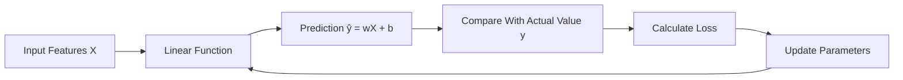
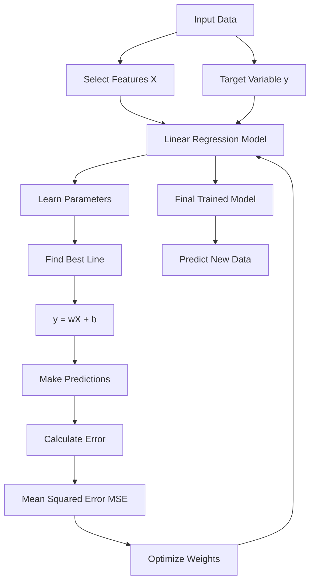

# Linear Regression

## 1. Model Definition (The Hypothesis)

> Linear regression attempts to model the relationship between a dependent variable ($Y$) and one or more independent variables ($X$) by fitting a linear equation to observed data.


## Linear Regression Concept



##  Learning Objectives

- Understand the mathematical foundation of linear regression and derive the hypothesis function
- Implement linear regression from scratch using gradient descent optimization
- Derive and apply gradient descent update rules for minimizing Mean Squared Error (MSE)
- Compare Gradient Descent and the Normal Equation based on computational complexity and practical usage
- Build multiple linear regression models with feature standardization and analyze learned parameters
- Understand how Ridge Regression (L2 Regularization) reduces overfitting by penalizing large weights

---

##  The Problem

Imagine you have a dataset containing **house sizes and their corresponding sale prices**. Your goal is to predict the price of a new house based on its size.

A simple approach would be to visualize the data and draw a line that seems to fit the points. However, a machine learning model needs a mathematical function that can automatically learn this relationship and make predictions for unseen data.

Linear Regression solves this problem by finding the **best-fitting line** that minimizes the difference between actual and predicted values.

For example:
```
Input:
House Size = 2000 sq ft

Output:
Predicted Price = $400,000
```


These same concepts are used in advanced machine learning algorithms, including neural networks and deep learning models.

Linear regression is not limited to simple prediction tasks. It is widely used in real-world applications such as **demand forecasting, financial modeling, business analytics, A/B testing analysis, and as a baseline model for regression problems**.
```
Define Model
   ↓
Make Predictions
   ↓
Calculate Error (Cost Function)
   ↓
Optimize Parameters
   ↓
Improve Model Performance
```
---

These same concepts are used in advanced machine learning algorithms, including neural networks and deep learning models.

Linear regression is not limited to simple prediction tasks. It is widely used in real-world applic

### A. Scalar Form (1D Data - "Line of Best Fit")
$$y = wx + b$$

* **$w$ (Weight/Slope):** Determines the angle of the line.
* **$b$ (Bias/Intercept):** Determines where the line crosses the Y-axis.

### B. Matrix Form (Multidimensional Data)
$$F(X) = X \times W$$

**Cost Function (with L2 Regularization/Ridge):**
$$J = || F(X) - Y ||_2^2 + \lambda ||W||_2^2$$

* $X_{n \times k}$: Input Data (n samples, k features)
* $W$: Weights vector
* $\lambda$: Regularization term (prevents overfitting)

---

## 2. Prediction (Forward Pass)

For a new input $x$, the model predicts:
$$y_{pred} = wx + b$$

**Example:**
* Weights: $w = 2, b = 1$
* Input: $x = 4$
* Result: $y = 2(4) + 1 = 9$

---

## 3. Cost Function (The "Scorecard")

We need a mathematical way to measure "how wrong" the line is. We use **MSE (Mean Squared Error)**.

$$J(w,b) = \frac{1}{2m} \sum_{i=1}^{m} (y_{pred}^{(i)} - y^{(i)})^2$$

* **Why Square it?** To eliminate negative signs and penalize large errors more heavily.
* **Goal:** Minimize $J$.


---

## 4. Optimization: Gradient Descent

Used for **large datasets**. It is an iterative algorithm that tweaks weights to minimize the Cost.

**The Update Rule:**
Repeat until convergence:
$$w_{new} = w_{old} - \alpha \frac{\partial J}{\partial w}$$
$$b_{new} = b_{old} - \alpha \frac{\partial J}{\partial b}$$

* **$\alpha$ (Learning Rate):** Controls step size.
    * Too small: Slow convergence.
    * Too large: Overshoots/Diverges.
* **Gradient ($\frac{\partial J}{\partial w}$):** The direction of the steepest ascent (we go opposite).


---

## 5. Optimization: The Normal Equation (Alternative)

Used for **small datasets**. We can solve for $W$ mathematically in one step without loops.

$$W = (X^T X)^{-1} X^T Y$$

| Gradient Descent | Normal Equation |
| :--- | :--- |
| Needs Learning Rate ($\alpha$) | No $\alpha$ needed |
| Iterative (Many steps) | Exact solution (One step) |
| $O(kn^2)$ - Good for large $n$ | $O(n^3)$ - Slow if $n > 10,000$ |

---

## 6. Evaluation Metrics (How good is it?)

The Cost Function is for the machine. These metrics are for humans to report performance.

### A. R-Squared ($R^2$)
Measures "Goodness of Fit."
* **Range:** 0 to 1.
* **Interpretation:** 0.80 means "The model explains 80% of the variance in the target variable."

### B. RMSE (Root Mean Squared Error)
$$RMSE = \sqrt{\frac{1}{m} \sum (y_{pred} - y)^2}$$
* **Interpretation:** Tells you the error in the actual units of $Y$.
* *Example:* If predicting House Prices, an RMSE of 5000 means the model is usually off by about \$5,000.

---

## 7. Critical Assumptions

Linear Regression only works reliably if these assumptions hold true:

1.  **Linearity:** The relationship between $X$ and $Y$ is linear.
2.  **Independence:** Observations are independent of each other.
3.  **Homoscedasticity:** The variance of error terms is constant (the "noise" is consistent across all values of $X$).
4.  **Normality:** The residuals (errors) are normally distributed.


---

## 8. Pre-processing Requirement: Feature Scaling

**Crucial for Gradient Descent:**
Because Gradient Descent is sensitive to the scale of input features, you must normalize data ( using **StandardScaler** or **MinMaxScaler**).
* **Goal:** Scale all features to a similar range ( -1 to 1) to prevent the gradient from oscillating.

---

## 9. When to Use (and When Not to Use)

###  When to Use
1.  **Baseline:** Always start here. It's fast and simple.
2.  **Explainability:** When you need to explain *exactly* how each feature affects the result ( Bank Loans).
3.  **Linear Data:** When the relationship is truly a straight line.
4.  **Sparse Data:** When you don't have enough data for Neural Networks.

###  When NOT to Use
1.  **Non-Linear Data:** If data is curved, this model will fail.
2.  **Outliers:** One bad point can ruin the whole model.
3.  **Complex Inputs:** Cannot handle Images, Audio, or Text efficiently.

---

## 10. Common Interview Questions

**Q1: Why do we square the error in MSE?**
> To remove negative signs and punish larger errors more severely than small ones.

**Q2: What happens if the Learning Rate is too high?**
> The model overshoots the minimum and may diverge (error increases to infinity).

**Q3: Can R-Squared be negative?**
> Yes. If the model is worse than a simple horizontal line (mean), $R^2$ is negative.

**Q4: Explain L1 vs L2 Regularization.**
> **L1 (Lasso):** Shrinks weights to zero (feature selection).
> **L2 (Ridge):** Shrinks weights *near* zero (prevents overfitting).

---
# Linear Regression Workflow


## 11. Advanced: Deriving the Gradient (Step-by-Step)

*This is the mathematical proof for the update rule.*

**1. The Cost Function:**
$$J = \frac{1}{2m} \sum_{i=1}^{m} (wx^{(i)} + b - y^{(i)})^2$$

**2. The Chain Rule:**
We want $\frac{\partial J}{\partial w}$. Let $u = (wx + b - y)$. Then $J = u^2$.
$$\frac{\partial J}{\partial w} = \frac{\partial J}{\partial u} \times \frac{\partial u}{\partial w}$$

**3. The Derivatives:**
* Outer derivative ($\partial J / \partial u$): $2(wx + b - y)$
* Inner derivative ($\partial u / \partial w$): $x$

**4. Combine them:**
The $2$ from the derivative cancels out the $\frac{1}{2}$ in the cost function.
$$\frac{\partial J}{\partial w} = \frac{1}{m} \sum (wx^{(i)} + b - y^{(i)}) \cdot x^{(i)}$$

**Final Result (The Gradient):**
$$\text{Gradient} = \text{Average}(\text{Error} \times \text{Input})$$

