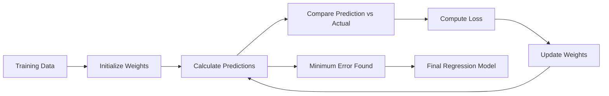
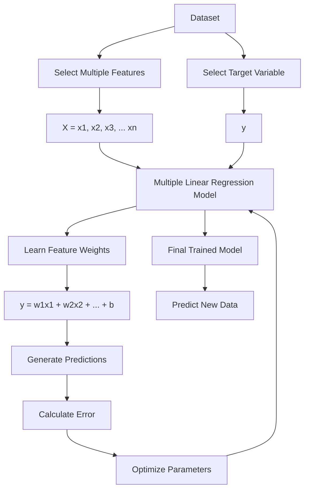
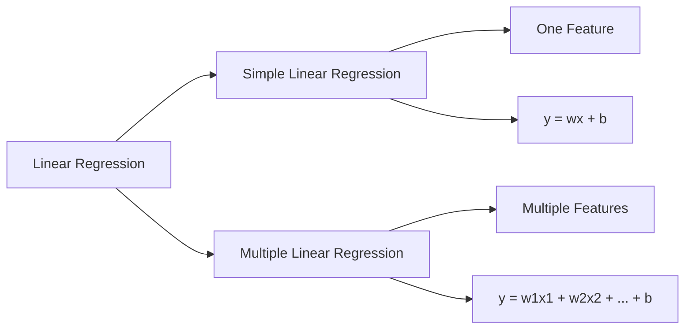
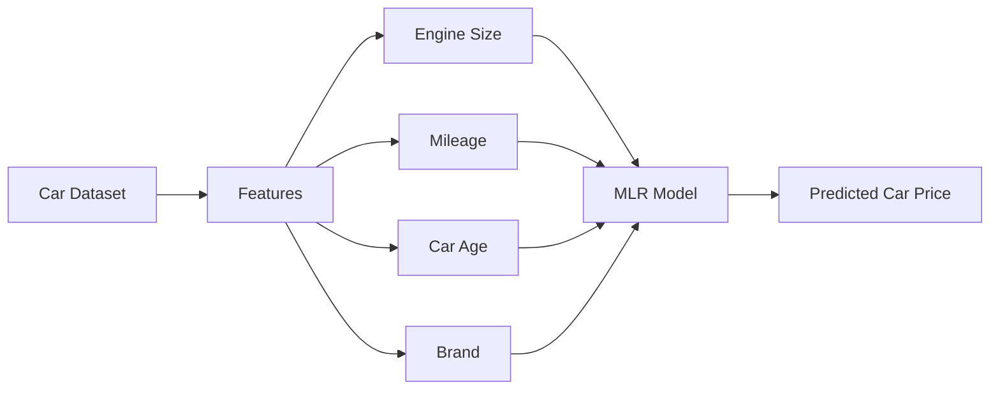

# Multiple Linear Regression (MLR)

##  Definition & Goal

Extension of Simple Linear Regression that uses **two or more independent variables** to predict a dependent variable ($Y$).

##  Learning Objectives

- Understand the mathematical foundation of Multiple Linear Regression and the hypothesis function
- Build a regression model using multiple input features to predict continuous outcomes
- Learn how model coefficients represent the relationship between features and target values
- Implement Multiple Linear Regression using Gradient Descent and the Normal Equation
- Apply feature scaling and standardization to improve model performance
- Analyze feature importance by interpreting learned weights
- Understand multicollinearity and its impact on regression models
- Learn how Ridge Regression (L2 Regularization) improves generalization and prevents overfitting

---

##  The Problem

In many real-world problems, a prediction cannot be made using a single factor.

For example, predicting a house price depends on multiple features:

| Feature | Example Value |
|---|---|
| Size | 2000 sq ft |
| Bedrooms | 4 |
| Bathrooms | 3 |
| Location Score | 8/10 |
| Age | 5 years |

The goal is to build a model that can learn from historical data and predict the price of a new house using all available information.


> where each coefficient represents how much a specific feature contributes to the final prediction.

---

##  Why Multiple Linear Regression Matters

Multiple Linear Regression introduces important machine learning concepts used in advanced models:

```
Multiple Features
     ↓
Feature Processing
     ↓
Model Training
     ↓
Parameter Optimization
     ↓
Prediction
```

It provides the foundation for understanding:

- Feature engineering
- Model interpretability
- Optimization algorithms
- Regularization techniques
- Advanced regression models

## Learning Process of MLR

### The Hypothesis 
Instead of a line, we fit a **hyperplane** (in 3D+) to the data.

$$y = \beta_0 + \beta_1x_1 + \beta_2x_2 + ... + \beta_kx_k + \epsilon$$

* **Goal:** Find the best linear combination of inputs ($X$) to predict $Y$ by minimizing the error.


---

##  Calculating Parameters 
For MLR, we generally use linear algebra (Matrix operations) to find the coefficients in one step.

### The Equation
$$\beta = (X^T X)^{-1} X^T Y$$

* **$X$**: Matrix of features (dimensions: $n \times k$).
* **$Y$**: Vector of target values (dimensions: $n \times 1$).
* **$\beta$**: Vector of coefficients (weights).
* **$X^T$**: Transpose of X.
* **$^{-1}$**: Inverse of the matrix.

---

##  Correlation vs. Regression

It is vital to distinguish between relationship strength and prediction.

| Metric | Purpose |
| :--- | :--- |
| **Correlation** ($\rho$) | Measures the **strength and direction** of a relationship. (Range: -1 to 1). Does not imply causation. |
| **Regression** | Uses the relationship to **predict** $Y$ based on $X$. Quantifies the impact ( "Increasing $X$ by 1 increases $Y$ by 5"). |

---

##  The Critical Problem: Multicollinearity

Occurs when independent variables are **highly correlated with each other** ( "Age" and "Year Born").

### Why is it a problem?
1.  **Unstable Coefficients:** Small changes in data lead to wild swings in weights ($\beta$).
2.  **Loss of Interpretability:** You can't tell which feature is actually driving the prediction.
3.  **Overfitting:** The model fits the noise, not the signal.

### Detection: VIF (Variance Inflation Factor)
* **Rule of Thumb:**
    * $VIF = 1$: No correlation.
    * $VIF > 5$: High multicollinearity (Warning).
    * $VIF > 10$: Severe multicollinearity (Fix immediately).

### Solutions
1.  **Remove:** Drop one of the correlated features.
2.  **PCA (Principal Component Analysis):** Combine features into new uncorrelated components.
3.  **Regularization:** Use Lasso (L1) or Ridge (L2) regression to penalize large weights.

---

##  Handling Categorical Data: Dummy Variables

Computers can't read text ( "Male", "Female", "France"). We must convert them to numbers.

### Method: One-Hot Encoding
Creating binary columns (0 or 1).

**Example:**
* **Original:** Feature `Gender` $\rightarrow$ {Male, Female}
* **Converted:**
    * `Is_Male` = 1 (if Male), 0 (if Female)
    * `Is_Female` = 0 (if Male), 1 (if Female)

> ** The Dummy Variable Trap:**
> You must always drop **one** column to avoid perfect multicollinearity (because `Is_Male` + `Is_Female` = 1).
> * **Rule:** If you have $C$ categories, use $C-1$ dummy variables.

---

##  Pre-processing: Feature Scaling

Since MLR involves combining different features ( "Salary" in thousands vs. "Age" in years), scaling is crucial for numerical stability.

### A. Standardization (Z-Score)
Centers data around 0 with a standard deviation of 1.
$$x' = \frac{x - \mu}{\sigma}$$
* **Best for:** When data follows a Gaussian (Bell curve) distribution.

### B. MinMax Scaling (Normalization)
Squishes data between 0 and 1.
$$x' = \frac{x - \min(x)}{\max(x) - \min(x)}$$
* **Best for:** Neural Networks or when data does not follow a normal distribution.

---

##  Performance Metrics (Evaluation)

### A. Adjusted $R^2$ (The Upgrade)
Standard $R^2$ **always increases** when you add a new feature, even if that feature is junk. Adjusted $R^2$ fixes this.

$$R^2_{adj} = 1 - (1-R^2) \frac{n-1}{n-k-1}$$

* $n$: Number of samples.
* $k$: Number of predictors.
* **Logic:** It penalizes the score if you add useless variables. If $R^2_{adj}$ drops, remove the feature.

### B. F-Statistic (Global Test)
Tests if the **entire model** is statistically significant.
* **Null Hypothesis ($H_0$):** All coefficients are zero ($\beta_1 = \beta_2 = ... = 0$).
* **Interpretation:** A high F-statistic (with low p-value) means *at least one* variable is related to $Y$.

### C. P-Values (Individual Test)
Tests if a **specific feature** is significant.
* **$p < 0.05$:** Feature is significant (Keep it).
* **$p > 0.05$:** Feature is likely noise (Consider removing it).


---

## Multiple Linear Regression Workflow



## Simple Linear Regression vs Multiple Linear Regression


## Example Workflow: Car Price Prediction
