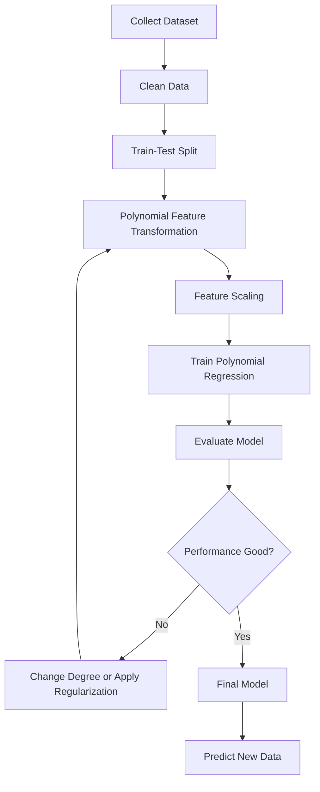
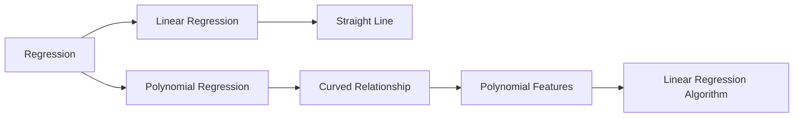

# Polynomial Regression

Polynomial Regression is an extension of **Linear Regression** that models **non-linear relationships** between the independent variable(s) and the dependent variable by introducing polynomial features. Although the resulting prediction curve is non-linear, the model remains **linear in its parameters (coefficients)**.


# Definition & Goal

Polynomial Regression is used when the relationship between the input feature(s) and the target variable is **curved rather than a straight line**.

Instead of fitting a straight line, Polynomial Regression fits a **curve** by creating higher-order powers of the original feature.

The goal is to learn a function that accurately captures the underlying pattern while maintaining good generalization on unseen data.

---

# Why Polynomial Regression?

Many real-world datasets are not perfectly linear.

Examples include:

| Problem                          | Relationship                              |
| -------------------------------- | ----------------------------------------- |
| House Prices                     | Price increases rapidly for larger houses |
| Population Growth                | Exponential-like curve                    |
| Temperature vs Electricity Usage | U-shaped curve                            |
| Car Speed vs Fuel Consumption    | Curved                                    |
| Age vs Income                    | Rises then falls                          |

A simple straight line cannot model these relationships effectively.

Polynomial Regression provides a simple solution without moving to more complex models.

---

# Learning Objectives

After studying this topic, you should be able to:

* Understand why linear regression sometimes fails
* Learn polynomial feature engineering
* Understand why Polynomial Regression is still considered linear
* Train models using Gradient Descent and the Normal Equation
* Choose an appropriate polynomial degree
* Understand underfitting and overfitting
* Apply feature scaling
* Use Ridge and Lasso Regularization
* Evaluate Polynomial Regression models

---

# Why is it Still Linear Regression?

This is one of the most common interview questions.

Although the prediction curve is curved, the model is still **linear in its parameters**.

The coefficients never multiply each other and never appear with exponents.

For example,

$$
y=\beta_0+\beta_1x+\beta_2x^2+\beta_3x^3
$$

is linear because

* β₀ appears linearly
* β₁ appears linearly
* β₂ appears linearly
* β₃ appears linearly

Only the input variable is transformed.

---

# The Hypothesis Function

The Polynomial Regression equation is

$$
y=\beta_0+\beta_1x+\beta_2x^2+\beta_3x^3+\cdots+\beta_nx^n+\epsilon
$$

where

* β₀ = intercept
* β₁...βₙ = coefficients
* x = input feature
* n = polynomial degree
* ε = random error

---

# Understanding the Degree

| Degree | Shape                       |
| ------ | --------------------------- |
| 1      | Straight Line               |
| 2      | Quadratic Curve             |
| 3      | Cubic Curve                 |
| 4+     | Increasingly Flexible Curve |

Higher degree means more flexibility.

However,

Higher flexibility also increases the risk of overfitting.

---

# Geometric Interpretation

Simple Linear Regression

```
y
|
|
|      /
|    /
|  /
|/
+---------------- x
```

Polynomial Regression

```
y
|
|      *
|   **
| **
|*
+---------------- x
```

Instead of fitting one straight line, Polynomial Regression fits a smooth curve.

---

# Polynomial Feature Transformation

Polynomial Regression is simply Multiple Linear Regression applied to transformed features.

Original feature

```
x
```

Degree 2

```
x

↓

[x, x²]
```

Degree 3

```
x

↓

[x, x², x³]
```

Example

Input

```
x = 2
```

Degree 3

```
x   = 2

x²  = 4

x³  = 8
```

Feature vector becomes

$$
\begin{bmatrix}
2\\
4\\
8
\end{bmatrix}
$$

The regression model is now

$$
\begin{bmatrix}
2\\
4\\
8
\end{bmatrix}
$$

Notice that the algorithm is still solving a linear regression problem.

---

# Matrix Representation

After polynomial transformation,

$$
X=\begin{bmatrix}
1 & x & x^2 & x^3
\end{bmatrix}
$$

The prediction becomes

$$
Y=X\beta
$$

The Normal Equation is

$$
\boldsymbol{\beta}
=(X^TX)^{-1}X^TY
$$

---

# Cost Function

Polynomial Regression minimizes the same Mean Squared Error (MSE) cost used in Linear Regression.

$$ J(\beta)=\frac{1}{2m}\sum_{i=1}^{m}(\hat y_i-y_i)^2 $$

Goal

```
Initialize Parameters

↓

Predict

↓

Calculate Error

↓

Update Parameters

↓

Repeat

↓

Minimum Cost
```

---

# Training Methods

## Gradient Descent

* Works iteratively
* Suitable for large datasets
* Requires a learning rate
* Feature scaling is recommended

---

## Normal Equation

$$[
\beta=(X^TX)^{-1}X^TY
]$$

Advantages

* No learning rate
* Exact solution

Disadvantages

* Computationally expensive for many features

---

# Choosing the Polynomial Degree

Selecting the degree is one of the most important tasks.

| Degree     | Result       |
| ---------- | ------------ |
| Too Small  | Underfitting |
| Just Right | Good Fit     |
| Too Large  | Overfitting  |

A degree that is too large memorizes the training data instead of learning the true pattern.

---

# Bias-Variance Tradeoff

```
Low Degree

    ↓

High Bias

    ↓

Underfitting

    ↓

Optimal Degree

    ↓

Good Generalization

    ↓

High Degree

    ↓

High Variance

    ↓

Overfitting
```
---
````
Increasing polynomial degree

    ↓

Lower Bias

    ↓

Higher Variance
````
Finding the optimal balance is the objective.

---

# Feature Scaling

Polynomial features can become very large.

Example

```
x = 100

x² = 10,000

x³ = 1,000,000
```

Large values slow Gradient Descent.

Standardization is usually recommended.

$$
x'=\frac{x-\mu}{\sigma}
$$

Scaling is especially important for

* Gradient Descent
* Ridge Regression
* Lasso Regression

---

# Regularization

Higher-degree models tend to overfit.

Regularization keeps coefficients small.

## Ridge Regression (L2)

$$
J=MSE+\lambda\sum_{j=1}^{n}\beta_j^2
$$

Advantages

* Reduces overfitting
* Keeps all features

---

## Lasso Regression (L1)

$$
J=MSE+\lambda\sum_{j=1}^{n}|\beta_j|
$$

Advantages

* Performs feature selection
* Can reduce some coefficients exactly to zero

---

# Model Evaluation

Common evaluation metrics

| Metric      | Better Value |
| ----------- | ------------ |
| MAE         | Lower        |
| MSE         | Lower        |
| RMSE        | Lower        |
| R²          | Higher       |
| Adjusted R² | Higher       |

For selecting polynomial degree,

Cross Validation is usually preferred.

---

# Advantages

* Captures non-linear relationships
* Easy to understand
* Simple extension of Linear Regression
* Fast to train
* Good interpretability

---

# Limitations

* Sensitive to outliers
* Easily overfits with high degrees
* Poor extrapolation outside the training range
* Large polynomial features may cause numerical instability

---

# Best Practices

* Start with degree 2 or 3
* Scale the features
* Use Cross Validation
* Avoid unnecessarily high degrees
* Apply Ridge or Lasso when overfitting occurs
* Evaluate using a separate test set

---

# Complete Workflow



---

# Polynomial Regression vs Linear Regression



---

# Summary

Polynomial Regression extends Linear Regression by transforming the original features into polynomial features. Even though the prediction curve becomes non-linear, the model remains linear in its coefficients, allowing the same optimization techniques used in Linear Regression.

The key challenge is choosing the correct polynomial degree. A degree that is too small causes underfitting, while a degree that is too large leads to overfitting. Techniques such as Cross Validation, Feature Scaling, Ridge Regression, and Lasso Regression help build models that generalize well to unseen data.
