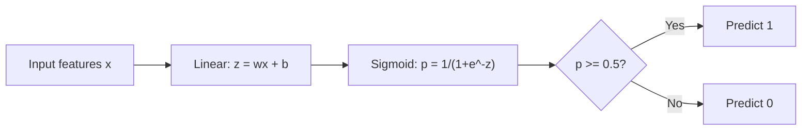
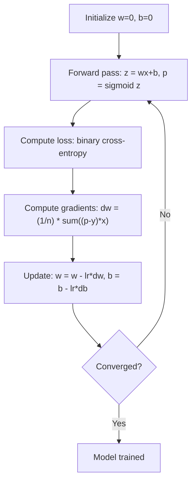

# Logistic Regression

> Logistic regression bends a straight line into an S-curve to answer yes-or-no questions with probabilities.

## What you'll be able to do after this

- Implement logistic regression from scratch using the sigmoid function and binary cross-entropy loss
- Compute and interpret precision, recall, F1 score, and the confusion matrix for binary classification
- Explain why MSE fails for classification and why binary cross-entropy produces a convex cost surface
- Build a softmax regression model for multi-class classification and evaluate threshold tuning tradeoffs

## The Problem

Say you want to predict whether a tumor is malignant or benign given its size. You try linear regression. It spits out numbers like 0.3, or 1.7, or -0.5. What do those mean? Is 1.7 "very malignant"? Is -0.5 "very benign, and then some"? None of that makes sense — linear regression outputs unbounded numbers, but classification needs two things: a bounded probability between 0 and 1, and a clean yes/no decision.

Logistic regression solves this by reusing the linear model you already know (`wx + b`) and passing the result through the **sigmoid function**, which squashes any real number into the range (0, 1). The output is now a genuine probability. Pick a threshold (usually 0.5) and you have a decision rule.

One naming quirk worth clearing up immediately: despite the name, logistic regression is a **classification** algorithm, not a regression algorithm. The "regression" part refers to the linear model at its core; the "logistic" part refers to the sigmoid (a.k.a. logistic) function bolted on top.

## The Concept

### Why Linear Regression Fails for Classification

Imagine predicting pass/fail (1/0) from hours studied:

```
hours:  1   2   3   4   5   6   7   8   9   10
actual: 0   0   0   0   1   1   1   1   1   1
```

Fit a straight line through this data and you might get predictions like -0.2 at hour 1 and 1.3 at hour 10. Neither is a valid probability — they overshoot the [0, 1] range entirely. It gets worse: if one more data point is added — someone who studied 50 hours and passed — that single point drags the whole line's slope, quietly changing the predicted outcome for everyone else in the dataset, even people whose situation didn't change at all. A model whose predictions for existing points can be knocked around by one distant outlier is not a model you can trust for decisions.

What classification actually needs is a function that:
- Outputs values between 0 and 1 (so they're interpretable as probabilities)
- Creates a sharp-ish transition zone (a decision boundary) instead of a straight ramp
- Is not overly sensitive to points far from that boundary

### The Sigmoid Function

The sigmoid function does exactly this:

```
sigmoid(z) = 1 / (1 + e^(-z))
```

A few numbers to build intuition:

| z | sigmoid(z) | interpretation |
|---|---|---|
| -10 | ≈ 0.00005 | essentially "definitely class 0" |
| -2 | ≈ 0.12 | leaning strongly toward 0 |
| 0 | 0.5 | totally undecided |
| 2 | ≈ 0.88 | leaning strongly toward 1 |
| 10 | ≈ 0.99995 | essentially "definitely class 1" |

Notice the shape this produces: near z = 0, small changes in z move the probability a lot (the S-curve is steepest there). Far from z = 0, even large changes in z barely move the probability at all — it's already pinned near 0 or 1. This is exactly the "insensitive to outliers far from the boundary" property linear regression was missing. A student who studied 50 hours just pushes z further into "definitely pass" territory without dragging the boundary around.

Key properties:
- Output is always strictly between 0 and 1
- z = 0 maps to exactly 0.5 (maximum uncertainty)
- The function is smooth and differentiable everywhere, which matters for gradient descent
- Its derivative has a remarkably clean form: `sigmoid'(z) = sigmoid(z) * (1 - sigmoid(z))` — this is why logistic regression gradients turn out so simple later on

### Logistic Regression = Linear Model + Sigmoid

The model computes `z = wx + b` (identical to linear regression so far), then applies sigmoid:



The output `p` is interpreted as `P(y=1 | x)` — the model's estimated probability that this input belongs to class 1. The decision boundary sits wherever `wx + b = 0`, because that's precisely where sigmoid outputs 0.5. Everything on one side of that boundary gets more than 50% probability of being class 1; everything on the other side gets less.

### Binary Cross-Entropy Loss

Here's a natural question: why not just use the same MSE loss from linear regression, plugged into this new model? The answer is that it technically *works* but trains badly. Squaring the error between a sigmoid output and a 0/1 label produces a cost surface with multiple local minima and flat, low-gradient regions — gradient descent can get stuck partway through training, especially when predictions start out badly wrong. You want a loss whose landscape has exactly one valley to walk down.

That loss is **binary cross-entropy** (also called log loss):

```
Loss = -(1/n) * sum(y * log(p) + (1-y) * log(1-p))
```

Notice only one of the two terms is ever "active" for a given example, because y is either 0 or 1:
- If **y = 1**, the `(1-y)` term vanishes, leaving `-log(p)` — the loss only cares how close p is to 1
- If **y = 0**, the `y` term vanishes, leaving `-log(1-p)` — the loss only cares how close p is to 0

Walking through the four cases:
- y=1, p≈1: `log(1) = 0` → loss ≈ 0 (correct and confident: no penalty)
- y=1, p≈0: `log(0) → -∞` → loss is huge (confidently wrong: heavily penalized)
- y=0, p≈0: `log(1) = 0` → loss ≈ 0 (correct and confident: no penalty)
- y=0, p≈1: `log(0) → -∞` → loss is huge (confidently wrong: heavily penalized)

The important behavior here is that being *confidently* wrong is punished far more harshly than being *unsurely* wrong — a model that says "I'm 99% sure this is benign" and turns out to be wrong about a malignant tumor pays a steep price, which is exactly the incentive you want for a medical screening model. For this particular pairing of sigmoid + cross-entropy, the resulting cost surface is provably convex — it has exactly one minimum, so gradient descent is guaranteed to find it (given a reasonable learning rate) rather than getting trapped somewhere suboptimal.

### Gradient Descent for Logistic Regression

The gradients for binary cross-entropy with sigmoid work out to a clean, almost suspiciously simple form:

```
dL/dw = (1/n) * sum((p - y) * x)
dL/db = (1/n) * sum(p - y)
```

These are algebraically identical in *shape* to the linear regression gradients you've seen before. The only thing that changed is what `p` means: in linear regression, `p = wx + b` directly; here, `p = sigmoid(wx + b)`. All the nonlinearity is packed into how `p` is computed — once you have `p`, the update rule for `w` and `b` looks exactly the same as before. This is not a coincidence; it falls directly out of that clean sigmoid derivative from earlier, which cancels neatly against the log terms in cross-entropy during differentiation.



**A tiny worked example.** Suppose `w = 0`, `b = 0`, learning rate `lr = 0.1`, and a single training example `x = 2, y = 1`.

1. Forward pass: `z = 0*2 + 0 = 0`, so `p = sigmoid(0) = 0.5`
2. Gradient: `dw = (p - y) * x = (0.5 - 1) * 2 = -1`, and `db = (p - y) = -0.5`
3. Update: `w = 0 - 0.1*(-1) = 0.1`, `b = 0 - 0.1*(-0.5) = 0.05`

After one step, `w` and `b` both nudged in the direction that would have made `p` closer to 1 (the true label) for this example. Repeat across the full dataset, in batches, over many epochs, and `p` gradually tightens around the true labels.

### The Decision Boundary

For 2D input (two features), the decision boundary is the line where:

```
w1*x1 + w2*x2 + b = 0
```

Points on one side of that line get classified as 1, points on the other as 0. It's worth being explicit about a limitation here: **logistic regression always produces a linear decision boundary** — a straight line in 2D, a flat plane in 3D, a flat hyperplane in higher dimensions. If your data needs a curved boundary (imagine one class forming a ring around another), plain logistic regression cannot represent that, no matter how much you train it. Two common workarounds: engineer polynomial features (e.g., feed in `x1^2`, `x2^2`, `x1*x2` as additional inputs so the boundary is linear in the new feature space but curved in the original one), or switch to a model family that's nonlinear by construction, like a decision tree or neural network.

### Multi-Class Classification with Softmax

Binary logistic regression only handles two classes. For k classes, the natural generalization is **softmax**:

```
softmax(z_i) = e^(z_i) / sum(e^(z_j) for all j)
```

Instead of one weight vector, each class gets its own: class i has weights that produce a raw score `z_i` for a given input. Softmax then converts the whole vector of raw scores into probabilities that sum to exactly 1 — so it's answering "given that this belongs to one of these k classes, how likely is each one?" The predicted class is simply whichever one got the highest probability.

The loss generalizes too, becoming **categorical cross-entropy**:

```
Loss = -(1/n) * sum(sum(y_k * log(p_k)))
```

Here `y_k` is 1 for the true class and 0 for every other class (this is one-hot encoding), so — just like in the binary case — only the log-probability assigned to the *correct* class actually contributes to the loss for each example. Everything else gets multiplied by zero and drops out.

### Evaluation Metrics

Accuracy alone can be dangerously misleading. Picture a fraud-detection dataset where 95% of transactions are legitimate and 5% are fraudulent. A model that always predicts "not fraud," never even looking at the input, gets 95% accuracy — and is completely useless, since it catches zero fraud. This is why classification results are reported through a **confusion matrix** and metrics derived from it.

**Confusion Matrix**:

| | Predicted Positive | Predicted Negative |
|---|---|---|
| Actually Positive | True Positive (TP) | False Negative (FN) |
| Actually Negative | False Positive (FP) | True Negative (TN) |

**Precision** — of everything the model flagged as positive, how much was actually positive?
```
Precision = TP / (TP + FP)
```

**Recall** (a.k.a. Sensitivity) — of everything that was actually positive, how much did the model catch?
```
Recall = TP / (TP + FN)
```

**F1 Score** — the harmonic mean of precision and recall, balancing both into one number:
```
F1 = 2 * (Precision * Recall) / (Precision + Recall)
```

**A worked example.** Say a cancer-screening model is run on 100 patients, 10 of whom actually have cancer. The model flags 12 patients as positive; of those, 8 really do have cancer (so it missed 2 of the 10 true cases, and flagged 4 healthy patients unnecessarily).

- TP = 8, FN = 2, FP = 4, TN = 86
- Precision = 8 / (8 + 4) = 0.67 — of the people flagged, two-thirds actually had cancer
- Recall = 8 / (8 + 2) = 0.80 — the model caught 80% of actual cancer cases
- F1 = 2 * (0.67 * 0.80) / (0.67 + 0.80) ≈ 0.73

Which metric matters most depends entirely on what a mistake costs:
- **Prioritize precision** when false positives are expensive — a spam filter that blocks a legitimate, important email causes real harm, so you'd rather let a few spam messages through than misfire on good ones.
- **Prioritize recall** when false negatives are expensive — in this cancer-screening example, missing 2 real cases (FN) is far worse than the 4 unnecessary follow-up tests (FP), so you'd tune the threshold down from 0.5 to catch more true positives even at the cost of more false alarms.
- **Use F1** when you need one number that won't let a model win by ignoring one side entirely.

Threshold tuning is how you act on this in practice: lowering the classification threshold below 0.5 makes the model flag more cases as positive overall, which raises recall but tends to lower precision (more false alarms creep in), and vice versa for raising the threshold. There's no universally "correct" threshold — it's a business or clinical decision about which kind of mistake you can tolerate more.

## Key Terms

| Term | What people say | What it actually means |
|------|----------------|----------------------|
| Logistic regression | "Regression for classification" | A linear model followed by a sigmoid function that outputs class probabilities |
| Sigmoid function | "The S-curve" | The function 1/(1+e^(-z)) that maps any real number to the range (0, 1) |
| Binary cross-entropy | "Log loss" | The loss function -[y*log(p) + (1-y)*log(1-p)] that penalizes confident wrong predictions severely |
| Decision boundary | "The dividing line" | The surface where the model's output probability equals 0.5, separating predicted classes |
| Softmax | "Multi-class sigmoid" | A function that converts a vector of scores into probabilities that sum to 1 |
| Precision | "How many selected are relevant" | TP / (TP + FP), the fraction of positive predictions that are actually positive |
| Recall | "How many relevant are selected" | TP / (TP + FN), the fraction of actual positives that the model correctly identifies |
| F1 score | "Balanced accuracy" | The harmonic mean of precision and recall: 2*P*R / (P+R) |
| Confusion matrix | "The error breakdown" | A table showing TP, TN, FP, FN counts for each class pair |
| Threshold | "The cutoff" | The probability value above which the model predicts class 1 (default 0.5, tunable) |
| One-hot encoding | "Binary columns for categories" | Representing class k as a vector of zeros with a 1 at position k |
| Categorical cross-entropy | "Multi-class log loss" | The extension of binary cross-entropy to k classes using one-hot encoded labels |