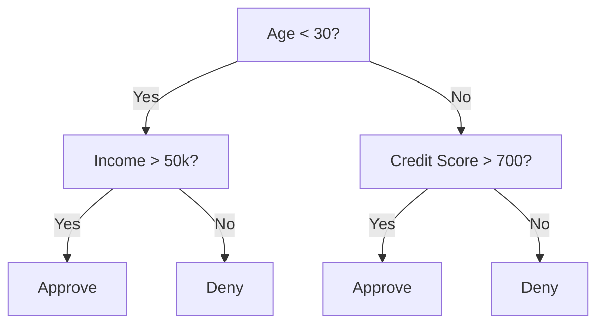

# Decision Trees

## Learning Objectives

- Implement Gini impurity, entropy, and information gain calculations to find optimal decision tree splits
- Build a decision tree classifier from scratch with pre-pruning controls (max depth, min samples)
- Understand stopping conditions, pruning, and decision trees for regression

## The Problem

You have tabular data. Rows are samples, columns are features, and there is a target column you want to predict. You could throw a neural network at it. But for tabular data, tree-based models consistently outperform deep learning. Kaggle competitions on structured data are dominated by XGBoost and LightGBM, not transformers.

Why? Trees handle mixed feature types (numeric and categorical) without preprocessing. They handle nonlinear relationships without feature engineering. They are interpretable: you can look at the tree and see exactly why a prediction was made.

This lesson builds a decision tree from scratch using recursive splitting. You will implement the math behind split criteria (Gini impurity, entropy, information gain) and understand pruning.

## The Concept

### What a decision tree does

A decision tree partitions the feature space into rectangular regions by asking a sequence of yes/no questions.



Each internal node tests a feature against a threshold. Each leaf node makes a prediction. To classify a new data point, you start at the root and follow the branches until you reach a leaf.

The tree is built top-down by choosing, at each node, the feature and threshold that best separate the data. "Best" is defined by a split criterion.

### Split criteria: measuring impurity

At each node, we have a set of samples. We want to split them so that the resulting child nodes are as "pure" as possible, meaning each child contains mostly one class.

**Gini impurity** measures the probability that a randomly chosen sample would be misclassified if it were labeled according to the class distribution at that node.

```
Gini(S) = 1 - sum(p_k^2)

where p_k is the proportion of class k in set S.
```

For a pure node (all one class), Gini = 0. For a binary split with 50/50 classes, Gini = 0.5. Lower is better.

```
Example: 6 cats, 4 dogs

Gini = 1 - (0.6^2 + 0.4^2) = 1 - (0.36 + 0.16) = 0.48
```

**Entropy** measures the information content (disorder) in a node.

```
Entropy(S) = -sum(p_k * log2(p_k))
```

For a pure node, entropy = 0. For a 50/50 binary split, entropy = 1.0. Lower is better.

```
Example: 6 cats, 4 dogs

Entropy = -(0.6 * log2(0.6) + 0.4 * log2(0.4))
        = -(0.6 * -0.737 + 0.4 * -1.322)
        = 0.442 + 0.529
        = 0.971 bits
```

**Information gain** is the reduction in impurity (entropy or Gini) after a split.

```
IG(S, feature, threshold) = Impurity(S) - weighted_avg(Impurity(S_left), Impurity(S_right))

where the weights are the proportions of samples in each child.
```

The greedy algorithm at each node: try every feature and every possible threshold. Pick the (feature, threshold) pair that maximizes information gain.

### How splitting works

For a dataset with n features and m samples at the current node:

1. For each feature j (j = 1 to n):
   - Sort the samples by feature j
   - Try every midpoint between consecutive distinct values as a threshold
   - Compute the information gain for each threshold
2. Select the feature and threshold with the highest information gain
3. Split the data into left (feature <= threshold) and right (feature > threshold)
4. Recurse on each child

This greedy approach does not guarantee the globally optimal tree. Finding the optimal tree is NP-hard. But greedy splitting works well in practice.

### Stopping conditions

Without stopping conditions, the tree grows until every leaf is pure (one sample per leaf). This perfectly memorizes the training data and generalizes terribly.

**Pre-pruning** stops the tree before it fully grows:
- Maximum depth: stop splitting when the tree reaches a set depth
- Minimum samples per leaf: stop if a node has fewer than k samples
- Minimum information gain: stop if the best split improves impurity by less than a threshold
- Maximum leaf nodes: limit the total number of leaves

**Post-pruning** grows the full tree, then trims it back:
- Cost-complexity pruning (used by scikit-learn): adds a penalty proportional to the number of leaves. Increase the penalty to get smaller trees
- Reduced error pruning: remove a subtree if the validation error does not increase

Pre-pruning is simpler and faster. Post-pruning often produces better trees because it does not prematurely stop splits that might lead to useful further splits.

### Decision trees for regression

For regression, the leaf prediction is the mean of the target values in that leaf. The split criterion changes too:

**Variance reduction** replaces information gain:

```
VR(S, feature, threshold) = Var(S) - weighted_avg(Var(S_left), Var(S_right))
```

Pick the split that reduces variance the most. The tree partitions the input space into regions, and predicts a constant (the mean) in each region.

```figure
decision-tree-depth
```

## Build It

### Step 1: Gini impurity and entropy

Build both split criteria from scratch and verify they agree on which splits are good.

```python
import math

def gini_impurity(labels):
    n = len(labels)
    if n == 0:
        return 0.0
    counts = {}
    for label in labels:
        counts[label] = counts.get(label, 0) + 1
    return 1.0 - sum((c / n) ** 2 for c in counts.values())

def entropy(labels):
    n = len(labels)
    if n == 0:
        return 0.0
    counts = {}
    for label in labels:
        counts[label] = counts.get(label, 0) + 1
    return -sum(
        (c / n) * math.log2(c / n) for c in counts.values() if c > 0
    )
```

### Step 2: Find the best split

Try every feature and every threshold. Return the one with the highest information gain.

```python
def information_gain(parent_labels, left_labels, right_labels, criterion="gini"):
    measure = gini_impurity if criterion == "gini" else entropy
    n = len(parent_labels)
    n_left = len(left_labels)
    n_right = len(right_labels)
    if n_left == 0 or n_right == 0:
        return 0.0
    parent_impurity = measure(parent_labels)
    child_impurity = (
        (n_left / n) * measure(left_labels) +
        (n_right / n) * measure(right_labels)
    )
    return parent_impurity - child_impurity
```

### Step 3: Build the DecisionTree class

Recursive splitting, prediction, and feature importance tracking. `_build` is the heart of the tree: it stops when a node is pure or hits a pre-pruning limit, otherwise it takes the best split and recurses into both children.

See `code/decision_tree.py` for the complete implementation, including the `DecisionTree` class with `fit`, `predict`, and internal helpers (`_build`, `_best_split`, `_split_data`, `_predict_one`).

## Use It

With scikit-learn, training a decision tree is a few lines:

```python
from sklearn.tree import DecisionTreeClassifier
from sklearn.datasets import load_iris
from sklearn.model_selection import train_test_split

X, y = load_iris(return_X_y=True)
X_train, X_test, y_train, y_test = train_test_split(X, y, random_state=42)

tree = DecisionTreeClassifier(max_depth=4, random_state=42)
tree.fit(X_train, y_train)
print(f"Accuracy: {tree.score(X_test, y_test):.4f}")
```

A single tree is fast and fully interpretable, but it is high variance: small changes in the training data can produce a very different tree. That variance problem is what random forests are built to solve (see the separate Random Forests lesson).

## Exercises

1. Train a single decision tree on a 2D dataset with 3 classes. Manually trace the splits and draw the rectangular decision boundaries. Compare the boundaries at max_depth=2 vs max_depth=10.

2. Implement variance reduction splitting for regression trees. Generate y = sin(x) + noise for 200 points and fit your regression tree. Plot the tree's piecewise-constant predictions against the true curve.

3. Compare Gini impurity vs entropy as split criteria on 5 different datasets. Measure accuracy and tree depth. In most cases, they produce nearly identical results. Explain why.

4. Implement cost-complexity (post) pruning and compare the resulting tree size and test accuracy against pre-pruning with a fixed max_depth.

## Key Terms

| Term | What people say | What it actually means |
|------|----------------|----------------------|
| Decision tree | "A flowchart for predictions" | A model that partitions feature space into rectangular regions by learning a sequence of if/else splits |
| Gini impurity | "How mixed the node is" | Probability of misclassifying a random sample at a node. 0 = pure, 0.5 = maximum impurity for binary |
| Entropy | "The disorder in a node" | Information content at a node. 0 = pure, 1.0 = maximum uncertainty for binary. From information theory |
| Information gain | "How good a split is" | Reduction in impurity after a split. The greedy criterion for choosing splits |
| Pre-pruning | "Stop the tree early" | Stopping tree growth early by setting max depth, min samples, or min gain thresholds |
| Post-pruning | "Trim the tree after" | Growing the full tree, then removing subtrees that do not improve validation performance |
| Variance reduction | "The regression version of info gain" | The regression tree analogue of information gain. Picks the split that reduces target variance the most |

