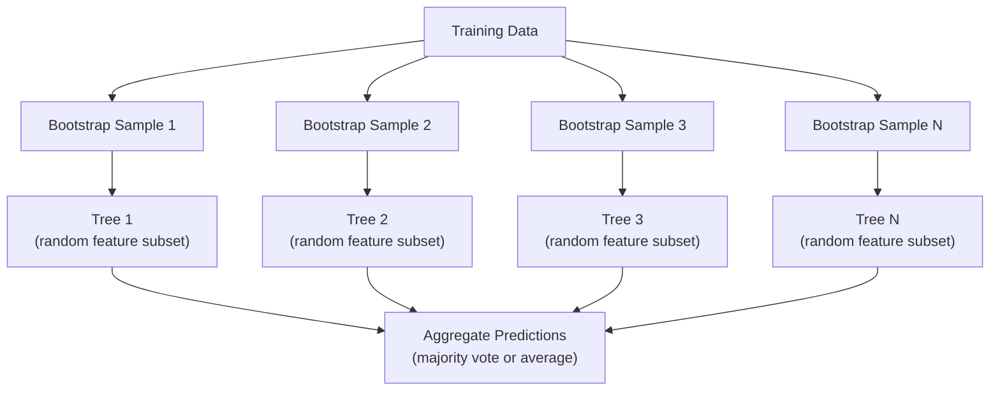

# Random Forests

## Learning Objectives

- Construct a random forest using bootstrap sampling and feature randomization, and explain why it reduces variance
- Compare MDI feature importance with permutation importance and identify when MDI is biased
- Understand when tree-based ensembles beat neural networks on tabular data

## The Problem

A single decision tree is high variance: small changes in the training data can produce a completely different tree, and a fully grown tree tends to overfit. Random forests fix this by training many trees on different random views of the data and averaging their predictions.

This lesson builds a random forest on top of a decision tree implementation (see the separate Decision Trees lesson for `DecisionTree`, `gini_impurity`, `entropy`, and `information_gain`). You will implement bootstrap sampling, feature randomization, and majority-vote aggregation, and understand why averaging decorrelated trees reduces variance without increasing bias.

## The Concept

### Random forests: the power of ensembles

A single decision tree is high variance. Small changes in the data can produce completely different trees. Random forests fix this by averaging many trees.



Two sources of randomness make the trees diverse:

**Bagging (bootstrap aggregating):** Each tree is trained on a bootstrap sample, a random sample with replacement from the training data. About 63% of the original samples appear in each bootstrap (the rest are out-of-bag samples that can be used for validation).

**Feature randomization:** At each split, only a random subset of features is considered. For classification, the default is sqrt(n_features). For regression, n_features/3. This prevents all trees from splitting on the same dominant feature.

The key insight: averaging many decorrelated trees reduces variance without increasing bias. Each individual tree may be mediocre. The ensemble is strong.

### Feature importance

Random forests naturally provide feature importance scores. The most common method:

**Mean Decrease in Impurity (MDI):** For each feature, sum the total reduction in impurity across all trees and all nodes where that feature is used. Features that produce bigger impurity reductions at earlier splits are more important.

```
importance(feature_j) = sum over all nodes where feature_j is used:
    (n_samples_at_node / n_total_samples) * impurity_decrease
```

This is fast (computed during training) but biased toward high-cardinality features and features with many possible split points.

**Permutation importance** is the alternative: shuffle one feature's values and measure how much the model's accuracy drops. More reliable but slower.

### When trees beat neural networks

Trees and forests dominate neural networks on tabular data. Several reasons:

| Factor | Trees | Neural networks |
|--------|-------|----------------|
| Mixed types (numeric + categorical) | Native support | Need encoding |
| Small datasets (< 10k rows) | Work well | Overfit |
| Feature interactions | Found by splitting | Need architecture design |
| Interpretability | Full transparency | Black box |
| Training time | Minutes | Hours |
| Hyperparameter sensitivity | Low | High |

Neural networks win when the data has spatial or sequential structure (images, text, audio). For flat tables of features, trees are the default.

In practice, gradient boosted trees (XGBoost, LightGBM, CatBoost) are often stronger than random forests because they build trees sequentially, with each tree correcting the errors of the previous ones. But random forests are harder to misconfigure and require almost no hyperparameter tuning.

## Build It

### Step 1: Bootstrap sampling

Each tree in the forest is trained on a random sample, drawn with replacement, from the original training data (same size as the original, but with duplicates and omissions).

```python
def bootstrap_sample(X, y):
    n = len(X)
    indices = [random.randint(0, n - 1) for _ in range(n)]
    return [X[i] for i in indices], [y[i] for i in indices]
```

### Step 2: Build the RandomForest class

Bootstrap sampling, feature randomization (handled inside `DecisionTree` via `max_features`), and majority voting.

```python
import random
from decision_tree import DecisionTree

class RandomForest:
    def __init__(self, n_trees=100, max_depth=None,
                 min_samples_split=2, max_features="sqrt",
                 criterion="gini"):
        self.n_trees = n_trees
        self.max_depth = max_depth
        self.min_samples_split = min_samples_split
        self.max_features = max_features
        self.criterion = criterion
        self.trees = []

    def fit(self, X, y):
        n = len(X)
        for _ in range(self.n_trees):
            indices = [random.randint(0, n - 1) for _ in range(n)]
            X_boot = [X[i] for i in indices]
            y_boot = [y[i] for i in indices]
            tree = DecisionTree(
                max_depth=self.max_depth,
                min_samples_split=self.min_samples_split,
                max_features=self.max_features,
                criterion=self.criterion,
            )
            tree.fit(X_boot, y_boot)
            self.trees.append(tree)

    def predict(self, X):
        all_preds = [tree.predict(X) for tree in self.trees]
        predictions = []
        for i in range(len(X)):
            votes = {}
            for preds in all_preds:
                v = preds[i]
                votes[v] = votes.get(v, 0) + 1
            predictions.append(max(votes, key=votes.get))
        return predictions
```

### Step 3: Aggregate feature importance across the forest

Average each tree's normalized `feature_importances_` to get the forest-level MDI importance:

```python
def forest_feature_importances(forest):
    n_features = len(forest.trees[0].feature_importances_)
    totals = [0.0] * n_features
    for tree in forest.trees:
        for j, imp in enumerate(tree.feature_importances_):
            totals[j] += imp
    return [t / len(forest.trees) for t in totals]
```

See `code/random_forest.py` for the complete implementation, including a small permutation-importance helper.

## Use It

With scikit-learn, training a random forest is three lines:

```python
from sklearn.ensemble import RandomForestClassifier
from sklearn.datasets import load_iris
from sklearn.model_selection import train_test_split

X, y = load_iris(return_X_y=True)
X_train, X_test, y_train, y_test = train_test_split(X, y, random_state=42)

rf = RandomForestClassifier(n_estimators=100, random_state=42)
rf.fit(X_train, y_train)
print(f"Accuracy: {rf.score(X_test, y_test):.4f}")
print(f"Feature importances: {rf.feature_importances_}")
```

## Exercises

1. Build a random forest with 1, 5, 10, 50, and 200 trees. Plot training accuracy and test accuracy vs number of trees. Observe that test accuracy plateaus but does not decrease (forests resist overfitting).

2. Implement permutation importance. Compare it with MDI importance on a dataset where one feature is random noise but has high cardinality. MDI will rank the noise feature highly. Permutation importance will not.

3. Vary `max_features` (e.g. all features vs sqrt(n_features) vs 1 feature) and measure how it affects tree correlation and forest accuracy. Explain the bias-variance tradeoff you observe.

4. Use out-of-bag (OOB) samples, the ~37% of rows not included in a given tree's bootstrap sample, to estimate test accuracy without a held-out test set. Compare your OOB estimate to a true train/test split.

## Key Terms

| Term | What people say | What it actually means |
|------|----------------|----------------------|
| Bagging | "Train on random subsets" | Bootstrap aggregating. Train each model on a different random sample with replacement |
| Bootstrap sample | "Random sample with repeats" | A random sample drawn with replacement from the original dataset. Same size, but with duplicates |
| Random forest | "A bunch of trees" | Ensemble of decision trees, each trained on a bootstrap sample with random feature subsets at each split |
| Feature importance (MDI) | "Which features matter" | Total impurity decrease contributed by each feature, summed across all trees and nodes |
| Permutation importance | "Shuffle and check" | Accuracy drop when a feature's values are randomly shuffled. More reliable than MDI for noisy features |
| Out-of-bag (OOB) samples | "The leftovers" | The ~37% of training rows not included in a given tree's bootstrap sample; usable as a free validation set |

