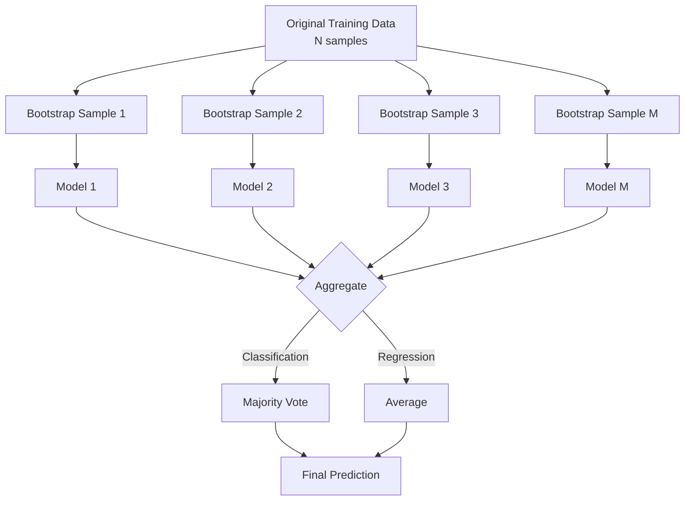
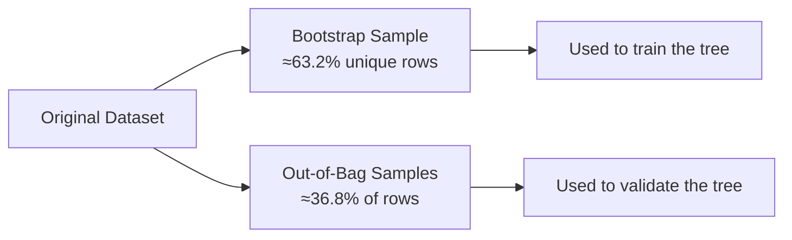

# Bagging (Bootstrap Aggregating)

A complete, structured walkthrough of Bagging: from intuition, to math, to implementation, to advanced variants like Random Forests.


---

## 1. What is Bagging?

**Bagging** (Bootstrap **Agg**regat**ing**) is an ensemble learning technique introduced by **Leo Breiman (1996)**. It improves the accuracy and stability of a model by training many copies of the same base model on different random subsets of the data, then combining their outputs.

> **Core idea:** Instead of trusting one model's guess, train many models on slightly different views of the data and let them vote (classification) or average (regression).

Key properties:

- It is a **parallel** ensemble method (unlike boosting, which is sequential).
- Each model is trained **independently**.
- It works best with **high-variance, low-bias** base learners (e.g., unpruned decision trees).
- It is the foundation of **Random Forest**.

---

## 2. Why Bagging Works — The Core Problem

Some models — especially deep, unpruned Decision Trees — are **unstable**: a tiny change in the training data can produce a very different model.

| Scenario | Result |
|---|---|
| Train Tree A on Dataset A | 85% accuracy |
| Train Tree B on Dataset A with 2 rows changed | 78% accuracy, different splits entirely |

This instability is a symptom of **high variance**: the model overfits to the noise/quirks of whatever data it happened to see.

**Bagging's fix:** if you train many such unstable models on different resamples of the data and average their predictions, the individual errors — being somewhat random and uncorrelated — tend to cancel out, while the true signal (which all models pick up on) reinforces itself.

This is the same statistical principle behind why averaging many noisy measurements gives a more reliable estimate than trusting a single one.

---

## 3. How Bagging Works, Step by Step



**The three stages:**

1. **Bootstrap** — draw `M` random samples (with replacement) from the training data, each the same size as the original dataset.
2. **Train in parallel** — fit one base model per bootstrap sample, independently (this is trivially parallelizable across CPU cores/machines).
3. **Aggregate** — combine all `M` predictions via majority vote (classification) or averaging (regression).

---

## 4. Bootstrap Sampling in Depth

A bootstrap sample of size `N` is built by repeatedly:

1. Randomly picking one row from the original dataset.
2. Adding it to the new sample.
3. **Putting it back** (replacement) so it can be picked again.
4. Repeating `N` times.

### Example

Original dataset (N = 5):

| Index | A | B | C | D | E |
|---|---|---|---|---|---|

Because sampling is *with replacement*, a bootstrap sample can contain duplicates and omissions:

| Bootstrap Sample 1 | Bootstrap Sample 2 |
|---|---|
| A | B |
| C | B |
| C | C |
| D | D |
| E | A |

Each sample:
- Has the same size (N) as the original.
- Contains duplicates.
- Misses some original rows entirely — these missed rows become that model's **OOB set** (see Section 6).

### Why 63.2% of the data ends up "unique" per sample

For a dataset of size `N`, the probability a specific row is **not** picked in a single draw is:

$$1 - \frac{1}{N}$$

The probability it's never picked across all `N` draws:

$$\left(1-\frac{1}{N}\right)^N$$

As `N → ∞`, this converges to:

$$\left(1-\frac{1}{N}\right)^N \approx e^{-1} \approx 0.368$$

So **≈36.8%** of the original rows are excluded from any given bootstrap sample, meaning **≈63.2%** of unique rows are included (with some appearing multiple times to pad the sample back to size N).

This 63.2% figure is a well-known constant in bagging theory and is the reason OOB evaluation works.

---

## 5. Aggregating Predictions

### Classification → Majority Vote

| Tree | Prediction |
|---|---|
| Tree 1 | Cat |
| Tree 2 | Dog |
| Tree 3 | Cat |
| Tree 4 | Cat |
| Tree 5 | Dog |

```text
Cat: 3 votes
Dog: 2 votes
→ Final Prediction = Cat
```

Some implementations use **soft voting** instead — averaging predicted class *probabilities* across trees rather than counting hard votes — which is usually slightly more accurate since it uses confidence information.

### Regression → Averaging

| Tree | Prediction |
|---|---|
| Tree 1 | 110 |
| Tree 2 | 120 |
| Tree 3 | 115 |
| Tree 4 | 118 |

$$\text{Final} = \frac{110+120+115+118}{4} = 115.75$$

---

## 6. Out-of-Bag (OOB) Evaluation

Because each bootstrap sample leaves out ~36.8% of the data, those leftover rows — the **Out-of-Bag (OOB) samples** — were never seen by that particular tree.



**OOB Error Procedure:**

1. For each training row `x`, identify all trees that did **not** use `x` during training (its OOB trees).
2. Predict `x`'s label using only those trees, aggregated (vote/average).
3. Compare against the true label.
4. Average this error across all rows → **OOB Error**.

**Why this matters:** it gives you a free, built-in validation estimate — similar in spirit to cross-validation — without holding out a separate validation split. This is especially valuable when data is limited.

---

## 7. The Math: Why Bagging Reduces Variance

Assume you average `M` independent models, each with variance `σ²`. The variance of their mean is:

$$\text{Var}_{\text{ensemble}} = \frac{\sigma^2}{M}$$

So as `M` (number of trees) grows, variance shrinks proportionally — in theory, toward zero.

**Caveat — real trees are correlated, not independent.** In practice, bootstrap samples overlap heavily (recall: ~63% shared data), so individual trees are correlated with correlation coefficient `ρ`. The more realistic formula is:

$$\text{Var}_{\text{ensemble}} = \rho \sigma^2 + \frac{1-\rho}{M}\sigma^2$$

As `M → ∞`, the second term vanishes, but the **first term (`ρσ²`) remains** — meaning variance reduction has a floor set by how correlated your trees are. This is precisely *why* Random Forest adds random feature selection: it lowers `ρ` further, unlocking additional variance reduction beyond plain bagging.

---

## 8. Bias-Variance Tradeoff

| Method | Bias | Variance | Notes |
|---|---|---|---|
| Single unpruned Tree | Low | High | Overfits easily |
| Bagging | Low (~unchanged) | Lower | Averaging cancels noise |
| Random Forest | Low (~unchanged) | Much Lower | Decorrelates trees further |

Bagging does **not** meaningfully reduce bias — if your base model is systematically wrong (underfitting), averaging many biased models still gives a biased answer. Bagging's entire value proposition is variance reduction. This is why it's most effective with **low-bias, high-variance** learners (deep trees) and largely wasted on **high-bias, low-variance** learners (e.g., linear regression, which barely changes across resamples).

---

## 9. From Bagging to Random Forest

**Random Forest = Bagging + Random Feature Subsetting.**

In addition to bootstrap-sampling rows, Random Forest also restricts each split to consider only a **random subset of features**, forcing trees to diversify further and decorrelating them (lowering `ρ` from Section 7).

### Example

With 20 total features, at each split different trees might only "see":

```text
Tree A: Features 1, 7, 10, 13
Tree B: Features 2, 5, 11, 20
Tree C: Features 4, 8, 9, 15
```

### Feature Subset Size Rule of Thumb

| Task | Formula | 100 features → |
|---|---|---|
| Classification | `m = √p` | `√100 = 10` |
| Regression | `m = p/3` | `100/3 ≈ 33` |

Where `p` = total features, `m` = features considered at each split.

---

## 10. Bagging vs Random Forest vs Boosting

| Feature | Bagging | Random Forest | Boosting (e.g. AdaBoost/GBM) |
|---|---|---|---|
| Training | Parallel | Parallel | Sequential |
| Bootstrap sampling | Yes | Yes | No (reweighting instead) |
| Random feature selection | No | Yes | Sometimes (e.g. XGBoost) |
| Primary target | Variance | Variance | Bias (and variance) |
| Overfitting risk | Low | Lower | Higher (needs tuning) |
| Sensitive to outliers | Less | Less | More |
| Typical accuracy | Good | Usually higher | Often highest (well-tuned) |

---

## 11. Hyperparameters That Matter

| Hyperparameter | Effect |
|---|---|
| `n_estimators` (number of trees) | More trees → lower variance, but diminishing returns and higher compute cost. Rarely causes overfitting by itself. |
| `max_samples` | Fraction/size of each bootstrap sample. Smaller samples increase diversity but can raise bias. |
| `max_features` (Random Forest) | Controls tree decorrelation; smaller = more diverse but potentially weaker trees. |
| `max_depth` / `min_samples_leaf` | Controls how overfit each individual tree is; bagging works best with deep, low-bias trees. |
| `bootstrap` (True/False) | If False, trees train on the full dataset (loses variance-reduction benefit and OOB estimate). |
| `oob_score` | Whether to compute the free OOB validation metric. |

---

## 12. Python Implementation

```python
from sklearn.ensemble import BaggingClassifier, RandomForestClassifier
from sklearn.tree import DecisionTreeClassifier
from sklearn.datasets import make_classification
from sklearn.model_selection import train_test_split

X, y = make_classification(n_samples=1000, n_features=20, random_state=42)
X_train, X_test, y_train, y_test = train_test_split(X, y, test_size=0.2, random_state=42)

# --- Plain Bagging with Decision Trees ---
bagging_model = BaggingClassifier(
    estimator=DecisionTreeClassifier(),
    n_estimators=100,
    max_samples=1.0,      # bootstrap sample size = 100% of training data
    bootstrap=True,
    oob_score=True,       # get free validation estimate
    n_jobs=-1,             # parallelize across all cores
    random_state=42
)
bagging_model.fit(X_train, y_train)

print("OOB Score:", bagging_model.oob_score_)
print("Test Accuracy:", bagging_model.score(X_test, y_test))

# --- Random Forest (Bagging + feature randomness) ---
rf_model = RandomForestClassifier(
    n_estimators=100,
    max_features="sqrt",  # classification rule of thumb: m = sqrt(p)
    oob_score=True,
    n_jobs=-1,
    random_state=42
)
rf_model.fit(X_train, y_train)

print("RF OOB Score:", rf_model.oob_score_)
print("RF Test Accuracy:", rf_model.score(X_test, y_test))
```

For regression, swap in `BaggingRegressor` / `RandomForestRegressor` and use `max_features = p/3` as a starting point.

---

## 13. Advantages & Disadvantages

### Advantages
- Reduces overfitting and variance
- Improves stability of predictions
- Works especially well with high-variance base learners (decision trees)
- Naturally parallelizable — fast to train given enough cores
- Robust to noisy data and outliers
- Built-in validation via OOB error (no need to sacrifice data to a holdout set)

### Disadvantages
- Higher computational and memory cost (training/storing many models)
- Less interpretable than a single model
- Minimal benefit for already low-variance models (e.g., linear regression, k-NN with large k)
- Does not address bias — a systematically wrong base model stays wrong
- Slower inference (must query every model in the ensemble)

---

## 14. When (and When Not) to Use Bagging

**Use Bagging when:**
- Your base model (e.g., decision tree) overfits easily
- The dataset is noisy or you have limited data for a robust holdout
- You observe high variance (large accuracy swings across CV folds)
- Prediction stability matters more than interpretability
- Training can be parallelized (you have compute to spare)

**Avoid / reconsider when:**
- Your base model already has low variance (bagging won't help much and just adds cost)
- Interpretability/explainability is a hard requirement
- Inference latency is tightly constrained
- The bias, not variance, is the dominant error source (consider boosting instead)

**Common algorithms in this family:**
- `BaggingClassifier` / `BaggingRegressor`
- Random Forest
- Extra Trees (Extremely Randomized Trees — randomizes split *thresholds* too, not just features)

---

## 15. Common Pitfalls

- **Confusing OOB error with cross-validation error** — they're similar in spirit but not identical; OOB tends to be a slightly pessimistic/optimistic estimate depending on ensemble size.
- **Using bagging with already-stable models** (e.g., Naive Bayes, linear models) and expecting a big lift — there's little variance to reduce.
- **Setting `max_samples` too small** without realizing it increases bias, not just diversity.
- **Ignoring correlation between trees** — simply adding more trees plateaus once trees stop being independent (see Section 7's `ρσ²` floor); this is why Random Forest's feature randomization exists.
- **Forgetting bagging ≠ boosting** — bagging trains in parallel on resampled data to cut variance; boosting trains sequentially on reweighted/residual data to cut bias.

---

## 16. Quick Q&A

**Q: What problem does bagging solve?**
A: High variance in unstable models like decision trees — it stabilizes predictions by averaging over many models trained on different data resamples.

**Q: Does bagging reduce bias?**
A: No, primarily variance. Bias stays roughly the same as the base learner's bias.

**Q: Why sample with replacement?**
A: It lets each bootstrap sample be the same size as the original dataset while still differing from it, and it's what enables the OOB estimate (since some rows are naturally excluded).

**Q: What's the difference between Bagging and Random Forest?**
A: Random Forest = Bagging + random feature subsetting at each split, which further decorrelates trees and reduces variance beyond what bagging alone achieves.

**Q: Why ~63.2%?**
A: It's the limit of `1 - (1-1/N)^N` as N grows, which converges to `1 - e⁻¹ ≈ 0.632`.

**Q: Is bagging parallel or sequential?**
A: Parallel — every model trains independently, unlike boosting which is inherently sequential.