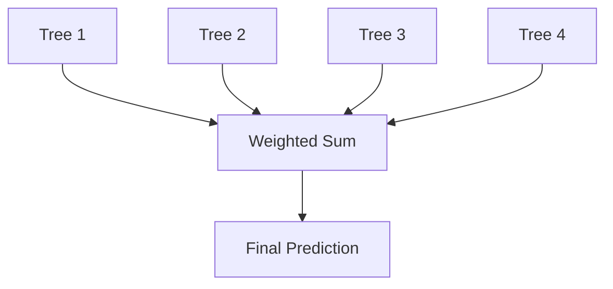
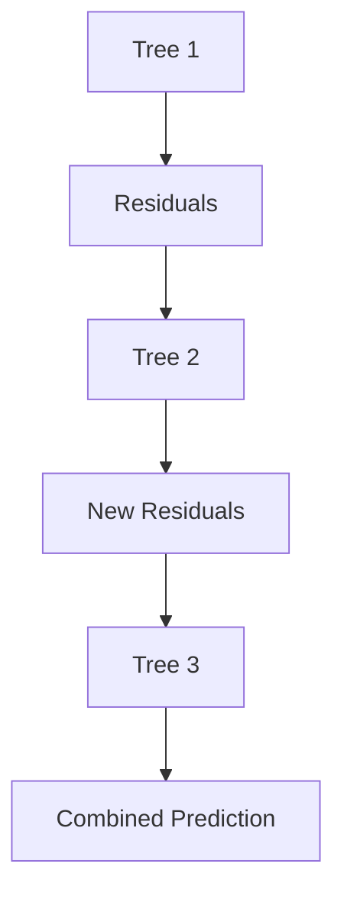

# Boosting (Sequential Error Correction) 

A complete, structured walkthrough of Boosting: from intuition, to math, to implementation, to the modern algorithms (XGBoost, LightGBM, CatBoost) that dominate tabular ML.

---


## 1. What is Boosting?

**Boosting** is an ensemble learning technique that combines many **weak learners** (typically shallow decision trees, often just "stumps" of depth 1) into a single **strong learner**.

Unlike Bagging — where models are trained independently and in parallel on random resamples — Boosting trains models **sequentially**, and each new model is built specifically to correct the mistakes of the ones before it.

> **Core idea:** "Learn from mistakes." Every new model pays extra attention to the training examples the previous models got wrong.

```text
Model 1 → Finds mistakes
Model 2 → Corrects Model 1's mistakes
Model 3 → Corrects remaining mistakes
...
Final Model = Weighted combination of all models
```

Key properties:
- **Sequential**, not parallel — each learner depends on the previous one's output.
- Primarily targets **bias reduction** (though modern variants also manage variance via regularization).
- Base learners are intentionally **weak** (shallow trees), unlike Bagging which prefers deep, high-variance trees.
- Forms the basis of some of the most successful tabular-data algorithms in practice: XGBoost, LightGBM, CatBoost.

---

## 2. Why Boosting Works — The Core Idea

A single shallow decision tree might only reach:

```text
Accuracy = 75%
```

because it's too simple to capture every pattern (high bias, underfitting).

Boosting repeatedly asks: **"What mistakes is the current ensemble making?"** — and trains the next model specifically to address those mistakes.

```text
Tree 1: Accuracy 75%
Tree 2: Corrects Tree 1's errors
Tree 3: Corrects remaining errors
Tree 4: Corrects remaining errors
...
Final Ensemble Accuracy: 90%+
```

Each weak learner alone is barely better than random guessing, but the *sequence*, combined with weighting, becomes a strong learner.

---

## 3. How Boosting Works, Step by Step

### Step 1 — Train the First Weak Learner

Initially, every sample has equal importance/weight.


| Sample | Actual | Prediction |
|---|---|---|
| A | Yes | Yes |
| B | No | No |
| C | Yes | No |
| D | No | Yes |

Misclassified: **C and D**.

### Step 2 — Increase the Weight of Misclassified Samples

| Sample | Weight (before) | Weight (after) |
|---|---|---|
| A | 0.25 | 0.15 |
| B | 0.25 | 0.15 |
| C | 0.25 | 0.35 |
| D | 0.25 | 0.35 |

The next model now pays more attention to C and D.

### Step 3 — Train the Next Model on the Reweighted Data


### Step 4 — Repeat


Each new learner focuses on whatever the ensemble-so-far still gets wrong.

### Step 5 — Combine All Models



**Full sequential pipeline:**


**Bagging vs Boosting, structurally:**

```text
Bagging:      Tree 1, Tree 2, Tree 3  — train independently, in parallel
Boosting:     Tree 1 → Tree 2 → Tree 3 — train sequentially, each fixing the last
```

---

## 4. The Math: Boosting as an Additive Model

Boosting builds a final model as a weighted sum of weak learners:

$$F(x) = \sum_{m=1}^{M} \alpha_m h_m(x)$$

Where:
- $h_m(x)$ = the $m$-th weak learner
- $\alpha_m$ = the weight/contribution of that learner
- $M$ = total number of learners

Better-performing learners (lower error) get larger $\alpha_m$, so they influence the final prediction more.

This is fundamentally a **forward stagewise additive modeling** process: at each stage, a new term is added to the model to best reduce the current overall error, and previously added terms are not revisited.

---

## 5. AdaBoost (Adaptive Boosting)

AdaBoost is the original, foundational boosting algorithm, introduced by **Yoav Freund and Robert Schapire in 1995–1997**. Their work later won the prestigious **Gödel Prize** for its impact on theoretical computer science and machine learning.

### The Algorithm

**1. Initialize weights** — every sample starts equally important:

$$w_i = \frac{1}{N}$$

**2. Train a weak learner** — typically a **decision stump** (a tree of depth 1).

**3. Compute the weighted error rate:**

$$\text{Error} = \frac{\text{Wrong Predictions}}{\text{Total Predictions}}$$

Example: 100 samples, 20 mistakes → `Error = 0.20`.

**4. Compute the learner's weight (its "say" in the final vote):**

$$\alpha = \frac{1}{2}\ln\left(\frac{1-\text{error}}{\text{error}}\right)$$

- Low error → high $\alpha$ (this learner is trusted more).
- High error (near 0.5, i.e., coin-flip) → $\alpha$ approaches 0.
- Error above 0.5 → $\alpha$ turns negative, effectively flipping that learner's vote.

**5. Update sample weights:**
- Misclassified samples → weight increases.
- Correctly classified samples → weight decreases.
- Weights are then re-normalized to sum to 1.

This forces every subsequent learner to focus disproportionately on the examples that are still hard to get right.

---

## 6. Gradient Boosting

AdaBoost works by **reweighting samples**. Gradient Boosting takes a more general approach: it fits each new tree to the **residual errors** of the current ensemble, framed as gradient descent in function space.

Instead of asking *"which samples are wrong?"*, it asks: **"what error still remains, numerically?"**

### Example

```text
Actual values:      [100, 120, 140]
Current prediction: [ 90, 125, 130]
Residuals:           [ 10,  -5,  10]
```

The next tree is trained to predict `[10, -5, 10]` — the leftover error — rather than the original targets. Its output is then added (scaled by a learning rate) to the running prediction.



More formally, each new tree approximates the **negative gradient** of the loss function with respect to the current predictions — for squared-error loss this negative gradient happens to equal the simple residual, which is why the intuition above works cleanly for regression. For other loss functions (e.g., log-loss for classification), the "residual" is replaced by the corresponding gradient term.

---

## 7. XGBoost (Extreme Gradient Boosting)

XGBoost was created by **Tianqi Chen** (as part of his research, later widely adopted across industry and competitions) and has become one of the most widely used machine learning algorithms for structured/tabular data.

### Key Improvements Over Vanilla Gradient Boosting

**Regularization** — the objective explicitly penalizes model complexity to control overfitting:

$$\text{Objective} = \text{Loss} + \text{Regularization}$$

**Tree pruning** — uses a "max depth then prune back" strategy that removes splits that don't sufficiently reduce loss, making trees smaller and faster without sacrificing much accuracy.

**Parallelized computation** — the split-finding step (not the sequential boosting itself) is parallelized across CPU cores, making XGBoost significantly faster than naive gradient boosting implementations.

**Native missing-value handling** — XGBoost learns the optimal default direction (left or right) for missing values at each split, rather than requiring imputation beforehand.

**Built-in feature importance** — reports multiple importance metrics:
- **Gain** — improvement in accuracy contributed by a feature to the splits it's used in.
- **Weight** — how many times a feature is used to split across all trees.
- **Cover** — the number of samples affected by splits on that feature.

---

## 8. LightGBM

LightGBM was developed by **Microsoft**. Its defining architectural choice is **leaf-wise tree growth** rather than the traditional **level-wise growth** used by most other tree ensembles.

- **Level-wise (XGBoost default, traditional):** grows the tree one full level at a time, expanding every node at the current depth before going deeper.
- **Leaf-wise (LightGBM):** always splits the single leaf that yields the largest loss reduction, regardless of depth — producing deeper, more irregular trees for the same "budget."

**Advantages:**
- Very fast training, especially on large datasets.
- Lower memory usage than level-wise growth.
- Often reaches lower loss for the same number of leaves.

**Trade-off:** leaf-wise growth can overfit more easily on small datasets, so `max_depth` / `num_leaves` need careful tuning.

---

## 9. CatBoost

CatBoost was developed by **Yandex**. It specializes in datasets with many **categorical features**.

**How it handles categoricals:** instead of requiring manual one-hot or label encoding, CatBoost uses an **ordered target statistics** technique — it encodes categories using target-derived statistics computed only from "prior" data in a randomized ordering, which avoids the target leakage that naive target encoding would otherwise cause.

**Benefits:**
- Minimal preprocessing required for categorical data.
- Strong performance with default hyperparameters (less tuning needed to get a good baseline).
- Built-in techniques (ordered boosting) that reduce overfitting compared to classic gradient boosting.

---

## 10. Bias-Variance Perspective

| Method | Bias | Variance |
|---|---|---|
| Single Tree | Low (if deep) / High (if shallow) | High (if deep) |
| Bagging | Low (unchanged from base learner) | Lower |
| Boosting | Lower (actively reduced) | Medium |
| Random Forest | Low | Much Lower |

Boosting's whole mechanism — sequentially correcting errors — directly attacks **bias**. This is the opposite emphasis from Bagging, which attacks **variance** through averaging. Boosting's variance is only "medium" because, if left unchecked (too many rounds, too high a learning rate), it can start fitting noise and its variance creeps back up — this is why learning rate and early stopping matter so much (Section 12).

---

## 11. Bagging vs Boosting

| Feature | Bagging | Boosting |
|---|---|---|
| Training | Parallel | Sequential |
| Primary goal | Reduce variance | Reduce bias |
| Bootstrap sampling | Yes | Usually no (uses reweighting or gradients instead) |
| Typical tree depth | Deep trees | Shallow trees (stumps to depth 3–8) |
| Aggregation | Average / majority vote | Weighted sum |
| Overfitting risk | Low | Higher (needs tuning) |
| Training speed | Faster (parallelizable) | Slower (inherently sequential, though split-finding can be parallelized) |
| Representative algorithm | Random Forest | AdaBoost, Gradient Boosting, XGBoost, LightGBM, CatBoost |

---

## 12. Hyperparameters That Matter

### `n_estimators` (number of trees / boosting rounds)
More trees → lower bias, but higher overfitting risk (unlike bagging, adding more boosting rounds *can* hurt). Usually tuned together with learning rate and early stopping.

### `learning_rate` (a.k.a. shrinkage, $\eta$)
Scales each tree's contribution to the running prediction.
- **Small** → slower learning, but typically better generalization (needs more trees to compensate).
- **Large** → faster learning, but higher overfitting risk.
- A common strategy: use a small learning rate (e.g., 0.01–0.1) with a large `n_estimators` and early stopping on a validation set.

### `max_depth`
Controls the complexity of each individual weak learner. Typical range for boosting: **3–8** (much shallower than bagging's typically deep, unpruned trees).

### `subsample` / `colsample_bytree`
Randomly subsampling rows/columns per tree (stochastic gradient boosting) injects some of bagging's variance-reduction benefit into a boosting pipeline and helps prevent overfitting.

### `early_stopping_rounds`
Stops training once validation performance stops improving for a set number of rounds — the primary practical defense against boosting's overfitting tendency.

---

## 13. Python Implementation

```python
from sklearn.ensemble import GradientBoostingClassifier, AdaBoostClassifier
from sklearn.tree import DecisionTreeClassifier
from sklearn.datasets import make_classification
from sklearn.model_selection import train_test_split

X, y = make_classification(n_samples=1000, n_features=20, random_state=42)
X_train, X_test, y_train, y_test = train_test_split(X, y, test_size=0.2, random_state=42)

# --- AdaBoost ---
ada_model = AdaBoostClassifier(
    estimator=DecisionTreeClassifier(max_depth=1),  # decision stump
    n_estimators=100,
    learning_rate=1.0,
    random_state=42
)
ada_model.fit(X_train, y_train)
print("AdaBoost Test Accuracy:", ada_model.score(X_test, y_test))

# --- Gradient Boosting ---
gb_model = GradientBoostingClassifier(
    n_estimators=200,
    learning_rate=0.05,
    max_depth=3,
    subsample=0.8,
    random_state=42
)
gb_model.fit(X_train, y_train)
print("Gradient Boosting Test Accuracy:", gb_model.score(X_test, y_test))

# --- XGBoost (requires: pip install xgboost) ---
import xgboost as xgb

xgb_model = xgb.XGBClassifier(
    n_estimators=500,
    learning_rate=0.05,
    max_depth=6,
    subsample=0.8,
    colsample_bytree=0.8,
    reg_lambda=1.0,       # L2 regularization
    early_stopping_rounds=20,
    eval_metric="logloss",
    n_jobs=-1,
    random_state=42
)
xgb_model.fit(
    X_train, y_train,
    eval_set=[(X_test, y_test)],
    verbose=False
)
print("XGBoost Test Accuracy:", xgb_model.score(X_test, y_test))
```

For LightGBM (`pip install lightgbm`) and CatBoost (`pip install catboost`), the APIs follow a similar `fit`/`predict` pattern via `LGBMClassifier` and `CatBoostClassifier` respectively, with CatBoost additionally accepting a `cat_features` argument to specify categorical columns directly.

---

## 14. Advantages & Disadvantages

### Advantages
- High predictive accuracy — often the strongest option for structured/tabular data
- Actively and significantly reduces bias
- Captures complex, non-linear patterns that weak learners alone miss
- Frequently wins ML competitions (Kaggle, etc.), especially XGBoost/LightGBM/CatBoost
- Works very well "out of the box" on tabular data compared to deep learning

### Disadvantages
- More sensitive to noisy data and outliers (since it keeps trying to fit hard/mislabeled examples)
- Can overfit if too many rounds are used without regularization or early stopping
- Slower to train than bagging (sequential dependency between trees)
- Requires more careful hyperparameter tuning (learning rate, depth, regularization, number of rounds all interact)

---

## 15. When (and When Not) to Use Boosting

**Use Boosting when:**
- You have structured/tabular data and want maximum predictive accuracy
- The base model underfits (high bias) — a single shallow tree isn't capturing enough signal
- You can afford proper hyperparameter tuning and validation
- Training time is not the primary constraint (or you can use LightGBM/XGBoost's speed optimizations)

**Avoid / reconsider when:**
- The data is very noisy or has many mislabeled examples (boosting will chase the noise)
- You need fast, embarrassingly-parallel training and have limited tuning budget — Bagging/Random Forest is more forgiving out of the box
- Strong interpretability is required without extra tooling (though SHAP values help mitigate this for boosted trees)
- The dataset is very small, where boosting's flexibility can overfit quickly

---

## 16. Common Pitfalls

- **Setting `n_estimators` too high without early stopping** — unlike bagging, more boosting rounds is not automatically safer.
- **Using a large learning rate with many trees** — a recipe for overfitting; the two should generally be traded off against each other.
- **Ignoring class imbalance** — boosting can amplify the influence of a majority class's easy examples unless class weights or an appropriate loss are used.
- **Treating AdaBoost and Gradient Boosting as interchangeable** — they update the model differently (reweighting samples vs. fitting gradients/residuals), which affects tuning strategy.
- **Not tuning `max_depth`** — using bagging-style deep trees inside a boosting loop is a common beginner mistake and usually overfits fast.

---

## 17. Quick  Q&A

**Q: Why does Boosting reduce bias?**
A: Because each new learner is trained explicitly to correct the errors/residuals left by the current ensemble, so the combined model gradually approximates the true function more closely.

**Q: Why can Boosting overfit?**
A: Because it keeps focusing on the hardest examples — including noisy or mislabeled ones — which can cause later trees to fit noise rather than signal if left unchecked.

**Q: Difference between AdaBoost and Gradient Boosting?**

| AdaBoost | Gradient Boosting |
|---|---|
| Reweights misclassified samples | Fits the residual/gradient of the loss |
| Originally classification-focused | Naturally extends to classification and regression |
| Conceptually simpler | More general and more powerful |

**Q: Why is XGBoost so popular?**
A: A combination of built-in regularization, fast parallelized split-finding, native missing-value handling, tree pruning, and consistently strong accuracy on tabular data.

**Q: Why is Boosting usually more accurate than Bagging?**
A: Bagging reduces variance by averaging independently trained models, while Boosting actively targets bias by sequentially correcting errors — on many tabular problems, bias reduction yields larger accuracy gains, provided overfitting is controlled via tuning.

**Q: What's the difference between level-wise and leaf-wise tree growth?**
A: Level-wise (XGBoost's default) expands every node at the current depth before going deeper; leaf-wise (LightGBM) always splits whichever leaf reduces loss the most, which is faster and often more accurate but more overfitting-prone on small data.

---

## Summary

```text
Bagging:
Train models independently → Average predictions → Reduce Variance

Boosting:
Train models sequentially → Correct previous errors → Weighted combination → Reduce Bias
```

**Key idea:** Boosting = Sequential Learning + Error Correction + Weighted Combination

**Popular Boosting Algorithms:**
1. AdaBoost
2. Gradient Boosting
3. XGBoost
4. LightGBM
5. CatBoost