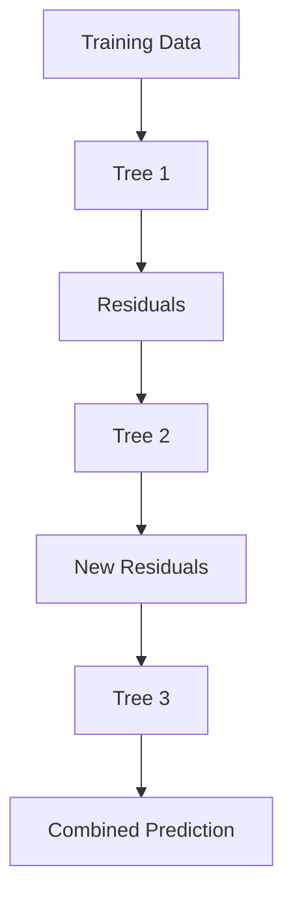

# Gradient Boosting

Gradient Boosting is one of the most powerful machine learning algorithms for tabular data.

It extends the idea of AdaBoost by allowing:

- Any differentiable loss function
- Regression and classification
- Flexible optimization using gradient descent

Instead of asking:

> "Which samples were classified incorrectly?"

Gradient Boosting asks:

> "What error remains in the current model?"

and trains the next tree to predict that error.

---

# Core Idea

Gradient Boosting builds models sequentially.

Each new model learns to correct the mistakes made by the previous ensemble.

```text
Model 1
   ↓
Residual Errors
   ↓
Model 2 learns residuals
   ↓
New Residuals
   ↓
Model 3 learns remaining errors
   ↓
Final Ensemble
```

---

# Why Gradient Boosting?

Suppose we want to predict house prices.

Actual values:

| House | Price |
|---------|---------|
| A | 100 |
| B | 120 |
| C | 150 |

First model predicts:

| House | Prediction |
|---------|------------|
| A | 90 |
| B | 125 |
| C | 140 |

Errors:

```text
10
-5
10
```

Instead of retraining from scratch:

Gradient Boosting trains another tree to predict:

```text
[10, -5, 10]
```

the remaining errors.

---

# Big Picture Workflow



Each tree improves the previous ensemble.

---

# Mathematical Foundation

Gradient Boosting builds an additive model:

```math
F_T(x)
=
F_0(x)
+
\sum_{t=1}^{T}
\eta \gamma_t h_t(x)
```

Where:

- \(F_0(x)\) = initial prediction
- \(h_t(x)\) = tree at iteration \(t\)
- \(\gamma_t\) = optimal step size
- \(\eta\) = learning rate
- \(T\) = number of trees

---

# General Algorithm

```text
1. Initialize model

2. Repeat:
      Compute residuals
      Train tree on residuals
      Scale tree output
      Add tree to ensemble

3. Return final model
```

---

# Step 1: Initialize the Model

The initial prediction minimizes the loss.

```math
F_0(x)
=
\arg\min_c
\sum L(y_i,c)
```

---

## Regression Example

Using Mean Squared Error (MSE):

```math
L=(y-\hat y)^2
```

Best constant prediction:

```math
Mean(y)
```

---

Example:

Targets:

```text
[100,120,140,160]
```

Mean:

```text
130
```

Initial model:

```text
F₀(x)=130
```

for every sample.

---

# Step 2: Compute Residuals

Residual:

```math
r_i
=
y_i
-
F_{t-1}(x_i)
```

For MSE loss:

```math
Pseudo Residual
=
Actual Residual
```

---

Example:

Prediction:

```text
130
130
130
130
```

Targets:

```text
100
120
140
160
```

Residuals:

```text
-30
-10
10
30
```

---

# Why Residuals Matter

Residuals tell us:

```text
How wrong we are
```

Positive residual:

```text
Prediction too small
```

Negative residual:

```text
Prediction too large
```

The next tree learns exactly this information.

---

# Step 3: Train a Tree on Residuals

Instead of predicting:

```text
House Price
```

the new tree predicts:

```text
Residual Error
```


Tree learns:

```text
Where current model is wrong
```

---

# Step 4: Compute Step Size

After fitting the tree:

```math
h_t(x)
```

we determine how much of its prediction should be added.

---

Formula:

```math
\gamma_t
=
\arg\min_\gamma
\sum
L
\Big(
y_i,
F_{t-1}(x_i)
+
\gamma h_t(x_i)
\Big)
```

---

Interpretation:

```text
Find best correction amount
```

---

# Step 5: Update Ensemble

Update rule:

```math
F_t(x)
=
F_{t-1}(x)
+
\eta \gamma_t h_t(x)
```

where:

```math
\eta
=
learning\ rate
```

---

# Learning Rate (Shrinkage)

One of the most important parameters.

Controls:

```text
How much each tree contributes
```

---

Update:

```math
New Model
=
Old Model
+
η × Tree
```

---

Example:

Tree predicts:

```text
20
```

Learning rate:

```text
0.1
```

Contribution:

```text
20 × 0.1 = 2
```

Only a small correction is added.

---

# Why Small Learning Rates Work Better

Large learning rate:

```text
Big jumps
Higher overfitting
```

Small learning rate:

```text
Small steps
Better generalization
```

Typical values:

| Learning Rate | Description |
|--------------|-------------|
| 0.3 | Fast learning |
| 0.1 | Standard |
| 0.05 | Conservative |
| 0.01 | Very safe |

---

# Residual Learning Example

Suppose:

Actual:

```text
100
120
140
160
```

---

Initial Prediction:

```text
130
130
130
130
```

Residuals:

```text
-30
-10
10
30
```

---

Tree 1 learns:

```text
-20
-5
5
20
```

Learning rate:

```text
0.1
```

Correction:

```text
-2
-0.5
0.5
2
```

New predictions:

```text
128
129.5
130.5
132
```

Closer to the targets.

---

# Gradient View

Gradient Boosting gets its name because it uses:

```text
Gradient Descent
```

in function space.

---

Normal Gradient Descent:

```math
\theta
=
\theta
-
\eta
\nabla L
```

Move parameters in the negative gradient direction.

---

Gradient Boosting:

```math
F_t
=
F_{t-1}
+
\eta h_t
```

where:

```text
h_t ≈ negative gradient
```

Instead of updating parameters, it updates the model itself.

---

# Pseudo Residuals

General form:

```math
r_i
=
-
\frac{
\partial L
}
{
\partial F(x_i)
}
```

---

These are called:

```text
Pseudo Residuals
```

because they are not always simple errors.

---

# Loss Functions

## Regression

### Mean Squared Error

```math
(y-\hat y)^2
```

Residual:

```math
y-\hat y
```

---

### Mean Absolute Error

```math
|y-\hat y|
```

More robust to outliers.

---

## Classification

### Logistic Loss

Used in binary classification.

```math
L(y,F)
=
\log(1+e^{-yF})
```

Produces probabilities.

---

# Tree Structure in Gradient Boosting

Unlike Random Forest:

```text
Deep trees
```

Gradient Boosting usually uses:

```text
Shallow trees
```

Typical depth:

```text
3–8
```

These are called:

```text
Weak Learners
```

---

# Hyperparameters

## Number of Trees

```python
n_estimators
```

More trees:

```text
Lower bias
Higher training time
```

---

## Learning Rate

```python
learning_rate
```

Most important parameter.

---

## Maximum Depth

```python
max_depth
```

Controls tree complexity.

---

## Subsample

```python
subsample
```

Fraction of rows used per tree.

Example:

```python
subsample=0.8
```

uses 80% of data.

Helps reduce overfitting.

---

# Stochastic Gradient Boosting

Instead of using all samples:

```text
Randomly sample rows
```

for each tree.

Benefits:

- Faster
- Lower variance
- Better generalization

---

# Bias-Variance Perspective

| Model | Bias | Variance |
|---------|--------|---------|
| Single Tree | Low | High |
| Random Forest | Low | Lower |
| Gradient Boosting | Very Low | Medium |

Gradient Boosting mainly reduces:

```text
Bias
```

through iterative corrections.

---

# Gradient Boosting vs AdaBoost

| Feature | AdaBoost | Gradient Boosting |
|-----------|-----------|------------------|
| Learns By | Reweighting Samples | Fitting Residuals |
| Loss Function | Exponential Loss | Any Differentiable Loss |
| Flexibility | Lower | Higher |
| Accuracy | Good | Better |
| Popularity | Less | More |

---

# Gradient Boosting vs Random Forest

| Feature | Random Forest | Gradient Boosting |
|-----------|---------------|------------------|
| Ensemble Type | Bagging | Boosting |
| Training | Parallel | Sequential |
| Goal | Reduce Variance | Reduce Bias |
| Trees | Deep | Shallow |
| Speed | Faster | Slower |
| Accuracy | Good | Often Better |

---

# Popular Implementations

### 1. GradientBoostingClassifier

From Scikit-Learn.

```python
from sklearn.ensemble import GradientBoostingClassifier
```

---

### 2. XGBoost

:contentReference[oaicite:0]{index=0}

Adds:

- Regularization
- Parallel optimization
- Missing-value handling

---

### 3. LightGBM

Developed by :contentReference[oaicite:1]{index=1}

Known for:

- Speed
- Low memory usage
- Large datasets

---

### 4. CatBoost

Developed by :contentReference[oaicite:2]{index=2}

Best known for:

- Handling categorical features
- Strong default performance

---

# Advantages

 Very high predictive accuracy

 Flexible loss functions

 Works for classification and regression

 Captures complex nonlinear patterns

 State-of-the-art for tabular data

---

# Disadvantages

 Sequential training

 Slower than Random Forest

 Sensitive to hyperparameters

 Can overfit if trees are too deep

 Requires tuning

---


### Why is it called Gradient Boosting?

Because each new tree approximates the **negative gradient** of the loss function.

### What are pseudo-residuals?

The negative gradient of the loss with respect to current predictions.

### Why use a learning rate?

To control how much each tree influences the ensemble and prevent overfitting.

### Why are shallow trees used?

Deep trees can memorize data and overfit; shallow trees act as weak learners.

### What is the most important hyperparameter?

Usually:

```text
learning_rate
```

and its interaction with:

```text
n_estimators
```

---

# Summary

```text
Initialize model
        ↓
Compute residuals
        ↓
Fit tree to residuals
        ↓
Scale by learning rate
        ↓
Add tree to ensemble
        ↓
Repeat
```

### Key Formula

Pseudo Residual:

```math
r_i
=
-
\frac{\partial L}
{\partial F(x_i)}
```

Model Update:

```math
F_t(x)
=
F_{t-1}(x)
+
\eta \gamma_t h_t(x)
```

Final Model:

```math
F_T(x)
=
F_0(x)
+
\sum_{t=1}^{T}
\eta\gamma_t h_t(x)
```

**Key Idea:**  
Gradient Boosting = Gradient Descent + Residual Learning + Sequential Trees → Powerful Predictive Model