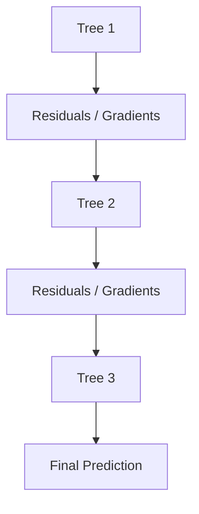

# XGBoost (eXtreme Gradient Boosting) 

A complete, structured walkthrough of XGBoost: from what problem it solves, to the exact math behind its split-finding, to the systems engineering that makes it fast, to practical tuning.

---


## 1. What is XGBoost?

**XGBoost** stands for **eXtreme Gradient Boosting**. Created by **Tianqi Chen** (originally as a research project, first described publicly in a 2016 paper co-authored with Carlos Guestrin), it is an optimized, production-grade implementation of Gradient Boosting that adds:

- Explicit regularization (built into the objective, not bolted on afterward)
- Second-order (Newton-style) optimization instead of first-order gradients alone
- Smarter, approximate split-finding for speed at scale
- Native missing-value handling
- Parallelized computation and cache-aware data structures
- Memory and I/O optimizations for out-of-core / distributed training

> Think of XGBoost as **Gradient Boosting engineered for both accuracy and speed** — not a different algorithm so much as a rigorously optimized implementation of the same core idea.

---

## 2. Where XGBoost Fits in the Ensemble Family Tree

```text
Decision Tree
      ↓
Bagging  →  Random Forest
      ↓
Gradient Boosting
      ↓
XGBoost  (regularized, 2nd-order, engineered for scale)
      ↓
LightGBM / CatBoost  (further specialized variants)
```

XGBoost is a **boosting** method (sequential, bias-focused), not a bagging method — it shares Gradient Boosting's residual-fitting core but changes both the math (objective, split criterion) and the systems (memory layout, parallelism) underneath it.

---

## 3. Why XGBoost Became the Default for Tabular Data

Before XGBoost, plain Gradient Boosting was known to be accurate but slow, and prone to overfitting without careful manual tuning. XGBoost's combination of **higher accuracy and faster training** made it the practical default for:

- Kaggle and other ML competitions
- Credit scoring and loan approval
- Fraud detection
- Customer churn prediction
- Medical outcome prediction
- Recommendation and ranking systems

Its popularity is largely a story of removing friction: it needed less manual regularization work, handled messy real-world data (missing values, sparse features) natively, and trained fast enough to iterate quickly.

---

## 4. High-Level Workflow

Like standard Gradient Boosting, each new tree learns to correct the errors of the current ensemble:



The difference from vanilla Gradient Boosting isn't the high-level loop — it's *everything happening inside each step*: a more informative optimization signal (Section 7), an explicit complexity penalty (Section 5), smarter split search (Section 8), and systems-level engineering (Section 12).

---

## 5. The Objective Function

Standard Gradient Boosting minimizes a **loss** term alone. XGBoost minimizes **loss plus regularization**:

$$\text{Obj} = \sum_i L(y_i, \hat{y}_i) + \sum_k \Omega(f_k)$$

where the per-tree complexity penalty is:

$$\Omega(f) = \gamma T + \frac{\lambda}{2}\sum_j w_j^2 + \alpha\sum_j |w_j|$$

**Components:**

- **Loss term** $L(y_i,\hat y_i)$ — measures prediction error (e.g., MSE for regression, log loss / cross-entropy for classification).
- **Regularization term** $\Omega(f)$ — penalizes tree complexity, where:
  - $T$ = number of leaves in the tree, penalized by $\gamma$ (discourages needlessly large trees)
  - $w_j$ = the prediction value (weight) stored at leaf $j$
  - $\lambda$ = L2 penalty coefficient on leaf weights
  - $\alpha$ = L1 penalty coefficient on leaf weights

### Why regularization matters

Without it, a tree can produce extreme, overconfident leaf values — e.g., predictions of +500, −400, +600 — that fit training data perfectly but generalize poorly. By penalizing large leaf weights directly in the objective, XGBoost keeps predictions more conservative and stable, which typically improves generalization at a small cost to training-set fit.

---

## 6. L1 vs L2 Regularization

### L1 Regularization (Lasso) — controlled by `alpha`

$$\alpha \sum_j |w_j|$$

**Effect:** pushes some leaf weights all the way to zero, acting like a built-in feature/complexity selection mechanism — some splits effectively stop mattering.

### L2 Regularization (Ridge) — controlled by `lambda`

$$\frac{\lambda}{2}\sum_j w_j^2$$

**Effect:** shrinks all large leaf weights proportionally (rather than zeroing them out), which smooths predictions and reduces variance without eliminating any particular split's contribution outright.

In practice, `lambda` (L2) is XGBoost's default and most commonly tuned regularizer; `alpha` (L1) is added when a sparser, more selective model is desired.

---

## 7. Second-Order Optimization: Gradients and Hessians

Traditional Gradient Boosting uses only the **first derivative** of the loss with respect to the current prediction:

$$g_i = \frac{\partial L}{\partial \hat{y}_i}$$

XGBoost additionally uses the **second derivative** (the Hessian):

$$h_i = \frac{\partial^2 L}{\partial \hat{y}_i^2}$$

**Intuition:** if the gradient tells you *which direction* reduces loss, the Hessian tells you *how sharply the loss curves* in that direction — i.e., how confident you should be in a large step versus a small one. Using both (a second-order/Newton-style approximation of the loss) lets XGBoost make more informed decisions about split quality and optimal leaf values than a first-order method can, which is a major source of its accuracy edge over plain Gradient Boosting.

This isn't just intuition — XGBoost derives its exact split-gain formula (Section 8) from a second-order Taylor expansion of the loss function around the current prediction, which is what allows it to support *any* twice-differentiable loss function generically, not just squared error.

---

## 8. The Split Gain Formula, Derived and Explained

For a candidate split dividing a node's samples into a left set $L$ and right set $R$, XGBoost scores the split as:

$$\text{Gain} = \frac{1}{2}\left[\frac{G_L^2}{H_L+\lambda} + \frac{G_R^2}{H_R+\lambda} - \frac{G^2}{H+\lambda}\right] - \gamma$$

Where:
- $G_L, G_R$ = sum of gradients in the left/right child ($G = G_L + G_R$)
- $H_L, H_R$ = sum of Hessians in the left/right child ($H = H_L + H_R$)
- $\lambda$ = L2 regularization term
- $\gamma$ = minimum-gain threshold / split penalty

**Reading the formula:** the first two fractional terms represent how much the loss improves by having two separate leaves (left and right) instead of one combined leaf (the third term). $\lambda$ in each denominator dampens the score for leaves with few/low-confidence samples (small $H$), which is the regularization acting directly inside the split decision — not just on the final leaf weights. $\gamma$ then acts as a flat threshold: **a split is only made if it improves the objective by more than $\gamma$**, which directly controls tree size.

Higher Gain = better split. This formula is what XGBoost evaluates (efficiently, via the histogram/quantile-sketch techniques below) at every candidate split point for every feature.

---

## 9. Pruning Strategy

Classic decision tree algorithms often **grow first, then prune**: build a large tree, then cut back branches that don't help on held-out data (post-pruning).

XGBoost instead does **pre-pruning**: it grows the tree but stops extending any branch whose split Gain falls below $\gamma$, checked as splits are considered (this is exactly the $-\gamma$ term in the Gain formula above).

**Benefit:** avoids wasting computation growing branches that will just be cut later, while still directly controlling overfitting through a single tunable threshold.

---

## 10. Missing Value Handling & Sparsity-Aware Learning

Most ML algorithms require missing values to be imputed (filled in) before training. XGBoost handles `NaN` values **automatically** during training.

**How it works:** at each split, XGBoost tries sending all missing-value samples to the left branch, then tries sending them all to the right branch, and keeps whichever direction produces the higher Gain. This "default direction" is learned per-split and stored with the tree, so at prediction time, any sample with a missing value at that feature is automatically routed the learned way.

### Sparsity-Aware Learning

The same mechanism generalizes to any **sparse data** — missing values, one-hot encoded zeros, or naturally sparse features (as in recommender systems or bag-of-words text features). XGBoost's split-finding algorithm is designed to skip zero/missing entries efficiently rather than iterating over them, which reduces both memory use and training time on sparse datasets — sometimes dramatically, since real-world tabular and sparse-feature datasets are rarely fully dense.

---

## 11. Row and Column Subsampling

Borrowing ideas from Bagging and Random Forest, XGBoost supports:

### Column (feature) subsampling — `colsample_bytree`
Instead of considering all features at every tree (or every split, depending on the variant used), only a random subset is considered. E.g., with 100 features and `colsample_bytree=0.3`, each tree only sees ~30 randomly chosen features.

**Benefits:** less overfitting, more diversity between trees, faster training (fewer candidate splits to evaluate).

### Row (sample) subsampling — `subsample`
Each tree is trained on a random fraction of the training rows (e.g., `subsample=0.8` uses 80% of rows per tree), similar in spirit to stochastic gradient descent's minibatching.

**Benefits:** reduced variance, better generalization, and a speed bonus from processing fewer rows per tree.

---

## 12. Systems Engineering: Why XGBoost Is Fast

Several implementation-level techniques, beyond the math, are responsible for XGBoost's practical speed:

### Weighted Quantile Sketch
Finding the best split point among, say, hundreds of possible numeric thresholds for a feature is expensive if done exactly at scale. XGBoost uses a **weighted quantile sketch** algorithm to efficiently propose a small set of candidate split points that approximate the full distribution (weighted by each sample's Hessian, tying this optimization back to the second-order framework), dramatically cutting the search space without meaningfully hurting split quality.

### Cache-Aware Block Structure
CPU throughput is heavily influenced by memory access patterns. XGBoost stores training data in a **column-block** layout designed to align with CPU cache lines, minimizing cache misses during split search — a low-level optimization with an outsized effect on wall-clock training time.

### Parallel Processing
While the boosting *rounds* remain sequential (each tree depends on the previous ensemble's residuals), XGBoost parallelizes the **within-round** work — split search, feature processing, and histogram construction — across CPU cores:

```python
n_jobs = -1  # use all available CPU cores
```

### Out-of-Core and Distributed Support
For datasets too large to fit in memory, XGBoost supports out-of-core computation (streaming data from disk) and distributed training across clusters (e.g., via Spark or Dask integrations), extending its reach well beyond single-machine use cases.

---

## 13. Hyperparameters

| Hyperparameter | Typical Range | Effect |
|---|---|---|
| `n_estimators` | 100 – 1000 | Number of boosting rounds (trees). More trees = more capacity, more overfitting risk without other controls. |
| `learning_rate` (`eta`) | 0.01 – 0.3 | Shrinks each tree's contribution. Smaller = slower but usually better generalization. |
| `max_depth` | 3 – 10 | Maximum depth per tree. Deeper = more complex, more overfitting risk. |
| `subsample` | 0.5 – 1.0 | Fraction of rows sampled per tree. |
| `colsample_bytree` | 0.5 – 1.0 | Fraction of features sampled per tree. |
| `lambda` (L2) | ≥ 0 | Shrinks leaf weights, reduces variance. |
| `alpha` (L1) | ≥ 0 | Sparsifies leaf weights toward zero. |
| `gamma` | ≥ 0 | Minimum Gain required to make a split — direct control over tree size / pre-pruning. |

### The Core Tradeoff: Learning Rate vs Number of Trees

**Large learning rate:** fewer trees needed, faster training, but higher overfitting risk.
**Small learning rate:** more trees needed, slower training, but typically better generalization.

A common, reliable combination:

```python
learning_rate = 0.05
n_estimators = 500
```

(paired with early stopping on a validation set to avoid manually guessing the right `n_estimators`).

---

## 14. Feature Importance

XGBoost reports three different importance metrics, and they can disagree with each other — it's worth knowing what each one actually measures:

- **Gain** — the average improvement in the objective function contributed by splits on this feature. Generally considered the most informative metric for understanding predictive value.
- **Weight** — the number of times a feature is used to split across all trees. High weight doesn't necessarily mean high impact (a feature could split often but contribute little Gain each time).
- **Cover** — the average number of samples affected by splits on this feature, relative to the total.

For more nuanced, per-prediction explanations (rather than global importance), practitioners commonly pair XGBoost with **SHAP values**, which attribute each individual prediction to its contributing features in a theoretically grounded way.

---

## 15. Python Implementation

```python
from xgboost import XGBClassifier
from sklearn.datasets import make_classification
from sklearn.model_selection import train_test_split

X, y = make_classification(n_samples=2000, n_features=30, random_state=42)
X_train, X_test, y_train, y_test = train_test_split(X, y, test_size=0.2, random_state=42)

model = XGBClassifier(
    n_estimators=500,
    learning_rate=0.05,
    max_depth=6,
    subsample=0.8,
    colsample_bytree=0.8,
    reg_lambda=1.0,          # L2 regularization
    reg_alpha=0.0,           # L1 regularization
    gamma=0.0,               # minimum split gain
    early_stopping_rounds=30,
    eval_metric="logloss",
    n_jobs=-1,
    random_state=42
)

model.fit(
    X_train, y_train,
    eval_set=[(X_test, y_test)],
    verbose=False
)

print("Test Accuracy:", model.score(X_test, y_test))
print("Best iteration:", model.best_iteration)

# Feature importance
importances = model.get_booster().get_score(importance_type="gain")
print("Top features by gain:", sorted(importances.items(), key=lambda x: -x[1])[:5])
```

---

## 16. XGBoost vs Random Forest

| Feature | Random Forest | XGBoost |
|---|---|---|
| Ensemble type | Bagging | Boosting |
| Training | Parallel | Sequential (rounds), parallel within each round |
| Primary goal | Reduce variance | Reduce bias |
| Accuracy (typical) | High | Usually higher, when properly tuned |
| Training speed | Faster, less tuning-sensitive | Slower, more tuning-sensitive |
| Tuning importance | Lower — reasonable defaults often work | Higher — learning rate, depth, and regularization interact meaningfully |

---

## 17. XGBoost vs Neural Networks on Tabular Data

| Dataset Type | Typical Best Starting Point |
|---|---|
| Images | CNNs / vision transformers |
| Text | Transformer-based language models |
| Audio | Deep learning (CNNs/transformers) |
| Tabular data | XGBoost / LightGBM / CatBoost |

### Why tree ensembles often win on tabular data

Real-world tabular features (age, income, credit score, etc.) commonly involve:
- Mixed scales across columns
- Missing values
- Non-linear, non-smooth relationships and feature interactions

Tree-based ensembles handle these characteristics natively — no scaling required, missing values handled automatically, and splits naturally capture non-linearities. Neural networks, by contrast, typically need larger datasets, more careful preprocessing, and more tuning/compute to match tree ensembles on tabular benchmarks, though this gap has narrowed somewhat with specialized tabular deep-learning architectures.

---

## 18. XGBoost vs LightGBM vs CatBoost

| Feature | XGBoost | LightGBM | CatBoost |
|---|---|---|---|
| Speed | Fast | Fastest (leaf-wise growth) | Fast |
| Accuracy | Excellent | Excellent | Excellent |
| Memory usage | Medium | Low | Medium |
| Categorical features | Requires encoding | Requires encoding (some native support) | Native support (ordered target statistics) |
| Overfitting control | Strong (explicit regularization) | Moderate (needs careful `num_leaves` tuning due to leaf-wise growth) | Strong (ordered boosting) |
| Ease of use | Moderate | Moderate | Easy — strong defaults |

There's no universal winner — LightGBM tends to be fastest on very large datasets, CatBoost shines with heavy categorical data and minimal tuning, and XGBoost remains a extremely reliable, well-documented, battle-tested default.

---

## 19. Real-World Applications

**Finance:** credit risk modeling, loan approval, fraud detection.
**Healthcare:** disease risk prediction, patient risk scoring.
**Marketing:** customer churn prediction, purchase propensity modeling.
**Industry:** demand forecasting, equipment failure prediction.

XGBoost's combination of accuracy, native handling of messy real-world data, and interpretability tools (feature importance, SHAP) make it a common choice wherever the underlying data is structured/tabular rather than image, text, or audio.

---

## 20. Common Pitfalls

- **Not using early stopping** — without it, it's easy to pick an `n_estimators` that overfits; always validate on a held-out set and let early stopping choose the round count.
- **Tuning learning rate and n_estimators independently** — they're coupled; changing one without adjusting the other invalidates prior tuning results.
- **Ignoring `gamma` and `lambda`** — many practitioners tune only `max_depth`/`n_estimators`/`learning_rate` and leave regularization at defaults, missing meaningful overfitting-control gains.
- **Using Gain-based importance as causal explanation** — feature importance reflects predictive/splitting usefulness within this model, not a causal claim about the real world.
- **Applying default settings to heavily categorical data without encoding** — unlike CatBoost, XGBoost needs categorical features encoded (one-hot, target encoding, or its newer native categorical support) before training.
- **Assuming XGBoost always beats Random Forest** — on small, noisy, or low-sample datasets, Random Forest's variance-reduction focus and lower tuning sensitivity can outperform an under-tuned XGBoost model.

---

## 21. Quick Q&A

**Q: Why is XGBoost typically more accurate than plain Gradient Boosting?**
A: The combination of explicit regularization, second-order (gradient + Hessian) optimization for more informed splits, and more sophisticated split-finding — together these usually yield better generalization than first-order gradient boosting alone.

**Q: What are gradients and Hessians, intuitively?**
A: The gradient (first derivative) indicates the direction that reduces loss; the Hessian (second derivative) indicates the curvature of the loss surface — how confidently large a step to take. XGBoost uses both to compute more precise split quality (Gain) and optimal leaf values.

**Q: How does XGBoost handle missing values?**
A: It learns, per split, whether routing missing values left or right produces higher Gain, and stores that as the default direction — no manual imputation required.

**Q: What is "Gain" in XGBoost?**
A: The improvement in the regularized objective function achieved by a candidate split, computed from the gradient/Hessian sums of the resulting child nodes minus the parent, minus the `gamma` split penalty.

**Q: Why is XGBoost so popular in competitions like Kaggle?**
A: It reliably combines strong out-of-the-box accuracy, fast training, principled regularization, and scalability — a combination that's hard to beat without significant custom engineering.

**Q: How does XGBoost differ architecturally from LightGBM?**
A: XGBoost traditionally grows trees level-wise (though it also supports a histogram-based method similar to LightGBM); LightGBM grows trees leaf-wise by default, which is generally faster and can reach lower loss for the same leaf budget, at some added overfitting risk on small data.

---

## Summary

```text
Gradient Boosting
        ↓
Add Regularization (L1/L2 + leaf-count penalty)
        ↓
Use Gradients + Hessians (2nd-order optimization)
        ↓
Handle Missing Values Automatically
        ↓
Row/Column Sampling
        ↓
Efficient, Approximate Split Finding
        ↓
Cache-Aware, Parallelized Engineering
        ↓
XGBoost
```

### Core Objective

$$\text{Objective} = \text{Loss} + \text{Regularization}$$

### Key Innovations

- L1/L2 regularization built into the objective
- Second-order (Newton-style) optimization
- Automatic missing-value handling
- Column and row subsampling
- Weighted quantile sketch for fast split-finding
- Cache-aware block structure
- Parallelized split search

## Rule of Thumb

```text
Images  → Deep Learning (CNNs/vision transformers)
Text    → Transformers
Audio   → Deep Learning
Tables  → XGBoost / LightGBM / CatBoost
```

**Key idea:** XGBoost = Gradient Boosting + Regularization + Second-Order Optimization + Engineering Excellence → state-of-the-art tabular learning.