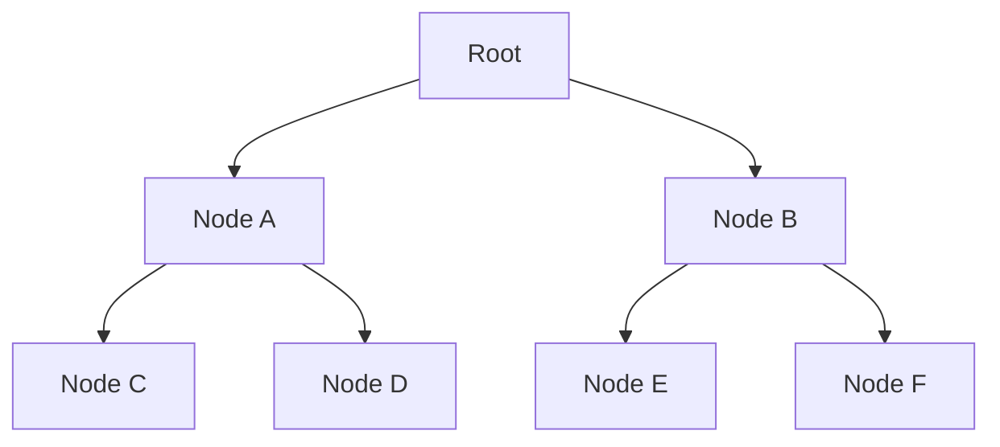
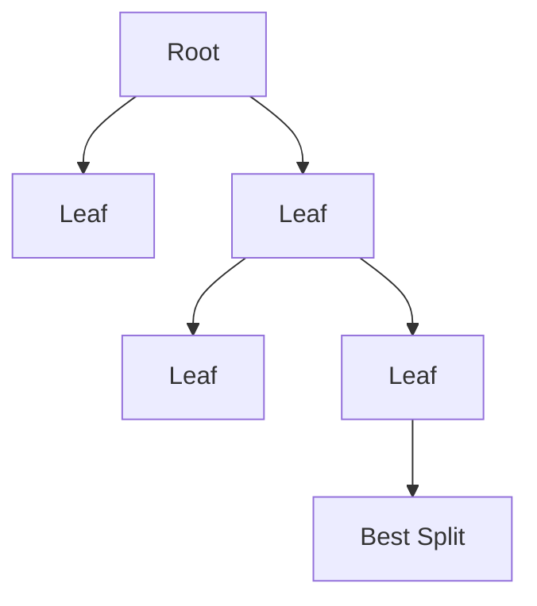

# LightGBM (Light Gradient Boosting Machine)

A complete, structured walkthrough of LightGBM: from the problem it was built to solve, to how histogram binning, leaf-wise growth, GOSS, and EFB actually work under the hood, to practical tuning.


---

## 1. What is LightGBM?

**LightGBM (Light Gradient Boosting Machine)** is a Gradient Boosting Decision Tree (GBDT) framework developed by **Microsoft**, released in 2017. It was designed to solve one specific, practical problem:

> Traditional Gradient Boosting and even XGBoost slow down significantly when datasets reach millions of rows and thousands of features.

LightGBM's headline improvements over that baseline:

- Faster training
- Lower memory usage
- Comparable or better accuracy
- Strong scalability to very large datasets

It achieves this through two structural changes — **histogram-based split finding** and **leaf-wise tree growth** — plus two novel sampling/compression techniques, **GOSS** and **EFB**, covered in depth below.

---

## 2. Where LightGBM Fits in the Ensemble Family Tree

```text
Decision Tree
      ↓
Gradient Boosting
      ↓
XGBoost  (regularization + 2nd-order optimization)
      ↓
LightGBM  (histogram binning + leaf-wise growth + GOSS + EFB)
```

Think of LightGBM as: **a faster, more memory-efficient variant of Gradient Boosting, purpose-built for large-scale tabular data** — it keeps the same sequential residual-fitting core as XGBoost but changes *how* trees are built, *how* splits are searched, and *how* memory is used.

---

## 3. Core Idea

Like XGBoost and Gradient Boosting generally, LightGBM builds an additive sequence of trees, each correcting the ensemble's current errors:

```text
Tree 1 learns the target
Tree 2 learns Tree 1's residuals
Tree 3 learns the remaining residuals
...
```

Final model, with learning rate $\eta$ shrinking each tree's contribution:

$$F(x) = \sum_{t=1}^{T} \eta \, h_t(x)$$

What differs from XGBoost is **not** this high-level structure — it's the internals: how trees are grown (Section 4), how split candidates are found (Section 5), and how training data is sampled and compressed (Sections 6–7).

---

## 4. Level-Wise vs Leaf-Wise Tree Growth

### Level-Wise Growth (traditional, used by XGBoost's default method)

Every node at the current depth is expanded together, level by level:



**Advantages:** produces more balanced trees; generally lower overfitting risk per tree.
**Disadvantages:** slower (splits nodes even when the gain is small) and uses more memory; can also waste capacity expanding low-value nodes just because they're at the "current level."

### Leaf-Wise Growth (LightGBM's default)

Instead of expanding every node at a level, LightGBM finds the **single leaf across the entire tree** that yields the largest reduction in loss, and splits only that leaf:



**Why this is often better:** suppose Node A's best possible split has Gain = 2, while Node B's has Gain = 20. Level-wise growth splits *both* regardless of how unequal the payoff is. Leaf-wise growth splits only B — the higher-value split — resulting in a larger loss reduction per split made, generally reaching lower training loss faster (with fewer total leaves) than level-wise growth would.

**The tradeoff:** leaf-wise growth can produce deep, unbalanced trees that overfit small datasets if left unconstrained — which is exactly why `num_leaves` (Section 12) becomes LightGBM's most important regularization knob.

**Selection rule:** at each growth step, LightGBM computes the Gain for every current leaf's best possible split, and always splits whichever leaf has the highest Gain — greedily, one leaf at a time, until a stopping condition (`num_leaves`, `max_depth`, or minimum gain) is reached.

---

## 5. Histogram-Based Learning

This is one of LightGBM's core speed innovations, and it directly targets the cost of finding good split points.

### The traditional (exact) approach

For a continuous feature like `Age` with many distinct values (20, 21, 22, ..., 80), the exact split-search method evaluates a candidate threshold between every pair of adjacent sorted values (20.5, 21.5, 22.5, ..., 79.5) — potentially thousands of evaluations per feature, per split, which becomes very expensive at scale.

### The histogram approach

LightGBM first **discretizes continuous feature values into a fixed number of bins** (typically 255 by default), for example:

```text
Age:
20–30 → Bin 1
31–40 → Bin 2
41–50 → Bin 3
51–60 → Bin 4
```

Split search then only needs to evaluate boundaries **between bins**, not between every individual raw value — so instead of thousands of candidate thresholds, there might be only a few hundred (bounded by the number of bins, regardless of how many unique raw values the feature has).

**Benefits:**
- Much faster split search (bounded by bin count, not by unique value count)
- Substantially lower memory usage (bin indices are typically stored as small integers rather than full-precision floats)
- Only a small, usually negligible accuracy cost from the discretization approximation

This same histogram trick also enables a useful computational shortcut: the histogram of a *sibling* node can be computed by subtracting its sibling's histogram from the parent's, roughly halving the histogram-construction work at each level.

---

## 6. GOSS: Gradient-Based One-Side Sampling

A LightGBM-specific optimization for reducing how much data needs to be processed per tree, without simply doing naive random sampling.

### The problem

On very large datasets (e.g., 10 million rows), even histogram-based training over every row for every tree is costly.

### The key observation

Not all training samples carry equal information for the next tree:
- Samples with **large gradients** are those the current ensemble is predicting **badly** — they still carry a lot of signal about how to improve.
- Samples with **small gradients** are already well-predicted by the current ensemble — they contribute comparatively little new information.

### The GOSS strategy

- **Keep all** samples with large gradients.
- **Randomly sample** a fraction of the samples with small gradients (rather than discarding or keeping them all).
- To avoid biasing the resulting gradient statistics, the sampled small-gradient examples are reweighted (scaled up) to compensate for the ones that were dropped.

**Result:** LightGBM trains on meaningfully less data per round while preserving the statistical information that matters most for building accurate splits — a targeted, information-aware alternative to plain random subsampling.

---

## 7. EFB: Exclusive Feature Bundling

A second LightGBM-specific optimization, this one targeting **sparse, high-dimensional feature spaces** (common after one-hot encoding, or in domains like recommender systems and text features).

### The problem

Many real-world feature sets contain numerous sparse columns — features that are mostly zero, and where **different features are rarely (or never) simultaneously non-zero** for the same row (i.e., they're "mutually exclusive" in practice).

### The solution

EFB identifies groups of features that are mostly mutually exclusive (rarely non-zero at the same time) and **bundles them into a single combined feature column**, since a non-zero value in the bundled column can still unambiguously indicate which original feature it came from (via offset encoding).

**Benefits:**
- Meaningfully lower memory usage
- Faster training, since fewer columns means fewer histograms to build and search over
- Little to no accuracy loss, since genuinely exclusive features lose no information by being bundled

This technique is what makes LightGBM particularly efficient on datasets with heavy one-hot encoding or naturally sparse features.

---

## 8. Missing Value Handling

Like XGBoost, LightGBM supports `NaN` values **natively**, with no manual imputation required. During training, for each split, LightGBM learns whether routing missing values to the left or right child minimizes loss, and stores that decision for use at prediction time.

---

## 9. Native Categorical Feature Support

Unlike XGBoost (which traditionally requires categorical features to be manually encoded — one-hot, label, or target encoding — before training), LightGBM can handle categorical features like `Country`, `Gender`, or `Department` more directly, without heavy preprocessing.

Internally, LightGBM uses a specialized algorithm for finding optimal splits on categorical variables (grouping categories into two subsets based on a technique related to gradient statistics) rather than treating each category as a separate binary feature, which tends to be both more memory-efficient and more effective than naive one-hot encoding for features with many categories.

---

## 10. The Objective Function

Like XGBoost, LightGBM's objective combines a loss term with regularization:

$$\text{Objective} = \text{Loss} + \text{Regularization}$$

Common loss functions by task:
- **Regression:** Mean Squared Error (MSE), or alternatives like MAE/Huber for robustness to outliers.
- **Binary classification:** Binary cross-entropy (log loss).
- **Multiclass classification:** Multiclass (softmax) cross-entropy.

Regularization is applied similarly to XGBoost — L1/L2 penalties on leaf weights, plus structural controls like `num_leaves` and `min_data_in_leaf` that limit how complex any individual tree can become.

---

## 11. Hyperparameters

| Hyperparameter | Typical Range | Effect |
|---|---|---|
| `n_estimators` | 100 – 5000 | Number of boosting rounds (trees). |
| `learning_rate` | 0.01 – 0.1 | Shrinks each tree's contribution; smaller values usually need more trees. |
| `num_leaves` | ~31 (default) | **The most important LightGBM parameter** — directly controls tree complexity (see Section 12). |
| `max_depth` | often left unconstrained (`-1`) | Secondary complexity control; can cap depth independently of `num_leaves` if needed. |
| `min_data_in_leaf` | dataset-dependent | Minimum samples required in a leaf; prevents tiny, overfit-prone leaves. |
| `feature_fraction` | 0.5 – 1.0 | Feature (column) subsampling per tree, analogous to XGBoost's `colsample_bytree`. |
| `bagging_fraction` | 0.5 – 1.0 | Row subsampling per tree, analogous to XGBoost's `subsample`. |

---

## 12. Why `num_leaves` Is the Parameter to Watch

Because LightGBM grows trees **leaf-wise** rather than level-wise, tree complexity is governed more directly by the **number of leaves** than by depth alone — a leaf-wise tree with a fixed depth limit can still have far more (or far fewer) leaves than an equivalent level-wise tree, since leaf-wise growth doesn't fill out every branch uniformly.

```python
num_leaves = 31  # LightGBM's default
```

- **More leaves** → higher potential accuracy (more expressive tree), but higher overfitting risk.
- **Fewer leaves** → more conservative, less prone to overfitting, but potentially underfitting.

A useful rule of thumb when converting intuition from depth-based tuning: `num_leaves` should generally be **less than** $2^{\text{max\_depth}}$ for a roughly comparable level of complexity to a depth-limited level-wise tree — setting it equal to or greater invites significantly higher overfitting risk given leaf-wise growth's tendency to chase the highest-gain leaf regardless of resulting tree shape.

### Complexity Comparison

| Algorithm | Growth Strategy |
|---|---|
| Classic Decision Tree | Level-wise |
| XGBoost (default) | Level-wise (also offers a histogram/leaf-wise mode) |
| LightGBM | Leaf-wise |

---

## 13. Python Implementation

```python
from lightgbm import LGBMClassifier
from sklearn.datasets import make_classification
from sklearn.model_selection import train_test_split

X, y = make_classification(n_samples=5000, n_features=30, random_state=42)
X_train, X_test, y_train, y_test = train_test_split(X, y, test_size=0.2, random_state=42)

model = LGBMClassifier(
    n_estimators=500,
    learning_rate=0.05,
    num_leaves=31,
    max_depth=-1,             # unconstrained; num_leaves governs complexity instead
    min_data_in_leaf=20,
    feature_fraction=0.8,
    bagging_fraction=0.8,
    bagging_freq=5,
    random_state=42
)

model.fit(
    X_train, y_train,
    eval_set=[(X_test, y_test)],
    callbacks=[]  # add lightgbm.early_stopping(30) here for early stopping
)

print("Test Accuracy:", model.score(X_test, y_test))
print("Feature importances:", model.feature_importances_[:10])
```

---

## 14. XGBoost vs LightGBM

| Feature | XGBoost | LightGBM |
|---|---|---|
| Tree growth | Level-wise (default) | Leaf-wise |
| Speed | Fast | Faster, especially at scale |
| Memory usage | Medium | Lower |
| Large datasets (millions of rows) | Good | Excellent |
| Small datasets | Often more stable | Similar, but more overfitting-prone without tuning `num_leaves` |
| Overfitting risk (default settings) | Lower | Higher (leaf-wise growth needs active constraint) |
| Categorical features | Requires encoding (traditionally) | Better native support |

---

## 15. LightGBM vs Random Forest

| Feature | Random Forest | LightGBM |
|---|---|---|
| Ensemble type | Bagging | Boosting |
| Training | Parallel | Sequential |
| Primary goal | Reduce variance | Reduce bias |
| Training speed | Fast | Fast (with histogram + GOSS + EFB optimizations) |
| Accuracy (typical) | High | Usually higher, when well-tuned |

---

## 16. LightGBM vs XGBoost vs CatBoost

| Feature | LightGBM | XGBoost | CatBoost |
|---|---|---|---|
| Speed | Fastest | Fast | Medium |
| Memory | Lowest | Medium | Medium |
| Accuracy | Excellent | Excellent | Excellent |
| Categorical features | Good native support | Traditionally weak (needs encoding) | Best (ordered target statistics) |
| Large datasets | Best | Good | Good |

---

## 17. Practical Rule of Thumb by Dataset Size

**Small dataset (< 100k rows):** XGBoost is often slightly more stable, since level-wise growth's built-in balance requirement acts as a mild natural regularizer.

**Medium dataset (100k – 1M rows):** Both XGBoost and LightGBM are strong choices; the difference is often marginal and worth benchmarking on your specific data.

**Huge dataset (> 1M rows):** LightGBM is usually meaningfully faster, thanks to histogram binning, GOSS, and EFB compounding at scale.

**Many categorical features:** CatBoost is often the easiest starting point, requiring the least manual preprocessing.

---

## 18. Advantages & Disadvantages

### Advantages
- Extremely fast training, especially on large datasets
- Low memory usage (histogram binning + EFB compression)
- Scales well to millions of rows and high-dimensional sparse data
- High accuracy, competitive with or exceeding XGBoost
- Native missing-value support
- Better native categorical feature handling than XGBoost
- GOSS and EFB provide meaningful speed/memory gains with minimal accuracy cost

### Disadvantages
- Can overfit small datasets if `num_leaves` isn't actively constrained
- More sensitive to hyperparameters than level-wise methods, precisely because leaf-wise growth is more aggressive
- Leaf-wise growth can create deep, unbalanced branches that are harder to reason about
- Less interpretable than a single decision tree (a limitation shared with all boosted ensembles)

---

## 19. Common Pitfalls

- **Leaving `num_leaves` at default on a small dataset** — the default (31) may already be too expressive for a small sample size; pair it with `min_data_in_leaf` and/or reduce it directly.
- **Tuning `max_depth` alone and ignoring `num_leaves`** — because growth is leaf-wise, `max_depth` alone doesn't constrain complexity the way it does for level-wise trees; `num_leaves` needs explicit attention.
- **Skipping early stopping** — as with any boosting method, more rounds isn't automatically safer; validate and stop early.
- **Assuming GOSS/EFB always trigger** — these optimizations depend on data characteristics (gradient distribution, feature sparsity); on small or dense datasets their benefit is smaller.
- **Not adjusting `min_data_in_leaf` for small datasets** — the default can allow leaves with very few samples, encouraging overfitting on limited data.

---

## 20. Quick Q&A

**Q: Why is LightGBM faster than XGBoost?**
A: A combination of histogram-based split finding (bounded candidate thresholds instead of scanning every unique value), leaf-wise tree growth (fewer, higher-value splits), GOSS (training on a smaller but information-preserving sample), and EFB (compressing sparse mutually-exclusive features into fewer columns).

**Q: What is GOSS?**
A: Gradient-based One-Side Sampling. It keeps all large-gradient (poorly-predicted) samples, randomly samples a subset of small-gradient (well-predicted) samples, and reweights the sampled ones to keep gradient statistics unbiased — speeding up training without discarding the most informative data.

**Q: What is EFB?**
A: Exclusive Feature Bundling. It identifies sparse features that are rarely non-zero simultaneously and merges them into a single combined column, reducing memory and computation with minimal information loss.

**Q: What's the most important LightGBM hyperparameter?**
A: `num_leaves`, because leaf-wise growth means tree complexity is governed directly by leaf count rather than depth — it's the primary lever for controlling overfitting.

**Q: Why can LightGBM overfit more easily than level-wise methods?**
A: Leaf-wise growth greedily chases whichever leaf has the highest gain, which can produce deep, unbalanced trees if `num_leaves` (or `min_data_in_leaf`) isn't constrained — level-wise growth's requirement to expand every node at a depth acts as an implicit brake that leaf-wise growth lacks.

**Q: How does LightGBM's categorical feature handling differ from one-hot encoding?**
A: Rather than exploding a category into many binary columns, LightGBM finds optimal groupings of categories directly during split search using gradient-based statistics, which tends to use less memory and produce better splits, especially for high-cardinality categorical features.

---

## Summary

```text
Gradient Boosting
        ↓
Histogram Binning
        ↓
Leaf-Wise Growth
        ↓
GOSS Sampling
        ↓
EFB Compression
        ↓
LightGBM
```

### Key Innovations
- Histogram-based learning
- Leaf-wise tree growth
- GOSS (Gradient-based One-Side Sampling)
- EFB (Exclusive Feature Bundling)
- Native missing-value support
- Native (better) categorical feature support
- Optimized for fast, large-scale training

### Quick Comparison

```text
Random Forest     → Reduce Variance (bagging)
AdaBoost          → Reweight Errors (adaptive boosting)
Gradient Boosting → Learn Residuals (sequential correction)
XGBoost           → Gradient Boosting + Regularization + 2nd-order optimization
LightGBM          → XGBoost-class accuracy + extreme speed via leaf-wise trees, histograms, GOSS, EFB
```

**Key idea:** LightGBM = Gradient Boosting + Histogram Binning + Leaf-Wise Growth + Smart Sampling (GOSS) + Feature Compression (EFB) → the fastest high-performance tree ensemble for large-scale tabular data.