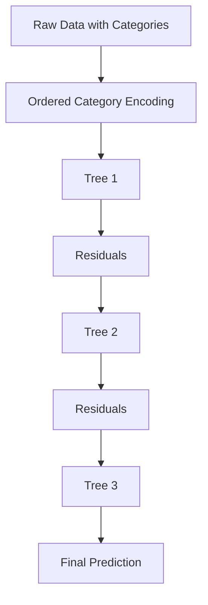
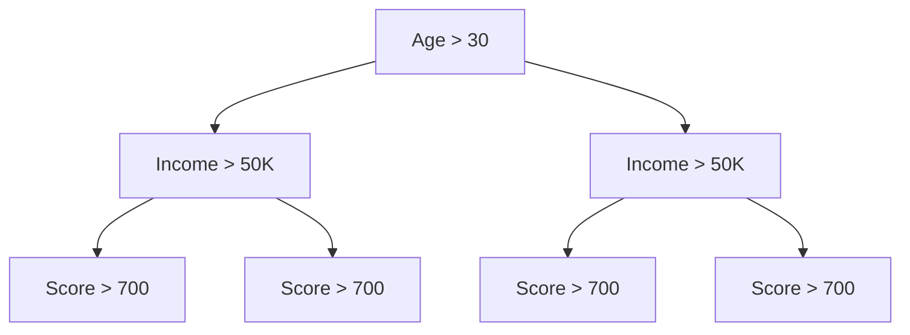

# CatBoost (Categorical Boosting)

A complete, structured walkthrough of CatBoost: why categorical features break naive boosting, how ordered target statistics and ordered boosting actually fix target leakage and prediction shift, how symmetric trees work, and practical tuning.

---

## 1. What is CatBoost?

**CatBoost** (short for **Cat**egorical **Boost**ing) is a gradient boosting framework developed by **Yandex**, first released in 2017. It was built specifically to solve one persistent, practical problem in tabular machine learning:

> Handling categorical features correctly, without extensive manual preprocessing, and without introducing subtle data leakage in the process.

CatBoost frequently achieves state-of-the-art results on tabular datasets rich in categorical variables (country, device type, product category, user ID, etc.) while requiring meaningfully less feature engineering than XGBoost or LightGBM.

---

## 2. Where CatBoost Fits in the Ensemble Family Tree

```text
Decision Tree
      ↓
Gradient Boosting
      ↓
XGBoost    (regularization + 2nd-order optimization)
      ↓
LightGBM   (histogram binning + leaf-wise growth + speed)
      ↓
CatBoost   (ordered target statistics + ordered boosting + symmetric trees)
```

Like XGBoost and LightGBM, CatBoost is a **sequential, residual-learning boosting method** — its distinguishing contributions are all about *how categorical data is encoded* and *how leakage/overfitting are controlled*, not a different high-level boosting loop.

---

## 3. Why CatBoost Was Created: The Categorical Feature Problem

Boosting algorithms fundamentally operate on numbers, but many real-world features are categorical:

| User | Country |
|---|---|
| 1 | Bangladesh |
| 2 | India |
| 3 | USA |

Two traditional encoding strategies each have a real cost:

### Label Encoding
```text
Bangladesh → 1
India → 2
USA → 3
```
**Problem:** this implies a numerical ordering (`USA > India > Bangladesh`) that has no real meaning, which can mislead a tree's split logic into treating the categories as if they lie on a meaningful scale.

### One-Hot Encoding
```text
Bangladesh = [1,0,0]
India      = [0,1,0]
USA        = [0,0,1]
```
**Problem:** scales terribly with **high-cardinality** categorical features — thousands of distinct categories (e.g., user IDs, product SKUs) become thousands of columns, exploding memory usage and often diluting each individual column's statistical signal.

### CatBoost's approach

CatBoost automatically converts categorical features into meaningful numeric representations using **target statistics** — roughly, a number reflecting how that category's rows tend to relate to the target — rather than an arbitrary integer or a huge sparse one-hot block. The tricky part, addressed in Sections 5–6, is doing this *without* leaking target information into the encoding itself.

---

## 4. High-Level Workflow



Structurally this is the same sequential residual-fitting loop as XGBoost and LightGBM — CatBoost's innovations are in the **encoding step** (ordered target statistics) and in **how residuals themselves are computed during training** (ordered boosting), both explained next.

---

## 5. The Core Problem: Target Leakage

Consider:

| User | Country | Purchased |
|---|---|---|
| A | Bangladesh | 1 |
| B | Bangladesh | 1 |
| C | Bangladesh | 0 |

The average target for "Bangladesh" across all three rows is:

$$\frac{1+1+0}{3} = 0.67$$

If this average is computed using the **entire dataset** and then used to encode every row — including row C itself — then row C's encoded feature value was computed *using its own target label*. This is **target leakage**: the model effectively gets to peek at the answer through the encoding, which produces an encoding that looks far more predictive during training than it actually will be on new, unseen data — a direct path to overfitting.

---

## 6. Ordered Target Encoding

CatBoost's fix is to compute target statistics using only **past** information relative to each row, following a randomized ordering of the data — never using a row's own label, and never using rows that come "after" it in the chosen order.

### How it works

1. Rows are assigned a **random permutation** (ordering).
2. For each row, its categorical feature is encoded using target statistics computed **only from rows earlier in that permutation**.
3. Multiple random permutations are typically used across different trees/stages to reduce the variance introduced by any single ordering choice.

### Example

| Row (in permutation order) | Target |
|---|---|
| A | 1 |
| B | 0 |
| C | 1 |

For row **C**, only rows A and B are used to compute the category's statistic — row C's own label is never used to encode row C.

**Benefit:** this closely mirrors how the model will actually be used at inference time (predicting on genuinely unseen data), which meaningfully reduces leakage-driven overfitting and produces encodings that generalize better than a naive full-dataset average.

---

## 7. Ordered Boosting: Fixing Prediction Shift

Ordered target encoding fixes leakage in the *feature encoding*. CatBoost's second major innovation, **ordered boosting**, fixes a related but distinct problem in the *boosting process itself*.

### The problem: prediction shift

In standard gradient boosting, the residuals used to train each new tree are computed using a model that was itself trained on those same samples. This creates a subtle but real mismatch: the residual statistics seen during training don't perfectly match what the model will encounter on genuinely new data, because the "current ensemble" being used to compute residuals has already seen and fit to the very rows it's now computing errors for. This is referred to as **prediction shift**, and it's a source of overfitting that's easy to overlook since it doesn't show up as an obvious bug — it's a systematic bias baked into the standard boosting procedure.

### CatBoost's solution

CatBoost trains using **ordered permutations** of the data (extending the same idea from Section 6 to the residual/gradient computation): for each sample, the model used to compute its residual/gradient is one that was trained **without using that sample**, following the permutation order. In effect, every sample's gradient is estimated by a model that hasn't "seen" it yet — much closer to how the model will behave on truly unseen data at inference time.

**Result:** significantly reduced overfitting, at the cost of additional computation (multiple models/orderings need to be maintained during training), which is part of why CatBoost tends to be somewhat slower than LightGBM.

---

## 8. Symmetric (Oblivious) Trees

One of CatBoost's most distinctive structural choices.

### Traditional (asymmetric) trees — used by XGBoost, LightGBM

Different branches of the tree can use entirely different split conditions:

```text
Age > 30?
    /      \
 Income?   Score?
```

### CatBoost's symmetric ("oblivious") trees

**Every node at the same depth uses the identical split condition**, applied uniformly across the whole tree level:

```text
Level 1 (all nodes): Age > 30
Level 2 (all nodes): Income > 50K
Level 3 (all nodes): Score > 700
```



### Why use symmetric trees?

- **Faster prediction** — because every path through the tree asks the same sequence of questions, the resulting structure can be evaluated via simple, uniform index arithmetic rather than traversing arbitrary branching logic, which is significantly cheaper at inference time.
- **Better parallelization** — the uniform structure maps efficiently onto vectorized/SIMD operations and GPU computation.
- **Lower memory footprint** — a symmetric tree can be stored much more compactly than an arbitrary asymmetric tree of the same depth, since the split conditions don't need to be stored per-node.

**Tradeoff:** the constraint of using one split condition per level is a form of built-in regularization — it reduces the tree's raw expressiveness compared to a fully asymmetric tree of the same depth, which is part of why CatBoost tends to resist overfitting well, but can occasionally underperform on datasets where highly irregular per-branch splits would genuinely help.

### Structural Comparison

| Framework | Tree Structure |
|---|---|
| XGBoost | Asymmetric |
| LightGBM | Asymmetric |
| CatBoost | Symmetric (oblivious) |

---

## 9. Automatic Feature Combinations

CatBoost automatically generates certain feature interactions during training. For example, it may combine:

```text
Country + Device → Country_Device
```

into a new synthetic categorical feature, capturing interaction effects (e.g., "mobile users in Bangladesh behave differently than mobile users in the USA") that neither original feature captures alone. CatBoost does this greedily and automatically as part of tree construction — it doesn't require the user to manually engineer these interaction columns — which is part of why CatBoost often needs less manual feature engineering than XGBoost or LightGBM to reach strong performance.

---

## 10. Missing Value Handling

Like XGBoost and LightGBM, CatBoost supports `NaN` values **natively** — no manual imputation step is required before training.

---

## 11. Loss Functions Supported

CatBoost supports a broad range of objectives across task types:

**Regression:** MSE, MAE, RMSE, Quantile Loss.
**Binary classification:** Log Loss (cross-entropy).
**Multiclass classification:** MultiClass loss.
**Ranking:** NDCG, pairwise ranking losses — commonly used in search engines and recommendation systems where relative ordering matters more than absolute prediction values.

---

## 12. Hyperparameters

| Hyperparameter | Typical Range | Effect |
|---|---|---|
| `iterations` (a.k.a. `n_estimators`) | 100 – 1000+ | Number of boosting rounds (trees). |
| `learning_rate` | 0.01 – 0.3 | Shrinks each tree's contribution to the ensemble. |
| `depth` | 4 – 10 | Depth of each symmetric tree (note: because trees are symmetric, depth controls complexity more directly/predictably than in asymmetric-tree frameworks). |
| `l2_leaf_reg` | ≥ 0 | L2 regularization on leaf values — the primary lever for controlling overfitting. |
| `random_strength` | ≥ 0 | Adds randomness to split score evaluation, which helps reduce overfitting and improves robustness, especially with ordered boosting. |
| `cat_features` | list of column indices/names | Explicitly tells CatBoost which columns to treat as categorical (rather than numeric). |

### CatBoost Training Process, Summarized

```text
Initialize Model
        ↓
Ordered Target Encoding (categorical features)
        ↓
Compute Residuals via Ordered Boosting
        ↓
Build a Symmetric Tree
        ↓
Update Ensemble Predictions
        ↓
Repeat for `iterations` rounds
```

---

## 13. Python Implementation

```python
from catboost import CatBoostClassifier, Pool
from sklearn.model_selection import train_test_split
import pandas as pd

# Example dataset with a mix of numeric and categorical columns
data = pd.DataFrame({
    "age": [25, 40, 31, 22, 55],
    "country": ["Bangladesh", "India", "USA", "Bangladesh", "USA"],
    "device": ["Mobile", "Desktop", "Mobile", "Mobile", "Desktop"],
    "purchased": [1, 0, 1, 0, 1]
})

X = data.drop(columns=["purchased"])
y = data["purchased"]
X_train, X_test, y_train, y_test = train_test_split(X, y, test_size=0.2, random_state=42)

cat_features = ["country", "device"]  # can use column names or indices

model = CatBoostClassifier(
    iterations=500,
    learning_rate=0.05,
    depth=6,
    l2_leaf_reg=3.0,
    random_strength=1.0,
    verbose=100,
    random_state=42
)

model.fit(
    X_train, y_train,
    cat_features=cat_features,
    eval_set=(X_test, y_test)
)

print("Test Accuracy:", model.score(X_test, y_test))
```

Using a `Pool` object (CatBoost's optimized data container) is recommended for larger datasets, since it avoids repeatedly re-parsing categorical column metadata:

```python
train_pool = Pool(X_train, y_train, cat_features=cat_features)
test_pool = Pool(X_test, y_test, cat_features=cat_features)
model.fit(train_pool, eval_set=test_pool)
```

---

## 14. XGBoost vs LightGBM vs CatBoost

| Feature | XGBoost | LightGBM | CatBoost |
|---|---|---|---|
| Categorical features | Encoding needed | Partial native support | Native support (best) |
| Speed | Fast | Fastest | Fast (slower than LightGBM due to ordered boosting overhead) |
| Accuracy | Excellent | Excellent | Excellent |
| Overfitting control | Strong | Moderate | Very strong (ordered boosting + symmetric trees) |
| Ease of use | Moderate | Moderate | Easiest — strong defaults, minimal preprocessing |
| Feature engineering required | More | Medium | Less (automatic combinations + native categoricals) |

---

## 15. When CatBoost Is the Best Choice

**Use CatBoost when:**
- The dataset has many categorical columns, especially high-cardinality ones
- Dataset size is small-to-medium (ordered boosting's overhead matters less here)
- Minimal preprocessing/feature engineering time is desired
- Strong default performance without heavy hyperparameter search is valuable

**Representative use cases:** customer churn prediction, sales forecasting, credit scoring, e-commerce recommendation, user behavior modeling — domains where features like country, device type, product category, and user segment are common and often high-cardinality.

### A concrete illustration

| Age | Country | Device | Purchased |
|---|---|---|---|
| 25 | Bangladesh | Mobile | Yes |
| 40 | India | Desktop | No |
| 31 | USA | Mobile | Yes |

- **XGBoost:** requires encoding `Country` and `Device` before training.
- **LightGBM:** may need encoding, though it has some native categorical support.
- **CatBoost:** works directly on the raw categorical columns, given `cat_features`.

---

## 16. Typical Performance by Dataset Profile

**Small dataset:** CatBoost often wins, since ordered boosting's leakage protection matters most when there's little data to spare, and its strong regularization (symmetric trees + `l2_leaf_reg`) helps prevent overfitting on limited samples.

**Medium dataset:** CatBoost, XGBoost, and LightGBM are typically roughly comparable — the right choice often comes down to categorical-feature density and tuning time available.

**Huge dataset:** LightGBM is usually the fastest, since CatBoost's ordered-boosting mechanism adds computational overhead that grows with dataset size.

**Many categorical features:** CatBoost is usually the strongest and easiest option, particularly for high-cardinality categoricals where one-hot encoding would be impractical for the other frameworks.

---

## 17. Advantages & Disadvantages

### Advantages
- Native categorical feature handling with minimal preprocessing
- Ordered target encoding meaningfully reduces target leakage
- Ordered boosting reduces prediction shift and overfitting
- Symmetric trees enable fast, memory-efficient prediction
- Automatic feature interaction generation
- Native missing-value support
- Strong out-of-the-box defaults — often competitive without heavy tuning

### Disadvantages
- Usually slower to train than LightGBM, due to ordered-boosting overhead
- Models can be larger and use more memory than LightGBM equivalents
- Training can be noticeably slower on very large (multi-million-row) datasets
- Symmetric tree structure, while efficient, is less flexible than asymmetric trees for capturing certain irregular split patterns

---

## 18. Common Pitfalls

- **Forgetting to pass `cat_features`** — if categorical columns aren't explicitly marked, CatBoost may treat them as numeric (if they're already encoded as integers) or error out, losing the benefit of native categorical handling.
- **Manually one-hot or label encoding before using CatBoost** — this defeats the purpose; let CatBoost handle raw categorical columns directly for the intended leakage-resistant encoding.
- **Assuming CatBoost is always the fastest option** — on huge, mostly-numeric datasets, LightGBM will typically train faster; CatBoost's advantages are concentrated around categorical-heavy, small-to-medium data.
- **Under-tuning `l2_leaf_reg` and `random_strength`** — these are CatBoost's primary overfitting controls and are easy to leave at defaults without realizing their impact.
- **Ignoring high-cardinality ID-like columns** — features such as raw user IDs can still leak information or add noise even with ordered encoding; consider whether such columns genuinely belong in the model.

---

## 19. Quick Q&A

**Q: Why is CatBoost called CatBoost?**
A: Short for "Categorical Boosting" — it was purpose-built to handle categorical features natively and effectively within a gradient boosting framework.

**Q: What is Ordered Target Encoding?**
A: A technique for encoding categorical features using target statistics computed only from "earlier" rows in a randomized permutation, ensuring a row's own label (and any "future" rows) never leak into its own encoding.

**Q: What is Ordered Boosting?**
A: A boosting strategy where each sample's residual/gradient is computed using a model that hasn't been trained on that sample, following ordered permutations of the data — this prevents "prediction shift," a subtle overfitting source in standard gradient boosting where the model computing residuals has already seen those exact rows.

**Q: What are Symmetric (Oblivious) Trees?**
A: Trees where every node at a given depth uses the identical split condition, producing a uniform structure that's faster to evaluate, easier to parallelize, and more memory-efficient than the arbitrary asymmetric trees used by XGBoost/LightGBM — at some cost to per-branch flexibility.

**Q: Why does CatBoost often outperform XGBoost specifically on categorical-heavy data?**
A: Because it avoids target leakage via ordered statistics, avoids prediction shift via ordered boosting, and encodes categorical features natively and directly — rather than requiring potentially lossy or memory-heavy manual encoding schemes like one-hot or plain label encoding.

**Q: What's the main tradeoff CatBoost makes for its overfitting resistance?**
A: Training speed — ordered boosting and ordered target statistics require maintaining and updating information across multiple data permutations, which adds computational overhead compared to LightGBM's more direct approach.

---

## Quick Comparison Across the Ensemble Family

```text
Random Forest     → Reduce Variance (bagging)
AdaBoost          → Reweight Errors (adaptive boosting)
Gradient Boosting → Learn Residuals (sequential correction)
XGBoost           → Gradient Boosting + Regularization + 2nd-order optimization
LightGBM          → XGBoost-class accuracy + extreme speed (histograms, leaf-wise growth, GOSS, EFB)
CatBoost          → Gradient Boosting mastering categorical features (ordered encoding + ordered boosting + symmetric trees)
```

---

## Summary

```text
Gradient Boosting
        ↓
Ordered Target Encoding
        ↓
Ordered Boosting
        ↓
Symmetric Trees
        ↓
CatBoost
```

### Key Innovations
- Ordered target encoding (leakage-resistant categorical encoding)
- Ordered boosting (prediction-shift-resistant residual computation)
- Symmetric (oblivious) trees
- Native categorical feature support
- Automatic feature interaction generation
- Native missing-value handling

### Rule of Thumb

```text
Many categorical features?  → Use CatBoost
Huge dataset (>1M rows)?    → Use LightGBM
General tabular data?       → Use XGBoost
Need strong defaults with minimal tuning?  → Use CatBoost
```

**Key idea:** CatBoost = Gradient Boosting + Ordered Encoding + Ordered Boosting + Symmetric Trees → state-of-the-art performance on categorical-rich tabular data with minimal preprocessing.