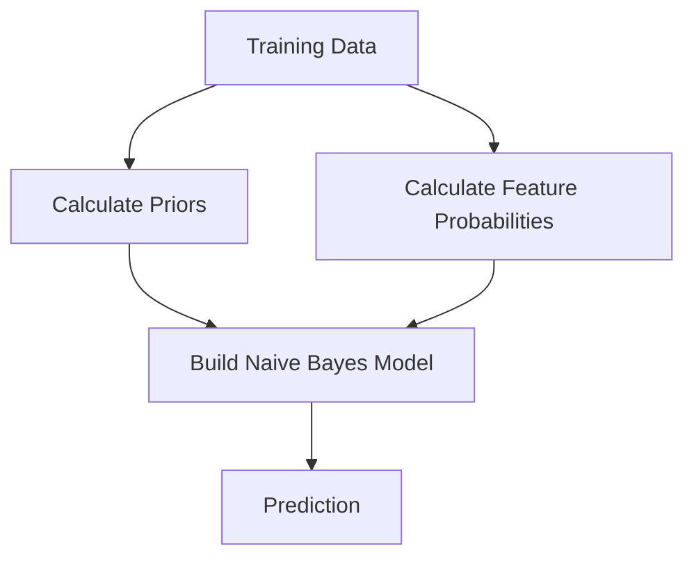
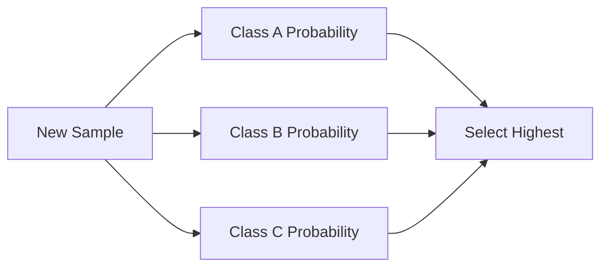

# Naive Bayes

Naive Bayes is a **probabilistic machine learning algorithm** based on:

:contentReference[oaicite:0]{index=0}' theorem.

It is one of the simplest yet surprisingly powerful classification algorithms.

Despite being over 250 years old, it is still widely used in:

- Spam Detection
- Sentiment Analysis
- Text Classification
- Document Categorization
- Medical Diagnosis
- Recommendation Systems

---

## Why is it Called "Naive"?

Because it makes a very strong assumption:

> All features are independent given the class.

Example:

Suppose we want to classify:

```text
Weather → Play Tennis?
```

Features:

```text
Sunny
Humidity
Wind
Temperature
```

Naive Bayes assumes:

```text
Humidity is independent of Temperature
Humidity is independent of Wind
Temperature is independent of Wind
```

which is usually false.

Hence:

```text
Naive = Simplifying Assumption
```

Surprisingly, it often works extremely well.

---

## Bayes' Theorem

Naive Bayes is built on Bayes' Rule:


::contentReference[oaicite:1]{index=1}


In words:

```text
Posterior
=
Likelihood × Prior
-------------------
Evidence
```

Where:

- P(A) = Prior Probability
- P(B|A) = Likelihood
- P(A|B) = Posterior Probability
- P(B) = Evidence

---

## Intuition

Suppose:

```text
1% of people have a disease.
```

A test returns positive.

Question:

```text
What is the probability
the person actually has the disease?
```

Bayes' theorem updates our belief using new evidence.

Naive Bayes applies this idea to classification.

---

## Classification Goal

Given features:

```text
X = (x₁,x₂,x₃,...,xₙ)
```

Predict class:

```text
C
```

Example:

```text
Email
```

Classes:

```text
Spam
Not Spam
```

Features:

```text
Contains "FREE"
Contains "WIN"
Contains "MONEY"
```

---

## Core Formula

We want:

```math
P(C|X)
```

Probability that sample belongs to class C.

Using Bayes:

```math
P(C|X)
=
\frac{P(X|C)P(C)}
{P(X)}
```

---

Since:

```math
P(X)
```

is same for all classes,

we compare:

```math
P(X|C)P(C)
```

and choose the largest.

---

## Naive Independence Assumption

Normally:

```math
P(X|C)
=
P(x_1,x_2,...,x_n|C)
```

which is hard to compute.

Naive Bayes assumes:

```math
P(X|C)
=
P(x_1|C)
P(x_2|C)
...
P(x_n|C)
```

This simplifies everything.

---

## Final Naive Bayes Formula

```math
P(C|X)
\propto
P(C)
\prod_{i=1}^{n}
P(x_i|C)
```

Meaning:

```text
Posterior
=
Prior
×
Likelihood of Feature 1
×
Likelihood of Feature 2
×
...
```

---

## Example: Spam Detection

Training Data:

| Email | Spam |
|---------|------|
| FREE MONEY | Yes |
| WIN MONEY | Yes |
| MEETING TODAY | No |
| PROJECT UPDATE | No |

---

### Prior Probability

Spam:

```text
2 / 4 = 0.5
```

Not Spam:

```text
2 / 4 = 0.5
```

---

### Likelihood

Word:

```text
FREE
```

Appears:

```text
1 time in Spam
0 times in Non-Spam
```

Thus:

```math
P(FREE|Spam)
=
1/2
```

---

## Prediction Example

New Email:

```text
FREE WIN
```

Compute:

```math
P(Spam|Email)
```

Using:

```text
Prior × Likelihoods
```

Whichever class gets larger probability wins.

---

## Training Process



---

## Prediction Process



---

## Types of Naive Bayes

Different versions depend on feature types.

---

## 1. Gaussian Naive Bayes

Used for:

```text
Continuous Numerical Data
```

Examples:

- Height
- Weight
- Age
- Income

Assumes:

```text
Features follow a Normal Distribution
```

---

Probability:

```math
P(x|C)
=
\frac{1}
{\sqrt{2\pi\sigma^2}}
e^{-\frac{(x-\mu)^2}{2\sigma^2}}
```

Stores:

```text
Mean (μ)
Variance (σ²)
```

for each feature and class.

---

## 2. Multinomial Naive Bayes

Most common for:

```text
Text Classification
```

Examples:

- Spam Detection
- News Classification
- Sentiment Analysis

Uses:

```text
Word Counts
```

---

Example:

```text
"free" appears 50 times
"money" appears 30 times
```

Probability based on frequency.

---

## 3. Bernoulli Naive Bayes

Used when features are:

```text
Binary
```

Example:

```text
Contains FREE?
0 or 1
```

Only presence/absence matters.

---

## Laplace Smoothing

Problem:

Suppose:

```text
Word never appeared
```

Then:

```math
P(word|class)=0
```

Because probabilities are multiplied:

```math
Anything × 0 = 0
```

Entire prediction becomes zero.

---

### Solution

Add 1 to counts.

```math
P
=
\frac{count+1}
{total+V}
```

where:

```text
V = vocabulary size
```

Called:

```text
Laplace Smoothing
```

or

```text
Add-One Smoothing
```

---

## Why Naive Bayes Works So Well

Even though the independence assumption is wrong:

```text
Feature Correlations
Often Affect All Classes Similarly
```

As a result:

```text
Class Ranking
Remains Correct
```

---

## Advantages

 Extremely fast training

 Extremely fast prediction

 Works well on small datasets

 Excellent for text classification

 Handles high-dimensional data

 Requires little memory

---

## Disadvantages

 Independence assumption rarely true

 Struggles with complex feature interactions

 Probability estimates may be poorly calibrated

 Lower accuracy than boosting methods on many tabular datasets

---

## Complexity

Training:

```math
O(N \times D)
```

Prediction:

```math
O(C \times D)
```

Where:

- N = samples
- D = features
- C = classes

Very efficient.

---

## Naive Bayes vs Logistic Regression

| Feature | Naive Bayes | Logistic Regression |
|-----------|------------|--------------------|
| Type | Generative | Discriminative |
| Speed | Faster | Slower |
| Data Requirement | Small | More Data |
| Probability Calibration | Poorer | Better |
| Text Classification | Excellent | Excellent |

---

## Naive Bayes vs Decision Tree

| Feature | Naive Bayes | Decision Tree |
|----------|------------|--------------|
| Training Speed | Very Fast | Fast |
| Interpretability | Moderate | High |
| Nonlinear Patterns | Poor | Good |
| High-Dimensional Data | Excellent | Moderate |

---

## Naive Bayes vs XGBoost

| Feature | Naive Bayes | XGBoost |
|-----------|-----------|---------|
| Training Time | Extremely Fast | Slower |
| Accuracy | Moderate | High |
| Feature Interaction | No | Yes |
| Text Classification | Excellent | Moderate |
| Tabular Data | Moderate | Excellent |

---

## Scikit-Learn Examples

### Gaussian Naive Bayes

```python
from sklearn.naive_bayes import GaussianNB

model = GaussianNB()
model.fit(X_train, y_train)
```

---

### Multinomial Naive Bayes

```python
from sklearn.naive_bayes import MultinomialNB

model = MultinomialNB()
model.fit(X_train, y_train)
```

---

### Bernoulli Naive Bayes

```python
from sklearn.naive_bayes import BernoulliNB

model = BernoulliNB()
model.fit(X_train, y_train)
```

---

## Real-World Applications

### Email Filtering

```text
Spam vs Not Spam
```

---

### NLP

```text
Sentiment Analysis
Language Detection
Topic Classification
```

---

### Healthcare

```text
Disease Prediction
Risk Assessment
```

---

### Recommendation Systems

```text
User Preference Prediction
```

---


### Why is Naive Bayes called "Naive"?

Because it assumes all features are conditionally independent given the class.

---

### What is the biggest limitation?

The independence assumption.

---

### Why use Laplace Smoothing?

To prevent zero probabilities.

---

### Which Naive Bayes variant is best for text classification?

```text
Multinomial Naive Bayes
```

---

### Is Naive Bayes generative or discriminative?

```text
Generative
```

because it models:

```math
P(X|C)
```

and

```math
P(C)
```

---

## Summary

```text
Bayes Theorem
       ↓
Assume Feature Independence
       ↓
Compute Priors
       ↓
Compute Likelihoods
       ↓
Multiply Probabilities
       ↓
Choose Highest Posterior
```

### Variants

```text
Gaussian NB
→ Continuous Data

Multinomial NB
→ Word Counts

Bernoulli NB
→ Binary Features
```

### Rule of Thumb

```text
Text Classification?
    ↓
Use Multinomial Naive Bayes

Continuous Features?
    ↓
Use Gaussian Naive Bayes

Binary Features?
    ↓
Use Bernoulli Naive Bayes
```

**Key Idea:**  
Naive Bayes = Bayes' Theorem + Conditional Independence Assumption → Fast and Effective Probabilistic Classification.