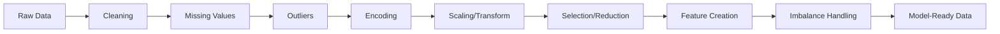

# Feature Engineering

> Garbage in, garbage out — no model architecture fixes a badly engineered feature set.

## Learning Objectives

- Clean raw data (duplicates, inconsistent values, wrong dtypes) before anything else touches it
- Choose an imputation strategy for missing values based on *why* the data is missing
- Detect and handle outliers without silently deleting real signal
- Encode categorical variables correctly for the model family you're using
- Scale and transform numeric features so models that are sensitive to magnitude behave
- Select and reduce features to fight the curse of dimensionality
- Engineer new features from dates, interactions, and aggregations
- Handle class imbalance without lying to your evaluation metric

## Why This Whole Module Exists

Models don't see your data — they see whatever matrix you hand them. A gradient boosting model can partially route around bad features; a linear model, a distance-based model (KNN, SVM), or a neural net cannot. Feature engineering is the layer that decides how much signal actually survives the trip from raw data to model input.

The ten sections below are ordered the way you'd typically walk through a real pipeline: clean first, handle gaps, deal with extremes, encode categories, scale/transform, then select/reduce/create, and finally address imbalance right before modeling. In practice you'll loop back and forth, but this is a sane default order.

---

## 01. Data Cleaning

Before anything statistical happens, the data has to be trustworthy at a mechanical level.

- **Duplicate removal**: Exact duplicate rows inflate the importance of whatever pattern they repeat and can leak across train/test splits if not removed *before* splitting. Near-duplicates (same entity, slightly different formatting) need fuzzy matching, not exact-match dedup.
- **Inconsistent values**: The same category spelled differently ("NY", "New York", "new york "), inconsistent units (kg vs lbs in the same column), or mixed date formats. These look like distinct categories to any encoder unless normalized first — silently fragmenting your feature space.
- **Data type conversion**: A column of numbers stored as strings (`"42"` instead of `42`) will not scale, won't compute correlations, and will break most numeric transforms. Dates stored as strings can't have date features extracted from them. Always audit dtypes before anything downstream.

**Common mistake**: cleaning *after* splitting into train/test, which means your cleaning logic (e.g., which categories get merged) is fit differently on each split. Clean first, split second — except for anything that "learns" a statistic (imputation values, encoding maps), which must be fit on train only (see Section 02 and 04).

---

## 02. Missing Value Handling

### Why values go missing matters more than how many are missing

- **MCAR (Missing Completely At Random)**: no pattern to the missingness. Simple imputation is safe.
- **MAR (Missing At Random)**: missingness depends on *other observed* columns (e.g., income missing more often for younger respondents). Imputation using those other columns (like KNN) captures more signal than a global mean.
- **MNAR (Missing Not At Random)**: missingness depends on the *unobserved value itself* (e.g., people with very high income decline to report it). No imputation method fixes this — you need a "was_missing" indicator feature at minimum, since the missingness itself is signal.

### Strategies, in order of sophistication

| Method | What it does | Use when |
|---|---|---|
| Drop rows/columns | Remove incomplete rows, or drop a column that's mostly missing | Missingness is rare and MCAR, or a column is >50-60% missing with no recoverable signal |
| Mean imputation | Fill with the column mean | Numeric, roughly symmetric distribution, MCAR |
| Median imputation | Fill with the column median | Numeric, skewed distribution or outliers present (median is robust to both) |
| Mode imputation | Fill with the most frequent value | Categorical columns |
| KNN imputation | Fill using the average of the k most similar rows (by the other features) | MAR, when other columns carry predictive information about the missing one |

**Critical rule**: fit any imputer (the mean, median, or KNN neighbor structure) on the **training set only**, then apply that same fitted value/structure to the test set. Computing the mean on the full dataset before splitting leaks test-set information into training.

---

## 03. Outlier Detection

An outlier isn't automatically an error — it might be the most important row in the dataset (fraud, a critical failure event, a high-value customer). The goal is to *detect and decide*, not to *delete by default*.

| Method | How it works | Notes |
|---|---|---|
| IQR method | Flag points outside `[Q1 - 1.5*IQR, Q3 + 1.5*IQR]` | Simple, robust, assumes roughly unimodal distribution |
| Z-score | Flag points where `\|x - mean\| / std > threshold` (commonly 3) | Assumes roughly normal distribution; sensitive to the outliers it's trying to detect (mean/std get pulled) |
| Winsorization | Cap extreme values at a percentile (e.g., clip below 1st / above 99th) instead of removing them | Keeps the row, reduces the extreme value's leverage — useful when you want to keep sample size |
| Isolation Forest | Randomly partitions the feature space; outliers get isolated in fewer splits than normal points | Works in high dimensions, doesn't assume a particular distribution shape, more expensive to compute |

**Common mistake**: computing outlier thresholds on the full dataset (including test data), or removing outliers *before* deciding whether they're data-entry errors versus genuine rare events worth modeling separately.

---

## 04. Categorical Encoding

Models need numbers. How you turn categories into numbers determines what relationships the model can learn.

| Method | What it produces | Use when | Watch out for |
|---|---|---|---|
| Label Encoding | Single integer per category (0, 1, 2, ...) | Tree-based models (splits don't care about the arbitrary ordering) | Implies a false order for linear/distance-based models |
| One-Hot Encoding | One binary column per category | Linear models, low-cardinality categories | Explodes column count with high cardinality |
| Ordinal Encoding | Integers reflecting a *real* order (e.g., low/medium/high → 0/1/2) | The category genuinely has a meaningful order | Using it on unordered categories reintroduces the label-encoding problem |
| Target Encoding | Replace category with the mean of the target for that category | High-cardinality categoricals, tree and linear models alike | Leaks target information if not done with proper cross-validation/smoothing — a major source of subtle overfitting |
| Frequency Encoding | Replace category with how often it appears | Cheap, no target leakage risk, useful as a supplementary feature | Two different categories with the same frequency become indistinguishable |

**Critical rule for target encoding**: never compute the target mean using a row's own target value. Use out-of-fold encoding (compute the mapping on K-1 folds, apply to the held-out fold) or it silently leaks the label into the feature.

---

## 05. Feature Scaling

Distance-based and gradient-based models (KNN, SVM, linear/logistic regression, neural nets, PCA) are sensitive to feature magnitude. Tree-based models (random forest, gradient boosting) are not — scaling is optional for them.

| Method | Formula (intuition) | Use when |
|---|---|---|
| StandardScaler | `(x - mean) / std` → mean 0, std 1 | Roughly normal features, most common default |
| MinMaxScaler | `(x - min) / (max - min)` → range [0, 1] | Bounded output needed (e.g., neural net inputs), no major outliers |
| RobustScaler | `(x - median) / IQR` | Data has outliers — median/IQR aren't pulled by extreme values the way mean/std are |
| Normalization (L2) | Scale each **row** so its vector length is 1 | Direction matters more than magnitude — text/TF-IDF vectors, cosine-similarity use cases |

**Critical rule**: fit the scaler on training data only, then transform both train and test with those fitted parameters — same leakage rule as imputation.

---

## 06. Feature Transformation

Transformations reshape a feature's *distribution*, which matters most for models that assume linearity or normality.

| Transform | What it does | Use when |
|---|---|---|
| Log | Compresses large values, expands small ones | Right-skewed data (revenue, prices, counts); requires positive values |
| Square root | Milder compression than log | Moderately right-skewed data, works with zero (unlike log) |
| Box-Cox | Finds the best power transform (log is a special case) to make data closer to normal | Positive-only data, you want an automatically-chosen transform |
| Yeo-Johnson | Like Box-Cox but works with zero and negative values | Same goal as Box-Cox, but data isn't strictly positive |
| Polynomial Features | Adds `x^2`, `x^3`, `x1*x2`, etc. | Linear models need to capture curvature/interactions the raw features don't expose |

**Common mistake**: log-transforming a column that contains zeros or negatives without an offset, and forgetting to inverse-transform predictions back to the original scale before evaluating/reporting them.

---

## 07. Feature Selection

More features isn't automatically better — irrelevant or redundant features add noise, slow training, and increase overfitting risk (the curse of dimensionality: as feature count grows, data becomes sparse relative to the space, and models need exponentially more samples to generalize).

| Method | How it decides | Type |
|---|---|---|
| Variance Threshold | Drop features with near-zero variance (they're almost constant, carry no information) | Filter (model-agnostic) |
| Correlation Analysis | Drop one of each pair of features that are highly correlated with each other (redundant) | Filter |
| SelectKBest | Score each feature independently against the target (e.g., F-statistic), keep the top K | Filter |
| Recursive Feature Elimination (RFE) | Fit a model, drop the least important feature, repeat | Wrapper (uses a model) |
| Feature Importance | Use a trained model's built-in importance scores (tree split gain, linear coefficients) to rank features | Embedded |
| SHAP-based Selection | Use SHAP values (per-prediction feature attribution) averaged across samples to rank features | Embedded, model-agnostic, more expensive but accounts for interactions |

**When to use what**: filters are cheap and a good first pass; wrapper methods (RFE) are more accurate but expensive since they retrain repeatedly; embedded methods are essentially free once you've already trained a model for other reasons.

---

## 08. Dimensionality Reduction

Selection *drops* features; reduction *combines* them into fewer, denser features.

| Method | What it does | Use when |
|---|---|---|
| PCA | Finds orthogonal directions of maximum variance, projects onto the top ones | Linear structure, want to preserve variance, need interpretable "components" |
| SVD | The linear algebra machinery underneath PCA (and usable directly on non-centered/sparse data) | Sparse data (e.g., text), or when you want the decomposition without centering |
| t-SNE | Nonlinear projection to 2-3 dimensions that preserves *local* neighborhood structure | Visualization only — distances between distant clusters aren't meaningful, and it's not meant for feeding into a downstream model |
| UMAP | Similar goal to t-SNE, faster, better preserves some global structure | Visualization, and sometimes as an actual preprocessing step (unlike t-SNE) |

**Common mistake**: feeding t-SNE/UMAP output into a model expecting meaningful absolute distances, or running PCA before scaling (a feature with a huge raw scale will dominate the top components purely due to units, not real importance).

---

## 09. Feature Creation

The highest-leverage step, and the hardest to automate — this is where domain knowledge pays off.

- **Date & time features**: day of week, month, is_weekend, is_holiday, days_since_event, cyclical encodings (sin/cos of hour-of-day) so midnight and 11 PM aren't treated as maximally different.
- **Interaction features**: `feature_a * feature_b`, ratios, differences — capture effects that only show up in combination (price *per* square foot, not price and square footage separately).
- **Aggregation features**: group-level statistics joined back onto each row (average purchase per customer, count of prior transactions) — turns a relational structure into row-level signal.
- **Binning**: convert a continuous variable into discrete buckets (age → age group). Useful when the *relationship* with the target is non-monotonic or you want a tree-friendly categorical, but you lose granularity.
- **Domain-specific features**: anything derived from expert knowledge of the problem — BMI from height/weight, debt-to-income ratio, RFM (recency/frequency/monetary) scores for customers. Usually the single highest-value category of feature engineering, and the one no generic library can do for you.

---

## 10. Imbalanced Data

When one class vastly outnumbers another (fraud detection, rare disease diagnosis), a model can get 99% accuracy by always predicting the majority class — and be useless.

| Method | What it does | Trade-off |
|---|---|---|
| Random Oversampling | Duplicate minority-class rows until classes are balanced | Simple, but duplicated rows can cause overfitting to those exact points |
| Random Undersampling | Remove majority-class rows until classes are balanced | Simple, but throws away potentially useful majority-class data |
| SMOTE | Generates *synthetic* minority examples by interpolating between a minority point and its nearest minority neighbors | Avoids exact duplication, but can generate unrealistic points if minority class is sparse or noisy |
| ADASYN | Like SMOTE, but generates more synthetic points in regions where the minority class is hardest to distinguish from the majority (near the decision boundary) | Focuses effort where it's most needed, but can amplify noise near a genuinely ambiguous boundary |

**Critical rule**: resample the training data only, *after* splitting off the test set, and ideally *inside* each cross-validation fold. Resampling before splitting leaks synthetic/duplicated information across the train/test boundary and produces an optimistic, dishonest evaluation score — the same leakage principle as Sections 02, 04, and 05, just applied to rows instead of feature values.

---

## Key Terms

| Term | Plain description | Precise meaning |
|---|---|---|
| MCAR / MAR / MNAR | "Ways data goes missing" | Missing Completely At Random / At Random (depends on other observed features) / Not At Random (depends on the missing value itself) |
| Leakage | "Test info sneaking into training" | Any statistic (mean, encoding map, resampling) fit on data that includes information unavailable at prediction time |
| Curse of dimensionality | "Too many features, too little data" | As feature count grows, the data needed to densely cover the feature space grows exponentially |
| Target encoding | "Category → target's average" | Replacing a category with the mean target value for that category, fit out-of-fold to avoid leakage |
| Variance-preserving projection | "Keep the spread, drop the axes" | PCA-style reduction that keeps directions of maximum variance in the data |
| Synthetic minority sample | "A fake-but-plausible new example" | A generated point (SMOTE/ADASYN) interpolated between real minority-class points, not copied from any single one |

## Practical Checklist

1. Clean and dedupe before anything else, and before any train/test split.
2. Split into train/test *before* fitting any imputer, scaler, encoder, or resampler.
3. Decide whether missingness itself is signal (MNAR) before choosing an imputation method.
4. Don't delete outliers by default — investigate whether they're errors or genuine rare events.
5. Match your encoding to your model family (label encoding is fine for trees, risky for linear models).
6. Scale for distance/gradient-based models; skip it for tree-based models if you're short on time.
7. Use filters for a fast first pass at feature selection, wrappers/embedded methods for the final cut.
8. Reserve t-SNE/UMAP for visualization, not as inputs to a downstream model.
9. Prioritize domain-specific feature creation — it usually beats any generic technique on this list.
10. Resample only the training fold, only after splitting, ideally inside cross-validation.
