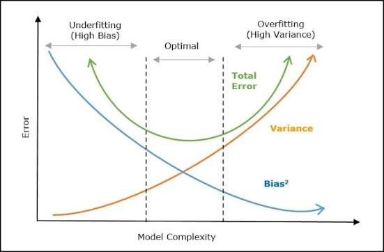

# Model Evaluation

How to reliably measure whether a model actually works — from a simple train/test split through hyperparameter tuning and the theory behind why models fail.

---

## 1. Train/Validation/Test Split

The foundation of honest model evaluation: never judge a model on the data it learned from.

| Split | Purpose |
|---|---|
| **Train** | Fit model parameters (weights, splits, coefficients) |
| **Validation** | Tune hyperparameters, compare models, decide when to stop |
| **Test** | Final, one-time estimate of real-world performance |

```python
from sklearn.model_selection import train_test_split

# First split off the test set
X_train_full, X_test, y_train_full, y_test = train_test_split(
    X, y, test_size=0.2, random_state=42, stratify=y
)

# Then split train into train/validation
X_train, X_val, y_train, y_val = train_test_split(
    X_train_full, y_train_full, test_size=0.25, random_state=42, stratify=y
)
# Results in ~60% train / 20% val / 20% test overall
```

**Critical rules:**
- The **test set must be touched exactly once**, at the very end. If you tune based on test performance, it silently becomes a second validation set and your final number is optimistic.
- Use `stratify=y` for classification to preserve class proportions across splits — vital for imbalanced data.
- For time series, **never shuffle** — always split chronologically (train on the past, validate/test on the future) to avoid leaking future information.

```python
# Time series split — no shuffling, no random_state
split_idx = int(len(df) * 0.8)
train, test = df.iloc[:split_idx], df.iloc[split_idx:]
```

---

## 2. Cross-Validation

A single train/val split can be noisy — performance depends on which rows happened to land where. Cross-validation (CV) averages performance over multiple splits for a more robust estimate.

### K-Fold Cross-Validation
Split data into K equal folds. Train on K-1 folds, validate on the remaining fold. Repeat K times, rotating the validation fold, then average the scores.

```python
from sklearn.model_selection import KFold, cross_val_score

kf = KFold(n_splits=5, shuffle=True, random_state=42)
scores = cross_val_score(model, X_train, y_train, cv=kf, scoring="roc_auc")
print(scores.mean(), scores.std())
```

**Why it's better than a single split:**
- Every row gets used for both training and validation (in different folds).
- The std of scores across folds tells you how *stable* your estimate is — high variance across folds is itself useful information.

### Leave-One-Out CV (LOOCV)
K = number of samples. Extremely thorough but computationally expensive; mainly used on small datasets.

### Repeated K-Fold
Runs K-Fold multiple times with different random splits, for an even more stable estimate — at the cost of more compute.
```python
from sklearn.model_selection import RepeatedKFold
rkf = RepeatedKFold(n_splits=5, n_repeats=3, random_state=42)
```

### Time Series Cross-Validation
Respects chronological order — each fold's validation set comes *after* its training set.
```python
from sklearn.model_selection import TimeSeriesSplit
tscv = TimeSeriesSplit(n_splits=5)
```

---

## 3. Stratified K-Fold

Standard K-Fold can accidentally create folds with very different class balances — especially damaging for imbalanced datasets (e.g., a fold with 0 positive examples).

**Stratified K-Fold preserves the class distribution in every fold**, matching the overall dataset's proportions.

```python
from sklearn.model_selection import StratifiedKFold, cross_val_score

skf = StratifiedKFold(n_splits=5, shuffle=True, random_state=42)
scores = cross_val_score(model, X_train, y_train, cv=skf, scoring="f1")
```

**Rule of thumb:** always use `StratifiedKFold` (not plain `KFold`) for classification tasks, especially with any class imbalance. For regression, plain `KFold` is standard (though `StratifiedKFold`-like binning approaches exist for skewed continuous targets).

For grouped data (e.g., multiple rows per patient/customer, where rows from the same group shouldn't span both train and validation):
```python
from sklearn.model_selection import StratifiedGroupKFold
sgkf = StratifiedGroupKFold(n_splits=5)
scores = cross_val_score(model, X, y, cv=sgkf, groups=patient_ids)
```

---

## 4. Grid Search

Exhaustively tries **every combination** of specified hyperparameter values, evaluating each with cross-validation.

```python
from sklearn.model_selection import GridSearchCV
from sklearn.ensemble import RandomForestClassifier

param_grid = {
    "n_estimators": [100, 300, 500],
    "max_depth": [5, 10, None],
    "min_samples_split": [2, 5, 10]
}

grid_search = GridSearchCV(
    estimator=RandomForestClassifier(random_state=42),
    param_grid=param_grid,
    cv=5,
    scoring="roc_auc",
    n_jobs=-1
)
grid_search.fit(X_train, y_train)

print(grid_search.best_params_)
print(grid_search.best_score_)
best_model = grid_search.best_estimator_
```

**Pros:** guaranteed to find the best combination *within the grid*.
**Cons:** cost grows multiplicatively with each added parameter/value — 3 params × 5 values each × 5 folds = 625 model fits. Becomes infeasible fast.

---

## 5. Randomized Search

Instead of trying every combination, samples a fixed number of random combinations from specified distributions — much more efficient for large search spaces.

```python
from sklearn.model_selection import RandomizedSearchCV
from scipy.stats import randint, uniform

param_distributions = {
    "n_estimators": randint(100, 1000),
    "max_depth": randint(3, 30),
    "min_samples_split": randint(2, 20),
    "max_features": uniform(0.3, 0.7)
}

random_search = RandomizedSearchCV(
    estimator=RandomForestClassifier(random_state=42),
    param_distributions=param_distributions,
    n_iter=50,          # only 50 combinations tried, regardless of grid size
    cv=5,
    scoring="roc_auc",
    random_state=42,
    n_jobs=-1
)
random_search.fit(X_train, y_train)
```

**Why it often works as well as grid search:** research (Bergstra & Bengio, 2012) showed that in high-dimensional hyperparameter spaces, most parameters have low actual impact — random search explores more *distinct values per parameter* for the same budget, so it tends to find near-optimal regions faster than exhaustive grids.

**Grid vs. Randomized — when to use which:**
| | Grid Search | Randomized Search |
|---|---|---|
| Search space | Small, discrete | Large or continuous |
| Compute budget | Flexible | Fixed/limited |
| Guarantee | Best within grid | Good approximation, not guaranteed optimal |
| Typical use | Fine-tuning around known good values | Initial broad exploration |

---

## 6. Hyperparameter Tuning (Advanced)

Beyond grid/random search, more sample-efficient methods exist for expensive models.

### Bayesian Optimization
Builds a probabilistic model of the objective function and picks the next hyperparameters to try based on where improvement is *likely*, not randomly or exhaustively.
```python
# Using Optuna
import optuna

def objective(trial):
    params = {
        "n_estimators": trial.suggest_int("n_estimators", 100, 1000),
        "max_depth": trial.suggest_int("max_depth", 3, 30),
        "learning_rate": trial.suggest_float("learning_rate", 0.01, 0.3, log=True)
    }
    model = GradientBoostingClassifier(**params)
    return cross_val_score(model, X_train, y_train, cv=5, scoring="roc_auc").mean()

study = optuna.create_study(direction="maximize")
study.optimize(objective, n_trials=100)
print(study.best_params)
```

### Successive Halving
Starts many candidate configurations with small resource budgets (few trees, small data subset), then progressively allocates more resources to the best-performing ones — discarding weak candidates early.
```python
from sklearn.experimental import enable_halving_search_cv
from sklearn.model_selection import HalvingRandomSearchCV
halving_search = HalvingRandomSearchCV(estimator, param_distributions, cv=5)
```

### Practical tuning workflow
1. Start broad with `RandomizedSearchCV` or Bayesian optimization to find promising regions.
2. Narrow down with `GridSearchCV` around the best region.
3. Always evaluate the final tuned model on the held-out **test set** exactly once.
4. Track both mean CV score and its variance — a slightly lower mean with much lower variance can be the more trustworthy choice.

---

## 7. Data Leakage

When information from outside the training data (often, indirectly, from the target or the future) leaks into the training process — causing inflated validation scores that don't hold up in production.

### Common sources of leakage

| Type | Example |
|---|---|
| **Preprocessing leakage** | Fitting a `StandardScaler` or imputer on the *entire* dataset before splitting |
| **Target leakage** | A feature that's only known *after* the target is determined (e.g., "was_late_fee_charged" to predict "will default") |
| **Temporal leakage** | Using future data to predict the past (common in time series if not split chronologically) |
| **Group leakage** | Rows from the same entity (patient, customer) appearing in both train and test |
| **Duplicate leakage** | Duplicate or near-duplicate rows split across train and test |
| **Feature engineering leakage** | Computing aggregate statistics (e.g., "average purchase amount") using the full dataset including test rows |

### How to prevent it
```python
# WRONG — scaler sees test data statistics before split evaluation
scaler = StandardScaler().fit(X)          # fit on everything
X_scaled = scaler.transform(X)
X_train, X_test = train_test_split(X_scaled, ...)

# RIGHT — fit only on training data
X_train, X_test = train_test_split(X, ...)
scaler = StandardScaler().fit(X_train)     # fit only on train
X_train_scaled = scaler.transform(X_train)
X_test_scaled = scaler.transform(X_test)   # transform only, never re-fit
```

Using a `Pipeline` (see the Data Preprocessing guide) largely automates this correctness, since `cross_val_score`/`GridSearchCV` will refit every preprocessing step inside each fold.

**Sanity checks for leakage:**
- Suspiciously high performance (e.g., 99%+ accuracy on a hard real-world problem) is a red flag.
- Check feature importances — a single dominant feature with near-perfect correlation to the target often signals leakage.
- Ask of every feature: "would this value actually be available at prediction time, in production?"

---

## 8. Overfitting vs. Underfitting

### Overfitting
The model learns the training data *too* well — including its noise — and fails to generalize.
- **Symptoms:** high training score, much lower validation/test score.
- **Causes:** model too complex relative to data size, too many features, insufficient regularization, training for too many epochs/iterations.
- **Fixes:** more training data, regularization (L1/L2, dropout), simpler model, early stopping, cross-validation-driven hyperparameter tuning, feature selection.

### Underfitting
The model is too simple to capture the underlying pattern at all.
- **Symptoms:** poor performance on *both* training and validation/test sets.
- **Causes:** model too simple, insufficient features, over-regularization, not training long enough.
- **Fixes:** more complex model, better features, less regularization, train longer.

### Diagnosing with learning curves
```python
from sklearn.model_selection import learning_curve
import numpy as np

train_sizes, train_scores, val_scores = learning_curve(
    model, X_train, y_train, cv=5, scoring="roc_auc",
    train_sizes=np.linspace(0.1, 1.0, 10)
)
```
| Pattern | Diagnosis |
|---|---|
| Both curves converge to a low score | Underfitting |
| Big, persistent gap between train (high) and validation (lower) curves | Overfitting |
| Both curves converge to a high score with a small gap | Good fit |
| Validation curve still rising as training size grows | More data would likely help |

---

## 9. Bias–Variance Tradeoff

The theoretical foundation underneath overfitting/underfitting.

Total expected prediction error decomposes as:

$$
\text{Error} = \text{Bias}^2 + \text{Variance} + \text{Irreducible Error}
$$

| Term | Meaning | Associated with |
|---|---|---|
| **Bias** | Error from overly simplistic assumptions — the model systematically misses relevant patterns | Underfitting |
| **Variance** | Error from excessive sensitivity to fluctuations in the training data — small changes in training data cause large changes in predictions | Overfitting |
| **Irreducible error** | Noise inherent to the problem itself; no model can remove it | Neither |

**The tradeoff:** as model complexity increases, bias tends to decrease (the model can fit more complex patterns) while variance tends to increase (the model becomes more sensitive to the specific training sample). The goal is the complexity level that minimizes their sum.

```



```

**Practical levers on the tradeoff:**
| Increases bias, decreases variance | Increases variance, decreases bias |
|---|---|
| More regularization | Less regularization |
| Simpler model (shallower trees, fewer features) | More complex model (deeper trees, more features) |
| Fewer polynomial degrees | Higher polynomial degrees |
| More training data (reduces variance without adding bias) | — |
| Bagging (e.g., Random Forest) | Boosting can reduce bias but risks increasing variance if overdone |

**Ensembles and the tradeoff:**
- **Bagging** (e.g., Random Forest) — averages many high-variance, low-bias models to reduce variance while keeping bias low.
- **Boosting** (e.g., Gradient Boosting, XGBoost) — sequentially combines many high-bias, low-variance weak learners to reduce bias, but needs careful tuning (learning rate, depth, early stopping) to avoid variance creeping back up.

---

## Putting It All Together: A Sound Evaluation Workflow

1. **Split** data into train/validation/test (or train/test, using CV for validation).
2. **Preprocess safely** inside a `Pipeline` to prevent leakage.
3. **Cross-validate** (`StratifiedKFold` for classification) to get a robust performance estimate.
4. **Tune hyperparameters** with `RandomizedSearchCV` → narrow with `GridSearchCV`, or use Bayesian optimization for expensive models.
5. **Diagnose fit** with learning curves — check for over/underfitting.
6. **Audit for leakage** — scrutinize any suspiciously high scores or dominant features.
7. **Evaluate once** on the untouched test set for a final, honest performance estimate.
8. **Report variance, not just mean** — CV std, confidence intervals — so the final number reflects real uncertainty.

```python
# Full example putting it together
from sklearn.pipeline import Pipeline
from sklearn.model_selection import RandomizedSearchCV, StratifiedKFold, train_test_split

X_train, X_test, y_train, y_test = train_test_split(X, y, test_size=0.2, stratify=y, random_state=42)

pipe = Pipeline([("preprocessor", preprocessor), ("classifier", RandomForestClassifier(random_state=42))])

skf = StratifiedKFold(n_splits=5, shuffle=True, random_state=42)
search = RandomizedSearchCV(pipe, param_distributions, n_iter=50, cv=skf, scoring="roc_auc", random_state=42)
search.fit(X_train, y_train)

final_score = search.best_estimator_.score(X_test, y_test)  # touched only once
```

---

## Quick Reference

| Concept | One-line takeaway |
|---|---|
| Train/val/test split | Never evaluate on data the model (or its tuning process) has seen |
| Cross-validation | Averages over multiple splits for a stable performance estimate |
| Stratified K-Fold | Preserves class balance in every fold — essential for imbalanced classification |
| Grid Search | Exhaustive but expensive; good for small, focused search spaces |
| Randomized Search | Samples the space efficiently; good for large/continuous search spaces |
| Bayesian/advanced tuning | Learns from past trials to search smarter, not just wider |
| Data leakage | Information from outside training data inflating results — always fit preprocessing on train only |
| Overfitting/underfitting | High train + low val = overfit; low train + low val = underfit |
| Bias-variance tradeoff | The theory explaining why: total error = bias² + variance + irreducible error |

---

## Suggested Learning Path
1. Manually split a dataset train/val/test and confirm the class balance in each with `stratify=y`.
2. Run `KFold` vs. `StratifiedKFold` on an imbalanced dataset and compare fold-to-fold score variance.
3. Run both `GridSearchCV` and `RandomizedSearchCV` on the same model/param space and compare best score vs. time taken.
4. Deliberately introduce a leakage bug (fit scaler before split) and observe the inflated CV score versus the honest one.
5. Plot learning curves for an intentionally overfit model (e.g., a very deep unregularized tree) and an intentionally underfit one (e.g., a linear model on non-linear data).
6. Implement a simple bias-variance decomposition experiment: fit polynomial regressions of increasing degree on noisy data and plot train vs. test error.
