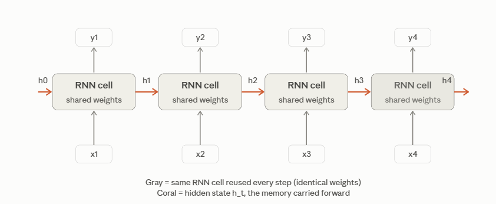

#  Introduction to Recurrent Neural Networks (RNNs)


##  The Problem: Why Existing Architectures Fall Short

Before learning what an RNN *is*, it helps to feel the specific gap it fills. Let's look at two architectures you already know — feedforward networks and CNNs — and see exactly where they break down on sequential data.

###  A concrete failure case

Suppose you want to build a model that reads a sentence and decides whether it's about a dog biting a man, or a man biting a dog:

> Sentence A: "The dog bit the man."

> Sentence B: "The man bit the dog."

**Attempt 1: Bag-of-words + feedforward network.** A simple approach is to count word occurrences, ignoring order:

| word | the | dog | bit | man |
|---|---|---|---|---|
| Sentence A count | 2 | 1 | 1 | 1 |
| Sentence B count | 2 | 1 | 1 | 1 |

The two feature vectors are **identical**. A feedforward network fed these counts has no way to distinguish the sentences — the information about *who did what to whom* lived entirely in the word order, and bag-of-words throws that away before the network ever sees it.

**Attempt 2: Fixed-size input.** You could instead feed the words in order, one input slot per word. This runs into a second problem: sentences don't all have the same length. "The dog bit the man" has 5 words; "She left" has 2; a paragraph might have 80. A feedforward network needs a fixed-size input vector, so you'd have to pad short sentences or truncate long ones — either wastes computation or throws away information.

**Attempt 3: CNN.** A CNN slides a filter across a fixed local window (e.g., 3 words at a time) and could, in principle, detect the pattern "X bit Y" versus "Y bit X" *within* that window. But its receptive field is local and fixed by design (covered in the CNN module's Lesson 01). A dependency between word 2 and word 47 of a long document is invisible to a filter that only ever looks at 3 consecutive words at a time, unless you stack many layers — and even then, the network has no explicit notion of "everything I've read so far," only "what's near me."

###  The three properties sequential data has

Generalizing from the example above, sequential data — text, audio, time series, DNA, sensor streams — has three properties that break the assumptions of feedforward networks and CNNs:

- **Length varies.** A sentence can be 3 words or 300; an audio clip can be 1 second or 10 minutes.
- **Order matters.** "The dog bit the man" and "The man bit the dog" use identical words but mean opposite things.
- **Context accumulates.** Understanding word 50 of a sentence often depends on words 1 through 49. A model needs *memory* — some way of carrying forward what it has seen so far.

What we need is an architecture that (a) reuses the same small set of parameters regardless of sequence length, and (b) carries forward a running summary of everything seen so far. That's exactly what an RNN provides.

---

##  The Concept: A Hidden State Carried Through Time

###  The core idea, informally

A Recurrent Neural Network processes a sequence **one element at a time**. At every step, it maintains a **hidden state** — a vector that summarizes everything relevant it has seen so far — and updates that hidden state using the current input plus the previous hidden state.



```

Same RNN cell (same weights) reused at every time step.
h_t depends on x_t AND h_(t-1) -- the network's "memory" of everything before it.
```

This is the sequential analogue of a CNN's weight sharing (CNN module, Lesson 01): a CNN reuses the same filter across *spatial* positions; an RNN reuses the same weights across *time steps*. This is precisely what lets a single, fixed-size set of weights handle sequences of any length.

###  The core idea, with math

Let's make "updates the hidden state using the current input plus the previous hidden state" precise. At each time step $t$:

$$h_t = f_W(x_t, h_{t-1})$$

where:

- $x_t$ is the input vector at time step $t$ (e.g., a word embedding, one audio sample, one row of sensor readings)
- $h_{t-1}$ is the hidden state carried over from the previous step (the network's "memory")
- $h_t$ is the new hidden state, produced by combining $x_t$ and $h_{t-1}$
- $f_W$ is a function with learned parameters $W$ — **the same function, with the same parameters, at every time step**

The most common concrete form of $f_W$ (the "vanilla" RNN cell) is:

$$h_t = \tanh(W_{hh}\, h_{t-1} + W_{xh}\, x_t + b_h)$$

Breaking this down term by term:

| Symbol | Shape | What it does |
|---|---|---|
| $x_t$ | $(d_x,)$ | current input vector, dimension $d_x$ |
| $h_{t-1}$ | $(d_h,)$ | previous hidden state, dimension $d_h$ |
| $W_{xh}$ | $(d_h, d_x)$ | learned matrix mapping input → hidden space |
| $W_{hh}$ | $(d_h, d_h)$ | learned matrix mapping previous hidden state → new hidden state |
| $b_h$ | $(d_h,)$ | learned bias vector |
| $\tanh$ | — | squashes values to $(-1, 1)$, keeping the hidden state bounded and adding nonlinearity |
| $h_t$ | $(d_h,)$ | new hidden state, same dimension as $h_{t-1}$ |


$$y_t = W_{hy}\, h_t + b_y$$

**The crucial detail:** $W_{xh}$, $W_{hh}$, $W_{hy}$, $b_h$, and $b_y$ do **not** change from one time step to the next. Whether the sequence has 5 elements or 500, it's the same five learned objects doing the work at every single step. That's the "reuse the same weights across time". 1, written out in full.

###  Walking through a tiny numeric example by hand

To make this concrete, let's trace two time steps with tiny 1-dimensional hidden state and input, so every number fits on one line. Suppose:

$$W_{hh} = 0.5, \quad W_{xh} = 1.0, \quad b_h = 0, \quad h_0 = 0$$

and the input sequence is $x_1 = 1.0,\ x_2 = 0.5$.

**Step 1:**
$$h_1 = \tanh(W_{hh} \cdot h_0 + W_{xh} \cdot x_1 + b_h) = \tanh(0.5 \cdot 0 + 1.0 \cdot 1.0 + 0) = \tanh(1.0) \approx 0.762$$

**Step 2:**
$$h_2 = \tanh(W_{hh} \cdot h_1 + W_{xh} \cdot x_2 + b_h) = \tanh(0.5 \cdot 0.762 + 1.0 \cdot 0.5 + 0) = \tanh(0.881) \approx 0.706$$

Notice that $h_2$ depends on $x_2$ *and* on $h_1$, which itself already encoded $x_1$. That's the recurrence: information from $x_1$ is still influencing the computation at step 2, even though $x_1$ is no longer directly in the equation. This is exactly what gives the network "memory" — and it's also the seed of a problem: trace this forward 100 steps and you can probably already sense that a very old input's influence gets diluted at every multiplication by $W_{hh}$. That's a preview of the vanishing-gradient problem covered in Lessons 05–06.

###  How this differs from a feedforward network

| | Feedforward network | RNN |
|---|---|---|
| Computation | $y = f(x)$ — one pass | $h_t = f_W(x_t, h_{t-1})$ — repeated, with feedback |
| Memory of past inputs | None | Carried in $h_{t-1}$ |
| Parameters vs. sequence length | N/A (fixed-size input) | Same parameters regardless of length |
| Can handle variable-length input? | No, without padding/truncation | Yes, naturally |

The feedback loop — $h_{t-1}$ feeding into the computation of $h_t$ — is where the word "recurrent" comes from, and it's the single idea the rest of this module builds outward from.

###  Minimal code: seeing the equation run

Here is the exact equation , implemented directly with NumPy, using the same tiny numbers as the hand-worked example , so you can check the two against each other:

```python
import numpy as np

# Parameters (1-dimensional, matching the hand-worked example)
W_hh = np.array([[0.5]])
W_xh = np.array([[1.0]])
b_h  = np.array([0.0])

def rnn_step(x_t, h_prev):
    """One step of a vanilla RNN: h_t = tanh(W_hh @ h_prev + W_xh @ x_t + b_h)."""
    return np.tanh(W_hh @ h_prev + W_xh @ x_t + b_h)

h = np.array([0.0])                 # h_0
inputs = [np.array([1.0]), np.array([0.5])]   # x_1, x_2

for t, x_t in enumerate(inputs, start=1):
    h = rnn_step(x_t, h)
    print(f"h_{t} = {h}")
```

```
h_1 = [0.76159416]
h_2 = [0.70600372]
```

These match  hand-calculated values. A full-scale RNN just does the same operation with vectors and matrices instead of scalars, and applies it once per element of a much longer sequence.

---

##  The Range of Tasks RNNs Handle

Because an RNN separates "what goes in at each step" from "what comes out at each step," the same core mechanism supports several different input/output shapes:

```
One-to-many:    single input  -> sequence output   (e.g. image captioning: 1 image -> a sentence)
Many-to-one:    sequence input -> single output     (e.g. sentiment classification: a review -> positive/negative)
Many-to-many:   sequence input -> sequence output   (e.g. machine translation, per-word part-of-speech tagging)
```

What changes between these three patterns is **only** where $x_t$ is fed in and where $y_t$ is read out — the underlying update equation $h_t = f_W(x_t, h_{t-1})$ stays the same in all three cases. Lesson 04 makes this concrete by walking through the wiring diagram for each pattern.

---


##  Why RNNs, in the Era of Transformers

Transformers (the architecture behind most modern large language models) have replaced RNNs for most large-scale text tasks. The core reason follows directly : an RNN's step $t$ literally cannot start until step $t-1$ finishes, because $h_t$'s formula requires $h_{t-1}$ as an input. That sequential dependency makes RNNs hard to parallelize across a long sequence during training. Lesson 18 covers this comparison in depth.

Even so, RNNs (and especially their LSTM/GRU variants) remain genuinely useful:

- Simpler to reason about, with far fewer moving parts than a Transformer
- Cheaper for smaller-scale or streaming/online tasks, where data genuinely arrives one step at a time
- Still a strong default for many time-series problems
- The conceptual foundation attention and Transformers were built in response to — understanding what RNNs do well and where they struggle (starting with the gradient issue foreshadowed ) is what makes the Transformer's design choices make sense, rather than feeling arbitrary

---

## Exercises

**Conceptual**

1. List three real-world tasks that are naturally sequential (order-dependent), and for each, describe concretely what "memory" of earlier steps the task requires. (Example to get you started: predicting the next word in a sentence requires remembering the topic and grammatical structure established earlier in the sentence.)
2. Revisit the "dog bit the man" / "man bit the dog" example . Explain in your own words why a bag-of-words vector can't distinguish them, and explain what specifically an RNN has access to that a bag-of-words vector doesn't.
3. For each of one-to-many, many-to-one, and many-to-many , name one additional real-world task beyond the examples already given.

**Working with the math**

4. Using the update equation $h_t = \tanh(W_{hh} h_{t-1} + W_{xh} x_t + b_h)$ and the same parameter values as  ($W_{hh}=0.5$, $W_{xh}=1.0$, $b_h=0$, $h_0=0$), compute $h_3$ by hand given $x_3 = -1.0$. Show your work.
5. Suppose $W_{hh} = 0$ (instead of $0.5$). What does the update equation simplify to? What does this tell you about the *role* $W_{hh}$ plays in giving the network memory?
6. We noted that repeatedly multiplying by $W_{hh}$ across many time steps hints at a problem. If $|W_{hh}| < 1$, what do you predict happens to the influence of $x_1$ after 50 time steps? What if $|W_{hh}| > 1$? (You don't need to prove this rigorously — an intuitive answer based on repeated multiplication is enough. Lessons 05–06 make this precise.)

---

## Key Terms

| Term | What it actually means |
|---|---|
| Recurrent Neural Network (RNN) | A neural network architecture that processes a sequence one element at a time, maintaining a hidden state updated at every step: $h_t = f_W(x_t, h_{t-1})$ |
| Hidden state ($h_t$) | A vector summarizing everything the network has processed so far in a sequence, carried forward and updated at each time step |
| Recurrence | The property that a step's computation depends on the result of the previous step ($h_{t-1}$), creating a feedback loop through time |
| Sequential data | Data where order carries meaning and length can vary, such as text, audio, or time series |
| Weight sharing (across time) | Using the same parameters ($W_{hh}$, $W_{xh}$, $b_h$) at every time step, which is what lets an RNN handle sequences of any length with a fixed number of parameters |
| $W_{hh}$, $W_{xh}$, $W_{hy}$ | The learned weight matrices mapping, respectively: previous hidden state → new hidden state; input → hidden state; hidden state → output |
| One-to-many / many-to-one / many-to-many | The three input/output patterns an RNN can be wired for, depending on where inputs are fed in and outputs are read out |