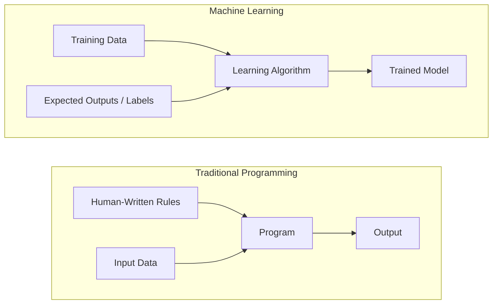
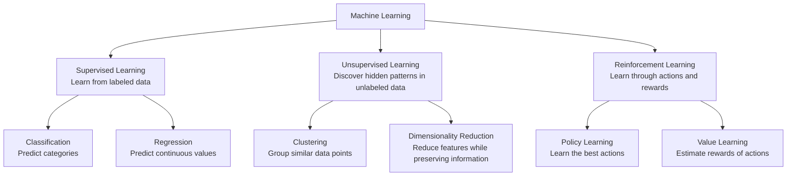
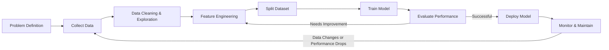
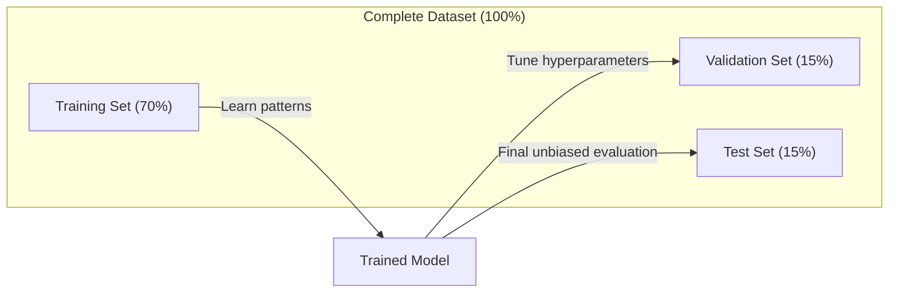
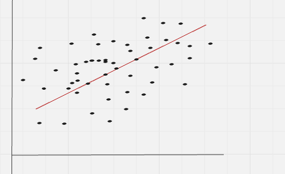
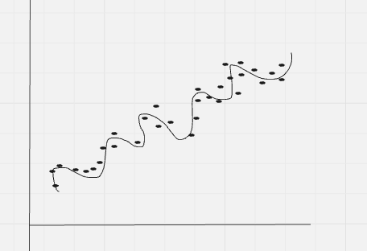
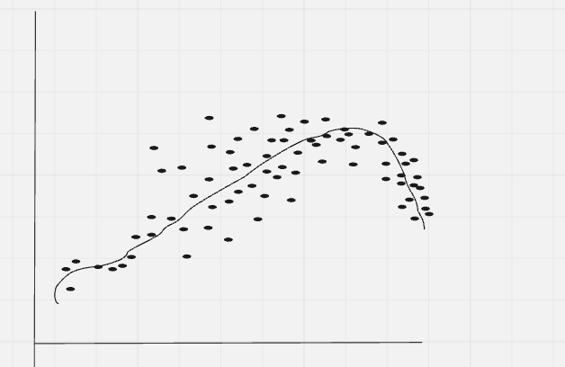
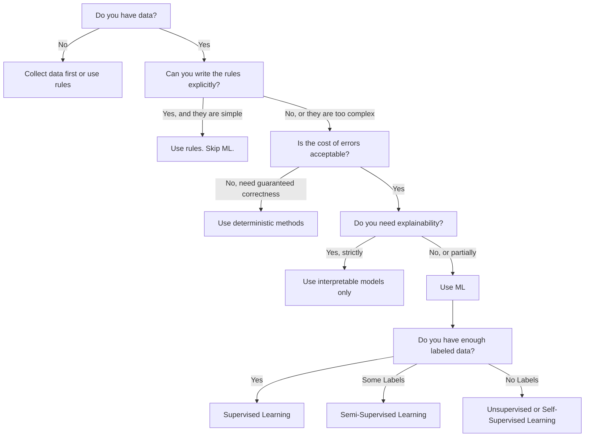

# What Is Machine Learning

> Instead of telling a computer how to solve a problem, we give it examples and let it discover the solution pattern from data.

## Learning Objectives

- Explain the differences between supervised, unsupervised, and reinforcement learning, and identify which type of learning applies to a given problem.
- Implement a nearest centroid classifier from scratch and compare its performance against a random baseline.
- Distinguish between classification and regression problems and select the appropriate loss function for each task.
- Evaluate whether a business problem is better suited for machine learning or can be solved more effectively using deterministic rules.
  
## The Problem


Imagine you want to build a system that predicts house prices. The traditional approach is to manually create hundreds of rules:

- "If the house has more than 3 bedrooms, increase the price."
- "If the house is near the city center, increase the price."
- "If the house is older than 50 years, decrease the price."

You spend weeks analyzing different factors and writing rules. However, real estate markets are complex. House prices depend on many interacting factors, such as location, neighborhood trends, economic conditions, nearby facilities, and buyer preferences. Your manually written rules often fail because they cannot capture all these hidden relationships.

Machine learning takes a different approach. Instead of manually defining every pricing rule, you provide the computer with thousands of examples of houses, including their features (size, location, number of rooms, age, etc.) and their actual selling prices. The model learns the patterns that connect house features to prices.

The model discovers relationships that humans may not have explicitly considered, such as how different combinations of features affect value. When market conditions change, you can retrain the model with new housing data instead of rewriting hundreds of rules.

This transition from "programming explicit rules" to "learning patterns from data" is the fundamental idea behind machine learning.

Modern technologies such as recommendation systems, voice assistants, self-driving vehicles, medical diagnosis systems, and large language models rely on this principle: using data to learn patterns and make intelligent predictions or decisions.

## The Concept

### Learning From Data, Not Rules

> Traditional programming starts with rules and applies them to data, while machine learning starts with data and learns the rules.



- Traditional programming: You manually define the rules. The computer follows those instructions and applies them to input data to generate the desired output.

- Machine learning: Instead of explicitly writing rules, you provide the algorithm with examples of data and their expected outputs. The learning process discovers the underlying patterns and creates its own rules.

- The model produced during training is the learned set of rules, represented mathematically through numbers such as weights and parameters. These learned patterns allow the model to generalize beyond the examples it has seen and make accurate predictions on new, unseen data.

### The Three Types of Machine Learning




## The Three Types of Machine Learning

### **Supervised Learning**

You provide the model with **labeled examples** (input-output pairs). The model learns the relationship between inputs and outputs and uses that knowledge to predict results for new data.

Examples:

- **Medical Diagnosis:**  
  "Here are thousands of patient records with symptoms and diagnoses. Learn the patterns and predict whether a new patient has a specific disease."

- **Email Category Prediction:**  
  "Here are emails labeled as work, personal, or promotional. Learn how to automatically classify new emails."

**Goal:** Learn a function that maps inputs → outputs.

---

### **Unsupervised Learning**

You provide the model with **unlabeled data**. The model analyzes the data and discovers hidden patterns, groups, or structures without predefined answers.

Examples:

- **News Article Grouping:**  
  "Here are thousands of news articles. Automatically group similar articles together based on their topics."

- **Anomaly Detection:**  
  "Here are millions of transaction records. Find unusual patterns that may indicate suspicious activity."

**Goal:** Discover hidden structures and relationships in data.

---

### **Reinforcement Learning**

An **agent learns by interacting with an environment**. It takes actions, receives rewards or penalties, and improves its behavior to maximize long-term rewards.

Examples:

- **Autonomous Driving:**  
  "Control a self-driving car. Receive rewards for safe driving and penalties for collisions or unsafe decisions. Learn the best driving strategy."

- **Resource Management:**  
  "Manage energy usage in a smart building. Receive rewards for reducing energy consumption while maintaining comfort."

**Goal:** Learn the best strategy (policy) through experience and feedback.

---

## Quick Comparison

| Learning Type | Data Available | Learning Process | Example |
|---|---|---|---|
| **Supervised Learning** | Labeled data | Learn from examples with correct answers | Disease prediction, email classification |
| **Unsupervised Learning** | Unlabeled data | Find hidden patterns and structures | Customer grouping, anomaly detection |
| **Reinforcement Learning** | Rewards and penalties | Learn through trial and error | Self-driving cars, game AI |


Most of what you will build in practice uses supervised learning. Unsupervised learning is common for preprocessing and exploration. Reinforcement learning powers game AI, robotics, and RLHF for language models.

# Beyond the Traditional Three Types of Machine Learning

The three main categories of machine learning — **supervised learning, unsupervised learning, and reinforcement learning** — provide a useful foundation. However, real-world machine learning systems often combine ideas from multiple categories because labeled data is expensive while unlabeled data is abundant.

Two important approaches that extend beyond the basic categories are **semi-supervised learning** and **self-supervised learning**.

---

## **Semi-Supervised Learning: Learning With Limited Labels**

Semi-supervised learning combines **a small amount of labeled data** with **a large amount of unlabeled data**.

In many real-world applications, collecting labels requires human experts and can be expensive. Instead of labeling every example, we provide a few labeled examples and allow the model to learn additional patterns from the larger unlabeled dataset.

Example:

> "A hospital has 500 labeled medical images reviewed by doctors and 100,000 unlabeled images. Use both datasets to improve disease detection."

Common techniques:

### **1. Label Propagation**

The algorithm builds relationships between similar data points and spreads known labels to nearby unlabeled examples.
```bash
Example:

Original:
"The cat is sitting on the mat."

Masked:
"The cat is sitting on the [MASK]."

Model predicts:
"mat"
```


The original text automatically provides the label.

---

### **2. Next-Token Prediction (GPT)**

The model learns to predict the next word based on previous words.
```bash
Example:
Input:
"The capital of France is"

Target:
"Paris"

```


Every text document becomes a collection of training examples without requiring manual labeling.

---

### **3. Contrastive Learning (SimCLR)**

The model learns which examples are similar and which are different.
```bash
Example:
Original Image
↓
Create two augmented versions

Image A + Image B
↓
Learn:
"They represent the same object"

```

The model learns useful representations without human labels.

---

# Relationship Between Learning Types

These approaches are not completely separate categories. They are **training strategies that extend the main machine learning framework**.

```bash
Machine Learning
│
├── Supervised Learning
│
├── Unsupervised Learning
│
├── Reinforcement Learning
│
├── Semi-Supervised Learning
│ └── Few labels + Many unlabeled examples
│
└── Self-Supervised Learning
└── Automatically generated labels
```

Self-supervised learning is technically a form of supervised learning because the model predicts targets. However, the important difference is that the labels are **generated automatically from the data rather than created by humans**.

Modern AI systems, including large language models and computer vision models, heavily rely on these advanced learning strategies because they allow models to learn from massive amounts of available data.


### Classification vs Regression

These are the two main supervised learning tasks.

| Aspect             | Classification                        | Regression                |
| ------------------ | ------------------------------------- | ------------------------- |
| Goal               | Predict a category/class              | Predict a numerical value |
| Output             | Discrete labels                       | Continuous numbers        |
| Examples           | Spam/Not Spam, Cat/Dog                | House Price, Temperature  |
| Output Space       | Finite set of classes                 | Any real number           |
| Loss Functions     | Cross-Entropy Loss, Hinge Loss        | MSE, RMSE, MAE            |
| Evaluation Metrics | Accuracy, Precision, Recall, F1-Score | MAE, MSE, RMSE, R²        |
| Model Learns       | Decision boundaries                   | Best-fit function/curve   |

# Classification

Classification predicts **which specific class or category** an input belongs to.

## Core Examples

- Email → Spam or Not Spam
- Image → Cat, Dog, Bird
- Tumor → Benign or Malignant
- Student → Pass or Fail

## Binary Classification

Involves only **two possible classes**:

- Yes / No
- 0 / 1
- True / False

### Example

**Will the customer buy?**

→ Yes or No

## Multi-Class Classification

Involves **more than two distinct classes**:

- Cat
- Dog
- Bird
- Horse

### How it Works

The model outputs mathematical probabilities for each possible category and selects the class with the **highest probability**.

---

# Regression

Regression predicts a **continuous numerical value** rather than a distinct category.

The output can be **any value within a specific range**.

## Core Examples

- House Price = \$350,000
- Temperature = 31.5°C
- Stock Price = 150.75
- Salary = \$65,000

## Example

**Input:**

- Area = 2000 sq ft

**Predicted Output:**

- House Price = \$420,500

## How it Works

The model tries to mathematically fit a **line** or a **curve** to the training data that minimizes the total prediction error.

# The Machine Learning Workflow

A machine learning project is not just about choosing an algorithm and training a model. Successful ML systems follow a structured workflow that transforms raw data into a reliable solution.

Regardless of the algorithm being used, most machine learning projects follow the same core pipeline:



## The Machine Learning Workflow Steps

### **1. Collect Data**

Gather raw data from relevant sources. Data is the foundation of every machine learning system.

More data can help improve a model, but **data quality is often more important than quantity**. Poor-quality data can lead to inaccurate predictions, even with advanced algorithms.

Examples of data sources:

- Databases
- Sensors
- User interactions
- Images, text, audio, and video
- Public datasets

---

### **2. Clean & Explore Data**

Raw data is rarely ready for training. It must be cleaned and analyzed before being used.

Common tasks include:

- Handling missing values
- Removing duplicate records
- Correcting incorrect data
- Detecting outliers
- Visualizing distributions and relationships

This step often takes **60–80% of the total project time** because understanding and preparing data is usually more challenging than training the model itself.

---

### **3. Feature Engineering**

Feature engineering transforms raw data into meaningful inputs that a machine learning model can understand.

Examples:

- Convert dates into useful features:
  - Day of the week
  - Month
  - Holiday indicator

- Normalize numerical values:
  - Convert different scales into a common range

- Encode categorical data:
  - Convert "Red", "Blue", "Green" into numerical representations

Good features can significantly improve model performance. In many cases, **better features matter more than using a more complex algorithm**.

---

### **4. Split Data**

The dataset is divided into separate parts to train and evaluate the model properly.
```bash
Typical split:
Training Data
↓
Used to learn patterns

Validation Data
↓
Used to tune model settings (hyperparameters)

Test Data
↓
Used for final performance evaluation
```

The test set must remain unseen during training to measure how well the model works on new data.

---

### **5. Train Model**

During training, the algorithm learns patterns from the training data.

The model adjusts its internal parameters to reduce prediction errors.
```bash
Process:
Training Data
↓
Learning Algorithm
↓
Trained Model
```

Most algorithms optimize a **loss function**, which measures how far the model's predictions are from the correct answers.

---

### **6. Evaluate Model**

The trained model is tested using validation or test data to measure its performance.

Evaluation depends on the problem type:

**Classification:**
- Accuracy
- Precision
- Recall
- F1-score

**Regression:**
- Mean Absolute Error (MAE)
- Mean Squared Error (MSE)
- Root Mean Squared Error (RMSE)

If performance is not acceptable, improve the system by trying:

- Better features
- Different algorithms
- Hyperparameter tuning
- More or better data

---

### **7. Deploy Model**

Once the model achieves acceptable performance, it is integrated into a real-world application.
```bash
Examples:

- Fraud detection systems
- Recommendation engines
- Voice assistants
- Medical prediction tools
```

The deployed model receives new data and produces predictions automatically.

---

### **8. Monitor & Maintain**

A machine learning model is not finished after deployment.

Real-world data changes over time, causing **data drift** and performance degradation.
```bash
Monitoring tracks:

- Prediction accuracy
- Data distribution changes
- Model reliability

```
When performance drops, the model needs to be updated or retrained using new data.

---

## The ML Workflow Is a Continuous Cycle
```bash
Collect Data
↓
Clean & Explore
↓
Create Features
↓
Train Model
↓
Evaluate
↓
Deploy
↓
Monitor
↓
Improve and Retrain
```
---

> A successful machine learning system is not just a good algorithm. It depends on the complete process: **high-quality data, meaningful features, proper evaluation, and continuous improvement.**

---
# Training, Validation, and Test Splits

One of the most important concepts in machine learning is evaluating a model on data it has **never seen during training**.

If you test a model using the same data it learned from, you are only measuring how well it memorized the examples — not how well it learned general patterns.

A good machine learning model should **generalize**: it should perform well on new, unseen data.



# Dataset Splits

When building a Machine Learning model, the dataset is typically divided into three parts.

| Split | Purpose | When Used | Typical Size |
|---------|---------|---------|---------|
| Training | Model learns patterns from this data | During training | 60–80% |
| Validation | Tune hyperparameters and compare models | After each training run | 10–20% |
| Test | Final unbiased performance evaluation | Once, at the very end | 10–20% |

---

## 1. Training Set

The **training set** is used to teach the model.

The model adjusts its parameters (weights and biases) by learning from the input-output examples in this dataset.

### Example

If we are predicting house prices:

- Input: House features (area, bedrooms, location)
- Output: Actual house price

The model repeatedly sees these examples and learns the relationship between inputs and outputs.

**Typical Size:** 60–80% of the dataset

---

## 2. Validation Set

The **validation set** is used to evaluate the model during development.

It helps us:

- Tune hyperparameters
- Compare different models
- Detect overfitting
- Choose the best model configuration

The model does **not learn** from this data directly.

### Example

You may test:

- Learning Rate = 0.01
- Learning Rate = 0.001
- Learning Rate = 0.0001

The validation set helps determine which setting performs best.

**Typical Size:** 10–20% of the dataset

---

## 3. Test Set

The **test set** is used only once after all training and tuning are complete.

Its purpose is to provide an unbiased estimate of how well the model performs on completely unseen data.

### Important Rule

Never use the test set to:

- Train the model
- Tune hyperparameters
- Select models

Doing so can lead to overly optimistic performance estimates.

**Typical Size:** 10–20% of the dataset

---

## Workflow

```bash
Dataset
│
├── Training Set (Learn Parameters)
│
├── Validation Set (Tune Hyperparameters)
│
└── Test Set (Final Evaluation)
```

---

# Common Split Ratios

| Training | Validation | Test |
|-----------|------------|------|
| 80% | 10% | 10% |
| 70% | 15% | 15% |
| 60% | 20% | 20% |

---

### Quick Memory Trick

- **Training Set** → Learn
- **Validation Set** → Tune
- **Test Set** → Evaluate

Training answers:
> "What should the model learn?"

Validation answers:
> "Which model settings are best?"

Test answers:
> "How good is the final model on unseen data?"

The test set is sacred. You look at it exactly once. If you keep adjusting your model based on test performance, you are effectively training on the test set and your reported numbers are meaningless.

For small datasets, use k-fold cross-validation: split data into k parts, train on k-1 parts, validate on the remaining part, rotate, and average results.

# Overfitting vs Underfitting

A machine learning model needs the right level of complexity. If the model is too simple, it cannot learn important patterns. If it is too complex, it may memorize the training data instead of learning general patterns.

The goal is to find the **right balance** where the model learns meaningful patterns and performs well on unseen data.

```mermaid
flowchart LR
    subgraph UF["Underfitting"]
        U1["Model too simple"]
        U2["High bias"]
        U3["Cannot capture important patterns"]
        U4["Poor performance on training and test data"]
    end

    subgraph GF["Good Fit"]
        G1["Appropriate model complexity"]
        G2["Balanced bias and variance"]
        G3["Learns meaningful patterns"]
        G4["Generalizes well to new data"]
    end

    subgraph OF["Overfitting"]
        O1["Model too complex"]
        O2["High variance"]
        O3["Learns noise instead of patterns"]
        O4["Excellent training performance but poor test performance"]
    end

    UF -->|Increase model complexity| GF
    GF -->|Excessive complexity| OF
```



**Underfitting vs Overfitting**

One of the main goals in Machine Learning is to build a model that **generalizes well** to unseen data. Two common problems are **underfitting** and **overfitting**.

| Aspect | Underfitting | Good Fit | Overfitting |
|----------|----------|----------|----------|
| Model Complexity | Too Simple | Appropriate | Too Complex |
| Training Error | High | Low | Very Low |
| Validation/Test Error | High | Low | High |
| Learns Patterns | No | Yes | Yes + Noise |
| Generalization | Poor | Good | Poor |

---

# Underfitting

**Underfitting** occurs when the model is too simple to capture the underlying patterns in the data.

The model fails to learn important relationships and performs poorly on both training and unseen data.

### Example

Imagine the true relationship is curved:




But the model tries to fit:

```text
-----------
```

A straight line cannot capture the curved pattern.

### Characteristics

- Training error is high
- Validation/Test error is high
- Poor performance on all datasets
- Model has not learned enough

### Causes

- Model is too simple
- Too few features
- Excessive regularization
- Insufficient training time

### Fixes

- Use a more complex model
- Add more useful features
- Reduce regularization
- Train for more epochs

---

# Overfitting

**Overfitting** occurs when the model becomes too complex and memorizes the training data, including random noise.

Instead of learning general patterns, it remembers specific examples.

### Example

The model creates a highly wiggly curve that passes through every training point:



This fits the training data perfectly but performs poorly on new data.

### Characteristics

- Training error is very low
- Validation/Test error is high
- Excellent training performance
- Poor real-world performance

### Signs of Overfitting

- Training accuracy is much higher than validation accuracy
- Validation loss increases while training loss decreases
- Model performs well on training data but poorly on unseen data
- Adding more training data improves performance

### Causes

- Model is too complex
- Too many parameters
- Small training dataset
- Training for too long

### Fixes

#### 1. Get More Training Data

More examples make memorization harder and encourage learning real patterns.

#### 2. Reduce Model Complexity

Examples:

- Smaller neural network
- Shallower decision tree
- Lower polynomial degree

#### 3. Regularization

Add a penalty for large weights.

Common types:

- L1 Regularization (Lasso)
- L2 Regularization (Ridge)

Regularized loss:

$$
\text{Loss} = \text{Original Loss} + \lambda \times \text{Penalty}
$$

#### 4. Dropout

Randomly deactivate neurons during training.

Benefits:

- Prevents co-adaptation
- Improves generalization
- Reduces memorization

#### 5. Early Stopping

Stop training when validation performance stops improving.

Typical behavior:

```text
Epochs →
Training Loss      ↓↓↓↓↓
Validation Loss    ↓↓↓↑↑↑
```

Stop at the minimum validation loss.

---

## Good Fit

A **good fit** occurs when the model captures the true patterns in the data without memorizing noise.

### Characteristics

- Training error is low
- Validation/Test error is low
- Small gap between training and validation performance
- Strong generalization to new data

### Example

The model follows the overall trend:



It captures the real pattern without chasing every data point.

---

## Bias-Variance Perspective

| Concept | Underfitting | Overfitting |
|----------|----------|----------|
| Bias | High | Low |
| Variance | Low | High |
| Learning Ability | Weak | Excessive |
| Generalization | Poor | Poor |

### Goal

Find the balance between:

- **High Bias** (Underfitting)
- **High Variance** (Overfitting)

This balance produces a model that generalizes well.

---

## Quick Memory Trick

### Underfitting

> "The model is too simple to learn."

- High Training Error
- High Test Error

### Overfitting

> "The model memorizes instead of learning."

- Low Training Error
- High Test Error

### Good Fit

> "The model learns the real pattern."

- Low Training Error
- Low Test Error

# The Bias-Variance Tradeoff

The **Bias-Variance Tradeoff** is the mathematical framework that explains **underfitting** and **overfitting**.

A good machine learning model must balance:

- **Bias** (oversimplification)
- **Variance** (over-sensitivity)

The goal is to achieve the lowest possible prediction error on unseen data.

---

## Bias

**Bias** is the error caused by incorrect assumptions in the learning algorithm.

A high-bias model is too simple and cannot capture the true relationship in the data.

### Example

Suppose the true relationship is curved:

```text
      *
    *   *
  *       *
 *         *
```

But the model assumes everything is linear:

```text
-----------
```

The model consistently makes systematic mistakes.

### Characteristics of High Bias

- Model is too simple
- Misses important patterns
- Training error is high
- Test error is high
- Leads to underfitting

### Examples

- Linear Regression for highly nonlinear data
- Very shallow Decision Tree
- Neural Network with too few parameters

---

## Variance

**Variance** measures how sensitive a model is to small changes in the training data.

A high-variance model changes significantly when trained on different subsets of data.

### Example

Train the model on Dataset A:

```text
Prediction = 100
```

Train the same model on Dataset B:

```text
Prediction = 180
```

Small changes in data produce large changes in predictions.

### Characteristics of High Variance

- Model is too complex
- Learns noise and random fluctuations
- Training error is very low
- Test error is high
- Leads to overfitting

### Examples

- Deep Decision Trees
- High-degree Polynomial Regression
- Large Neural Networks with insufficient data

---

## Relationship Between Bias and Variance

Generally:

- Increasing model complexity ↓ Bias
- Increasing model complexity ↑ Variance

This creates a tradeoff.

| Model Complexity | Bias | Variance | Result |
|------------------|-------|----------|---------|
| Too Low | High | Low | Underfitting |
| Moderate | Medium | Medium | Good Generalization |
| Too High | Low | High | Overfitting |

---

## Bias-Variance Curve

```text
Error
 ^
 |
 | \                Variance
 |  \                  /
 |   \                /
 |    \              /
 |     \            /
 |      \          /
 |       \        /
 |        \      /
 |         \    /
 |          \  /
 |           \/
 |           /\ 
 |          /  \
 |         /    \
 |        /      \
 |       /        \
 |      /          \
 |     /            \
 |    /              \
 |   /                \
 |  /                  \
 | /                    \
 +---------------------------------> Model Complexity

      Bias

           Total Error
               *
            Minimum
```

The optimal model lies near the minimum of the total error curve.

---

## Total Error Decomposition

The expected prediction error can be written as:


$$\text{Total Error}\text{Bias}^2+\text{Variance}+\text{Irreducible Noise}$$

or

$$E[(y-\hat{y})^2]=\text{Bias}^2+\text{Variance}+\sigma^2$$

where:

- **Bias²** = Error from wrong assumptions
- **Variance** = Error from sensitivity to training data
- **σ² (Noise)** = Randomness inherent in the data

---

## Irreducible Noise

Some error can never be eliminated.

### Examples

- Measurement errors
- Human mistakes
- Random weather effects
- Unobserved variables

Even a perfect model cannot predict these factors.

Therefore:

```text
Total Error ≥ Irreducible Noise
```

The best we can do is minimize:

$$
\text{Bias}^2 + \text{Variance}
$$

---

## Practical Interpretation

### High Bias Model

```text
Simple Model
↓
Misses Patterns
↓
Underfitting
```

### High Variance Model

```text
Complex Model
↓
Memorizes Noise
↓
Overfitting
```

### Balanced Model

```text
Learns Real Patterns
↓
Generalizes Well
↓
Best Performance
```

---

## No Free Lunch Theorem

The **No Free Lunch (NFL) Theorem** states:

> No single machine learning algorithm is best for every possible problem.

An algorithm that performs extremely well on one type of dataset may perform poorly on another.

Therefore:

```text
There is no universally best model.
```

---

## Why NFL Matters

Suppose:

- Dataset A is mostly linear
- Dataset B is highly nonlinear
- Dataset C contains images
- Dataset D contains text

A model that excels on Dataset A may fail on B, C, or D.

### Examples:

| Problem Type | Often Works Well |
|--------------|------------------|
| Linear Relationships | Linear Regression |
| Tabular Data | Gradient Boosting |
| Images | Convolutional Neural Networks (CNNs) |
| Text | Transformers |
| Sequential Data | RNNs / Transformers |

No algorithm dominates across all possible tasks.

---

## How Data Scientists Choose Models

In practice, model selection depends on:

### 1. Amount of Data

- Small dataset → Simpler models
- Large dataset → More complex models

### 2. Number of Features

- Few features → Simpler approaches may work
- Many features → Advanced models may help

### 3. Relationship Type

- Linear → Linear models
- Nonlinear → Trees, Neural Networks, Kernel Methods

### 4. Interpretability Requirements

If explanations are important:

- Linear Regression
- Logistic Regression
- Decision Trees

If accuracy is the priority:

- Ensembles
- Deep Learning

### 5. Computational Resources

Some models require:

- Large memory
- Powerful GPUs
- Long training times

Others train quickly on ordinary hardware.

---

## Quick Memory Trick

### Bias

> "Wrong assumptions."

- High Bias → Underfitting

### Variance

> "Too sensitive to data."

- High Variance → Overfitting

### Goal

> Minimize Bias² + Variance

### No Free Lunch

> No algorithm is best for every problem.
> Always test multiple models and compare results.

# When NOT to Use Machine Learning

Machine Learning is powerful, but it is **not always the right solution**.

Before building a model, ask:

> "Do I actually need Machine Learning, or can a simpler solution solve the problem?"

In many cases, traditional programming, rules, heuristics, or lookup tables are faster, cheaper, and more reliable.

---

# Do NOT Use Machine Learning When...

## 1. Rules Are Simple and Well-Defined

If the logic can be expressed using a few rules or formulas, ML adds unnecessary complexity.

### Examples

- Tax calculation
- Unit conversion
- Interest calculation
- Sorting algorithms
- Currency conversion

### Example

```python
if marks >= 40:
    result = "Pass"
else:
    result = "Fail"
```

No machine learning is needed.

### Why?

- Easier to implement
- Easier to debug
- 100% predictable
- Faster execution

---

## 2. You Have No Data (or Very Little Data)

Machine Learning learns patterns from examples.

Without enough data, the model cannot learn meaningful relationships.

### Example

Suppose you want to predict house prices but only have:

```text
10 houses
```

This is usually insufficient for training a reliable model.

### Rule

```text
No Data
↓
No Learning
```

### Better Approach

- Collect more data
- Use domain knowledge
- Start with rule-based methods

---

## 3. The Cost of Errors Is Catastrophic

Machine Learning models are probabilistic.

Even highly accurate models make mistakes.

If mistakes are unacceptable, deterministic systems are preferred.

### Examples

- Medical dosage calculation
- Nuclear reactor control
- Aircraft safety systems
- Cryptographic verification
- Banking transaction verification

### Why?

A model that is:

```text
99.9% Accurate
```

still fails:

```text
1 out of 1000 times
```

In critical systems, that may be unacceptable.

---

## 4. A Lookup Table or Simple Heuristic Solves the Problem

Sometimes a simple rule covers almost all cases.

### Example

Shipping Cost Table

| Weight | Cost |
|----------|----------|
| 0–1 kg | \$5 |
| 1–5 kg | \$10 |
| 5–10 kg | \$20 |

No model is needed.

### Another Example

```python
if temperature > 38:
    alert = True
```

A threshold works perfectly.

### Why?

- Easier maintenance
- Lower cost
- Easier validation
- More reliable

---

## 5. Full Explainability Is Required

Some industries require every decision to be explainable.

### Examples

- Lending
- Insurance
- Healthcare
- Criminal justice
- Government systems

### Challenge

Many advanced ML models behave like black boxes.

Examples:

- Deep Neural Networks
- Large Ensembles
- Transformers

### Better Options

Use interpretable models:

- Linear Regression
- Logistic Regression
- Small Decision Trees

If explainability is mandatory, complex ML may not be appropriate.

---

## 6. The Problem Changes Faster Than You Can Retrain

Models learn from historical data.

If the environment changes rapidly, the model becomes outdated.

### Example

Suppose:

```text
Rules change every day
```

but

```text
Retraining takes one week
```

Then the model is always behind reality.

### Common Situations

- Frequently changing business policies
- Rapidly evolving regulations
- Dynamic pricing rules

In such cases, explicit rules may be more practical.

---

# Traditional Programming vs Machine Learning

| Question | Traditional Programming | Machine Learning |
|-----------|-----------|-----------|
| Rules Known? | Yes | No |
| Data Needed? | Little | Large Amounts |
| Explainable? | Fully | Sometimes |
| Guaranteed Correctness? | Possible | No |
| Maintenance Cost | Low | Often Higher |
| Adaptability | Lower | Higher |

---

# Decision Flowchart



---

# Real-World Examples

| Problem | Use ML? | Reason |
|----------|----------|----------|
| Celsius to Fahrenheit Conversion |   No | Formula Exists |
| Tax Calculation |   No | Exact Rules Known |
| Sorting Numbers |   No | Deterministic Algorithm Exists |
| Spam Detection |   Yes | Rules Too Complex |
| Face Recognition |   Yes | Pattern Recognition Problem |
| House Price Prediction |   Yes | Relationship Is Complex |
| Fraud Detection |   Yes | Patterns Change Over Time |
| Medical Dosage Formula |   Usually No | Errors Can Be Dangerous |

---

# Quick Memory Trick

Use Machine Learning when:

```text
Data Exists
+
Patterns Are Complex
+
Some Errors Are Acceptable
+
Rules Cannot Be Easily Written
```

Avoid Machine Learning when:

```text
Rules Are Known
OR
Data Is Insufficient
OR
Errors Are Unacceptable
OR
A Simple Solution Already Works
```
# Key Machine Learning Terms

Understanding these terms is essential because they appear in almost every Machine Learning paper, tutorial, interview, and project.

| Term | What People Say | What It Actually Means |
|--------|--------|--------|
| Model | "The AI" | A mathematical function with learnable parameters that maps inputs to outputs |
| Training | "Teaching the AI" | Running an optimization algorithm to adjust model parameters so predictions match known outputs |
| Feature | "An input column" | A measurable property of the data used to make predictions |
| Label | "The answer" | The known output for a training example |
| Hyperparameter | "A setting you tweak" | A parameter chosen before training that controls learning |
| Loss Function | "How wrong the model is" | A function that measures prediction error |
| Overfitting | "It memorized the test" | The model learned noise instead of general patterns |
| Underfitting | "It didn't learn enough" | The model is too simple to capture real patterns |
| Generalization | "It works on new data" | The ability to perform well on unseen examples |
| Cross-Validation | "Testing on different chunks" | Repeated train/test splits used to estimate performance |
| Regularization | "Keeping weights small" | Techniques that reduce model complexity and overfitting |
| Data Drift | "The world changed" | The data distribution changes over time |

---

# 1. Model

A **model** is the mathematical function that learns patterns from data.

People often call it:

```text
"The AI"
```

but technically it is a function:

$$
y = f(x)
$$

that maps inputs to outputs.

### Examples

- Linear Regression
- Logistic Regression
- Decision Trees
- Random Forests
- Neural Networks

### Example

House Price Prediction:

```text
Input:
Area = 2000 sq ft

Model

Output:
Price = $420,000
```

---

# 2. Training

Training is the process of adjusting model parameters so predictions become more accurate.

People often say:

```text
"We are teaching the AI."
```

What actually happens:

```text
Predict
↓
Measure Error
↓
Adjust Parameters
↓
Repeat
```

The model gradually improves through optimization.

---

# 3. Feature

A **feature** is an input variable used by the model.

### Examples

For house price prediction:

| Feature | Description |
|----------|-------------|
| Area | Square footage |
| Bedrooms | Number of bedrooms |
| Age | House age |
| Location | Neighborhood |

Features are the information the model uses to make predictions.

---

# 4. Label

A **label** is the correct answer associated with a training example.

### Example

| Area | Bedrooms | Price |
|--------|--------|--------|
| 2000 | 3 | \$420,000 |

Features:

```text
Area = 2000
Bedrooms = 3
```

Label:

```text
Price = $420,000
```

The label tells the model what it should learn to predict.

---

# 5. Hyperparameter

A **hyperparameter** is a setting chosen before training begins.

Unlike model parameters, hyperparameters are not learned automatically.

### Examples

| Hyperparameter | Example |
|---------------|----------|
| Learning Rate | 0.01 |
| Number of Layers | 5 |
| Batch Size | 32 |
| Number of Epochs | 100 |
| Tree Depth | 10 |

### Analogy

```text
Model Parameters
→ Learned during training

Hyperparameters
→ Chosen by the developer
```

---

# 6. Loss Function

A **loss function** measures how wrong the model's predictions are.

Training attempts to minimize this value.

### Example

Actual Price:

```text
$400,000
```

Predicted Price:

```text
$450,000
```

Loss:

```text
Error = $50,000
```

### Common Loss Functions

#### Regression

- MAE
- MSE
- RMSE

#### Classification

- Cross-Entropy Loss
- Binary Cross-Entropy

Training objective:

$$
\text{Minimize Loss}
$$

---

# 7. Overfitting

Overfitting occurs when the model memorizes the training data instead of learning general patterns.

### Characteristics

- Very low training error
- High validation/test error
- Poor performance on new data

### Example

```text
Training Accuracy = 99%

Validation Accuracy = 70%
```

The model learned the training examples too specifically.

---

# 8. Underfitting

Underfitting occurs when the model is too simple to learn the underlying relationships.

### Characteristics

- High training error
- High validation error
- Poor performance everywhere

### Example

Trying to fit:

```text
y = x²
```

using:

```text
y = mx + b
```

The model lacks sufficient complexity.

---

# 9. Generalization

Generalization is the ability to perform well on data the model has never seen before.

This is the true goal of Machine Learning.

### Example

Train on:

```text
10,000 emails
```

Successfully classify:

```text
New emails never seen before
```

Good generalization means the model learned real patterns.

---

# 10. Cross-Validation

Cross-validation provides a more reliable estimate of model performance.

Instead of one train-test split, the data is split multiple times.

### K-Fold Cross Validation

Example:

```text
Dataset
│
├── Fold 1 → Test
├── Fold 2 → Train
├── Fold 3 → Train
├── Fold 4 → Train
├── Fold 5 → Train
```

Repeat until each fold has been used as the test set once.

Final score:

$$
\text{Average of all folds}
$$

### Benefits

- Better performance estimates
- Less dependent on a single split
- Useful for small datasets

---

# 11. Regularization

Regularization reduces overfitting by discouraging overly complex models.

It adds a penalty term to the loss function.

### General Formula

$$\text{New Loss}=\text{Original Loss}+\lambda \times \text{Penalty}$$

### Common Types

#### L1 Regularization (Lasso)

Encourages sparse weights.

#### L2 Regularization (Ridge)

Keeps weights small.

### Benefits

- Reduces overfitting
- Improves generalization
- Prevents extreme parameter values

---

# 12. Data Drift

Data drift occurs when incoming data changes over time.

The model was trained on one distribution but receives data from another.

### Example

Spam Detection

Training Data (2023):

```text
"Win a free iPhone!"
```

Real Data (2026):

```text
"Claim your crypto reward!"
```

Spam patterns changed.

### Consequences

- Accuracy decreases
- Predictions become unreliable
- Model must be retrained

### Common Causes

- User behavior changes
- Market changes
- Economic changes
- Seasonal effects
- New technologies

---

# Relationship Between Terms

```text
Features + Labels
        │
        ▼
     Training
        │
        ▼
      Model
        │
        ▼
   Predictions
        │
        ▼
  Loss Function
        │
        ▼
Parameter Updates
        │
        ▼
 Generalization
```

Potential Problems:

```text
Too Simple
→ Underfitting

Too Complex
→ Overfitting

Data Changes
→ Data Drift
```

---

# Quick Memory Sheet

| Term | One-Line Definition |
|--------|--------|
| Model | Mathematical function that makes predictions |
| Training | Process of learning parameters |
| Feature | Input variable |
| Label | Correct answer |
| Hyperparameter | Setting chosen before training |
| Loss Function | Measures prediction error |
| Overfitting | Memorizes training data |
| Underfitting | Too simple to learn patterns |
| Generalization | Works well on unseen data |
| Cross-Validation | Repeated train/test evaluation |
| Regularization | Prevents overly complex models |
| Data Drift | Data distribution changes over time |

### Golden Rule

> Machine Learning is fundamentally the process of using features and labels to train a model that minimizes loss and generalizes well to unseen data while avoiding underfitting, overfitting, and data drift.
